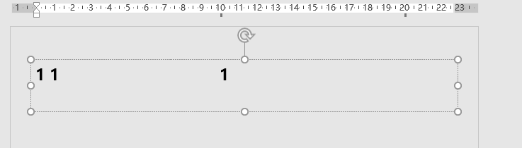
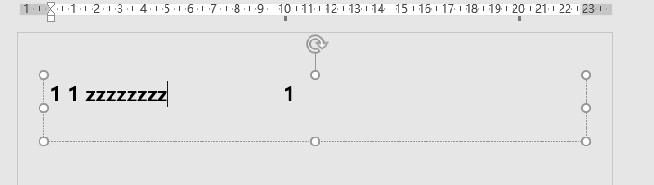
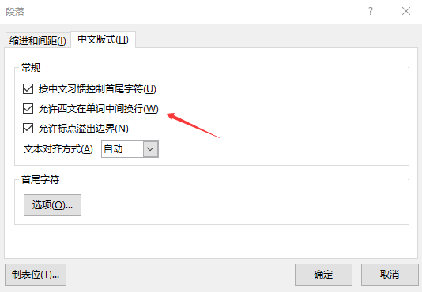
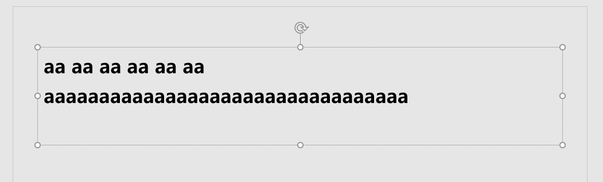
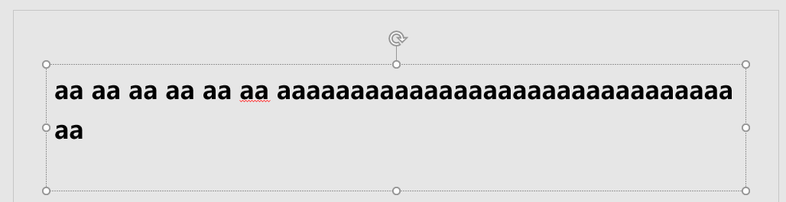
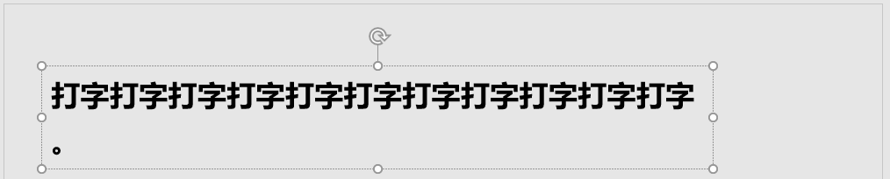
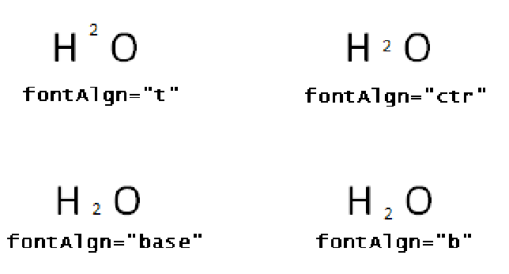

# dotnet OpenXML 文本 ParagraphProperties 的属性作用

本文收集 a:pPr 段落属性 ParagraphProperties 的属性的作用

<!--more-->


<!-- 草稿 -->

本文的 OpneXMl SDK 的获取代码前提都有以下代码

```csharp
public void Foo(Paragraph textParagraph)
{
	 ParagraphProperties paragraphProperties = textParagraph.ParagraphProperties;
}
```

## defTabSz

Default Tab Size

OpneXMl SDK: `var defaultTabSize = paragraphProperties.DefaultTabSize;`

单位： EMU

作用： 描述 Tab 字符的默认宽度，注意 Tab 会被具体的字符影响，实际宽度不一定等于这个属性设置的值，因为会被具体的标尺影响，会和具体的排版相关

例如下面代码

```xml
<a:pPr fontAlgn="auto" defTabSz="360000">
	<a:r>
		<a:rPr b="1" dirty="0" lang="en-US" sz="2400">
			<a:latin typeface="+mn-ea"/>
		</a:rPr>
		<a:t>1 1	1</a:t>
	</a:r>
</a:pPr>
```

上面代码将 `defTabSz` 设置为 `360000` 也就是 10 厘米

```
1 cm = 360000 EMUs
10 cm = 3600000 EMUs
```

因此设置之后的效果如下

<!--  -->


在两个字符之间如果输入 Tab 键，那么这个 Tab 键将占用 360000EMU 单位空间，当然，后续在这两个字符中间输出不超过 360000EMU 单位空间 的字符，那么依然不会更改 Tab 后字符的距离，如下图，输入了多个 z 字符

<!--  -->


当然，想要理解这一点，还需要了解 Tab 的规则

## latinLnBrk

Latin Line Break

OpenXML SDK: `var latinLineBreak = paragraphProperties.LatinLineBreak;`

作用：是否允许西文在单词中间换行

<!--  -->


例如下面代码

```xml
<a:p>
	<a:pPr fontAlgn="auto" defTabSz="3600000" latinLnBrk="0">
	</a:pPr>
	<a:r>
		<a:rPr b="1" dirty="0" lang="en-US" sz="2400" >
			<a:latin typeface="+mn-ea"/>
		</a:rPr>
		<a:t>aa aa aa aa aa aa aaaaaaaaaaaaaaaaaaaaaaaaaaaaaaaaa</a:t>
	</a:r>
</a:p>
```

显示效果如下

<!--  -->


将 `latinLnBrk` 设置为 1 的效果如下

<!--  -->


## eaLnBrk

East Asian Line Break

OpenXML SDK: `var eastAsianLineBreak = paragraphProperties.EastAsianLineBreak;`

作用：是否允许东方字符在单词中间换行

请看 latinLnBrk 的作用，表现为允许标点在行首，如下面代码

```xml
<a:p>
	<a:pPr fontAlgn="auto" defTabSz="3600000" latinLnBrk="1"></a:pPr>
	<a:r>
		<a:rPr b="1" dirty="0" lang="en-US" sz="2400" >
			<a:latin typeface="+mn-ea"/>
		</a:rPr>
		<a:t>打字打字打字打字打字打字打字打字打字打字打字。</a:t>
	</a:r>
</a:p>
```

效果如下

<!--  -->


## fontAlgn

Font Alignment

OpenXML SDK: `var fontAlignment = paragraphProperties.FontAlignment;`

作用：设置字体比较小的文本对齐方法

Office 的 PPT 2016 不支持

效果如下图

<!--  -->


可以作出上标下标的效果


更多请看 [Office 使用 OpenXML SDK 解析文档博客目录](https://blog.lindexi.com/post/Office-%E4%BD%BF%E7%94%A8-OpenXML-SDK-%E8%A7%A3%E6%9E%90%E6%96%87%E6%A1%A3%E5%8D%9A%E5%AE%A2%E7%9B%AE%E5%BD%95.html )


<a rel="license" href="http://creativecommons.org/licenses/by-nc-sa/4.0/"></a><br />本作品采用<a rel="license" href="http://creativecommons.org/licenses/by-nc-sa/4.0/">知识共享署名-非商业性使用-相同方式共享 4.0 国际许可协议</a>进行许可。欢迎转载、使用、重新发布，但务必保留文章署名[林德熙](http://blog.csdn.net/lindexi_gd)(包含链接:http://blog.csdn.net/lindexi_gd )，不得用于商业目的，基于本文修改后的作品务必以相同的许可发布。如有任何疑问，请与我[联系](mailto:lindexi_gd@163.com)。