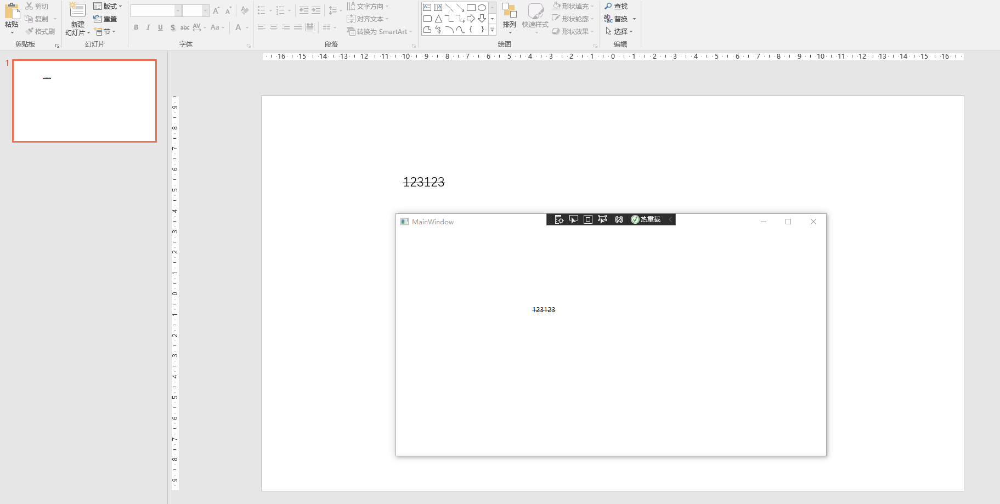
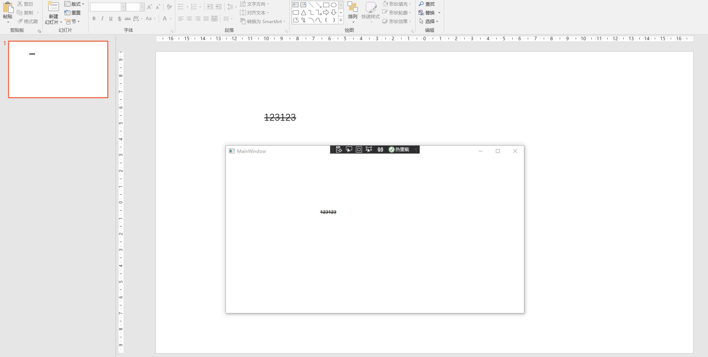

# dotnet OpenXML 文本删除线解析方法

本文来告诉大家如何解析读取在 OpenXML 里面存放的文本删除线，本文使用 PowerPoint 作为例子来告诉大家如何读取然后在 WPF 应用里面显示

<!--more-->


<!-- 发布 -->

在开始之前，期望大家已了解如何在 dotnet 应用里面读取 PPT 文件，如果还不了解读取方法，请参阅 [C# dotnet 使用 OpenXml 解析 PPT 文件](https://blog.lindexi.com/post/C-dotnet-%E4%BD%BF%E7%94%A8-OpenXml-%E8%A7%A3%E6%9E%90-PPT-%E6%96%87%E4%BB%B6.html)

期望在阅读本文之前，先阅读 [dotnet OpenXML 简单聊聊 PPT 文本解析](https://blog.lindexi.com/post/dotnet-OpenXML-%E7%AE%80%E5%8D%95%E8%81%8A%E8%81%8A-PPT-%E6%96%87%E6%9C%AC%E8%A7%A3%E6%9E%90.html )

以下是本文效果

<!--  -->


在 OpenXML 文档，将文本的删除线放在了文本的 Run 属性里面，大概内容如下

```xml
            <a:r>
              <a:rPr lang="en-US" altLang="zh-CN" strike="sngStrike" dirty="0" smtClean="0" />
              <a:t>123123</a:t>
            </a:r>
```

以上代码的 strike 表示的就是删除线的内容。和 WPF 的设计不同的是，在 WPF 里面，无论是下划线还是删除线等，都是属于文本装饰。但是在 PPT 里面，下划线是下划线，而删除线是删除线。同时下划线和删除线的样式也是特别多的

如删除线的 TextStrikeValues 的枚举，在 ECMA 376 的第 20.1.10.78 章可以了解到有单线条的删除线和双线条的删除线，在 OpenXML 里面的枚举如下

```csharp
  /// <summary>
  /// Text Strike Type
  /// </summary>
  public enum TextStrikeValues
  {
    /// <summary>
    /// Text Strike Enum ( No Strike ).
    /// <para>When the item is serialized out as xml, its value is "noStrike".</para>
    /// </summary>
    [EnumString("noStrike")]
    NoStrike,
    /// <summary>
    /// Text Strike Enum ( Single Strike ).
    /// <para>When the item is serialized out as xml, its value is "sngStrike".</para>
    /// </summary>
    [EnumString("sngStrike")]
    SingleStrike,
    /// <summary>
    /// Text Strike Enum ( Double Strike ).
    /// <para>When the item is serialized out as xml, its value is "dblStrike".</para>
    /// </summary>
    [EnumString("dblStrike")]
    DoubleStrike,
  }
```

下面开始在一个空 WPF 项目里面尝试去读取一个包含删除线文本的 PPT 文件，然后将文本在界面渲染

在开始之前，先读取 PPT 文件，代码如下

```csharp
            var file = new FileInfo("Test.pptx");

            using var presentationDocument =
                DocumentFormat.OpenXml.Packaging.PresentationDocument.Open(file.FullName, false);
```

拿到第一个页面

```csharp
            var slide = presentationDocument.PresentationPart.SlideParts.First().Slide;
```

接着获取文本元素的坐标

```csharp
            var shape = slide.CommonSlideData.ShapeTree.GetFirstChild<Shape>();
            // 获取坐标
            var offset = shape.ShapeProperties.Transform2D.Offset;
            var x = new Emu(offset.X);
            var y = new Emu(offset.Y);
```

以上的 EMU 是通过 [dotnetCampus.OpenXMLUnitConverter](https://github.com/dotnet-campus/dotnetCampus.OfficeDocumentZiper) 开源仓库提供的，详细请看 [Office Open XML 的测量单位](https://blog.lindexi.com/post/Office-Open-XML-%E7%9A%84%E6%B5%8B%E9%87%8F%E5%8D%95%E4%BD%8D.html )

获取文本元素的文本内容，文本内容需要先读取段落，接着再获取文本属性和文本

```csharp
            // 读取文本内容
            var textBody = shape.TextBody;

            // 读取段落
            var paragraph = textBody.GetFirstChild<Paragraph>();

            // 读取段落的文本
            var run = paragraph.GetFirstChild<Run>();

            // 读取删除线
            var strike = run.RunProperties.Strike;
```

转换为 WPF 的元素，代码如下

```csharp
            // 创建元素
            var textBlock = new TextBlock()
            {
                TextDecorations = strike.Value == TextStrikeValues.NoStrike? new TextDecorationCollection():TextDecorations.Strikethrough,
                Text = run.Text.Text,
                Margin = new Thickness()
                {
                    Left = x.ToPixel().Value,
                    Top = y.ToPixel().Value,
                }
            };

            Canvas.Children.Add(textBlock);
```

以上代码的 Canvas 是放在 XAML 的控件，本文所有代码放在[github](https://github.com/lindexi/lindexi_gd/tree/c7d8eb1b879f3e5ba418f8efba290081cd6263ae/Pptx) 和 [gitee](https://gitee.com/lindexi/lindexi_gd/tree/c7d8eb1b879f3e5ba418f8efba290081cd6263ae/Pptx) 欢迎访问

可以通过如下方式获取本文的源代码，先创建一个空文件夹，接着使用命令行 cd 命令进入此空文件夹，在命令行里面输入以下代码，即可获取到本文的代码

```
git init
git remote add origin https://gitee.com/lindexi/lindexi_gd.git
git pull origin c7d8eb1b879f3e5ba418f8efba290081cd6263ae
```

以上使用的是 gitee 的源，如果 gitee 不能访问，请替换为 github 的源

```
git remote remove origin
git remote add origin https://github.com/lindexi/lindexi_gd.git
```

获取代码之后，进入 Pptx 文件夹

如果要支持双删除线，可以使用如下代码

```csharp
            var textBlock = new TextBlock()
            {
                TextDecorations = strike.Value switch
                {
                    TextStrikeValues.NoStrike => new TextDecorationCollection(),
                    TextStrikeValues.SingleStrike => TextDecorations.Strikethrough,
                    TextStrikeValues.DoubleStrike => new TextDecorationCollection()
                    {
                        new TextDecoration(TextDecorationLocation.Strikethrough,new Pen(Brushes.Black,1), -1, TextDecorationUnit.Pixel, TextDecorationUnit.Pixel),
                        new TextDecoration(TextDecorationLocation.Strikethrough,new Pen(Brushes.Black,1), 1, TextDecorationUnit.Pixel, TextDecorationUnit.Pixel)
                    },
                    _ => throw new ArgumentException()
                },
                Text = run.Text.Text,
                Margin = new Thickness()
                {
                    Left = x.ToPixel().Value,
                    Top = y.ToPixel().Value,
                }
            };
```

效果如下

<!--  -->


更多请看 [Office 使用 OpenXML SDK 解析文档博客目录](https://blog.lindexi.com/post/Office-%E4%BD%BF%E7%94%A8-OpenXML-SDK-%E8%A7%A3%E6%9E%90%E6%96%87%E6%A1%A3%E5%8D%9A%E5%AE%A2%E7%9B%AE%E5%BD%95.html )


<a rel="license" href="http://creativecommons.org/licenses/by-nc-sa/4.0/"></a><br />本作品采用<a rel="license" href="http://creativecommons.org/licenses/by-nc-sa/4.0/">知识共享署名-非商业性使用-相同方式共享 4.0 国际许可协议</a>进行许可。欢迎转载、使用、重新发布，但务必保留文章署名[林德熙](http://blog.csdn.net/lindexi_gd)(包含链接:http://blog.csdn.net/lindexi_gd )，不得用于商业目的，基于本文修改后的作品务必以相同的许可发布。如有任何疑问，请与我[联系](mailto:lindexi_gd@163.com)。