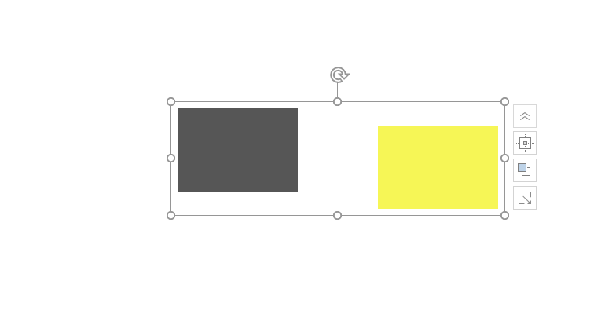
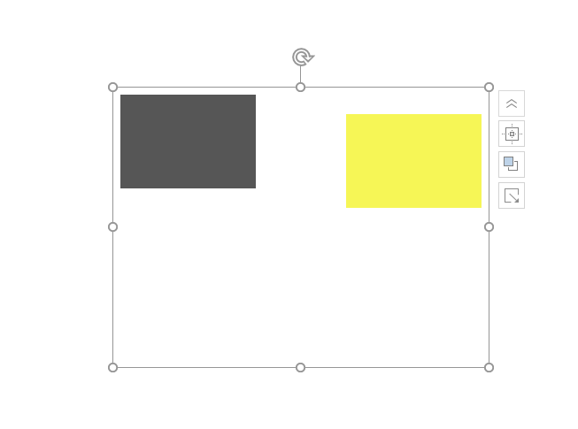

# dotnet OpenXML 继承组合颜色的 GrpFill 属性

在 OpenXML 的颜色画刷填充，有特殊的填充是 GrpFill 属性，对应 OpenXML SDK 定义的 DocumentFormat.OpenXml.Drawing.GroupFill 类型

<!--more-->


<!-- 发布 -->

本文属于 OpenXML 系列博客，前后文请参阅 [Office 使用 OpenXML SDK 解析文档博客目录](https://blog.lindexi.com/post/Office-%E4%BD%BF%E7%94%A8-OpenXML-SDK-%E8%A7%A3%E6%9E%90%E6%96%87%E6%A1%A3%E5%8D%9A%E5%AE%A2%E7%9B%AE%E5%BD%95.html )

在颜色画刷的定义，如形状的填充色，在形状放入到组合里面时，可以让形状的颜色继承组合的颜色。根据 ECMA 376 的 20.1.8.35 章文档，通过 grpFill (Group Fill)属性可以让形状等元素的画刷继承组合元素的画刷，如下面文档内容，下面文档忽略很多代码，只是作为例子

```xml
      <p:grpSp>
        <p:grpSpPr>
          <a:solidFill>
            <a:srgbClr val="565656" />
          </a:solidFill>
        </p:grpSpPr>
        <p:sp>
          <p:spPr>
            <a:prstGeom prst="rect"/>
            <a:grpFill />
          </p:spPr>
        </p:sp>
        <p:sp>
          <p:spPr>
            <a:prstGeom prst="rect"/>
            <a:solidFill>
               <a:srgbClr val="F6F656" />
            </a:solidFill>
          </p:spPr>
        </p:sp>
      </p:grpSp>
```

可以看到在组合内有两个矩形，其中第一个矩形的填充写的是 `<a:grpFill />` 采用组合元素的填充。而组合元素的填充如下

```xml
          <a:solidFill>
            <a:srgbClr val="565656" />
          </a:solidFill>
```

我以为大家都能看出 RGB 的值，因此就截图此时的文档从 PowerPoint 打开的界面，不标注每个矩形的颜色

<!--  -->


可以看到左边的矩形采用了 `565656` 的颜色，而另一个矩形采用自己定义的 `F6F656` 颜色。也就是说第一个矩形的颜色是从组合读取的

使用 OpenXML SDK 读取的代码如下

```csharp
        private static void ReadFill(Shape shape)
        {
            var shapeProperties = shape.ShapeProperties;
            if (shapeProperties == null)
            {
                return;
            }

            var groupFill = shapeProperties.GetFirstChild<GroupFill>();
            if (groupFill != null)
            {
                // 如果是组合的颜色画刷，那需要去获取组合的
                var groupShape = shape.Parent as GroupShape;
                var solidFill = groupShape?.GroupShapeProperties?.GetFirstChild<SolidFill>();

                Debug.Assert(solidFill?.RgbColorModelHex?.Val != null, "solidFill.RgbColorModelHex.Val != null");
                Console.WriteLine(solidFill.RgbColorModelHex.Val.Value);
            }
            else
            {
                var solidFill = shapeProperties.GetFirstChild<SolidFill>();

                Debug.Assert(solidFill?.RgbColorModelHex?.Val != null, "solidFill.RgbColorModelHex.Val != null");
                Console.WriteLine(solidFill.RgbColorModelHex.Val.Value);
            }
        }
```

以上的测试文件和代码放在 [github](https://github.com/lindexi/lindexi_gd/tree/c42f54305663193343be6c7f7da318a63cd1ce94/PptxDemo) 和 [gitee](https://gitee.com/lindexi/lindexi_gd/tree/c42f54305663193343be6c7f7da318a63cd1ce94/PptxDemo) 欢迎访问

可以通过如下方式获取本文的源代码，先创建一个空文件夹，接着使用命令行 cd 命令进入此空文件夹，在命令行里面输入以下代码，即可获取到本文的代码

```
git init
git remote add origin https://gitee.com/lindexi/lindexi_gd.git
git pull origin c42f54305663193343be6c7f7da318a63cd1ce94
```

以上使用的是 gitee 的源，如果 gitee 不能访问，请替换为 github 的源

```
git remote remove origin
git remote add origin https://github.com/lindexi/lindexi_gd.git
```

获取代码之后，进入 PptxDemo 文件夹

那如果是放在组合的组合里面的元素呢？规则和 WPF 资源相同，越靠近元素的越优先。如下面文档代码，只有最上层的组合存在组合填充，在第二层组合里面没有组合填充，此时的矩形将会使用最上层的组合的填充

```xml
 <p:grpSp>
   <p:grpSpPr>
     <a:solidFill>
       <a:srgbClr val="565656" />
     </a:solidFill>
   </p:grpSpPr>
   <p:grpSp>
     <p:grpSpPr>
       <!-- 没有填充 -->
     </p:grpSpPr>
     <p:sp>
       <p:spPr>
         <a:prstGeom prst="rect"/>
         <a:grpFill />
       </p:spPr>
     </p:sp>
     <p:sp>
       <p:spPr>
         <a:prstGeom prst="rect"/>
         <a:solidFill>
           <a:srgbClr val="F6F656" />
         </a:solidFill>
       </p:spPr>
     </p:sp>
   </p:grpSp>
   <p:sp>
     <!-- 卖萌的 -->
   </p:sp>
 </p:grpSp>
```

从 PowerPoint 打开的界面如下

<!--  -->


修改一下逻辑，如下

```csharp
        private static void ReadFill(Shape shape)
        {
            // 更多读取画刷颜色请看 [dotnet OpenXML 获取颜色方法](https://blog.lindexi.com/post/Office-%E4%BD%BF%E7%94%A8-OpenXML-SDK-%E8%A7%A3%E6%9E%90%E6%96%87%E6%A1%A3%E5%8D%9A%E5%AE%A2%E7%9B%AE%E5%BD%95.html )

            var shapeProperties = shape.ShapeProperties;
            if (shapeProperties == null)
            {
                return;
            }

            var groupFill = shapeProperties.GetFirstChild<GroupFill>();
            if (groupFill != null)
            {
                // 如果是组合的颜色画刷，那需要去获取组合的
                var groupShape = shape.Parent as GroupShape;
                var solidFill = groupShape?.GroupShapeProperties?.GetFirstChild<SolidFill>();

                if (solidFill is null)
                {
                    // 继续获取组合的组合
                    while (groupShape!=null)
                    {
                        groupShape = groupShape.Parent as GroupShape;
                        solidFill = groupShape?.GroupShapeProperties?.GetFirstChild<SolidFill>();

                        if (solidFill != null)
                        {
                            break;
                        }
                    }
                }

                Debug.Assert(solidFill?.RgbColorModelHex?.Val != null, "solidFill.RgbColorModelHex.Val != null");
                Console.WriteLine(solidFill.RgbColorModelHex.Val.Value);
            }
            else
            {
                var solidFill = shapeProperties.GetFirstChild<SolidFill>();

                Debug.Assert(solidFill?.RgbColorModelHex?.Val != null, "solidFill.RgbColorModelHex.Val != null");
                Console.WriteLine(solidFill.RgbColorModelHex.Val.Value);
            }
        }
```

上面代码在获取到当前形状的上一层组合，拿不到画刷时，将会继续尝试去找组合的组合

以上代码和测试文件放在 [github](https://github.com/lindexi/lindexi_gd/tree/f15fb418610fc95ac807289a4ea19343489daa2d/PptxDemo) 和 [gitee](https://gitee.com/lindexi/lindexi_gd/tree/f15fb418610fc95ac807289a4ea19343489daa2d/PptxDemo) 欢迎访问

可以继续在当前代码仓库里面输入以下命令获取

```
git pull origin f15fb418610fc95ac807289a4ea19343489daa2d
```

更多请看 [Office 使用 OpenXML SDK 解析文档博客目录](https://blog.lindexi.com/post/Office-%E4%BD%BF%E7%94%A8-OpenXML-SDK-%E8%A7%A3%E6%9E%90%E6%96%87%E6%A1%A3%E5%8D%9A%E5%AE%A2%E7%9B%AE%E5%BD%95.html )


<a rel="license" href="http://creativecommons.org/licenses/by-nc-sa/4.0/"></a><br />本作品采用<a rel="license" href="http://creativecommons.org/licenses/by-nc-sa/4.0/">知识共享署名-非商业性使用-相同方式共享 4.0 国际许可协议</a>进行许可。欢迎转载、使用、重新发布，但务必保留文章署名[林德熙](http://blog.csdn.net/lindexi_gd)(包含链接:http://blog.csdn.net/lindexi_gd )，不得用于商业目的，基于本文修改后的作品务必以相同的许可发布。如有任何疑问，请与我[联系](mailto:lindexi_gd@163.com)。