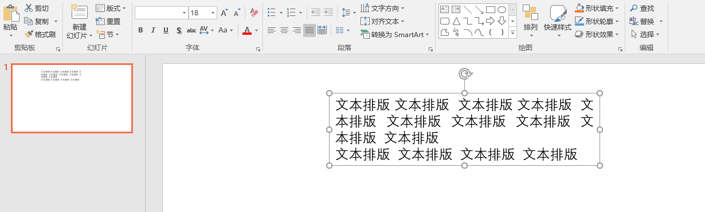
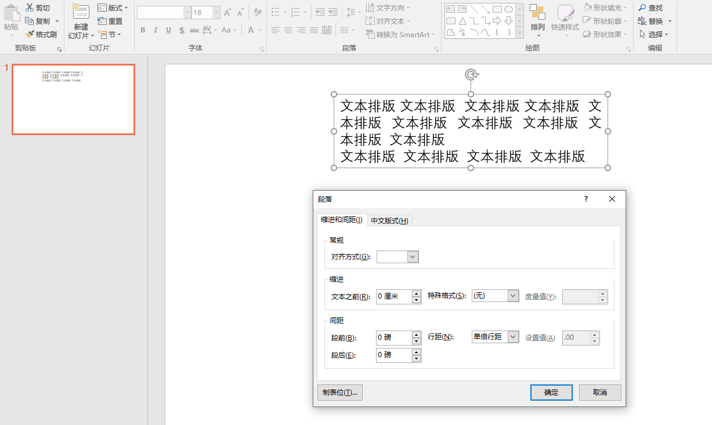
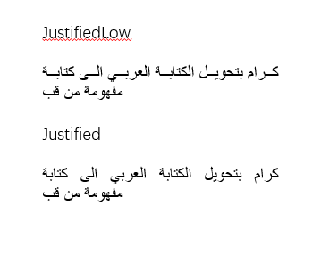
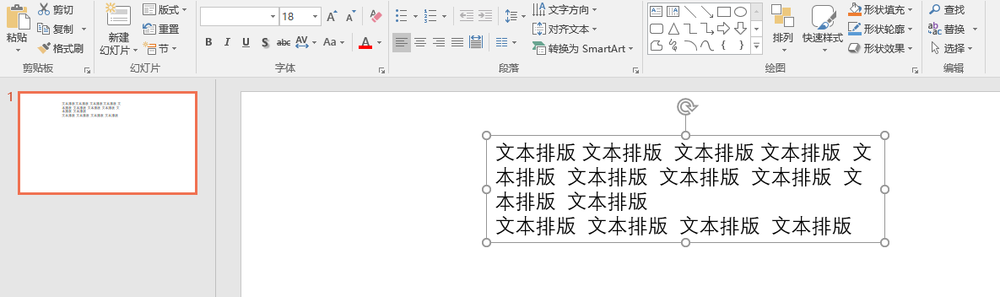
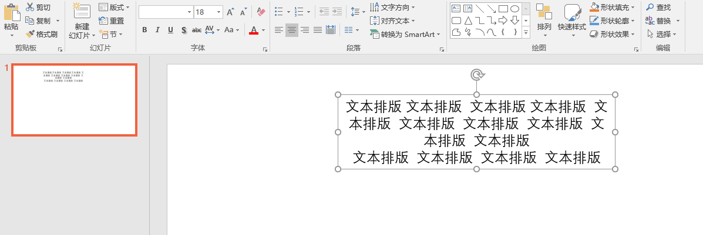
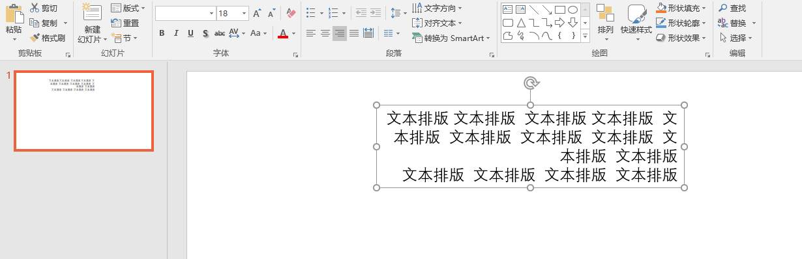
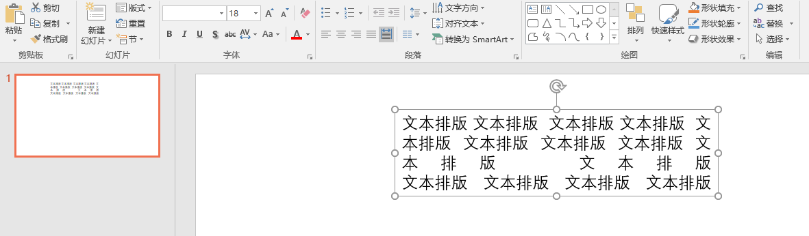
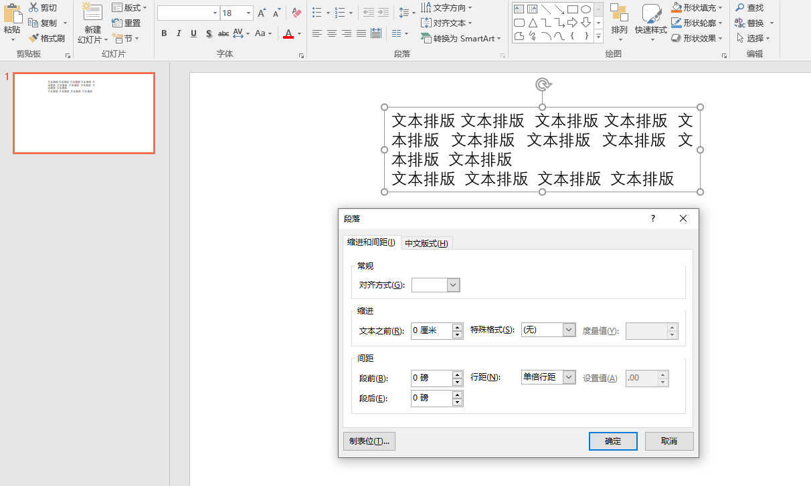

# dotnet OpenXML 聊聊文本段落对齐方式

本文来和大家聊聊在 OpenXML 里面，文本段落对齐方式。在 Word 和 PPT 的文本段落对齐规则是相同的，对齐的规则比较多，本文将一一告诉大家

<!--more-->


<!-- 发布 -->

文本的段落对齐，需要设置给段落属性上，在 OpenXML SDK 里，使用 TextAlignmentTypeValues 枚举设置，如以下代码

```csharp
using A = DocumentFormat.OpenXml.Drawing;

 A.ParagraphProperties paragraphProperties = new A.ParagraphProperties() { Alignment = A.TextAlignmentTypeValues.Left };
```

我通过 [OpenXML SDK 工具](https://download.csdn.net/download/lindexi_gd/19401193) 将一份简单的 PPT 进行代码生成，然后修改里面的属性，用来测试不同的枚举值的效果。此 [OpenXML SDK 工具](https://download.csdn.net/download/lindexi_gd/19401193) 我放在 [CSDN 下载](https://download.csdn.net/download/lindexi_gd/19401193) ，如果你想要但是不想从 CSDN 下载，还请发邮件给我

在 ECMA 376 文档，可以从 20.1.10.58 章找到具体的定义

我新建一个空 WPF 项目，添加如下代码用来测试

```csharp
        private void MainWindow_Loaded(object sender, RoutedEventArgs e)
        {
            foreach (var textAlignmentTypeValue in Enum.GetValues<TextAlignmentTypeValues>())
            {
                var generatedClass = new GeneratedClass()
                {
                    TextAlignment = textAlignmentTypeValue
                };

                var file = $"{textAlignmentTypeValue}.pptx";
                generatedClass.CreatePackage(file);

                Process.Start("explorer.exe", file);
            }
        }
```

上面的 GeneratedClass 就是使用 [OpenXML SDK 工具](https://download.csdn.net/download/lindexi_gd/19401193) 生成的

测试效果如下：

## Justified

两端对齐，在 OpenXML 文档里面写入的字符串是 `just` 的值。运行效果如下：

<!--  -->


两端对齐相对来说比较复杂

## JustifiedLow

两端对齐，和 Justified 的不同在于，这是为阿拉伯语特别做的，对应字符串是 `justLow` 的值。 运行效果如下：

<!--  -->


在 ECMA 376 的定义如下

> Aligns the text with an adjusted kashida length for Arabic text.

可以测试如下的阿拉伯语

```
كرام بتحويل الكتابة العربي الى كتابة مفهومة من قب
```

分别使用 JustifiedLow 和 Justified 进行对齐，可以看到效果如下

<!--  -->


最大的不同在于 JustifiedLow 对齐修改的是线条，但 Justified 是通过修改空格的宽度对齐

## Left

左对齐，对应字符串是 `l` 的值。运行效果如下：

<!--  -->


## Center

居中对齐，对应字符串是 `ctr` 的值。运行效果如下：


<!--  -->


## Right

右对齐，对应字符串是 `r` 的值。运行效果如下：

<!--  -->


## Distributed

分散对齐，对应字符串是 `dist` 的值。运行效果如下：

<!--  -->


和两端对齐的不同，请参阅本文的参考文档

## ThaiDistributed

泰语分散对齐，对应字符串是 `thaiDist` 的值。运行效果如下：

Distributes Thai text specially, because each character is treated as a word.

<!--  -->


## 代码

本文所有代码放在[github](https://github.com/lindexi/lindexi_gd/tree/cd98a7a6b29e9297864aad9d7326a635b6b68e5b/Pptx) 和 [gitee](https://gitee.com/lindexi/lindexi_gd/tree/cd98a7a6b29e9297864aad9d7326a635b6b68e5b/Pptx) 欢迎访问

可以通过如下方式获取本文的源代码，先创建一个空文件夹，接着使用命令行 cd 命令进入此空文件夹，在命令行里面输入以下代码，即可获取到本文的代码

```
git init
git remote add origin https://gitee.com/lindexi/lindexi_gd.git
git pull origin cd98a7a6b29e9297864aad9d7326a635b6b68e5b
```

以上使用的是 gitee 的源，如果 gitee 不能访问，请替换为 github 的源

```
git remote remove origin
git remote add origin https://github.com/lindexi/lindexi_gd.git
```

获取代码之后，进入 Pptx 文件夹

## 参考

  - [对齐文本](https://helpx.adobe.com/cn/incopy/using/aligning-text.html )
  - [怎样将PPT中的文字强制对齐（分散对齐）-百度经验](https://jingyan.baidu.com/article/f7ff0bfce5f7f52e26bb138b.html )
  - [word两端对齐与分散对齐的区别_Office教程网](https://www.office26.com/wjq/18376.html )
  - [两端分散对齐怎么设置_Word文档两端对齐.分散对齐如何设置_如说的博客-CSDN博客](https://blog.csdn.net/weixin_30543595/article/details/113690872 )
  - [office2016Word文档字数不同段落如何两端都对齐-百度经验](https://jingyan.baidu.com/article/454316ab334fdef7a7c03a82.html )
  - [Word文档左右两端对齐有什么用，怎么调整](https://baijiahao.baidu.com/s?id=1704092411488760371&wfr=spider&for=pc )
  - [TextAlignmentTypeValues 枚举 (DocumentFormat.OpenXml.Drawing)](https://docs.microsoft.com/zh-cn/dotnet/api/documentformat.openxml.drawing.textalignmenttypevalues?view=openxml-2.8.1 )


<a rel="license" href="http://creativecommons.org/licenses/by-nc-sa/4.0/"></a><br />本作品采用<a rel="license" href="http://creativecommons.org/licenses/by-nc-sa/4.0/">知识共享署名-非商业性使用-相同方式共享 4.0 国际许可协议</a>进行许可。欢迎转载、使用、重新发布，但务必保留文章署名[林德熙](http://blog.csdn.net/lindexi_gd)(包含链接:http://blog.csdn.net/lindexi_gd )，不得用于商业目的，基于本文修改后的作品务必以相同的许可发布。如有任何疑问，请与我[联系](mailto:lindexi_gd@163.com)。