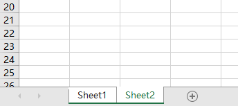

# dotnet OpenXML 获取 Excel 表格当前激活选择的工作表

本文告诉大家如何读取 Excel 里面的信息拿到当前激活选择的工作表

<!--more-->


<!-- 发布 -->

在开始之前，期望大家了解如何使用 OpenXML 读取 Excel 文件，如果对此还不了解，请看 [C# dotnet WPF 使用 OpenXml 解析 Excel 文件](https://blog.lindexi.com/post/C-dotnet-WPF-%E4%BD%BF%E7%94%A8-OpenXml-%E8%A7%A3%E6%9E%90-Excel-%E6%96%87%E4%BB%B6.html)

在 OpenXML 里面，可以通过 ActiveTab 属性拿到当前激活的工作表的序号。先打开咱的一个测试使用的 Excel 文件，如下面代码，接下来将使用此测试文件作为例子告诉大家如何拿到激活选择的工作表

```csharp
            FileInfo file = new("Test.xlsx");
            using var stream = file.OpenRead();
            SpreadsheetDocument spreadsheet = SpreadsheetDocument.Open(stream, false);
```

以上的测试文件可以在本文最后拿到

通过 OpenXML SDK 的定义，可以了解到 ActiveTab 放在 WorkbookView 里面，新版本的 SDK 加了可空，可以方便让咱了解某些属性是否一定是必须的。刚好这就不是一个必须的属性，通过 ECMA 376 文档可以了解到，如果没有定义，那就是序号为 0 的工作表被激活。获取的代码如下

```csharp
            var workbookPart = spreadsheet.WorkbookPart;
            Workbook workbook = workbookPart!.Workbook;
            var workbookView = workbook.BookViews?.GetFirstChild<WorkbookView>();
            var activeTabIndex = workbookView?.ActiveTab?.Value;
            Console.WriteLine($"当前激活的工作表序号：{activeTabIndex}");
            Debug.Assert(activeTabIndex != null);
```

拿到激活的工作表序号之后，可以通过序号拿到对应的工作表。这里有一个坑就是不能通过 WorksheetParts 的顺序去获取，如下面代码拿到的不一定是期望的工作表

```csharp
            // 下面的获取方法是错误的，不能通过 WorksheetParts 的序号获取，原因是这里的顺序是依靠 workbook.xml.rels 文件里面存放的顺序决定的
            var worksheetPart = workbookPart.WorksheetParts.ElementAt((int)activeTabIndex);
```

原因就是这里的顺序是依靠 workbook.xml.rels 文件里面存放的顺序决定的。正确的获取方法是先拿到 workbook.xml 的 Sheets 属性，这个属性就是工作表的顺序

```csharp
            var sheets = workbook.Sheets;
            // 序号从0开始
            var sheet = sheets!.Elements<Sheet>().ElementAt((int)activeTabIndex);
```

刚好这个序号是从 0 开始的，获取的方法十分简单，通过 Sheet 即可拿到对应工作表，代码如下

```csharp
            var worksheetPart = (WorksheetPart)workbookPart.GetPartById(sheet.Id!.Value!);
            var worksheet = worksheetPart.Worksheet;
```

以上就是获取激活的工作表的方法。如果想要拿到选择的工作表，尽管大部分的 Excel 文件，当前激活的工作表就是被选择的工作表，不过通过下面代码可以再次判断当前激活的工作表是否是选择的

```csharp
            // 在工作表里面，也有一个属性表示当前是被选择的
            // 默认在 Excel 的行为就是被选择而且被激活
            var sheetViews = worksheet.SheetViews;
            var sheetView = sheetViews!.GetFirstChild<SheetView>();
            Console.WriteLine($"当前工作表被选择：{sheetView!.TabSelected}");
```

如果一个 Excel 表格的激活是在第二个工作表，但是选择的是第一个工作表，那么表现如下

<!--  -->


本文以上的测试文件和代码放在[github](https://github.com/lindexi/lindexi_gd/tree/a3ccca2c3afb34ff1d21d83c77a90a8b41a1f35d/Xlsx) 和 [gitee](https://gitee.com/lindexi/lindexi_gd/tree/a3ccca2c3afb34ff1d21d83c77a90a8b41a1f35d/Xlsx) 欢迎访问

可以通过如下方式获取本文的源代码，先创建一个空文件夹，接着使用命令行 cd 命令进入此空文件夹，在命令行里面输入以下代码，即可获取到本文的代码

```
git init
git remote add origin https://gitee.com/lindexi/lindexi_gd.git
git pull origin a3ccca2c3afb34ff1d21d83c77a90a8b41a1f35d
```

以上使用的是 gitee 的源，如果 gitee 不能访问，请替换为 github 的源

```
git remote remove origin
git remote add origin https://github.com/lindexi/lindexi_gd.git
```

获取代码之后，进入 Xlsx 文件夹

更多请看 [Office 使用 OpenXML SDK 解析文档博客目录](https://blog.lindexi.com/post/Office-%E4%BD%BF%E7%94%A8-OpenXML-SDK-%E8%A7%A3%E6%9E%90%E6%96%87%E6%A1%A3%E5%8D%9A%E5%AE%A2%E7%9B%AE%E5%BD%95.html )


<a rel="license" href="http://creativecommons.org/licenses/by-nc-sa/4.0/"></a><br />本作品采用<a rel="license" href="http://creativecommons.org/licenses/by-nc-sa/4.0/">知识共享署名-非商业性使用-相同方式共享 4.0 国际许可协议</a>进行许可。欢迎转载、使用、重新发布，但务必保留文章署名[林德熙](http://blog.csdn.net/lindexi_gd)(包含链接:http://blog.csdn.net/lindexi_gd )，不得用于商业目的，基于本文修改后的作品务必以相同的许可发布。如有任何疑问，请与我[联系](mailto:lindexi_gd@163.com)。