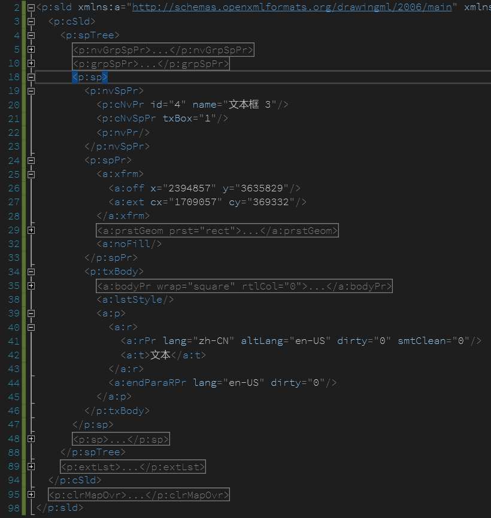
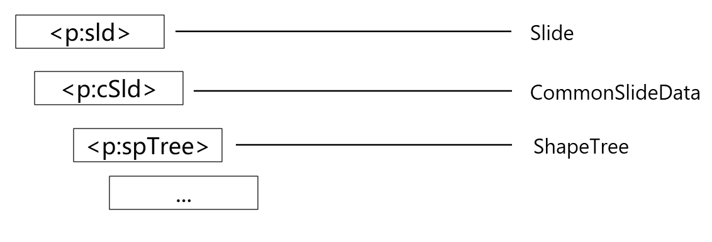
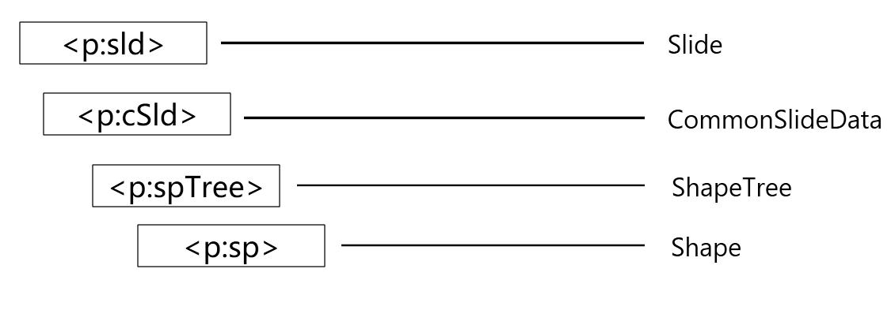
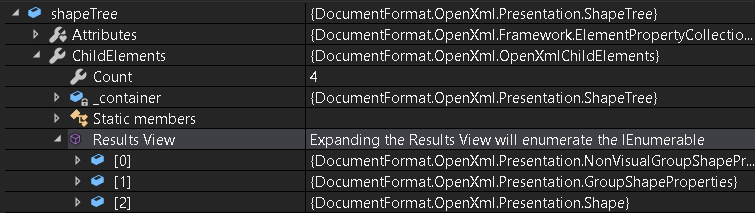

# dotnet OpenXML 解析 PPT 页面元素文档格式

本文告诉大家在 OpenXML 里面的 PPT 页面 Slide 的元素文档格式

<!--more-->


<!-- CreateTime:7/4/2020 9:45:01 AM -->

<!-- 发布 -->

是否小伙伴还记得如何使用 OpenXML SDK 获取一份 PPTX 文件的某一个页面？如果不记得，请看 [C# dotnet 使用 OpenXml 解析 PPT 文件](https://blog.lindexi.com/post/C-dotnet-%E4%BD%BF%E7%94%A8-OpenXml-%E8%A7%A3%E6%9E%90-PPT-%E6%96%87%E4%BB%B6.html )

如下是一个简单的 PPTX 的 Slide 页面

<!--  -->


大概的主结构如下

<!--  -->


对应缩写如下

```csharp
p - Presentation
p:sld - Slide
p:cSld - CommonSlideData
p:spTree - ShapeTree
```

对应获取代码如下

```csharp
            using (var presentationDocument =
                PresentationDocument.Open("test.pptx", false))
            {
                var presentationPart = presentationDocument.PresentationPart;
                foreach (var slidePart in presentationPart.SlideParts)
                {
                    var slide = slidePart.Slide;

                    var slideData = slide.CommonSlideData;
                    var shapeTree = slideData.ShapeTree;
                }
            }
```

元素放在 ShapeTree 里面，文档格式如下

<!--  -->


 
尽管有多媒体元素等不属于 Shape 形状，但是在 PPT 里面形状属于最基础的元素， 在 PPT 里面的所有的元素都放在 ShapeTree 里面。虽然 ShapeTree 命名是形状，但实际上所有元素都可以当成形状使用

例如在 ShapeTree 里面放一个文本，文本本身就是 DocumentFormat.OpenXml.Presentation.Shape 也就是形状。形状是形状，而文本框也是形状

获取页面里面的形状的方法如下

```csharp
foreach (var openXmlElement in shapeTree)
{
    if (openXmlElement is DocumentFormat.OpenXml.Presentation.Shape shape)
    {

    }
}
```

这里的代码放在 [github](https://github.com/lindexi/lindexi_gd/tree/b552920d1e89d2d876145a5588dbe898e2e80441/ChihilaygerYadekearhu) 欢迎小伙伴访问，运行代码在 `openXmlElement is DocumentFormat.OpenXml.Presentation.Shape shape` 添加断点就可以看到断点进入

在 VS 的帮助下，其实咱可以不理会PPT文档本身，直接使用 OpenXML 解析完成的值，这样做的优势在于不需要频繁去找文档。除非真的在看了注释之后依然不理解属性的含义和作用，不过一般此时看文档作用也不大

例如想要看某个页面包含的元素，可以点开 shapeTree 的 ChildElements 属性

<!--  -->


此时对应的 XML 的缩写的含义以及对应的属性将可以在 VS 调试的时候看到，看到具体的属性含义以及值，相对来说开发效率会提升很多。当然这需要你学会 VS 的调试方法哈

每个元素都有一些通用的属性，例如元素的变换，也就是表示元素的坐标和大小等的属性，元素翻转旋转等

此外对于特定的元素，例如形状元素有形状元素自己的属性，例如线条填充等，这部分就需要每个元素自己去解析了

在 PPT 里面所有文本都是形状，只是文本框是有趣的形状，而其他的形状大部分都是可以添加文本的。但 PPT 使用的文本和 Word 的文本是等价的，而 Word 的文本小伙伴都知道有多复杂了…… 因此在 PPT 解析里面的神坑其实就是文本的解析部分，关于文本解析我写了一些博客

换句话说如果完成了 PPT 的文本的解析和渲染，那么基本上 Word 的文本解析就完成了大半了。当然强大的 Word 可不止文本这一项

现在市面大部分的 PPT 解析工具和软件都只是实现了基础元素的基础属性，例如

- 通用颜色
- 通用动画的基础动画
- 占位符
- 形状
  + 形状线条
  + 形状样式
- 文本
  + 纯文本
  + 文本多行多段
  + 文本装饰下划线等
  + 文本字体字号
  + 文本上下标
- 图片
  + 图片文件
  + 图片裁剪
  + 基础图片特效
- 音视频
  + 音视频图片
  + 音视频文件
- 表格
  + 基础表格
  + 表格线条
  + 表格颜色

其中公式以及 Ole 元素等都可以作为图片显示，因此大部分包括 WPS 在内基本上对于公式和 Ole 元素都是当成图片，当然 WPS 很强，能解析一些公式和 Ole 元素

其实PPT解析里面的元素部分大部分都是 Office 通用的，例如文本是 PPT 和 Word 和 Excel 通用的。而表格是 Excel 的简化版

基本上完成一个元素的完全解析，基本上也就完成 Office 系列软件某个元素的解析

本文说的解析其实是不对的，因为使用 OpenXML SDK 库就是瞬间完成了内存模型解析。其他的业务都是根据业务本身从数据拿出来进行处理，例如进行渲染或者修改等


<a rel="license" href="http://creativecommons.org/licenses/by-nc-sa/4.0/"></a><br />本作品采用<a rel="license" href="http://creativecommons.org/licenses/by-nc-sa/4.0/">知识共享署名-非商业性使用-相同方式共享 4.0 国际许可协议</a>进行许可。欢迎转载、使用、重新发布，但务必保留文章署名[林德熙](http://blog.csdn.net/lindexi_gd)(包含链接:http://blog.csdn.net/lindexi_gd )，不得用于商业目的，基于本文修改后的作品务必以相同的许可发布。如有任何疑问，请与我[联系](mailto:lindexi_gd@163.com)。