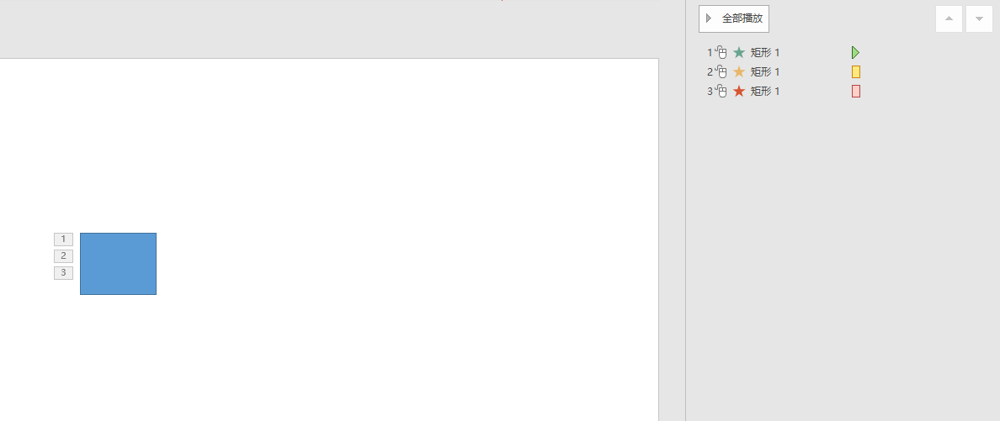

# dotnet OpenXML 读取 PPT 主序列进入退出强调动画

本文告诉大家如何读取 PPT 文件里面，放在主动画序列 MainSequence 的进入和退出和强调的动画，和在 OpenXML 里面的存放方式

<!--more-->


<!-- 发布 -->

如以下的课件内容，给一个元素添加了进入强调退出的动画，动画之间没有相关影响，通过点击触发动画，如下图

<!--  -->


大概的动画内容如下

```xml
  <p:timing>
    <p:tnLst>
      <p:par>
        <p:cTn id="1" dur="indefinite" restart="never" nodeType="tmRoot">
          <p:childTnLst>
            <p:seq concurrent="1" nextAc="seek">
              <p:cTn id="2" dur="indefinite" nodeType="mainSeq">
                <p:childTnLst>
                  <p:par>
                    <p:cTn id="3" fill="hold">
                      <p:stCondLst>
                        <p:cond delay="indefinite" />
                      </p:stCondLst>
                      <p:childTnLst>
                        <p:par>
                          <p:cTn id="4" fill="hold">
                            <p:stCondLst>
                              <p:cond delay="0" />
                            </p:stCondLst>
                            <p:childTnLst>
                              <p:par>
                                <p:cTn id="5" presetID="1" presetClass="entr" presetSubtype="0" fill="hold" grpId="0" nodeType="clickEffect">
                                  <p:stCondLst>
                                    <p:cond delay="0" />
                                  </p:stCondLst>
                                  <p:childTnLst>
                                    <!-- 忽略代码-->
                                  </p:childTnLst>
                                </p:cTn>
                              </p:par>
                            </p:childTnLst>
                          </p:cTn>
                        </p:par>
                      </p:childTnLst>
                    </p:cTn>
                  </p:par>
                  <p:par>
                    <p:cTn id="7" fill="hold">
                      <p:stCondLst>
                        <p:cond delay="indefinite" />
                      </p:stCondLst>
                      <p:childTnLst>
                        <p:par>
                          <p:cTn id="8" fill="hold">
                            <p:stCondLst>
                              <p:cond delay="0" />
                            </p:stCondLst>
                            <p:childTnLst>
                              <p:par>
                                <p:cTn id="9" presetID="25" presetClass="emph" presetSubtype="0" fill="hold" grpId="2" nodeType="clickEffect">
                                  <p:stCondLst>
                                    <p:cond delay="0" />
                                  </p:stCondLst>
                                  <p:childTnLst>
                                     <!-- 忽略代码-->
                                  </p:childTnLst>
                                </p:cTn>
                              </p:par>
                            </p:childTnLst>
                          </p:cTn>
                        </p:par>
                      </p:childTnLst>
                    </p:cTn>
                  </p:par>
                  <p:par>
                    <p:cTn id="14" fill="hold">
                      <p:stCondLst>
                        <p:cond delay="indefinite" />
                      </p:stCondLst>
                      <p:childTnLst>
                        <p:par>
                          <p:cTn id="15" fill="hold">
                            <p:stCondLst>
                              <p:cond delay="0" />
                            </p:stCondLst>
                            <p:childTnLst>
                              <p:par>
                                <p:cTn id="16" presetID="10" presetClass="exit" presetSubtype="0" fill="hold" grpId="1" nodeType="clickEffect">
                                    <!-- 忽略代码-->
                                </p:cTn>
                              </p:par>
                            </p:childTnLst>
                          </p:cTn>
                        </p:par>
                      </p:childTnLst>
                    </p:cTn>
                  </p:par>
                </p:childTnLst>
              </p:cTn>
              <!-- 忽略代码-->
            </p:seq>
          </p:childTnLst>
        </p:cTn>
      </p:par>
    </p:tnLst>
    <!-- 忽略代码-->
  </p:timing>
```

根据 `cTn` 也就是 OpenXML sdk 定义的 `CommonTimeNode` 类型的 PresetClass 属性可以了解到，动画 id 是 5 的是进入动画，动画 id 是 9 的是强调动画，动画 id 是 10 的是退出动画

可以看到在 PPT 里面，多个不同的动画，这些动画没有关联，也就是没有在上一个播放完成后，而是通过点击触发的，放在主序列的动画的内容大概如下

```xml
  <p:timing>
    <p:tnLst>
      <p:par>
        <p:cTn id="1" dur="indefinite" restart="never" nodeType="tmRoot">
          <p:childTnLst>
            <p:seq concurrent="1" nextAc="seek">
              <p:cTn id="2" dur="indefinite" nodeType="mainSeq">
                <p:childTnLst>
                  <p:par>
                    <!-- 进入动画-->
                  </p:par>
                  <p:par>
                    <!-- 强调动画-->
                  </p:par>
                  <p:par>
                    <!-- 退出动画-->
                  </p:par>
                </p:childTnLst>
              </p:cTn>
              <!-- 忽略代码-->
            </p:seq>
          </p:childTnLst>
        </p:cTn>
      </p:par>
    </p:tnLst>
    <!-- 忽略代码-->
  </p:timing>
```

如上面的内容，大概可以理解存放的方式了，只是在 PPT 里面，有多个 ParallelTimeNode 和 CommonTimeNode 的嵌套。从 mainSeq 也就是 MainSequence 主动画序列以下，获取到的实际的进入动画，是经过了如下路径才能获取

```
cTn (mainSeq) -> childTnLst -> par -> cTn (id="3") -> childTnLst -> par -> cTn (id="4") -> childTnLst -> par -> cTn (id="5" presetClass="entr")
```

可以使用以下代码读取

```csharp
        static void Main(string[] args)
        {
            using var presentationDocument =
                DocumentFormat.OpenXml.Packaging.PresentationDocument.Open("Test.pptx", false);
            var presentationPart = presentationDocument.PresentationPart;
            var slidePart = presentationPart!.SlideParts.First();
            var slide = slidePart.Slide;
            var timing = slide.Timing;
            // 第一级里面默认只有一项
            var commonTimeNode = timing?.TimeNodeList?.ParallelTimeNode?.CommonTimeNode;

            if (commonTimeNode?.NodeType?.Value == TimeNodeValues.TmingRoot)
            {
                // 这是符合约定
                // nodeType="tmRoot"
            }

            if (commonTimeNode?.ChildTimeNodeList == null) return;
            // 理论上只有一项，而且一定是 SequenceTimeNode 类型
            var sequenceTimeNode = commonTimeNode.ChildTimeNodeList.GetFirstChild<SequenceTimeNode>();

            var mainSequenceTimeNode = sequenceTimeNode.CommonTimeNode;
            if (mainSequenceTimeNode?.NodeType?.Value == TimeNodeValues.MainSequence)
            {
                // [TimeLine 对象 (PowerPoint) | Microsoft Docs](https://docs.microsoft.com/zh-cn/office/vba/api/PowerPoint.TimeLine )
                //  MainSequence 主动画序列
                var mainParallelTimeNode = mainSequenceTimeNode.ChildTimeNodeList;

                foreach (var openXmlElement in mainParallelTimeNode)
                {
                    // 并行关系的
                    if (openXmlElement is ParallelTimeNode parallelTimeNode)
                    {
                        var timeNode = parallelTimeNode.CommonTimeNode.ChildTimeNodeList
                            .GetFirstChild<ParallelTimeNode>().CommonTimeNode.ChildTimeNodeList
                            .GetFirstChild<ParallelTimeNode>().CommonTimeNode;

                        switch (timeNode.PresetClass.Value)
                        {
                            case TimeNodePresetClassValues.Entrance:
                                // 进入动画
                                break;
                            case TimeNodePresetClassValues.Exit:
                                // 退出动画
                                break;
                            case TimeNodePresetClassValues.Emphasis:
                                // 强调动画
                                break;
                            case TimeNodePresetClassValues.Path:
                                // 路由动画
                                break;
                            case TimeNodePresetClassValues.Verb:
                                break;
                            case TimeNodePresetClassValues.MediaCall:
                                // 播放动画
                                break;
                            default:
                                throw new ArgumentOutOfRangeException();
                        }
                    }
                }
            }

            // 文档规定，必须存在一个AttributeNameList列表，一定存在AttributeName元素，如果有多个只取第一个元素。
            // 见"[MS-OI 29500].PDF 第2.1.1137章节（g选项）"
        }
```

本文上面代码放在 [github](https://github.com/lindexi/lindexi_gd/tree/2c06ddf74e45c31ad7842dd06dc09bcc67b6142e/PptxDemo) 和 [gitee](https://gitee.com/lindexi/lindexi_gd/tree/2c06ddf74e45c31ad7842dd06dc09bcc67b6142e/PptxDemo) 欢迎访问

可以通过如下方式获取本文的源代码，先创建一个空文件夹，接着使用命令行 cd 命令进入此空文件夹，在命令行里面输入以下代码，即可获取到本文的代码

```
git init
git remote add origin https://gitee.com/lindexi/lindexi_gd.git
git pull origin 2c06ddf74e45c31ad7842dd06dc09bcc67b6142e
```

以上使用的是 gitee 的源，如果 gitee 不能访问，请替换为 github 的源

```
git remote remove origin
git remote add origin https://github.com/lindexi/lindexi_gd.git
```

获取代码之后，进入 PptxDemo 文件夹

以上的测试使用的 PPT 课件也放在此文件夹


本文的属性是依靠 [dotnet OpenXML 解压缩文档为文件夹工具](https://blog.lindexi.com/post/dotnet-OpenXML-%E8%A7%A3%E5%8E%8B%E7%BC%A9%E6%96%87%E6%A1%A3%E4%B8%BA%E6%96%87%E4%BB%B6%E5%A4%B9%E5%B7%A5%E5%85%B7.html ) 工具协助测试的，这个工具是开源免费的工具，欢迎使用

更多请看 [Office 使用 OpenXML SDK 解析文档博客目录](https://blog.lindexi.com/post/Office-%E4%BD%BF%E7%94%A8-OpenXML-SDK-%E8%A7%A3%E6%9E%90%E6%96%87%E6%A1%A3%E5%8D%9A%E5%AE%A2%E7%9B%AE%E5%BD%95.html )


<a rel="license" href="http://creativecommons.org/licenses/by-nc-sa/4.0/"></a><br />本作品采用<a rel="license" href="http://creativecommons.org/licenses/by-nc-sa/4.0/">知识共享署名-非商业性使用-相同方式共享 4.0 国际许可协议</a>进行许可。欢迎转载、使用、重新发布，但务必保留文章署名[林德熙](http://blog.csdn.net/lindexi_gd)(包含链接:http://blog.csdn.net/lindexi_gd )，不得用于商业目的，基于本文修改后的作品务必以相同的许可发布。如有任何疑问，请与我[联系](mailto:lindexi_gd@163.com)。