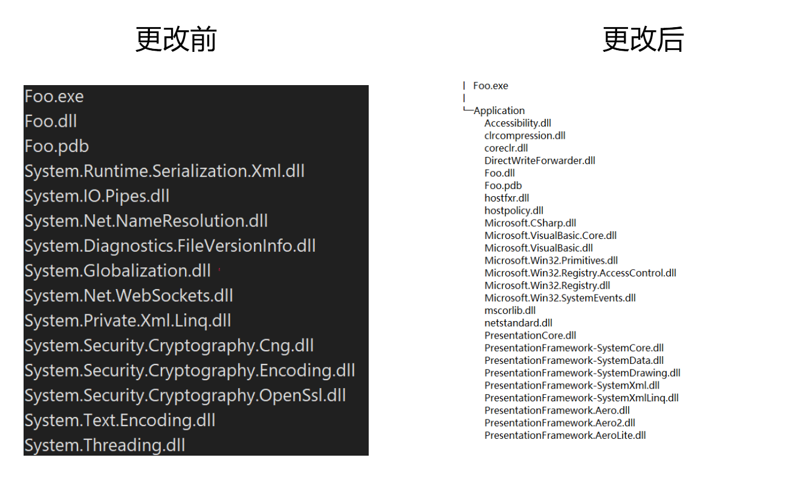

# dotnet core 应用是如何跑起来的 通过AppHost理解运行过程

在 dotnet 的输出路径里面，可以看到有一个有趣的可执行文件，这个可执行文件是如何在框架发布和独立发布的时候，找到 dotnet 程序的运行时的，这个可执行文件里面包含了哪些内容

<!--more-->


<!-- CreateTime:2020/12/1 20:04:44 -->

<!-- 发布 -->

在回答上面的问题之前，请大家尝试打开 `C:\Program Files\dotnet\sdk\5.0.100\AppHostTemplate\` 这个文件夹。当然了，请将 dotnet 版本号修改为你本机的版本号。在这个文件夹里面，可以看到有一个文件叫 apphost.exe 的可执行文件。有趣的是在咱的 dotnet 项目的 obj 文件夹下也能找到叫这个名字的这个文件

更有趣的是在咱的 dotnet 项目的 obj 文件夹下的 apphost.exe 可执行文件和最终输出的可执行文件是相同的一个文件

这有什么联系呢？ 回答这个问题需要从 dotnet 的代码开始。在 GitHub 完全开源的 dotnet 源代码仓库 [https://github.com/dotnet/runtime](https://github.com/dotnet/runtime) 里面，将代码拉到本地，可以在 `dotnet runtime\src\installer\corehost\` 文件里面看到很多有趣的逻辑

没错，其实 apphost.exe 的核心逻辑就放在 `dotnet runtime\src\installer\corehost\` 文件里面

打开 `dotnet runtime\src\installer\corehost\corehost.cpp` 文件，可以看到一段有趣的注释

```
/**
 * Detect if the apphost executable is allowed to load and execute a managed assembly.
 *
 *    - The exe is built with a known hash string at some offset in the image
 *    - The exe is useless as is with the built-in hash value, and will fail with an error message
 *    - The hash value should be replaced with the managed DLL filename with optional relative path
 *    - The optional path is relative to the location of the apphost executable
 *    - The relative path plus filename are verified to reference a valid file
 *    - The filename should be "NUL terminated UTF-8" by "dotnet build"
 *    - The managed DLL filename does not have to be the same name as the apphost executable name
 *    - The exe may be signed at this point by the app publisher
 *    - Note: the maximum size of the filename and relative path is 1024 bytes in UTF-8 (not including NUL)
 *        o https://en.wikipedia.org/wiki/Comparison_of_file_systems
 *          has more details on maximum file name sizes.
 */
```

在 `dotnet runtime\src\installer\corehost\corehost.cpp` 文件的 `exe_start` 大概就是整个可执行文件的入口方法了，在这里实现的功能将包含使用 hostfxr 和 hostpolicy 来托管执行整个 dotnet 进程，以及主函数的调起。而在使用托管之前，需要先寻找 dotnet_root 也就是 dotnet 框架用来承载整个 dotnet 进程

上面的逻辑的核心代码如下

```c++
            const pal::char_t* dotnet_root_cstr = fxr.dotnet_root().empty() ? nullptr : fxr.dotnet_root().c_str();
            rc = hostfxr_main_bundle_startupinfo(argc, argv, host_path_cstr, dotnet_root_cstr, app_path_cstr, bundle_header_offset);
```

而在进行独立发布的时候，其实会在创建 fxr 对象的时候传入 app_root 路径，如下面代码

```csharp
    hostfxr_resolver_t fxr{app_root};
```

在 dotnet core 里面，和 dotnet framework 不同的是，在 dotnet core 的可执行程序没有使用到系统给的黑科技，是一个完全的 Win32 应用程序，在双击 exe 的时候，将会执行一段非托管的代码，在进入到 corehost.cpp 的  `exe_start` 函数之后。将会开始寻找 dotnet 托管入口，以及 dotnet 运行时，通过 hostfxr 的方式加载运行时组件，然后跑起来托管应用

那么在 dotnet 构建输出的可执行文件又是什么？其实就是包含了 corehost.cpp 逻辑的 AppHost.exe 文件的魔改。在 corehost.cpp 构建出来的 AppHost.exe 文件，是不知道开发者的最终输出包含入口的 dll 是哪个的，需要在构建过程中传入给 AppHost.exe 文件。而 AppHost.exe 文件是固定的二进制文件，不接受配置等方式，因此传入的方法就是通过修改二进制的内容了

这也就是为什么 AppHost.exe 放在 AppHostTemplate 文件夹的命名原因，因为这个 `C:\Program Files\dotnet\sdk\5.0.100\AppHostTemplate\` 文件夹的 AppHost.exe 是一个 Template 模版而已，在 corehost.cpp 文件里面，预定了一段大概是 1025 长度的空间用来存放 dotnet 入口 dll 路径名。这个代码就是本文上面给的很长的注释下面的代码

```c++
#define EMBED_HASH_HI_PART_UTF8 "c3ab8ff13720e8ad9047dd39466b3c89" // SHA-256 of "foobar" in UTF-8
#define EMBED_HASH_LO_PART_UTF8 "74e592c2fa383d4a3960714caef0c4f2" // 这两句代码就是 foobar 的 UTF-8 二进制的 SHA-256 字符串
#define EMBED_HASH_FULL_UTF8    (EMBED_HASH_HI_PART_UTF8 EMBED_HASH_LO_PART_UTF8) // NUL terminated

bool is_exe_enabled_for_execution(pal::string_t* app_dll)
{
    constexpr int EMBED_SZ = sizeof(EMBED_HASH_FULL_UTF8) / sizeof(EMBED_HASH_FULL_UTF8[0]);
    // 这里给的是就是最长 1024 个 byte 的 dll 名，加上一个 \0 一共是 1025 个字符
    constexpr int EMBED_MAX = (EMBED_SZ > 1025 ? EMBED_SZ : 1025); // 1024 DLL name length, 1 NUL

    // 这就是定义在 AppHost.exe 二进制文件里面的一段空间了，长度就是 EMBED_MAX 长度，内容就是 c3ab8ff13720e8ad9047dd39466b3c8974e592c2fa383d4a3960714caef0c4f2 这段字符串
    static char embed[EMBED_MAX] = EMBED_HASH_FULL_UTF8;     // series of NULs followed by embed hash string

    static const char hi_part[] = EMBED_HASH_HI_PART_UTF8;
    static const char lo_part[] = EMBED_HASH_LO_PART_UTF8;

    // 将 embed 的内容复制到 app_dll 变量里面
    pal::clr_palstring(embed, app_dll);
}


int exe_start(const int argc, const pal::char_t* argv[])
{
	// 读取嵌入到二进制文件的 App 名，也就是 dotnet 的入口 dll 路径，可以是相对也可以是绝对路径
    pal::string_t embedded_app_name;
    if (!is_exe_enabled_for_execution(&embedded_app_name))
    {
        trace::error(_X("A fatal error was encountered. This executable was not bound to load a managed DLL."));
        return StatusCode::AppHostExeNotBoundFailure;
    }

    // 将 embedded_app_name 的内容赋值给 app_path 变量，这个变量的定义代码我没有写
    append_path(&app_path, embedded_app_name.c_str());

    const pal::char_t* app_path_cstr = app_path.empty() ? nullptr : app_path.c_str();
    // 跑起来 dotnet 应用
    rc = hostfxr_main_bundle_startupinfo(argc, argv, host_path_cstr, dotnet_root_cstr, app_path_cstr, bundle_header_offset);
}
```

上面代码不是实际的 corehost.cpp 的代码，只是为了方便本文描述而修改的代码

在实际输出的 dotnet 可执行文件里面的逻辑是先从 `C:\Program Files\dotnet\sdk\5.0.100\AppHostTemplate\` 文件夹复制 AppHost.exe 出来，接着依靠上面代码的 `static char embed[EMBED_MAX] = EMBED_HASH_FULL_UTF8;` 的逻辑，替换二进制文件的 embed 值的内容

在 `dotnet runtime\src\installer\managed\Microsoft.NET.HostModel\AppHost\HostWriter.cs` 文件中，将包含实际的替换逻辑，代码如下

```csharp
    /// <summary>
    /// Embeds the App Name into the AppHost.exe
    /// If an apphost is a single-file bundle, updates the location of the bundle headers.
    /// </summary>
    public static class HostWriter
    {
        /// <summary>
        /// hash value embedded in default apphost executable in a place where the path to the app binary should be stored.
        /// </summary>
        private const string AppBinaryPathPlaceholder = "c3ab8ff13720e8ad9047dd39466b3c8974e592c2fa383d4a3960714caef0c4f2";
        private static readonly byte[] AppBinaryPathPlaceholderSearchValue = Encoding.UTF8.GetBytes(AppBinaryPathPlaceholder);

        /// <summary>
        /// Create an AppHost with embedded configuration of app binary location
        /// </summary>
        /// <param name="appHostSourceFilePath">The path of Apphost template, which has the place holder</param>
        /// <param name="appHostDestinationFilePath">The destination path for desired location to place, including the file name</param>
        /// <param name="appBinaryFilePath">Full path to app binary or relative path to the result apphost file</param>
        /// <param name="windowsGraphicalUserInterface">Specify whether to set the subsystem to GUI. Only valid for PE apphosts.</param>
        /// <param name="assemblyToCopyResorcesFrom">Path to the intermediate assembly, used for copying resources to PE apphosts.</param>
        public static void CreateAppHost(
            string appHostSourceFilePath,
            string appHostDestinationFilePath,
            string appBinaryFilePath,
            bool windowsGraphicalUserInterface = false,
            string assemblyToCopyResorcesFrom = null)
        {
            var bytesToWrite = Encoding.UTF8.GetBytes(appBinaryFilePath);
            if (bytesToWrite.Length > 1024)
            {
                throw new AppNameTooLongException(appBinaryFilePath);
            }

            void RewriteAppHost()
            {
                // Re-write the destination apphost with the proper contents.
                using (var memoryMappedFile = MemoryMappedFile.CreateFromFile(appHostDestinationFilePath))
                {
                    using (MemoryMappedViewAccessor accessor = memoryMappedFile.CreateViewAccessor())
                    {
                        BinaryUtils.SearchAndReplace(accessor, AppBinaryPathPlaceholderSearchValue, bytesToWrite);

                        appHostIsPEImage = PEUtils.IsPEImage(accessor);

                        if (windowsGraphicalUserInterface)
                        {
                            if (!appHostIsPEImage)
                            {
                                throw new AppHostNotPEFileException();
                            }

                            PEUtils.SetWindowsGraphicalUserInterfaceBit(accessor);
                        }
                    }
                }
            }

            // 忽略代码
        }
    }
```

可以看到在 HostWriter 的逻辑就是找到 AppHost.exe 里面的 `private const string AppBinaryPathPlaceholder = "c3ab8ff13720e8ad9047dd39466b3c8974e592c2fa383d4a3960714caef0c4f2";` 二进制内容，替换为 appBinaryFilePath 的内容

而除了这个之外，还有其他的逻辑就是包含一些资源文件，如图标和程序清单等，将这些内容放入到 AppHost.exe 里面，这就是实际的输出文件了

利用这个机制，咱可以更改可执行程序的内容，让可执行程序文件，寻找其他路径下的 dll 文件作为 dotnet 程序的入口，大概就可以实现将 exe 放在文件夹外面，而将 dll 放在文件夹里面的效果。原先的输出就是让 exe 和 dll 都在相同的一个文件夹，这样看起来整个文件夹都很乱。也不利于进行 OTA 静默升级。而将入口 exe 文件放在 dll 所在文件夹的外面，可以让整个应用文件夹看起来更加清真

<!--  -->


想要达成这个效果很简单，如上面描述的原理，可以通过修改 AppHost.exe 文件的二进制内容，设置入口 dll 的路径来实现

更改方法就是抄 HostWriter 的做法，替换 exe 里面对应的二进制内容，我从 dnSpy 里面抄了一些代码，魔改之后放在 [github](https://github.com/lindexi/lindexi_gd/tree/176caf10abb0f58a7c8a99bb524e62c20eb17762/AppHostPatcher ) 欢迎小伙伴访问

在拉下来 AppHostPatcher 之后，进行构建，此时的 AppHostPatcher 是一个命令行工具应用，支持将最终输出的 exe 文件进行魔改。传入的命令行参数只有两个，一个是可执行文件的路径，另一个就是新的 dll 所在路径。如下面代码

```csharp
AppHostPatcher.exe Foo.exe .\Application\Foo.dll
```

此时原本的 Foo.exe 将会寻找相同文件夹下的 Foo.dll 文件作为 dotnet 的入口程序集，而在执行上面代码之后，双击 Foo.exe 将会寻找 `Application\Foo.dll` 作为入口程序集，因此就能将整个文件夹的内容，除了 exe 之外的其他文件放在其他文件夹里面

更多细节请看 [Write a custom .NET Core runtime host](https://docs.microsoft.com/en-us/dotnet/core/tutorials/netcore-hosting?WT.mc_id=DX-MVP-5003606 )

本文以上使用的代码是在 [https://github.com/dotnet/runtime](https://github.com/dotnet/runtime)  的 v5.0.0-rtm.20519.4 版本的代码


<a rel="license" href="http://creativecommons.org/licenses/by-nc-sa/4.0/"></a><br />本作品采用<a rel="license" href="http://creativecommons.org/licenses/by-nc-sa/4.0/">知识共享署名-非商业性使用-相同方式共享 4.0 国际许可协议</a>进行许可。欢迎转载、使用、重新发布，但务必保留文章署名[林德熙](http://blog.csdn.net/lindexi_gd)(包含链接:http://blog.csdn.net/lindexi_gd )，不得用于商业目的，基于本文修改后的作品务必以相同的许可发布。如有任何疑问，请与我[联系](mailto:lindexi_gd@163.com)。