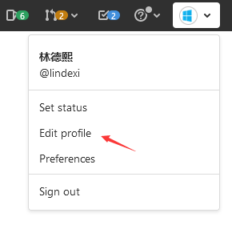
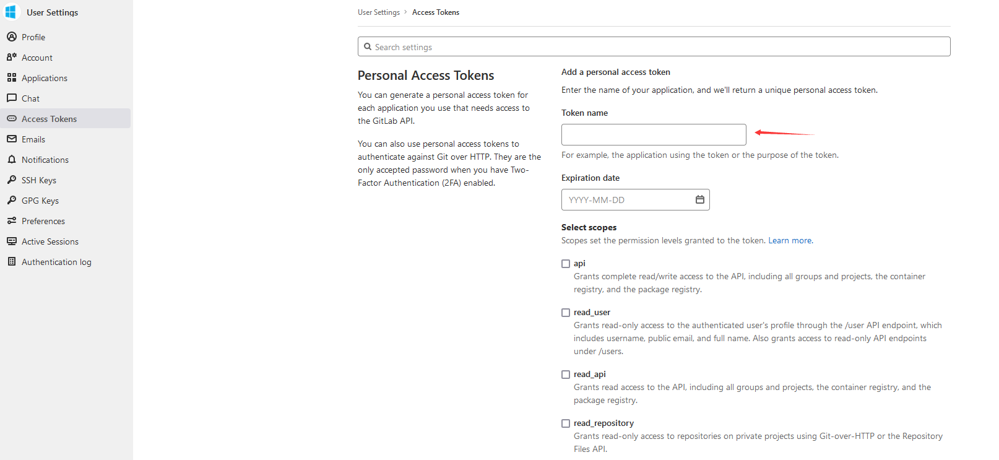
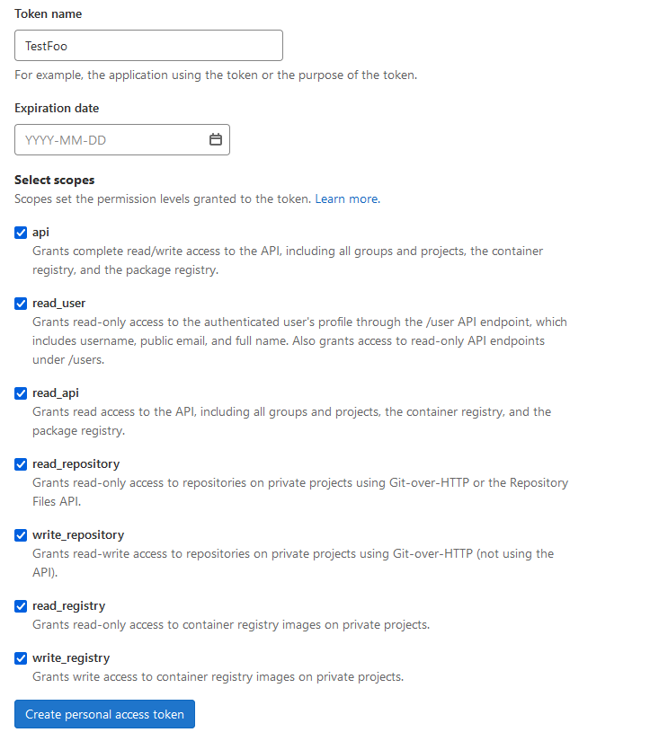
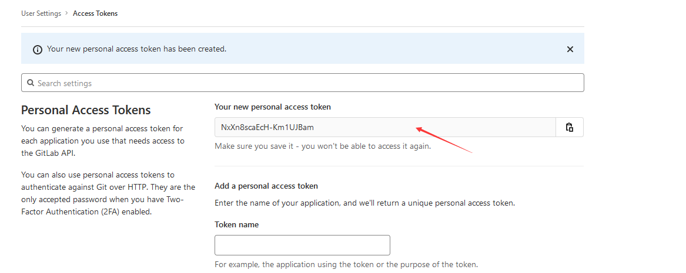
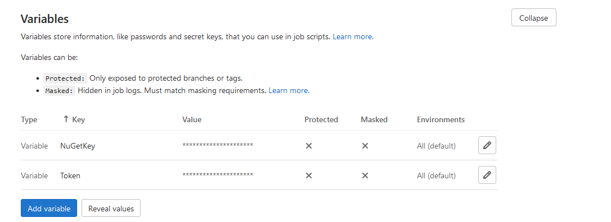
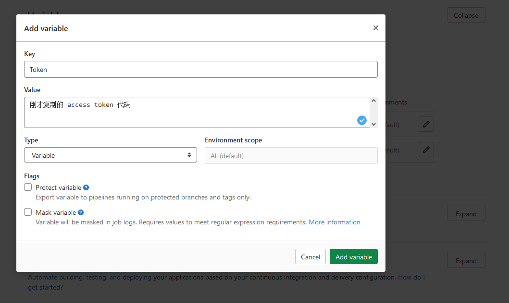

# dotnet tool 创建 GitLab 合并请求 Merge Requests 工具

本文来告诉大家如何使用 dotnetCampus.GitLabMergeRequestCreator 工具，命令行创建 GitLab 合并请求 Merge Requests 的方法

<!--more-->


<!-- CreateTime:2021/11/29 8:52:59 -->

<!-- 发布 -->

## 使用

这是在 GitHub 上完全开源的工具，请看 [https://github.com/dotnet-campus/dotnetcampus.DotNETBuildSDK](https://github.com/dotnet-campus/dotnetcampus.DotNETBuildSDK)

此工具是基于 dotnet tool 制作发布的，安装部署方法特别简单，只需在命令行输入以下代码即可

```
dotnet tool update -g dotnetCampus.GitLabMergeRequestCreator
```

命令行参数创建 合并请求 Merge Requests 的例子如下

```
CreateGitLabMergeRequest -GitLab https://gitlab.sdlsj.net -Token $Token -TargetBranch dev -SourceBranch release -ProjectId $CI_PROJECT_ID -Title "Merge release to dev"
```

命令行参数命令的含义如下：

- `-GitLab`: GitLab 地址，如 `https://gitlab.sdlsj.net` 。可选，默认将通过环境变量获取 GitLab 的 `$CI_SERVER_URL` 变量
- `-Token`: 拥有创建 MergeRequest 的 Token 值，可在 GitLab 上的 `profile/personal_access_tokens` 生成。可选，默认将通过环境变量获取 GitLab 的 `Token` 变量。此变量需要运维手动设置才有
- `-ProjectId`: 将要创建 MergeRequest 的仓库项目 Id 值。可选，默认将通过环境变量获取 GitLab 的 `$CI_PROJECT_ID` 常量
- `-TargetBranch`: 将从 SourceBranch 合并到 TargetBranch 分支。可选，默认将通过环境变量获取 GitLab 的 `$CI_DEFAULT_BRANCH` 分支，也就是仓库的默认分支
- `-SourceBranch`: 将从 SourceBranch 合并到 TargetBranch 分支。可选，默认将通过环境变量获取 GitLab 的 `$CI_COMMIT_BRANCH` 分支，也就是当前 CI 正在运行分支
- `-Title`: 提交 MergeRequest 的标题。可选，默认是 "[Bot] Automated PR to fix formatting errors" 字符串

在 GitLab 的配置需要放入到 `.gitlab-ci.yml` 文件，如以下代码

```yml
 - "dotnet tool update -g dotnetCampus.GitLabMergeRequestCreator"
 - 'CreateGitLabMergeRequest -GitLab https://gitlab.sdlsj.net -Token $Token -TargetBranch dev -SourceBranch release -ProjectId $CI_PROJECT_ID -Title "Merge release to dev"'
```

可以使用此工具实现自动合并 Release 分支到 Dev 分支的功能，如以下代码

```yml
stages:
  - build

ReleaseToDev:
  # 自动从 release 分支合并到 dev 分支的工具
  stage: build
  script:
    - "chcp 65001"
    - 'dotnet tool update -g dotnetCampus.GitLabMergeRequestCreator' # 安装或更新工具
    - 'CreateGitLabMergeRequest -Title "Merge release to dev"' # 自动创建合并 Release 分支到 Dev 分支
  only:
    - release
```

我所在的团队约定了，产品项目进入发布过程，将切换到 Release 分支，封锁功能。此时开发的功能都是代码合入到 Release 分支的，但是默认的激进开发分支是 Dev 分支，需要不断从 Release 分支合入到 Dev 版本。通过以上放在 `.gitlab-ci.yml` 文件的代码，即可自动实现有代码合入到 Release 分支，就自动创建合并请求，提醒开发者进行合入

在 GitLab 的 Runner 里，有很多参数都是会当成环境变量传入的，如项目 Id 等等。因此在调用 CreateGitLabMergeRequest 命令，可以传入很少的参数，大多数的参数都在环境变量获取

以上代码的 `$Token` 是存放在 GitLab 的私密信息，设置方法是在 CI/CD Settings 里面的 Variables 添加变量，详细请看 [GitLab CI/CD variables](https://docs.gitlab.com/ee/ci/variables/ )

如何在 GitLab 上创建 Token 请参阅如下方法

## 创建 Token 方法

生成 Token 方法如下：

进入 GitLab 的 `profile/personal_access_tokens` 界面，进入方法是点击右上角自己的头像，点击 Edit profile 进入设置界面

<!--  -->


点击设置界面的 Access Tokens 选项，即可看到如下界面

<!--  -->


填写 Token name 为你期望的字符串，如 `TestFoo` 等。这个用来给你了解此 Token 的用途，是给你自己看的内容，接着在 `Select scopes` 上全部打上勾

<!--  -->


完成之后，点击 Create personal access token 按钮即可

此时将生成一段 access token 代码，如下图

<!--  -->


拷贝如上 access token 代码，进入到 CI/CD Settings 设置，点开 Variables 点击 Add variable 按钮添加变量

<!--  -->


添加一个 Key 叫 Token 且值是刚才复制的 access token 代码

<!--  -->


这样就完成了配置。在 GitLab 上，即可通过 `$Token` 变量获取到刚才设置的 access token 代码

## 原理

本工具的原理特别简单，在 GitLab 上开放了很多 API 可以调用，其中就包括了创建合并请求。通过 [nmklotas/GitLabApiClient](https://github.com/nmklotas/GitLabApiClient ) 库即可非常方便进行调用，如下面代码

```csharp
            var gitLabClient = new GitLabClient(options.GitLabUrl, options.GitLabToken);

            await gitLabClient.MergeRequests.CreateAsync(options.ProjectId,
                    new CreateMergeRequest(currentBranch, targetBranch, title)
                    {

                    });
```

获取 GitLab 的环境变量的方法，以及更多细节还请到 [GitHub](https://github.com/dotnet-campus/dotnetcampus.DotNETBuildSDK) 获取源代码


<a rel="license" href="http://creativecommons.org/licenses/by-nc-sa/4.0/"></a><br />本作品采用<a rel="license" href="http://creativecommons.org/licenses/by-nc-sa/4.0/">知识共享署名-非商业性使用-相同方式共享 4.0 国际许可协议</a>进行许可。欢迎转载、使用、重新发布，但务必保留文章署名[林德熙](http://blog.csdn.net/lindexi_gd)(包含链接:http://blog.csdn.net/lindexi_gd )，不得用于商业目的，基于本文修改后的作品务必以相同的许可发布。如有任何疑问，请与我[联系](mailto:lindexi_gd@163.com)。