# dotnet 代码调试方法

本文将会从简单到高级，告诉大家如何调试 dotnet 的代码，特别是桌面端。本文将会使用到 VisualStudio 大量的功能，通过各种好用的功能提高调试方法

<!--more-->


<!-- csdn -->

在本文开始将会告诉大家一些套路，也就是遇到什么问题怎么调试，然后将会告诉大家在面对一些棘手问题，例如遇到我不熟悉的代码如何调试，遇到库里面的代码出问题如何调试

除了调试问题之外，本文还包括性能调试，有小伙伴说卡，那么卡在哪，如何找到卡的代码。有小伙伴说占用内存，那么占用内存的代码是什么？

对于客户端还包括渲染方面调试，我觉得我软件显示比较慢，那么是渲染卡还是主线程卡

欢迎小伙伴告诉我一些你的调试方法

## 课前测试

带着问题阅读效果将会更好

1. 如何看待断点调试

- [x] 断点调试应该优先考虑，只要代码能做断点调试的优先进行断点调试
- [x] 断点调试是其他手段的一个辅助，在大多数调试方法里面都用到断点调试
- [x] 在断点调试过程可以了解当前上下文变量状态，以及代码执行逻辑，甚至更改变量值更改执行顺序
- [x] 在断点调试库或框架中最重要的是符号文件，可以通过 dotPeek 反编译生成
- [ ] 断点调试一定需要符号文件配合

1. 如何看待异常调试

- [x] 在 VisualStudio 使用第一次机会异常，无论用户有没有吞这个异常都能抓到
- [x] 进行异常调试的套路是先通过输出窗口找到对应的异常，再从异常窗口开启
- [x] 异常调试过程在调用堆栈可以发现调用方法的逻辑是否合预期
- [x] 不需要符号文件和源代码都可以进行异常调试
- [x] 异常调试需要依赖具体代码实现，如果在代码实现过程没有考虑异常，那么将无法进行异常调试

1. 如何看待多线程调试

- [x] 多线程调试过程会被断点影响，可以通过断点输出的方式降低多线程影响
- [x] 多线程的死锁问题可以通过并行堆栈找出
- [x] 多线程问题可以通过随机暂停方式找到对应的代码
- [x] 在多线程中的控制台输出也会影响多线程代码运行顺序
- [x] 调试过程重点关注多个线程访问到的值的变化以及方法调用顺序
- [x] 在 VisualStudio 可以通过线程窗口看到当前程序开启的所有线程，同时对应线程的调用堆栈

1. 如何调试已发布库？

- [x] 在开始调试之前，需要先确定自己写的代码是否清真。应该假定调用的库的接口是符合预期的，和所使用的框架是稳定的
- [x] 如果拿到的库不是稳定的库，或从接口实现上无法明确。可以构建出测试代码用于调试库逻辑
- [x] 在不明确是否库的问题还是自己代码的问题的时候，在确定库代码的输入对应的输出的时候，可以自己模拟创建库的代码进行调试
- [ ] 现在微软开源了很多框架，在调试过程应该尽可能将开源代码加入调试

1. 在说到性能问题的时候说的方面有哪些？

- [x] CPU 性能
- [x] 单线程忙碌
- [x] 过多 IO 读写
- [x] 渲染性能
- [x] 内存占用

1. 面对无从下手的调试的时候可以尝试哪些方向？

- [x] 最短复现，找到最容易复现的方法
- [x] 最小代码模拟测试，确定是否框架或库的问题
- [x] 通过异常代码搜寻以及最短复现方法是否有相关博客
- [x] 通过大量日志追踪
- [x] 进行随机断点
- [x] 从入口函数开始断点调试进入
- [x] 在用户已经出问题的设备上，通过 dnspy 和 VS 附加调试或获取 DUMP 调试
- [x] 查看是否在软件上版本不存在此问题，在上上版本不存在此问题等，通过二分代码找到出代码提交
- [x] 在各大社交网络进行询问

从题目上看，最简单的调试方法从断点调试开始，想要知道题目的答案是为什么，请看本文

<div id="toc"></div>

## 断点调试

从 VisualStudio 中打开源代码，进入调试模式，在调试模式里面可以通过断点的方法调试

断点调试可以用来做什么？调试分支，调试执行逻辑，调试当前运行的值

在进行断点调试的时候建议使用 DEBUG 版进行调试，此时几乎可以在任意的代码里面添加断点

在遇到任何坑的时候，第一个应该做的是通过断点调试

例如我在调试下面的代码的时候，发现软件没有按照我预期的运行

```csharp
if (foo)
{
   // 执行某段逻辑，但是这段逻辑没有按照期望被运行
}
```

此时我应该通过断点，将断点放在判断这句话

### 添加断点方法

添加断点有很多方法

在需要调试的代码里面，将光标定位到需要调试的代码这一行，默认快捷键按下 F9 添加断点

或者从代码这一行的左边点击一下就可以添加断点

<!-- 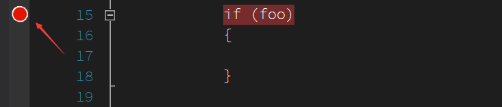 -->


断点可以在运行调试之前添加，可以在调试的过程添加断点，添加成功了断点可以在代码左边看到红点，此时执行到断点的地方，程序将会停在断点这里

<!-- 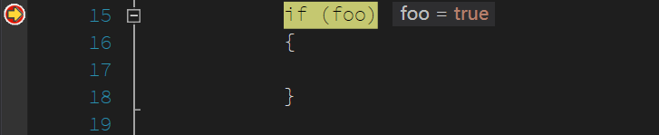 -->


除了在打开代码某一行进行断点之外，还可以点击工具栏的 调试-窗口-断点 打开断点设置

点击添加可以添加函数断点，函数断点需要添加限定符，完全的表达式如下

```csharp
命名空间.类.方法(参数)
```

例如

```csharp
WegaljifoWhelbaichewair.Program.Main(string[])
```

但是一般都可以简写，如不存在重载方法的时候，不需要添加参数，如上面代码可以去掉`string[]`在没有重载的主函数。如不存在多重命名冲突的时候，可以去掉命名空间

另外，在调用堆栈里面也可以设置断点，例如在进入某个断点的时候，程序暂停，此时可以通过 调试-窗口-调用堆栈 打开调用堆栈，在调用堆栈里面可以看到进入到当前这一行代码调用的方法顺序

<!-- 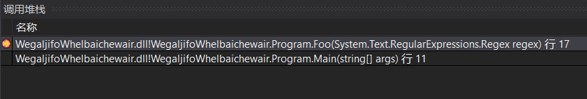 -->


在对应的调用方法右击点击断点可以新建断点

最少用到的是在反编译窗口里面添加断点，点击调试-窗口-反编译在反编译窗口里面右击也可以添加断点

[Use breakpoints in the debugger - Visual Studio](https://docs.microsoft.com/en-us/visualstudio/debugger/using-breakpoints?wt.mc_id=MVP )

### 变量窗口

在进入断点的时候可以做什么？可以查看当前运行到这一行代码的时候，各个变量的值

点击调试-窗口-局部变量可以打开局部变量窗口，局部变量也就是本方法使用到的局部变量

同理还有自动窗口，在自动窗口还会显示在上下文用到的变量，一般使用自动窗口会更多

通过自动窗口或局部变量可以看到每个变量是什么，从而了解当前的代码为什么这样执行

### 单步调试

在进入断点之后，就可以通过单步的方法知道程序运行的逻辑，通过单步可以看到代码是如何运行的

在 VisualStudio 提供了逐语句和逐过程，这里的不同点在于逐语句是一行行运行，同时遇到了调用，会进入到方法里面。而逐过程则是在遇到方法的时候，直接跳过方法。小伙伴可以按照自己的需要进行选择，建议使用快捷键进行调试，逐语句是 F11 逐过程是 F10 配合断点时候，如在遇到某些很长的代码的时候，这里面有一段是不关心的，可以使用 F5 继续运行跳过，同时在关心的部分，通过断点让 F5 继续运行的程序会进入断点

在进行单步调试的时候需要同时关注自动窗口等的变量的值，查看值是否符合预期

### 符号是做什么用的

在断点调试过程中，可能遇到的问题是我添加了断点，但是代码没有停在断点里面，此时看到的 VisualStudio 本来应该是红色的断点现在变成了白色同时提示没有加载符号或符号和源代码不匹配

这就是大家说的白点问题，这个问题很多时候都是应该符号没有加载的原因，或者当前添加断点的代码不是实际运行的代码

在 VisualStudio 需要存在符号文件才能调试，符号文件包含了某段代码对应的函数和对应的代码行，所以无法添加断点的问题请先看一下提示是否没有加载符号，如果发现没有加载符号

加载符号可以通过点击调试-窗口-模块打开模块页面，找到没有加载符号的模块，通过右击加载符号

更多请看[View DLLs and executables - Visual Studio Modules window](https://docs.microsoft.com/en-us/visualstudio/debugger/how-to-use-the-modules-window?wt.mc_id=MVP )

但是符号一般只有自己写的代码才有符号，很多例如框架里面的代码是没有符号的，如果没有符号就无法添加断点，没有断点就不能愉快调试代码了。本文接下来告诉大家如何通过 dotPeek 创建符号文件进行调试

### 条件断点

填坑

### 更改执行逻辑

填坑

### dotPeek 反编译库调试

在很多的库的调试的时候，这些库都没有带符号文件，此时可以通过 dotPeek 反编译同时创建符号文件加载

首先需要下载 dotPeek ，可以到官网下载 [dotPeek: Free .NET Decompiler & Assembly Browser by JetBrains](https://www.jetbrains.com/decompiler/) 还可以到 csdn [下载](http://download.csdn.net/download/lindexi_gd/10133189 )

打开 dotPeek 然后点击启动符号服务器，然后选择所有的程序集都需要反编译创建符号


点击 dotPeek 的工具设置，可以看到这个页面，选择所有符号都需要同时复制 dotPeek 创建的符号服务器的端口


这时在 dotPeek 就创建了一个符号服务器，可以提供任意的库的符号，在 VisualStudio 调试的时候发现有某个模块没有加载符号就会尝试去符号服务器加载符号

但是现在的 VisualStudio 还不知道 dotPeek 符号服务器的存在，打开 VS 工具选项，在调试设置符号，粘贴刚才复制的符号服务器就可以

详细请看[调试 ms 源代码](https://blog.lindexi.com/post/%E8%B0%83%E8%AF%95-ms-%E6%BA%90%E4%BB%A3%E7%A0%81.html ) 和 [断点调试 Windows 源代码](https://blog.lindexi.com/post/%E6%96%AD%E7%82%B9%E8%B0%83%E8%AF%95-windows-%E6%BA%90%E4%BB%A3%E7%A0%81 )

断点调试适合在已知代码和模块的时候进行调试，可以做到准确定位，断点调试是所有调试的基础。只要需要调试，那么请优先考虑进行断点调试，只有在断点调试难以使用的时候才考虑使用其他方法

在项目开发的时候，有时候会遇到一些奇怪的坑，但是项目太大了，不能确定是哪个模块的问题，或者自己对整个逻辑也不熟悉，此时可以尝试使用异常调试的方法

### 调试对象

在 VisualStudio 中提供了给某个对象添加 ID 的功能，在软件运行的过程，整个进程有超级多的对象被创建，而在调试的时候经常发现了修改了某个对象的属性或值但实际上没有应用上。此时可能的原因是找错了对象，通过在局部变量或自动窗口等右击对应的属性可以给这些对象添加一个 id 通过 id 就可以判断当前使用的对象和之前使用的是否相同的对象

这里用一个案例说明

我遇到一个很复杂的代码，这个代码的坑大概是这样的，我已经写了更改了某个对象的 Name 属性，然后在调用 GetName 时就会去取这个属性的值，同时如果这个属性的值为空了，就会出现异常，在调试的时候的代码大概如下图

<!-- 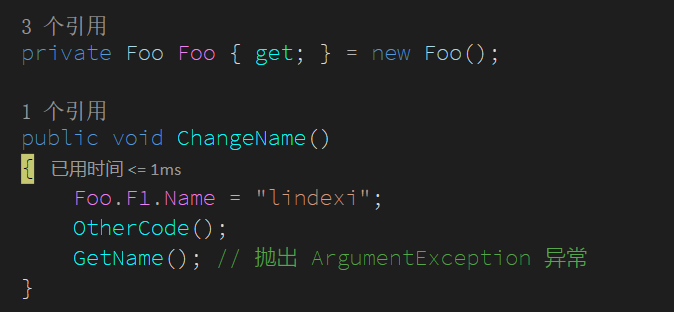 -->


在 GetName 方法判断传入的属性是否为空，如果为空就异常

```csharp
        private void GetName()
        {
            if (string.IsNullOrEmpty(Foo.F1.Name))
            {
                throw new ArgumentException();
            }
        }
```

我通过断点调试发现了我成功设置了 Name 的值

<!-- 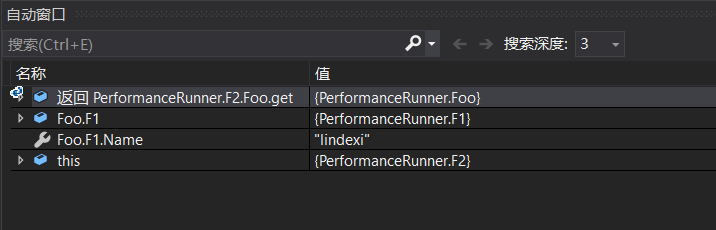 -->


但还是发现了异常，我通过搜代码的 Name 的属性赋值，发现只有上面的代码才会赋值

<!-- 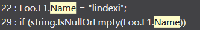 -->


此时就可以尝试通过断点调试里面的给对象设置 id 的方法调试，我给了 F1 设置了一个 id 通过局部变量找到这个属性，右击创建分配了 `$1` 给这个属性

<!-- 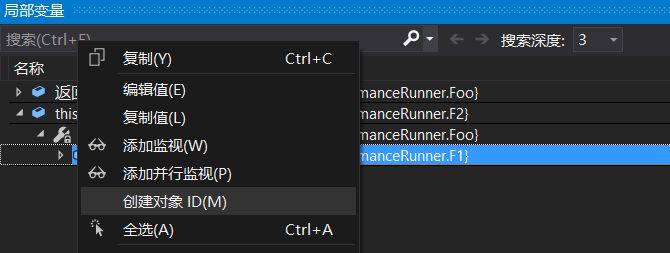 -->


然后在 GetName 方法添加断点，此时发现了现在的 F1 对象没有被标记，而存在标记的值和当前的 F1 不是同一个值，也就是说明有一段代码更改了 F1 的值

<!-- 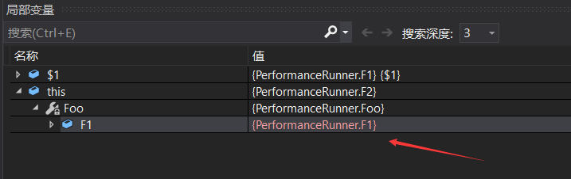 -->


而可惜我看到了 F1 代码的定义如下

```csharp
    public class Foo
    {
        public F1 F1 = new F1();
    }
```

这样的定义的代码将会出现一个坑在于我无法和属性一样通过在 set 方法上面添加断点知道了在这段代码内有哪个地方更改了 F1 的值，只能通过看代码的形式去寻找。这也就是一个好的例子说明了禁止公开字段的重要性，公开了字段会影响断点调试

如果我将 F1 更改为属性，那么我愉快在 set 方法打上断点，注意不是一开始就打上断点，而是在我设置了 Name 属性之后才添加断点，然后按下 F5 继续运行

<!-- 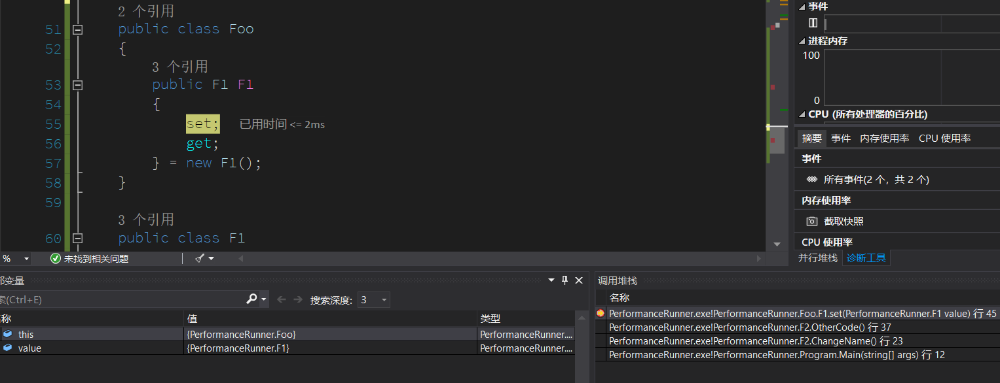 -->


在进入了断点通过调用堆栈可以找到是在 OtherCode 里面有代码更改了这个值

在断点调试里面使用多个技术一起使用，如局部变量和调用堆栈等可以提高调试的速度。当然调用堆栈还有很多用途，在下文的异常调试也会用到调用堆栈也会详细告诉大家如何使用

## 跳过编译直接调试

卧龙岗扯淡的人说大型项目很少Start运行调试的，都是attach进程，不然每次编译十几分钟

### 附加进程调试

填坑

### 调试软件启动

[WPF 如何在应用程序调试启动](https://blog.lindexi.com/post/wpf-%E5%A6%82%E4%BD%95%E5%9C%A8%E5%BA%94%E7%94%A8%E7%A8%8B%E5%BA%8F%E8%B0%83%E8%AF%95%E5%90%AF%E5%8A%A8 )

## 异常调试

如果遇到程序运行的过程不符合预期，但是自己又不确定是哪个模块，或者代码太多逻辑很复杂，不知道在哪里下断点的效率才会高，此时可以尝试一下异常调试

异常调试的意思就是通过找到不符合预期的行为是否存在异常，通过分析异常调试

在 VisualStudio 会提供第一次机会异常，可以直接定位到对应的第一次机会异常所在的代码

### 第一次机会异常调试

进行异常调试的套路是先看输出，如果出现了异常，那么在输出窗口默认可以看到异常是什么和异常的输出

如果发现在输出窗口没有显示任何的异常，此时请右击输出窗口看一下是不是没有开启异常消息

<!-- 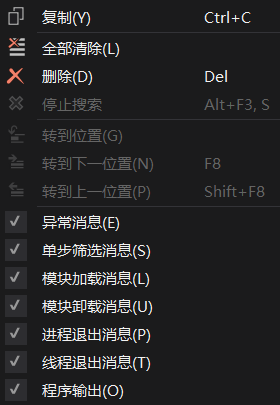 -->


通过输入可以发现运行过程的异常，然后在调试-窗口-异常打开输出里面的异常，如我看到输出里面显示了`引发的异常:“System.ArgumentException”(位于 WegaljifoWhelbaichewair.dll 中)` 此时可以在异常里面开启

<!-- 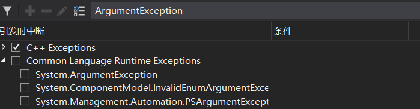 -->


因为异常很多，建议通过搜的方式开启需要调试的异常而不是打开全部异常

这样再次运行的时候就会在出现异常代码停下，这里 VisualStudio 使用的是第一次机会异常，所以相对好一点，即使有小伙伴 catch 所有异常也会在抛异常的地方停下如下图

<!-- 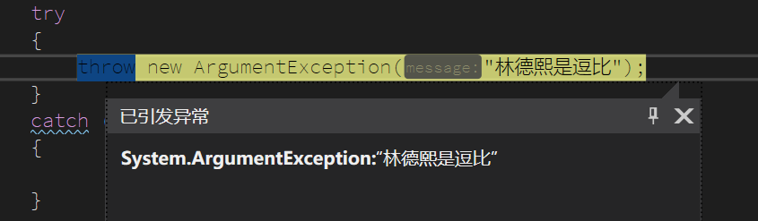 -->


找到了异常的代码，可以在代码的调用上下进行断点调试

关于第一次机会异常请看[C#/.NET 如何在第一次机会异常 FirstChanceException 中获取比较完整的异常堆栈 - walterlv](https://walterlv.com/post/how-to-get-the-full-stacktrace-of-an-first-chance-exception.html )

### 读取异常的信息

很多的异常都是带有足够的信息，一般的异常里面都有 Message 告诉小伙伴哪里的使用是不对的，如果信息很多将会在 Data 里面附带其他辅助的信息

在异常的 StackTrace 里面会记录这个异常的调用堆栈，让小伙伴可以知道是在哪个调用顺序里面扔的

在看到一个异常的时候，第一个应该看的就是 Message 大多数的异常通过 Message 都能知道问题，如果发现 Message 里面带的数据不够，可以尝试通过 Data 里面看是否还有附加的信息。在异常的调用堆栈信息里面可以看到方法调用的顺序

#### 好的例子

用一个好的例子说明异常调试

我在尝试小伙伴写的一个库，我写了这样的代码

```csharp
            var f2 = new F2();
            f2.ChangeName();
```

在运行的时候发现在调用 ChangeName 方法给了我一个异常，在异常提示里面写了 `在调用此方法之前，请先调用 Init 初始化方法` 看到这个提示我就知道了在调用之前需要先初始化

#### 不好的例子

一个不好的例子是从微软的 WPF 框架抛的异常在这个信息里面完全没有多少有用的信息

```csharp
ExceptionType: System.IndexOutOfRangeException
 ExceptionMessage: 索引超出了数组界限

   在 System.Collections.Generic.Dictionary`2.Insert(TKey key, TValue value, Boolean add)
   在 System.Windows.Input.StylusWisp.WispLogic.CoalesceAndQueueStylusEvent(RawStylusInputReport inputReport)
   在 System.Windows.Input.StylusWisp.WispLogic.ProcessInputReport(RawStylusInputReport inputReport)
   在 System.Windows.Input.PenContext.FirePackets(Int32 stylusPointerId, Int32[] data, Int32 timestamp)
   在 System.Windows.Input.PenThreadWorker.FlushCache(Boolean goingOutOfRange)
   在 System.Windows.Input.PenThreadWorker.FireEvent(PenContext penContext, Int32 evt, Int32 stylusPointerId, Int32 cPackets, Int32 cbPacket, IntPtr pPackets)
   在 System.Windows.Input.PenThreadWorker.ThreadProc()
   在 System.Threading.ThreadHelper.ThreadStart_Context(Object state)
   在 System.Threading.ExecutionContext.RunInternal(ExecutionContext executionContext, ContextCallback callback, Object state, Boolean preserveSyncCtx)
   在 System.Threading.ExecutionContext.Run(ExecutionContext executionContext, ContextCallback callback, Object state, Boolean preserveSyncCtx)
   在 System.Threading.ExecutionContext.Run(ExecutionContext executionContext, ContextCallback callback, Object state)
   在 System.Threading.ThreadHelper.ThreadStart()
```

在看到这个异常的时候，请问这是在做什么？为什么在这里炸了

#### 写出方便调试的代码

这就是为什么异常不是用来随便扔的，想要在异常调试里面能够快速调试就需要依赖代码对异常的处理

**减少线程委托使用**

先举一个不好的例子，我看到有小伙伴写了这段代码

```csharp
            new Thread((() =>
            {
                throw new Exception("林德熙是逗比");
            })).Start();
```

请问上面的代码的坑有哪些？

如果是将上面的代码写在日志或上报等无法附加调试，那么能看到的信息是

```csharp
ExceptionType： Exception
ExceptionMessage：林德熙是逗比

   在 lindexi.exe!lindexi.Program.Main.AnonymousMethod__0_0() 
   在 System.Threading.ExecutionContext.RunInternal(ExecutionContext executionContext, ContextCallback callback, Object state, Boolean preserveSyncCtx)
   在 System.Threading.ExecutionContext.Run(ExecutionContext executionContext, ContextCallback callback, Object state, Boolean preserveSyncCtx)
   在 System.Threading.ExecutionContext.Run(ExecutionContext executionContext, ContextCallback callback, Object state)
   在 System.Threading.ThreadHelper.ThreadStart()
```

这样完全不知道这个代码是在哪里运行的，想要添加断点进行调试也不知道是在哪里添加断点

所以推荐的方法是减少在线程里面直接使用辣么大请使用方法，如我写了这样的方法

```csharp
            new Thread((() =>
            {
                Foo();
            })).Start();	

        static void Foo()
        {
            throw new Exception("林德熙是逗比");
        }
```	

这样的代码比上面的代码好一点，可以拿到的信息请看下面

```csharp
ExceptionType： Exception
ExceptionMessage：林德熙是逗比

   在 lindexi.exe!lindexi.Program.Foo() 
   在 lindexi.exe!lindexi.Program.Main.AnonymousMethod__0_0() 
   在 System.Threading.ExecutionContext.RunInternal(ExecutionContext executionContext, ContextCallback callback, Object state, Boolean preserveSyncCtx)
   在 System.Threading.ExecutionContext.Run(ExecutionContext executionContext, ContextCallback callback, Object state, Boolean preserveSyncCtx)
   在 System.Threading.ExecutionContext.Run(ExecutionContext executionContext, ContextCallback callback, Object state)
   在 System.Threading.ThreadHelper.ThreadStart()
```

我就可以通过调用堆栈的 Foo 找到了对应的代码，从而进行断点调试

**不要在静态构造函数抛出异常**

填坑

**区分发布代码**

在一些模块，即使出现了异常还是可以正常工作，但是如果没有吃掉这个异常将会让整个软件无法使用。但是有很多逗比的开发者会写出逗比的代码，我期望让他在开发的时候就发现，于是我就通过了判断当前是 DEBUG 版还是发布版执行不同的逻辑

例如在希沃白板软件加载课件的过程，每个课件里面都有不同的页面，如果某个页面加载出现异常，我不期望用户整个课件都打不开，于是就吃掉了页面加载的异常。但是页面是很多小伙伴写的，我期望在开发的时候小伙伴就能发现这里有异常，我通过下面的代码区分了发布版

```csharp
        static void Foo()
        {
#if DEBUG
            throw new Exception("林德熙是逗比");
#else
            Console.WriteLine("林德熙是逗比");
#endif
```

建议是在 DEBUG 下只要不符合预期就抛异常，这样可以在开发的时候减少诡异的使用

**保存堆栈**

很多初学 dotnet 的小伙伴喜欢吃掉全局的异常然后重新抛

```csharp
                try
                {
                    Foo();
                }
                catch (Exception e)
                {
                    throw e;
                }
```

这个做法是很逗比的，在外层拿到的 e 将会丢失了在 Foo 里面的堆栈信息

**更多方法**

我推荐小伙伴阅读以下博客了解在代码中如何写

- [.NET/C# 建议的异常处理原则 - walterlv](https://walterlv.com/post/suggestions-for-handling-exceptions.html )

- [应该抛出什么异常？不应该抛出什么异常？（.NET/C#） - walterlv](https://walterlv.com/post/throws-which-exception.html )

- [.NET/C# 在正确的条件下抛出最合适的异常](https://blog.walterlv.com/post/when-to-throw-which-exceptions.html)

- [使用 ExceptionDispatchInfo 捕捉并重新抛出异常 - walterlv](https://walterlv.com/post/exceptiondispatchinfo-capture-throw.html )

- [Exception.Data 为异常添加更多调试信息 - walterlv](https://walterlv.com/dotnet/2017/09/12/exception-data.html )

- [NullReferenceException，就不应该存在！ - walterlv](https://walterlv.com/post/wipe-out-null-reference-exception.html )

- [C#/.NET 如何获取一个异常（Exception）的关键特征，用来判断两个异常是否表示同一个异常 - walterlv](https://walterlv.com/post/get-the-key-descriptor-of-an-exception.html )

### 开启所有异常

在进入异步等的过程，会发现有一部分的异常提示不在具体的代码，而是在上一层的代码提示，此时可以通过在提示的哪个异常就开启哪个异常的方法，找到对应的代码

但是如果发现提示的异常是合并的异常，或者需要开启的太多了，可以尝试开启所有的异常

<!-- 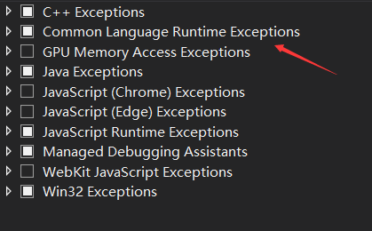 -->


在调试窗口异常设置里面，如果前面的分类是一个方形那么就是开启默认的异常，此时有很多异常都是被忽略的。再点击一次变成勾就可以开启所有的异常

对于很多渣的软件，包括调试 VisualStudio 的过程是不建议开启所有的异常，因为有很多无关的代码特别是异常控制流程会干扰调试

通过开启所有异常的调试大家也知道异常控制流程会影响到调试的方法，在我开启所有异常的时候，如果存在很多异常控制流程的代码，那么将会在调试的时候被这些诡异的代码影响

但是有时候开启了所有的异常还没有让 VisualStudio 停在自己需要关注的代码上面，此时就需要用到调用堆栈

### 调用堆栈

在找到对应的异常的过程，请通过调用堆栈看到这个方法是如何被调用的，在被调用的函数上面，可以通过双击到达函数，此时在局部窗口等可以看到附近的值，这个方法可以找到代码运行的逻辑，也就是为什么会进入这个分支

如果发现很难通过调用堆栈看出代码运行的逻辑，也可以在调用堆栈上面右击函数添加断点，然后再次运行代码

很多时候通过调用堆栈可以看出来调用方法进来的路径是否符合预期，以及在不符合预期的时候各个函数的参数是什么这些参数是否符合预期

这里推荐插件[调试神器OzCode](https://walterlv.github.io/post/using-ozcode-to-improve-debug.html)可以协助看代码逻辑
  


通过调用堆栈和异常的方法可以快速定位代码调用是否符合预期，各个函数传入参数是否符合预期，此时的调试不限在 DEBUG 下，同时适合在用户端调试发布的代码

在调用堆栈的使用过程，会自动将没有加载符号的代码作为外部代码隐藏，也就是在开启异常的时候不会将异常代码显示，此时可以通过在调用堆栈右击，选择显示外部代码，此时将会显示所有的调用的外部代码

在外部代码里面的方法都是没有加载符号的，所以无法直接通过双击的方法进入到对应代码，此时可以通过右击加载符号加载对应模块的符号，如果这个模块属于库同时也没有符号，可以通过断点调试的使用 dotPeek 方法创建符号加载

如果在没有符号的时候，只能通过调用的方法名和传入的参数和一下局部变量调试，如果是调试的方法的方法名和所做的内容相同，同时一个方法里面的代码很少，通过看参数和局部变量和调用顺序比较简单找到坑。但是如果在调用堆栈里面无法跳到代码，例如等待 dotPeek 反编译的时间实在太长，同时这个方法的代码特别多，那么将很难进行调试

### 用户端调试

在用户端调试不是说只有在用户的电脑上进行调试，更多的是在没有使用自己代码进行 DEBUG 编译调试。如果现在遇到的问题是一个不带符号文件的程序出现了坑，如何调试他

在 VisualStudio 提供了附加到进程的功能，在 VisualStudio 运行的时候可以通过点击调试附加到进程，附加到现在正在运行的程序。同样先尝试复现一下，在输出窗口可以看到对应的输出的异常，在异常窗口开启对应的异常，再次复现让 VisualStudio 停在对应的异常的代码

也许此时出现异常的是在库里面，或者整个程序在运行的过程是找不到符号文件的，也就是无法定位到具体的代码。但是在调用堆栈依然可以看到用户代码调用顺序，同时在局部窗口也可以发现每次调用的局部变量

此时可以再打开一个 VisualStudio 找到对应的函数的对应代码，按照调用堆栈里面的调用逻辑，是否可以找到解决方法

### 上报异常

不是所有的用户都可以将你拉过去打靶，也不是所有的异常都需要解决

建议在软件运行过程中，所有没有接住的异常还有被接住但是需要解决的都进行上报

此时需要一个后台的服务器用于接受用户运行过程中上报的信息，对于异常的数据建议上报的内容包括以下

 - ExceptionType
 - ExceptionMessage
 - stacktrace

如果能将对应的 Data 上报就更好，对于特殊的如 AggregateException 等就需要拆开，除了以上信息还需要上报通用的信息，包括用户的 id 和系统版本安装的 .NET 版本这些

通过上报的数据找到用户报的比较多的异常优先解决，同时在软件上线的过程对于新模块的异常优先解决

因为是在后台看到上报的数据无法进行附加调试，此时上报的异常的信息就更加重要，建议小伙伴在写代码的时候考虑调试

### 无异常调试

当然很多异常都是小伙伴自己抛的，如果在代码里面写的不规范，例如需要抛的时候不抛，将会提高调试的难度，此时将使用无异常调试，面对无异常调试的时候一般都是界面相关，莫名发现界面没有符合预期，但是此时没有任何异常，也没有任何日志

例如我有小伙伴尝试从资源获取动画，通过播放动画修改界面

```csharp
         var fooStoryboard = FindResource("FooStoryboard") as Storyboard;

         if (fooStoryboard != null)
         {
             fooStoryboard.Begin();
         }
```

有逗比更改了 FooStoryboard 资源，让 fooStoryboard 为空，因为此时存在判断空，此时动画不存在就不执行，也就是这段代码的开发者没有考虑到防逗比也不明白异常策略，此时没有异常也无法快速定位。因为我不知道这段界面的动画代码是写在哪，我也不知道这里是不是有逗比改了动画还是有逗比修改了逻辑让动画不触发

这时就进入了无异常调试，虽然很多时候还是可以打断点的，但是因为代码太多也很难知道从哪里开始进入断点

这时的调试就没有什么高效率的方法了，推荐的做法是在入口点，例如已知功能的入口函数，或相关入口函数上添加断点。在不明白是哪个入口才能触发对应的逻辑的时候，只能通过相关的入口函数，例如我知道点击某个按钮或输入某段文本将会触发某个动画，但是此时这个动画没有被触发，也没有任何异常。那么我需要在所有的相关的点击事件和输入文本函数上面添加断点，在 VisualStudio 的摘要有一个好用的功能就是事件。如果不明确是在哪一段代码，也许可以通过事件找到在触发代码的过程发现的事件，通过事件跳转到对应的代码，在对应的代码上添加断点

<!-- 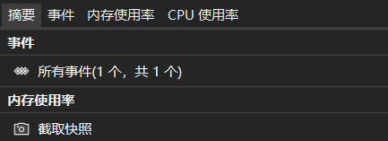 -->


在阅读完无异常调试的时候，相信小伙伴都了解到了异常的作用，以及在某些地方如何防逗比了

当然不是所有的时候都适合使用异常也许可以尝试一下日志，另外对于 WPF 和 UWP 的界面相关有另外的调试方法

### 用户端无代码调试

无论是否有异常都可以尝试使用这个方法，通过 dnspy 在用户端调试，可以不需要任何代码，只要在用户端能找到 exe 就可以调试

求填坑 dnspy 使用方法

更多关于 dnspy 请看 [神器如 dnSpy，无需源码也能修改 .NET 程序 - walterlv](https://walterlv.com/post/edit-and-recompile-assembly-using-dnspy.html )

## 多线程调试

现在很少有软件只是有单个线程，一般的软件都是存在多个线程一起使用，而有很多不看书的小伙伴会随意使用多线程，也就会遇到很多多线程的问题，在调试的过程中，调试多线程之前请先了解多线程。不需要了解到内核态什么的，但是需要了解以下的知识点，在不了解之前，很多小伙伴都会说垃圾微软一定是 vs 没编译好

 - 异步和同步
 - 异步切换上下文
 - 框架里面提供了哪些多线程方案
 - 线程安全方法或属性
 - 多线程读写问题
 - 框架里面提供哪些锁在什么时候使用
 - 调度的使用方法

### 当前线程

在开始调试的过程，可以找到当前运行代码的对应的线程，如我在方法添加了断点，我可以看到这个方法在哪个线程运行

<!--  -->


还是刚才的代码，我在两个方法里面修改了 Name 这个属性，然后在第三个方法判断了 Name 的值

```csharp
        public void ChangeName()
        {
            Foo.F1.Name = "lindexi";
            OtherCode();
            GetName(); // 抛出 ArgumentException 异常
        }

        private void OtherCode()
        {
            Foo.F1.Name = "逗比";
        }

        private void GetName()
        {
            if (Foo.F1.Name != "逗比")
            {
                throw new ArgumentException();
            }
        }
```

理论上代码是先调用 ChangeName 里面的 OtherCode 在这里修改了值，然后才调用 GetName 方法，也就是获取到的值就是最后一次设置的值

但是实际在调试的时候会发现，可能这个 Name 的值是 `lindexi` 此时尝试在 ChangeName 和 GetName 方法上面添加断点在进入断点的时候请看对应的线程是否相同，多次进入断点如果发现方法的线程是不相同的，那么就可以知道这是一个多线程问题。通过单步调试可以发现在线程 1 调用了 ChangeName 到 GetName 方法的过程，在调用 OtherCode 方法完成之后刚好有线程 2 调用了 ChangeName 方法，而在线程2修改了属性之后，在线程1就判断了属性

在调试的过程，可以点击线程，进行切换线程，可以看到在某个线程执行某段代码的时候，另一个线程在做什么，通过这个方式可以调试多线程访问资源

### 并行堆栈

如何看出进入了相互等待的锁的问题

填坑

## 无断点调试

有一些代码是不支持添加断点进行调试的，理论上很少有代码不能添加断点，但是存在很多添加了断点就无法继续的业务。包括了有一些功能是不支持软件暂停的，例如桌面端的调试输入和数据库通信过程。还有一些软件是在不知道是在哪一行代码添加断点，这就需要用到无断点调试

### 不支持暂停的调试

在无断点调试里面做桌面端的小伙伴就知道，如果是在调试用户输入过程，那么此时是不支持暂停的也就无法添加断点调试，如果软件进入了暂停那么等待软件的输入将会被暂停，将无法做出连贯的功能

例如我有一个功能是书写我需要调试，但是如果我添加了断点就会打断书写的输入，在调试的时候就不能使用断点调试也就是上面提供的任何方法都不能在这里使用

### 随机暂停调试

对于另一些无法添加断点调试的可能是不知道在哪里添加断点，例如有小伙伴告诉我软件什么都没做但是占用了很多的 CPU 计算，不知道是哪段代码在计算


### 通过日志调试

文件

debug view

填坑


### 辅助代码调试

填坑

### 即时窗口

填坑

## 库调试

在进行库调试之前，应该充分相信使用的库的质量，也就是相信库的代码是稳定的

### 桩测试

模拟库里面的公开的代码

填坑


### 模块测试

静态状态

填坑


### 重定向库输出

如果发现真的是库的问题，那么就需要将库加入到代码进行调试

将 Nuget 替换为 csproj 项目可以使用 [DllReferencePathChanger 这个插件](https://github.com/dotnet-campus/DllReferencePathChanger) 使用这个插件可以将某个 Nuget 替换为项目引用

但是此时需要重新编译整个大项目才能进行调试，这样的调试的效率比较低，可以尝试编译了库的代码，将库的调试作为项目的输出文件，通过这个方法做到每次调试编译库代码就可以，提高效率详细请看下面两篇博客

[Roslyn 让 VisualStudio 急速调试底层库方法](https://blog.lindexi.com/post/roslyn-%E8%AE%A9-visualstudio-%E6%80%A5%E9%80%9F%E8%B0%83%E8%AF%95%E5%BA%95%E5%B1%82%E5%BA%93%E6%96%B9%E6%B3%95 )

[VisualStudio 通过外部调试方法快速调试库代码](https://blog.lindexi.com/post/visualstudio-%E9%80%9A%E8%BF%87%E5%A4%96%E9%83%A8%E8%B0%83%E8%AF%95%E6%96%B9%E6%B3%95%E5%BF%AB%E9%80%9F%E8%B0%83%E8%AF%95%E5%BA%93%E4%BB%A3%E7%A0%81 )

### 案例

我和少珺在一起写一个 c/s 代码，他发现了后台返回的值他拿不到，经过了断点调试发现了后台有返回 json 字符串，但是他解析出来的是一个空的值

此时他很慌的说，我使用的 json 解析库是我自己写的

听到这里我做了一个错误的决策，我认为需要将他写的 json 解析库加入调试

其实最后发现的问题是他的 json 解析库对大小写敏感，需要添加特性修复这个问题。在少珺的 json 解析库里面，对于 json 的属性名是大小写敏感的，因为我返回的属性都是第一个字符小写的，但是他写的代码里面每个属性都符合命名规范都是第一个字符大写的，需要通过特性的方法重新定向到小写的属性名

这个决策让我和少珺多用了很长的时间，其实在使用库代码的时候，应该相信库的实现是稳定的。即使通过模块测试的方法，也只是确定是否正确使用了库提供的功能。在发现调用了某个库的方法不符合预期的时候，请先确定自己是否按照库提供的接口预期使用。

在发现某段代码出现的问题和库相关，第一时间应该是确定是否自己的代码的问题，也就是跳过和库相关的代码，认为库的代码是正确的。如果此时库的接口影响到了自己的模块的功能，可以尝试桩测试，如果在进行桩测试成功之后，那么可以认为是自己没有按照预期的使用库的接口。可以尝试使用模拟测试寻找库的正确打开方式。最后才是尝试认为这是库提供的问题

## 模拟调试

填坑


### 网络模拟调试

使用 Fiddler 模拟

填坑


### 输入模拟调试

修改代码模拟输入

填坑


### 单元测试模拟调试

通过单元测试模拟某个接口

填坑


## 文件读写调试

文件占用

找不到库找不到文件

### 加载库调试

判断文件加载的是哪些库

填坑


### 读写性能调试

通过 dot trace 找到读写文件

填坑


## 界面调试

### 实时可视化树

填坑

### 渲染范围

对于 WPF 和 UWP 使用不同方法

填坑

### 使用 snoop 调试

填坑

## DUMP调试

### 使用 VisualStudio 调试

填坑

### 使用 dotMemory 调试内存

填坑

### 使用 WinDbg 调试

填坑


## 性能调试

### 通过 VisualStudio 分析

填坑


### CPU 调试

通过 dotTrace 调试

### GPU 调试

通过 VisualStudio 分析，通过 PXI 通过 Vtune 调试

填坑


### 内存调试

在 VisualStudio 看内存，分析内存

通过 dotMemory 调试

填坑


## 经验

经验里面将会包括很多套路

### 面对不熟悉代码的调试


填坑

### 通过 git 理解代码

有一些代码明明是可以使用的，但是被添加了某个业务，然后某个业务就不能和之前一样使用。在调试到这个问题的时候不能简单改回去，需要知道为什么那个逗比小伙伴要这样修改

但是这个逗比小伙伴在蹲坑，我不想去找他，我有什么方法可以知道为什么他要这样修改？

或者本金鱼经常不知道自己为什么会这样写代码，我在调试的过程发现有诡异的代码，我如何知道为什么这样做

如果代码里面存在注释，可以通过注释找到这样写的原因。如果是发现上个版本可以使用，但是这个版本被修改了，可以通过 git 的提交信息知道为什么这样修改，在修改的时候可以不掉到上次的坑

有一个笑话是我改了一个 bug 但是测试给我报了 10 个，原因在于我将之前小伙伴解的坑又踩了

填坑


### 不必现问题

提高复现，找到最简单步骤

填坑


### 二分代码

完全不知道的代码，不熟悉的模块，或不确定是全局的底层库的属性被修改

通过 git 的二分查找

通过二分注释代码

填坑


<a rel="license" href="http://creativecommons.org/licenses/by-nc-sa/4.0/"></a><br />本作品采用<a rel="license" href="http://creativecommons.org/licenses/by-nc-sa/4.0/">知识共享署名-非商业性使用-相同方式共享 4.0 国际许可协议</a>进行许可。欢迎转载、使用、重新发布，但务必保留文章署名[林德熙](http://blog.csdn.net/lindexi_gd)(包含链接:http://blog.csdn.net/lindexi_gd )，不得用于商业目的，基于本文修改后的作品务必以相同的许可发布。如有任何疑问，请与我[联系](mailto:lindexi_gd@163.com)。