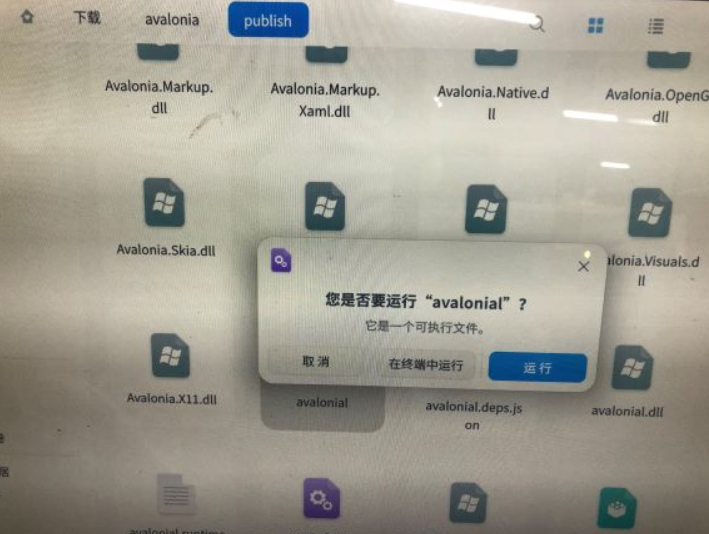

# dotnet 使用 Avalonia 开发 UOS 原生应用

最近很火的是国产的操作系统 UOS 系统，这个系统现在存在的问题就是生态没搭建起来。作为 dotnet 开发者，可以通过很多不同方向的技术为 UOS 系统生态贡献应用，如 Xamarin 和 GTK# 或 wine 和 win32 应用，或 mono 和 WinForms 应用等。本文将安利大家使用 Avalonia 框架开发 UOS 上的原生应用

<!--more-->


<!-- CreateTime:4/2/2020 8:16:19 AM -->

<!-- 发布 -->

什么是 Avalonia 简单说法就是原 WPF 的开发者没事干写的一套全平台框架，这个框架将 UI 布局和 UI 渲染抽离，通过在不同的平台注入平台原生的渲染框架做到了全平台。理论上无论哪个平台，只要符合渲染原理能够封装注入进去，那么将可以用上 Avalonia 框架

咱的 UOS 系统是基于 deepin 基于 debian 10 的系统，刚好在 dotnet core 支持范围。接下来将通过 dotnet core 全平台的特性，加上 Avalionia 和平台无关的布局和交互计算框架，配合具体平台渲染和交互，就可以做到在 UOS 上开发原生的应用

我有一个 Windows 的设备，在 Windows 上开发的效率比较高，本文的代码编写和构建都将会在 Windows 上进行。当然，用纯 UOS 下开发也是可以的，只是前提是对 Linux 要比较熟悉

请从模版创建开始，从零从控制台搭建的细节太多了，也不是本文关注的内容

先通过 Git 下载 官方的模版库 [https://github.com/AvaloniaUI/avalonia-dotnet-templates](https://github.com/AvaloniaUI/avalonia-dotnet-templates)

然后通过 cd 命令进入到 avalonia-dotnet-templates 文件夹，通过下面代码安装此模版。注意，只有在首次使用才需要安装模版

```csharp
dotnet new --install ./
```

上面代码是通过 dotnet 模版安装的方法，安装当前文件夹才存在的模版

如果安装成功，理论上应该可以从输出里面看到下面代码

```
Avalonia .NET Core App      avalonia.app         [C#]          ui/xaml
Avalonia .NET Core MVVM App avalonia.mvvm        [C#]          ui/xaml
Avalonia UserControl        avalonia.usercontrol [C#]          ui/xaml
Avalonia Window             avalonia.window      [C#]          ui/xaml
```

接下来新建一个空白文件夹，用命令行进入此文件夹（为什么不用 VisualStudio 原因是命令行说起来更简单）在命令行输入下面代码创建一个 Avalonia 应用

```csharp
dotnet new avalonia.app
```

此时将会在当前文件夹里面创建一个 Avalonia 应用

一个空白的 Avalonia 应用默认带有 Hellow 界面，先不要尝试修改界面逻辑，请先发布运行一下

使用 Avalonia 带来的优势是部署特别方便，原因是 dotnet core 部署非常方便，通过下面命令就可以独立发布一个 dotnet core 应用。独立发布将不需要任何依赖，可以做到在 Linux 上复制文件的方式安装

```csharp
dotnet publish -c release -r linux-x64 --self-contained
```

此时就完成了生成，尝试将 `bin\release\netcoreapp3.0\linux-x64\publish\` 文件夹复制到 UOS 系统上。我采用的方法是在本机先将 Publish 文件夹压缩为 Publish.zip 文件，然后用下面两句代码开启一个 http 静态文件服务器

```csharp
dotnet tool install --global dotnet-serve

dotnet serve -p 1007 -a 0.0.0.0
```

关于上面开启静态文件服务器的方法请看 [dotnet serve 一句话开启文件服务器 通过 HTTP 将文件共享给其他设备](https://blog.lindexi.com/post/dotnet-serve-%E4%B8%80%E5%8F%A5%E8%AF%9D%E5%BC%80%E5%90%AF%E6%96%87%E4%BB%B6%E6%9C%8D%E5%8A%A1%E5%99%A8-%E9%80%9A%E8%BF%87-HTTP-%E5%B0%86%E6%96%87%E4%BB%B6%E5%85%B1%E4%BA%AB%E7%BB%99%E5%85%B6%E4%BB%96%E8%AE%BE%E5%A4%87.html )

在 UOS 上访问 `http://xx.xx.xx.xx:1007` 就能看到开启的静态文件服务器，找到里面的 publish.zip 文件，下载下来，可以在 UOS 的资源管理器里面，右击解压缩

此时需要通过命令行给他一个权限才能运行，在 UOS 通过快捷键 ctrl+alt+t 打开命令行，通过 cd 命令进去下载的文件夹的路径。默认都会下载到 `~/Download` 文件夹，这里可执行文件是一个不带后缀的文件。如我创建的项目是 avalonial 此时我生成的可执行文件就是和项目名相同的不带后缀名的文件，使用下面代码就可以让这个文件有权限执行

```csharp
chmod 777 ./avalonial
```

接下来可以选择用命令行输入 `./avalonial` 执行，也可以如下图在资源管理器里面双击运行

<!--  -->


在成功跑起来之后，再请小伙伴修改界面，写出还玩的应用。此时部署炸了就肯定不会说 Avalonia 不兼容 UOS 了

现在 AvaloniaUI 是完全开源的，我也在这个项目里面水了改注释的代码，欢迎小伙伴组队贡献代码

[AvaloniaUI/avalonia-dotnet-templates: Avalonia Templates for `dotnet new`](https://github.com/AvaloniaUI/avalonia-dotnet-templates )

[AvaloniaUI/Avalonia: A multi-platform .NET UI framework](https://github.com/AvaloniaUI/Avalonia )

[Avalonia UI Framework - Creating a new Avalonia Project](https://avaloniaui.net/docs/quickstart/create-new-project ) 

[.NET Core UI框架Avalonia_运维_思月行云-CSDN博客](https://blog.csdn.net/kenkao/article/details/84973130 )


<a rel="license" href="http://creativecommons.org/licenses/by-nc-sa/4.0/"></a><br />本作品采用<a rel="license" href="http://creativecommons.org/licenses/by-nc-sa/4.0/">知识共享署名-非商业性使用-相同方式共享 4.0 国际许可协议</a>进行许可。欢迎转载、使用、重新发布，但务必保留文章署名[林德熙](http://blog.csdn.net/lindexi_gd)(包含链接:http://blog.csdn.net/lindexi_gd )，不得用于商业目的，基于本文修改后的作品务必以相同的许可发布。如有任何疑问，请与我[联系](mailto:lindexi_gd@163.com)。