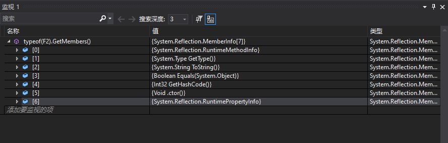
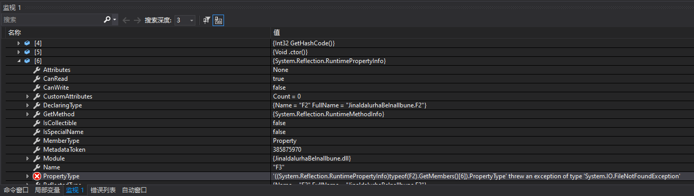
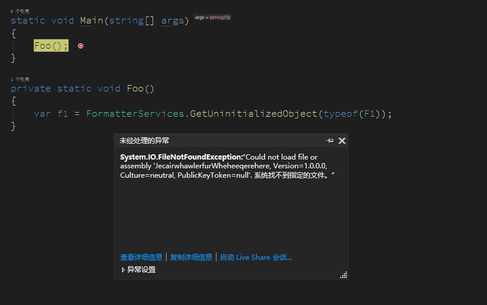

# dotnet 使用 FormatterServices 的 GetUninitializedObject 方法在丢失 DLL 情况下能否执行

在 dotnet 里面，可以使用 FormatterServices 的 GetUninitializedObject 方法可以实现只创建对象，而不调用对象的构造函数方法。而如果在使用此方法时，存在了 DLL 缺失的情况，此时能否让此方法运行通过，创建出空的对象

<!--more-->


<!-- CreateTime:2021/7/21 19:27:09 -->

<!-- 发布 -->

答案是可以创建成功，也可以创建不成功。当所有碰到的字段都是引用类型的时候，可以创建成功。如果存在值类型，但是值类型的 DLL 定义文件被删除，将会失败

下面来写一点测试的逻辑，如下面代码分别定义 F1 和 F2 和 F3 三个不同的类型

```csharp
    class F1
    {
        public F2 F2 { get; } = new F2();
    }

    class F2
    {
        public F3 F3 { get; } = new F3();
    }

    public class F3
    {

    }
```

在 Main 函数里面使用下面代码调用 FormatterServices 的 GetUninitializedObject 方法创建对象

```csharp
    class Program
    {
        static void Main(string[] args)
        {
            var f1 = FormatterServices.GetUninitializedObject(typeof(F1));
        }
    }
```

接着将 F3 类放在另一个项目里面，然后让此项目引用包含 F3 类的项目。在构建完成之后，删除包含 F3 类的项目的输出 DLL 文件。接着运行 Main 方法，可以看到实际上 f1 对象还是被创建才出来，不会炸掉

上面代码放在 [github](https://github.com/lindexi/lindexi_gd/tree/2f00793486fcb1962de7e368ec527cf1169db135/JinaldalurhaBelnallbune) 和 [gitee](https://gitee.com/lindexi/lindexi_gd/tree/2f00793486fcb1962de7e368ec527cf1169db135/JinaldalurhaBelnallbune) 欢迎访问

可以通过如下方式获取本文的源代码，先创建一个空文件夹，接着使用命令行 cd 命令进入此空文件夹，在命令行里面输入以下代码，即可获取到本文的代码

```
git init
git remote add origin https://gitee.com/lindexi/lindexi_gd.git
git pull origin 2f00793486fcb1962de7e368ec527cf1169db135
```

以上使用的是 gitee 的源，如果 gitee 不能访问，请替换为 github 的源

```
git remote remove origin
git remote add origin https://github.com/lindexi/lindexi_gd.git
```

获取代码之后，进入 JinaldalurhaBelnallbune 文件夹


其实此时即使获取 F2 的类型，通过反射拿到所有的成员，也是可以获取到的，如下图

<!--  -->


可以看到原本是 F3 的类型对应的属性，在反射拿到的是 `System.Reflection.RuntimePropertyInfo` 类型

<!--  -->


可以看到对应的模块被删除时，只会提示说文件找不到，而不会让反射失败

接下来试试使用结构体的方式，也就是字段实际是值类型的方式，修改 F2 和 F3 从引用类型修改为结构体，代码如下

```csharp
    struct F2
    {
        public F3 F3 { get; }
    }

    public struct F3
    {
        static F3()
        {
        }
    }
```

依然将 F3 放在另一个程序集，然后在输出文件里面删除此程序集的 DLL 文件。尝试运行代码，可以看到此时运行将会失败

<!--  -->


原因是因为值类型需要计算对象的占用的内存空间的大小，在准备创建 F1 的时候需要开始计算 F2 的占用空间，因为 F2 是一个结构体。但是 F2 里面引用了 F3 类型，此时 F2 就需要开始计算 F3 的空间，然而定义 F3 占用空间大小的数据放在了被删除的程序集里面，因此拿不到 F3 的占用空间大小，从而计算不出 F2 的空间大小，也就无法创建 F1 对象，因此失败

那为什么 F3 的占用空间大小需要放在定义 F3 的程序集里面，不能放在被引用的如 F2 所在的程序集里面？原因在于 dotnet 的应用可以支持 DLL 兼容更新，如我可以方便的更改 F3 类型的定义，如添加一个字段。那么此时 F3 的占用内存空间大小自然就需要修改了。然而此时我可以做到不更改 F2 所在的程序集，只需要更新 F3 所在的程序集即可，这就是因为在运行时里面读取了 F3 所在的程序集拿到了 F3 的占用内存空间的大小，不需要依赖在 F2 所在的程序集的定义

上面代码放在 [github](https://github.com/lindexi/lindexi_gd/tree/415664a5516c778db662dd519e9114a320a4d690/JinaldalurhaBelnallbune) 和 [gitee](https://gitee.com/lindexi/lindexi_gd/tree/415664a5516c778db662dd519e9114a320a4d690/JinaldalurhaBelnallbune) 欢迎访问

可以通过如下方式获取本文的源代码，先创建一个空文件夹，接着使用命令行 cd 命令进入此空文件夹，在命令行里面输入以下代码，即可获取到本文的代码

```
git init
git remote add origin https://gitee.com/lindexi/lindexi_gd.git
git pull origin 415664a5516c778db662dd519e9114a320a4d690
```

以上使用的是 gitee 的源，如果 gitee 不能访问，请替换为 github 的源

```
git remote remove origin
git remote add origin https://github.com/lindexi/lindexi_gd.git
```

获取代码之后，进入 JinaldalurhaBelnallbune 文件夹

如果不是直接的引用的类型找不到定义的程序集，那依然可以成功，将 F2 从结构体修改为引用类型，如下面代码

```csharp
    class F2
    {
        public F3 F3 { get; }
    }
```

此时删除 F3 所在的程序集，依然可以创建出来 F1 对象

通过上文可以了解到 F1 对象的内存空间，可以计算出来，因为 F2 是引用类型，引用类型占用的字段内存空间是固定的。所以就不需要再去计算 F2 里面包含的 F3 结构体的占用空间

当然，依然让 F2 是结构体类型，但是将 F3 修改为引用类型，也能创建成功。原因是 F2 结构体在不知道 F3 的程序集时依然可以根据引用类型占用的字段空间是固定的，计算出包含 F3 的属性的字段占用的内存，因此不需要去读取 F3 所在的程序集

通过上文可以了解到 dotnet 里面加载程序集的机制

更多请看 [dotnet C# 只创建对象不调用构造函数方法](https://blog.lindexi.com/post/dotnet-C-%E5%8F%AA%E5%88%9B%E5%BB%BA%E5%AF%B9%E8%B1%A1%E4%B8%8D%E8%B0%83%E7%94%A8%E6%9E%84%E9%80%A0%E5%87%BD%E6%95%B0%E6%96%B9%E6%B3%95.html )


<a rel="license" href="http://creativecommons.org/licenses/by-nc-sa/4.0/"></a><br />本作品采用<a rel="license" href="http://creativecommons.org/licenses/by-nc-sa/4.0/">知识共享署名-非商业性使用-相同方式共享 4.0 国际许可协议</a>进行许可。欢迎转载、使用、重新发布，但务必保留文章署名[林德熙](http://blog.csdn.net/lindexi_gd)(包含链接:http://blog.csdn.net/lindexi_gd )，不得用于商业目的，基于本文修改后的作品务必以相同的许可发布。如有任何疑问，请与我[联系](mailto:lindexi_gd@163.com)。