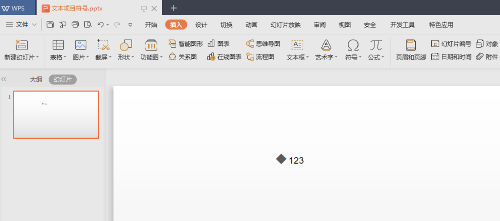
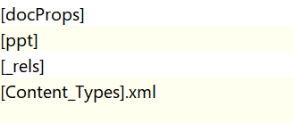
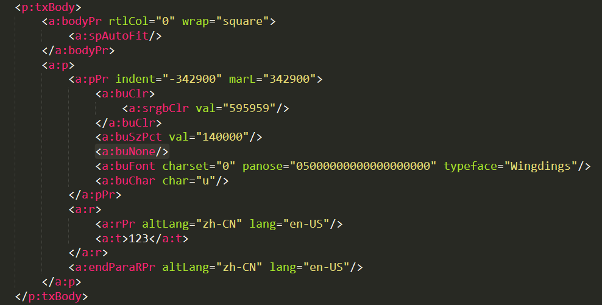

# dotnet 使用 OpenXML SDK 解析 Office 的项目符号 buNone 含义

在解析 PPT 文档的时候，文本是比较复杂的一部分，而因为很多有趣的坑，即使是微软大法也有一些诡异的设计，例如项目符号的是否显示

<!--more-->


<!-- CreateTime:5/11/2020 3:00:29 PM -->

<!-- 发布 -->

在阅读本文之前，我期望小伙伴是了解基础的解析 Office 的方法。在使用 OpenXML SDK 解析的时候，只需要开发 10 分钟就完成了整个 PPT 的解析了，剩下就是如何使用解析完成的数据。入门的文档请看 [C# dotnet 使用 OpenXml 解析 PPT 文件](https://blog.lindexi.com/post/C-dotnet-%E4%BD%BF%E7%94%A8-OpenXml-%E8%A7%A3%E6%9E%90-PPT-%E6%96%87%E4%BB%B6.html )

在 Office 的段落里面可以使用 `<a:buNone/>` 表示当前这一段不要显示项目符号，而这个属性的作用还需要小伙伴动手改一下 PPT 文档内容才比较好了解。为什么没有项目符号是一个属性？为什么不是没有设置项目符号就是没有项目符号？其实这里涉及一个命名问题，在 OpenXML SDK 里面给了一个很好理解的命名是 NoBullet 也就是不要项目符号。这个符号是什么意思，下面请看小伙伴修改一下 PPT 文档，看一下 Office 的 PPT 是如何显示

咱要支持 WPS 软件，我推荐使用教育版，这个版本几乎没广告

打开 WPS 写一个文本框，里面的文本设置项目符号

<!--  -->


保存之后，将后缀名修改为 zip 然后解压缩

```csharp
move 文本项目符号.pptx 文本项目符号.pptx.zip
```

解压缩可以看到下面文件

<!--  -->


打开 `f:\temp\文本项目符号\ppt\slides\slide1.xml` 文件

<!--  -->


在段落属性添加 `<a:buNone/>` 如上图，注意不要格式化，上面格式化只是让小伙伴们阅读起来不会要打我

将文件夹压缩，修改后缀名是 pptx 然后用 PPT 打开

用 PPT 打开可以看到文本没有项目符号

<!--  -->


当然此时的 WPS 是玩不过 Office 的，在 WPS 里面解析错了，将项目符号显示出来

从微软官方文档 [NoBullet Class (DocumentFormat.OpenXml.Drawing)](https://docs.microsoft.com/en-us/dotnet/api/documentformat.openxml.drawing.nobullet) 的原文说的，这个属性表示当前这一段不要显示项目符号，而项目符号在段落里面可以从默认段落以及样式继承。而这个属性就是表示不继承项目符号，也不要使用段落设置的项目符号

即使在段落里面设置了复杂的项目符号，只要存在 `<a:buNone/>` 那么就不显示项目符号。这个规则在 Office 里面是这样做的，但是在 WPS 不是

在 OpenXML SDK 拿到 TextParagraphPropertiesType 段落属性，可以通过 GetFirstChild 方法尝试获取是否设置 NoBullet 类

```csharp
private void Foo(TextParagraphPropertiesType paragraphProperties)
{
            // 如果是 NoBullet 就是说不用项目符号
            if (paragraphProperties.GetFirstChild<NoBullet>() != null)
            {
                // [NoBullet Class (DocumentFormat.OpenXml.Drawing)](https://docs.microsoft.com/en-us/dotnet/api/documentformat.openxml.drawing.nobullet )
                // 按照微软文档无论前面是否写了项目符号的字体还是定义了项目符号，只要写了 NoBullet 这一段不要项目符号，那么这一段就是没有项目符号
            }
}
```

在 WPF 中默认的文本都是没有项目符号可以设置的，只能通过自己用字符的方式，不过这不在本文的范围


<a rel="license" href="http://creativecommons.org/licenses/by-nc-sa/4.0/"></a><br />本作品采用<a rel="license" href="http://creativecommons.org/licenses/by-nc-sa/4.0/">知识共享署名-非商业性使用-相同方式共享 4.0 国际许可协议</a>进行许可。欢迎转载、使用、重新发布，但务必保留文章署名[林德熙](http://blog.csdn.net/lindexi_gd)(包含链接:http://blog.csdn.net/lindexi_gd )，不得用于商业目的，基于本文修改后的作品务必以相同的许可发布。如有任何疑问，请与我[联系](mailto:lindexi_gd@163.com)。