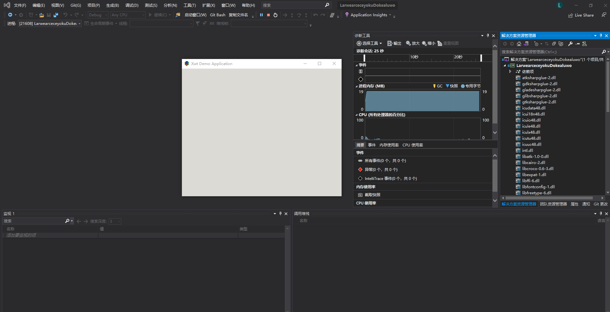

# dotnet 使用 XWT 构建跨平台客户端 入门篇

本文告诉大家如何入门开始开发一个基于 mono 组织开源的 XWT 跨平台客户端 UI 框架的应用，本文的 xwt 是在 GitHub 上完全开源的，基于 MIT 协议的，底层采用 GTK# 的 UI 框架

<!--more-->


<!-- 发布 -->

此 xwt 在设计上是通过 mono 进行跨平台运行的，而非采用 dotnet core 方式进行跨平台运行的，因此暂时只能使用 dotnet framework 4.7.2 版本，而不支持 dotnet core 版本。至少在 2021.08.09 依然是不支持在 dotnet core 运行

在开始之前，将会因为 xwt 依赖 GTK# 的环境而需要先部署 GTK# 的开发环境

从[官网](https://www.monodevelop.com/download/#fndtn-download-win) 下载 `GTK#` 的 x86 安装包或 mono x86 的应用

安装到默认路径，也就是在 `C:\Program Files (x86)\GtkSharp\2.12\bin` 路径，默认安装的时候会加入到环境变量。详细请参阅 [Xamarin 使用 GTK 提示找不到 libglib-2.0-0.dll 找不到](https://blog.lindexi.com/post/Xamarin-%E4%BD%BF%E7%94%A8-GTK-%E6%8F%90%E7%A4%BA%E6%89%BE%E4%B8%8D%E5%88%B0-libglib-2.0-0.dll-%E6%89%BE%E4%B8%8D%E5%88%B0.html )

接着打开 VisualStudio 完成 .NET Framework 4.7.2 和 dotnet core 负载（为了mono的默认安装）的安装，以及桌面开发 (xwt 可以基于 wpf 版本)的安装

以上就是所有的环境部署步骤，对于大部分开发者，只需要去下载 GtkSharp 安装即可。我依然推荐安装到默认路径，无论是 GtkSharp 还是 VisualStudio 都放在默认路径

新建一个 dotnet core 控制台项目

修改 csproj 项目文件，替换为如下代码

```xml
<Project Sdk="Microsoft.NET.Sdk">

  <PropertyGroup>
    <OutputType>Exe</OutputType>
    <TargetFrameworks>net472;netcoreapp3.1</TargetFrameworks>
    <PlatformTarget>x86</PlatformTarget>
  </PropertyGroup>

  <ItemGroup>
    <None Include="C:\Program Files %28x86%29\GtkSharp\2.12\bin\*.dll" Link="%(FileName).dll">
      <CopyToOutputDirectory>PreserveNewest</CopyToOutputDirectory>
    </None>
  </ItemGroup>

  <ItemGroup>
    <PackageReference Include="Xwt.Gtk" Version="0.2.247" />
  </ItemGroup>

</Project>
```

以上代码就是设置框架是 .NET Framework 4.7.2 和 dotnet core 3.1 两个版本，当然当前是不能跑 dotnet core 3.1 的版本的。接着因为 GTK# 当前只支持客户端的 x86 版本，因此需要设置 PlatformTarget 作为 x86 版本

默认是不会去找到 GTK Sharp 的 DLL 内容的，因此通过如下代码引用所有的 DLL 用来输出

```xml
  <ItemGroup>
    <None Include="C:\Program Files %28x86%29\GtkSharp\2.12\bin\*.dll" Link="%(FileName).dll">
      <CopyToOutputDirectory>PreserveNewest</CopyToOutputDirectory>
    </None>
  </ItemGroup>
```

打开 Program.cs 文件，添加如 xwt 官方开源仓库 [https://github.com/mono/xwt](https://github.com/mono/xwt) 的例子

```csharp
        [STAThread]
        static void Main(string[] args)
        {
            Application.Initialize(ToolkitType.Gtk);

            var mainWindow = new Window()
            {
                Title = "Xwt Demo Application",
                Width = 500,
                Height = 400
            };
            mainWindow.Show();
            Application.Run();
        }
```

选择 .NET Framework 4.7.2 版本，尝试运行一下应用。默认即可看到显示了窗口

<!--  -->


本文所有代码在 [github](https://github.com/lindexi/lindexi_gd/tree/11125ca50dc91e50cf581c36476f03b853bc7ef8/LarwearceceyokuDokealuwo) 和 [gitee](https://gitee.com/lindexi/lindexi_gd/tree/11125ca50dc91e50cf581c36476f03b853bc7ef8/LarwearceceyokuDokealuwo) 上完全开源

不嫌弃麻烦的话，还请自行下载代码，自己构建。可以通过如下方式获取本文的源代码，先创建一个空文件夹，接着使用命令行 cd 命令进入此空文件夹，在命令行里面输入以下代码，即可获取到本文的代码

```
git init
git remote add origin https://gitee.com/lindexi/lindexi_gd.git
git pull origin 11125ca50dc91e50cf581c36476f03b853bc7ef8
```

以上使用的是 gitee 的源，如果 gitee 不能访问，请替换为 github 的源

```
git remote remove origin
git remote add origin https://github.com/lindexi/lindexi_gd.git
```

获取代码之后，进入 LarwearceceyokuDokealuwo 文件夹


<a rel="license" href="http://creativecommons.org/licenses/by-nc-sa/4.0/"></a><br />本作品采用<a rel="license" href="http://creativecommons.org/licenses/by-nc-sa/4.0/">知识共享署名-非商业性使用-相同方式共享 4.0 国际许可协议</a>进行许可。欢迎转载、使用、重新发布，但务必保留文章署名[林德熙](http://blog.csdn.net/lindexi_gd)(包含链接:http://blog.csdn.net/lindexi_gd )，不得用于商业目的，基于本文修改后的作品务必以相同的许可发布。如有任何疑问，请与我[联系](mailto:lindexi_gd@163.com)。