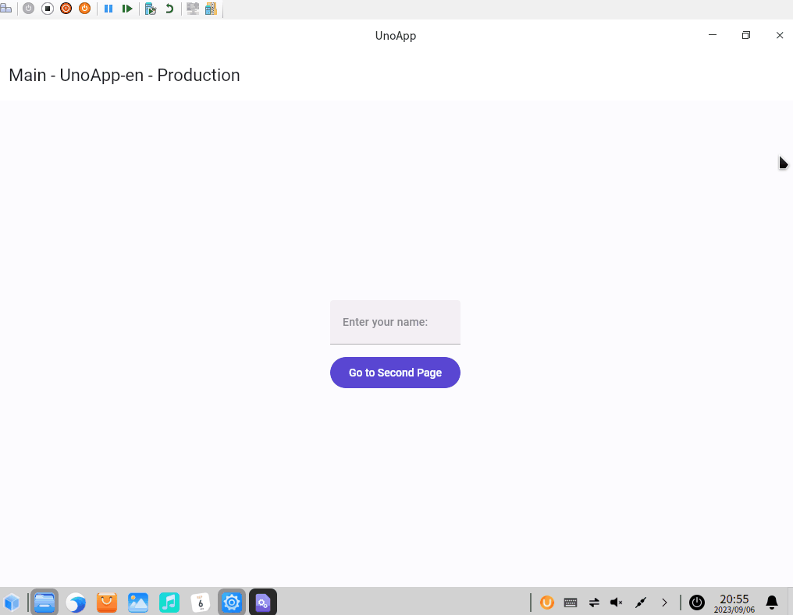

# dotnet 在 UOS 统信系统上运行 UNO 程序输入时闪烁黑屏问题

本文记录我在虚拟机内安装了 UOS 统信系统，运行 UNO 的基于 Skia 的 Gtk 应用程序时，在输入的过程中不断窗口闪黑问题

<!--more-->


<!-- 发布 -->
<!-- 博客 -->

本质上说这个问题和 UNO 毫无关系，这是一个 OpenGL 硬件加速在虚拟机里运行的问题，问题现象如下

<!--  -->


我给 UNO 官方报告了：https://github.com/unoplatform/uno/issues/13530

后面发现是 OpenGL 的一个已知问题，解决方法就是禁用 OpenGL 的加速，完全走软渲染方式

在 UNO 的 `host.Run()` 之前加上以下代码，用来禁用 OpenGL 的加速，规避 OpenGL 在虚拟机里闪烁黑屏的问题。由于我对 OpenGL 了解太少，不知道这么奇怪的 Bug 的原理是什么，如果有大佬知道的话，还请告诉我

```csharp
        host.RenderSurfaceType = RenderSurfaceType.Software;
```

修改之后的 Program.cs 的代码大概如下

```csharp
using GLib;

using System;

using Uno.UI.Runtime.Skia;

namespace UnoApp.Skia.Gtk;
public class Program
{
    public static void Main(string[] args)
    {
        ExceptionManager.UnhandledException += delegate (UnhandledExceptionArgs expArgs)
        {
            Console.WriteLine("GLIB UNHANDLED EXCEPTION" + expArgs.ExceptionObject.ToString());
            expArgs.ExitApplication = true;
        };

        var host = new GtkHost(() => new AppHead(), args);
        host.RenderSurfaceType = RenderSurfaceType.Software; // 这一句是关键

        host.Run();
    }
}
```

本文所有代码放在 [github](https://github.com/lindexi/lindexi_gd/tree/9285ee59071c54b49dd6ad0e868a744b4998d203/FayjarbeelajoFalfarkeyi) 和 [gitee](https://gitee.com/lindexi/lindexi_gd/tree/9285ee59071c54b49dd6ad0e868a744b4998d203/FayjarbeelajoFalfarkeyi) 上，可以通过以下方式获取整个项目的代码

先创建一个空文件夹，接着使用命令行 cd 命令进入此空文件夹，在命令行里面输入以下代码，即可获取到本文的代码

```
git init
git remote add origin https://gitee.com/lindexi/lindexi_gd.git
git pull origin 9285ee59071c54b49dd6ad0e868a744b4998d203
```

以上使用的是 gitee 的源，如果 gitee 不能访问，请替换为 github 的源。请在命令行继续输入以下代码

```
git remote remove origin
git remote add origin https://github.com/lindexi/lindexi_gd.git
git pull origin 9285ee59071c54b49dd6ad0e868a744b4998d203
```

获取代码之后，进入 FayjarbeelajoFalfarkeyi 文件夹


<a rel="license" href="http://creativecommons.org/licenses/by-nc-sa/4.0/"></a><br />本作品采用<a rel="license" href="http://creativecommons.org/licenses/by-nc-sa/4.0/">知识共享署名-非商业性使用-相同方式共享 4.0 国际许可协议</a>进行许可。欢迎转载、使用、重新发布，但务必保留文章署名[林德熙](http://blog.csdn.net/lindexi_gd)(包含链接:http://blog.csdn.net/lindexi_gd )，不得用于商业目的，基于本文修改后的作品务必以相同的许可发布。如有任何疑问，请与我[联系](mailto:lindexi_gd@163.com)。