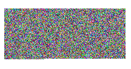

# dotnet 在 WPF 里显示数学 π 的颜色

有逗比小伙伴问我，数学的 π 视觉效果是啥。于是我就来写一个逗比的应用将 π 的颜色在 WPF 应用画出来。原理就是读取 π 的小数点后的数值，然后使用逗比算法转换为 RGB 颜色像素，接着将这些像素转换为一张图片

<!--more-->


<!-- 发布 -->
<!-- 博客 -->

以下就是我用程序生成的 π 图片 

<!--  -->


我先从某个有趣的地方随便找到了 π 小数点之后很长的数值，接下来将这个数值存放作为字符串，再对这个字符串执行如下算法

1. 读取两个 0-9 的字符
2. 将此两个字符拼接为两位数的数值
3. 将这些数值放在一个列表

此时就可以获取这个列表的内容

如以下代码，下面代码的 `NumberText.PI` 就是一个 π 的字符串

```csharp
        private static List<int> StringNumberToList()
        {
            var stringReader = new StringReader(NumberText.PI);
            stringReader.Read();
            stringReader.Read();

            var list = new List<int>();
            while (true)
            {
                var height = ReadNumber(stringReader);
                if (height < 0)
                {
                    break;
                }

                var low = ReadNumber(stringReader);
                if (low < 0)
                {
                    break;
                }

                var number = height * 10 + low;
                list.Add(number);
            }

            return list;
        }

        private static int ReadNumber(StringReader reader)
        {
            while (true)
            {
                var text = reader.Read();
                if (text == -1)
                {
                    return -1;
                }

                var c = (char)text;

                var n = c - '0';
                if (n is >= 0 and <= 9)
                {
                    return n;
                }
            }
        }
```

接下来通过 WriteableBitmap 将上面生成的数值列表转换为 RGB 像素写入到图片，算法如下

1. 按照顺序遍历数值列表
2. 按照 BGR 的顺序填充像素的数值
3. 像素每个数值计算方法是按照 0-100 的比例对应 0-255 的比例拉伸

代码如下

```csharp
        private static unsafe WriteableBitmap ToBitmap(List<int> list, double width, double height)
        {
            var writeableBitmap = new WriteableBitmap((int)width, (int)height, 96, 96, PixelFormats.Bgra32, null);

            writeableBitmap.Lock();

            var backBuffer = (byte*)writeableBitmap.BackBuffer;
            var length = writeableBitmap.PixelWidth * writeableBitmap.PixelHeight *
                writeableBitmap.Format.BitsPerPixel / 8;
            for (int i = 0, j = 0; i + 4 < length && j + 3 < list.Count; i = i + 4, j += 3)
            {
                var blue = backBuffer[i];
                var green = backBuffer[i + 1];
                var red = backBuffer[i + 2];
                var alpha = backBuffer[i + 3];

                blue = (byte)Math.Round(list[j + 2] / 100.0 * byte.MaxValue);
                green = (byte)Math.Round(list[j + 1] / 100.0 * byte.MaxValue);
                red = (byte)Math.Round(list[j + 0] / 100.0 * byte.MaxValue);
                alpha = 0xFF;

                backBuffer[i] = blue;
                backBuffer[i + 1] = green;
                backBuffer[i + 2] = red;
                backBuffer[i + 3] = alpha;
            }

            writeableBitmap.AddDirtyRect(new Int32Rect(0, 0, writeableBitmap.PixelWidth, writeableBitmap.PixelHeight));
            writeableBitmap.Unlock();
            return writeableBitmap;
        }
```

通过上面代码就可以拿到 π 的图片，将此图片在界面显示就可以看到效果

当然了，除了以上算法之外，还有其他很多有趣的方法，欢迎大家乱写

本文所有代码放在 [github](https://github.com/lindexi/lindexi_gd/tree/747c17ef199dddf7f13f8cae7ffc9aefc9d117ad/KohaykowurchemJaibuqajijiyeco) 和 [gitee](https://gitee.com/lindexi/lindexi_gd/tree/747c17ef199dddf7f13f8cae7ffc9aefc9d117ad/KohaykowurchemJaibuqajijiyeco) 欢迎访问

可以通过如下方式获取本文的源代码，先创建一个空文件夹，接着使用命令行 cd 命令进入此空文件夹，在命令行里面输入以下代码，即可获取到本文的代码

```
git init
git remote add origin https://gitee.com/lindexi/lindexi_gd.git
git pull origin 747c17ef199dddf7f13f8cae7ffc9aefc9d117ad
```

以上使用的是 gitee 的源，如果 gitee 不能访问，请替换为 github 的源

```
git remote remove origin
git remote add origin https://github.com/lindexi/lindexi_gd.git
```

获取代码之后，进入 KohaykowurchemJaibuqajijiyeco 文件夹


<a rel="license" href="http://creativecommons.org/licenses/by-nc-sa/4.0/"></a><br />本作品采用<a rel="license" href="http://creativecommons.org/licenses/by-nc-sa/4.0/">知识共享署名-非商业性使用-相同方式共享 4.0 国际许可协议</a>进行许可。欢迎转载、使用、重新发布，但务必保留文章署名[林德熙](http://blog.csdn.net/lindexi_gd)(包含链接:http://blog.csdn.net/lindexi_gd )，不得用于商业目的，基于本文修改后的作品务必以相同的许可发布。如有任何疑问，请与我[联系](mailto:lindexi_gd@163.com)。