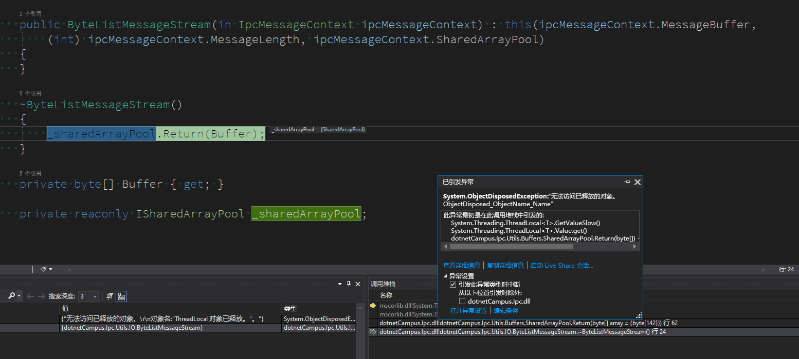

# dotnet 在析构函数调用 ThreadLocal 也许会抛出对方已释放

我在不自量力做一个数组池，就是为了减少使用 System.Buffers.dll 程序集，然而在数组池里面，所用的 ThreadLocal 类型，在我对象析构函数进行归还数组时，抛出了无法访问已释放对象

<!--more-->


<!-- CreateTime:2021/11/29 20:27:00 -->

<!-- 发布 -->

先来看第一个张图，亮点在于线程是 GC 终结器线程

<!--  -->


调用堆栈是 `~ByteListMessageStream` 函数，也就是 ByteListMessageStream 的 析构函数。代码如下

```csharp
        ~ByteListMessageStream()
        {
            _sharedArrayPool.Return(Buffer);
        }
```

<!--  -->


在进行数组归还的时候，因为 ThreadLocal 已被释放，所在的线程也不存在。此时的访问将失败，如下图

<!--  -->


请大家不要重复踩入此坑


<a rel="license" href="http://creativecommons.org/licenses/by-nc-sa/4.0/"></a><br />本作品采用<a rel="license" href="http://creativecommons.org/licenses/by-nc-sa/4.0/">知识共享署名-非商业性使用-相同方式共享 4.0 国际许可协议</a>进行许可。欢迎转载、使用、重新发布，但务必保留文章署名[林德熙](http://blog.csdn.net/lindexi_gd)(包含链接:http://blog.csdn.net/lindexi_gd )，不得用于商业目的，基于本文修改后的作品务必以相同的许可发布。如有任何疑问，请与我[联系](mailto:lindexi_gd@163.com)。