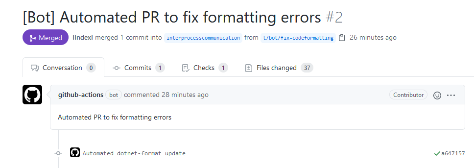

# dotnet 基于 dotnet format 的 GitHub Action 自动代码格式化机器人

是不是大家也会觉得代码审查里面审查代码格式化问题是无意义的，但是不审查又觉得过不去？是否有个专门的工具人，用来协助修复代码格式化的问题？本文来安利大家一个特别好用的方法，使用 dotnet 完全开源的专业格式化工具 dotnet format 配合 GitHub 的自动构建 Action 做的自动代码格式化机器人，这个机器人可以被指定到特定时机，如每天晚上或者每次代码合并等，进行代码格式化，格式化完成之后，可以选择直接推送或者提代码审查

<!--more-->


<!-- CreateTime:2020/10/13 19:53:07 -->


这个方法将需要用到 dotnet 完全开源的专业格式化工具 dotnet format 工具，请看 [https://github.com/dotnet/format](https://github.com/dotnet/format)

用法十分简单，可以复制本文最后的 GitHub 的自动构建 Action 的脚本，放在仓库的 `.github\workflows` 文件夹里面。现在请让我告诉大家这个构建脚本的细节

在 `.github\workflows` 文件夹里面创建的所有 `yml` 文件都会当成构建脚本，每个脚本就应该给定一个名字，如下面代码

```yml
name: Daily code format check
```

然后设置构建脚本的触发时机，如下面代码设置了在推送了 master 分支时，触发构建脚本

```yml
on: 
  push:
    branches: 
      - master
```

其他触发时机等，还请大家去阅读官方文档

下一步是指定运行在什么设备上，如下面代码

```yml
jobs:
  dotnet-format:
    runs-on: windows-latest
```

接下来就是将代码拉下来了，可以通过如下代码将当前分支的最新代码拉下来

```yml
    steps:
      - name: Checkout repo
        uses: actions/checkout@v2
        with:
          ref: ${{ github.head_ref }}
```

本文的格式化方法是使用 dotnet format 工具格式化的，在使用这个工具之前，需要先安装，请使用如下代码进行安装

```yml
      - name: Install dotnet-format
        run: dotnet tool install -g dotnet-format
```

原本可以使用一句命令 `dotnet format` 就进行格式化，但是当前遇到的问题是，如果代码格式化没有任何文件更改，那么此时就不应该做创建新的分支和开启代码审查了，因此就需要用到 [jfversluis](https://github.com/jfversluis) 大佬的 [dotnet-format](https://github.com/jfversluis/dotnet-format) 脚本。这个脚本可以输出参数，用于在后续步骤判断，如果没有文件更改，也就是没有代码需要格式化就不需要开启代码审查了

```yml
      - name: Run dotnet format
        id: format
        uses: jfversluis/dotnet-format@v1.0.5
        with:
          repo-token: ${{ secrets.GITHUB_TOKEN }}
          action: "fix"
          only-changed-files: true # only works for PRs
          # workspace: "Xamarin.Forms.sln" 默认根路径只有一个 sln 文件，可以忽略这一行
```

如果自己的仓库里面的根路径，也就是放在和 `.git` 文件夹所在的相同的文件夹，存在了一个 sln 文件，那么可以忽略 workspace 参数

调用了上面代码脚本之后，将会输出，可以使用如下代码判断，是否有文件更改

```yml
if: steps.format.outputs.has-changes == 'true'
```

接下来是 commit 代码，如果代码文件有更改的话

```yml
      - name: Commit files
        if: steps.format.outputs.has-changes == 'true' # 如果有格式化，才继续
        # 下面将使用机器人的账号，你可以替换为你自己的账号
        run: |
          git config --local user.name "github-actions-dotnet-formatter[bot]"
          git config --local user.email "41898282+github-actions[bot]@users.noreply.github.com"
          git commit -a -m 'Automated dotnet-format update'
```

上面代码的邮件等是 GitHub 机器人的账号，你可以替换为你的账号

最后一步是开启代码审查，然后指定代码审查者

```yml
      - name: Create Pull Request
        if: steps.format.outputs.has-changes == 'true' # 如果有格式化，才继续
        uses: peter-evans/create-pull-request@v3
        with:
          title: '[Bot] Automated PR to fix formatting errors'
          body: |
            Automated PR to fix formatting errors
          committer: GitHub <noreply@github.com>
          author: github-actions[bot] <41898282+github-actions[bot]@users.noreply.github.com>
          # 以下是给定代码审查者，需要设置仓库有权限的开发者
          assignees: lindexi,walterlv
          reviewers: lindexi,walterlv
          # 对应的上传分支
          branch: t/bot/fix-codeformatting
```

这样就能完成了在开发者将代码合并或推送到主分支的时候，自动尝试代码格式化，如果代码格式化有文件更改了，那么开启一个代码审查，如下图

<!--  -->


感谢 [jfversluis](https://github.com/jfversluis) 大佬的 [dotnet-format](https://github.com/jfversluis/dotnet-format) 脚本，和 [Peter Evans](https://github.com/peter-evans) 的创建代码审查的 [create-pull-request](https://github.com/peter-evans/create-pull-request) 脚本

我比较推荐使用这个方法，尽管 dotnet format 工具是专业的代码格式化工具，不会让格式化前后的代码的 IL 有变更。但是我依然推荐进行一次代码审查

其实不使用 [jfversluis](https://github.com/jfversluis) 大佬的脚本也可以，因为 [Peter Evans](https://github.com/peter-evans) 的创建代码审查的 [create-pull-request](https://github.com/peter-evans/create-pull-request) 脚本会自动判断如果没有 commit 就不创建代码审查，因此只需要跳过 commit 的失败就可以了，如下面代码

```yml
      - name: Install dotnet-format
        run: dotnet tool install -g dotnet-format

      - name: Run dotnet format
        run: dotnet format

      - name: Commit files
        # 下面将使用机器人的账号，你可以替换为你自己的账号
        run: |
          git config --local user.name "github-actions-dotnet-formatter[bot]"
          git config --local user.email "41898282+github-actions[bot]@users.noreply.github.com"
          git commit -a -m 'Automated dotnet-format update'
        continue-on-error: true
```

可以看到代码十分简洁

而另外的方法是在每个开发者开启代码审查的时候，尝试格式化他的代码，这样可以让代码审查者也许会更开森，代码十分简单，请看下面

```yml
name: Format check on pull request
on: pull_request
jobs:
  dotnet-format:
    runs-on: windows-latest
    steps:
      - name: Install dotnet-format
        run: dotnet tool install -g dotnet-format

      - name: Checkout repo
        uses: actions/checkout@v2
        with:
          ref: ${{ github.head_ref }}

      - name: Run dotnet format
        id: format
        uses: jfversluis/dotnet-format@v1.0.5
        with:
          repo-token: ${{ secrets.GITHUB_TOKEN }}
          action: "fix"
          only-changed-files: true

      - name: Commit files
        if: steps.format.outputs.has-changes == 'true'
        run: |
          git config --local user.name "github-actions[bot]"
          git config --local user.email "41898282+github-actions[bot]@users.noreply.github.com"
          git commit -a -m 'Automated dotnet-format update
          Co-authored-by: ${{ github.event.pull_request.user.login }} <${{ github.event.pull_request.user.id }}+${{ github.event.pull_request.user.login }}@users.noreply.github.com>'
      - name: Push changes
        if: steps.format.outputs.has-changes == 'true'
        uses: ad-m/github-push-action@v0.5.0
        with:
          github_token: ${{ secrets.GITHUB_TOKEN }}
          branch: ${{ github.head_ref }}
```

但是这个方法也许会让开发者不开森，因为他下一次上传代码的时候需要先拉代码，也许因为格式化给他了额外的改动。另外的，如 Xamarin 仓库的注释，其实代码推送无法用在 fork 的仓库上，也就是说如果这个代码审查是另一个开发者在他 fork 的仓库里面发起的，此时的这个方法将会失效

我现在在 [dotnetCampus.Ipc](https://github.com/dotnet-campus/dotnetCampus.Ipc) 就接入这个自动代码格式化机器人，用起来还不错


构建脚本的全部代码请看下面

```yml
name: Code format check

on: 
  push:
    branches: 
      - master
jobs:
  dotnet-format:
    runs-on: windows-latest
    steps:

      - name: Checkout repo
        uses: actions/checkout@v2
        with:
          ref: ${{ github.head_ref }}

      - name: Install dotnet-format
        run: dotnet tool install -g dotnet-format

      - name: Run dotnet format
        run: dotnet format

      - name: Commit files
        # 下面将使用机器人的账号，你可以替换为你自己的账号
        run: |
          git config --local user.name "github-actions-dotnet-formatter[bot]"
          git config --local user.email "41898282+github-actions[bot]@users.noreply.github.com"
          git commit -a -m 'Automated dotnet-format update'
        continue-on-error: true
        
      - name: Create Pull Request
        # if: steps.format.outputs.has-changes == 'true' # 如果有格式化，才继续
        uses: peter-evans/create-pull-request@v3
        with:
          title: '[Bot] Automated PR to fix formatting errors'
          body: |
            Automated PR to fix formatting errors
          committer: GitHub <noreply@github.com>
          author: github-actions[bot] <41898282+github-actions[bot]@users.noreply.github.com>
          # 以下是给定代码审查者，需要设置仓库有权限的开发者
          assignees: lindexi,walterlv
          reviewers: lindexi,walterlv
          # 对应的上传分支
          branch: t/bot/fix-codeformatting
```


<a rel="license" href="http://creativecommons.org/licenses/by-nc-sa/4.0/"></a><br />本作品采用<a rel="license" href="http://creativecommons.org/licenses/by-nc-sa/4.0/">知识共享署名-非商业性使用-相同方式共享 4.0 国际许可协议</a>进行许可。欢迎转载、使用、重新发布，但务必保留文章署名[林德熙](http://blog.csdn.net/lindexi_gd)(包含链接:http://blog.csdn.net/lindexi_gd )，不得用于商业目的，基于本文修改后的作品务必以相同的许可发布。如有任何疑问，请与我[联系](mailto:lindexi_gd@163.com)。