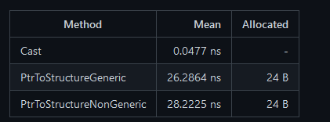

# dotnet 对指针转换为结构体多个不同方法的性能分析

在 dotnet 里面，拿到一个指针，可以有多个不同的方法转换为结构体，本文将来告诉大家这几个方法的性能的差别

<!--more-->


<!-- 发布 -->

特别感谢性能优化狂魔 [Stephen Toub](https://github.com/stephentoub) 大佬的指导

在 WPF 框架开发中，有小伙伴 [ThomasGoulet73](https://github.com/ThomasGoulet73) 问 [Stephen Toub](https://github.com/stephentoub) 大佬关于从指针转换为结构体的性能差别，请看 [https://github.com/dotnet/wpf/pull/4917#discussion_r690587610](https://github.com/dotnet/wpf/pull/4917#discussion_r690587610)

此时 [Stephen Toub](https://github.com/stephentoub) 大佬给出的性能测试如下

<!--  -->


通过 Cast 转换的性能是最佳的，但是需要用上不安全代码，使用的时候也有很多注意的事项。而采用 Marshal 的 PtrToStructure 有两个重载的方法，一个是泛型的，一个是非泛型的，测试代码如下

```csharp
using BenchmarkDotNet.Attributes;
using BenchmarkDotNet.Running;
using System;
using System.Runtime.InteropServices;

[MemoryDiagnoser]
public class Program
{
    public static void Main(string[] args) => BenchmarkSwitcher.FromAssembly(typeof(Program).Assembly).Run(args);

    private IntPtr _ptr;

    [GlobalSetup]
    public unsafe void Setup() => _ptr = Marshal.AllocHGlobal(sizeof(MyPoint));

    [GlobalCleanup]
    public void Cleanup() => Marshal.FreeHGlobal(_ptr);

    [Benchmark]
    public unsafe MyPoint Cast() => *(MyPoint*)_ptr; // 0.0477ns

    [Benchmark]
    public MyPoint PtrToStructureGeneric() => Marshal.PtrToStructure<MyPoint>(_ptr); // 26.2864ns

    [Benchmark]
    public MyPoint PtrToStructureNonGeneric() => (MyPoint)Marshal.PtrToStructure(_ptr, typeof(MyPoint)); // 28.2225ns
}

[StructLayout(LayoutKind.Sequential)]
public struct MyPoint
{
    public int X;
    public int Y;
}
```

在 [Stephen Toub](https://github.com/stephentoub) 大佬的建议是，虽然 Cast 方法，通过不安全代码指针转换的方法的性能足够好，如上面测试 只需 0.0477 纳秒，但是只有在类型是 [blittable](https://docs.microsoft.com/zh-cn/dotnet/framework/interop/blittable-and-non-blittable-types?WT.mc_id=WD-MVP-5003260)（可直接复制到本机结构中的类型）的时候才适合用强转的方式。否则还是需要使用 Marshal 的方法处理封送


<a rel="license" href="http://creativecommons.org/licenses/by-nc-sa/4.0/"></a><br />本作品采用<a rel="license" href="http://creativecommons.org/licenses/by-nc-sa/4.0/">知识共享署名-非商业性使用-相同方式共享 4.0 国际许可协议</a>进行许可。欢迎转载、使用、重新发布，但务必保留文章署名[林德熙](http://blog.csdn.net/lindexi_gd)(包含链接:http://blog.csdn.net/lindexi_gd )，不得用于商业目的，基于本文修改后的作品务必以相同的许可发布。如有任何疑问，请与我[联系](mailto:lindexi_gd@163.com)。