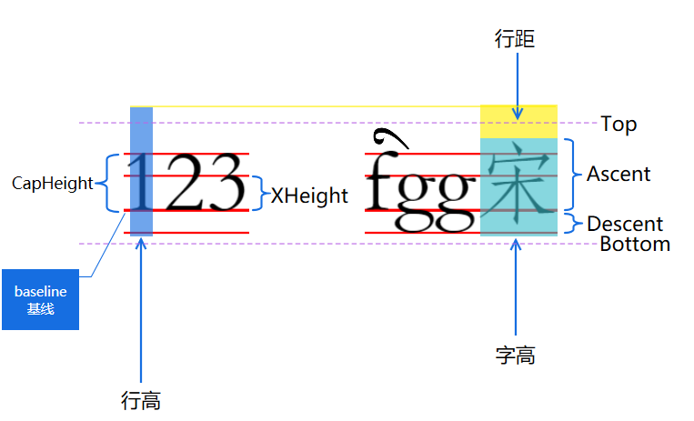
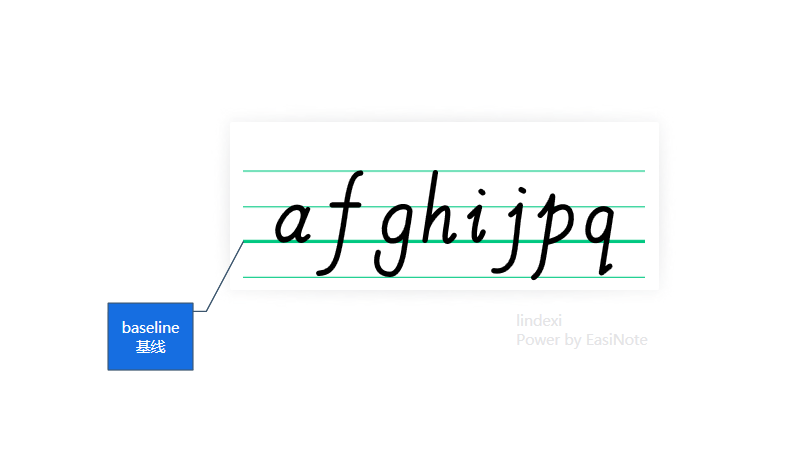
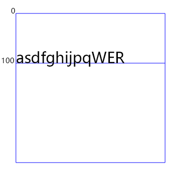

# dotnet 简单聊聊 Skia 里的 SKFontMetrics 的各项属性作用

本文将和大家简单聊聊 Skia 里的 SKFontMetrics 的各项属性作用和代表的含义

<!--more-->


<!-- CreateTime:2024/12/22 07:01:16 -->

<!-- 发布 -->
<!-- 博客 -->

熟悉文本排版的伙伴也许对于字体的 Metrics 概念不陌生，在 Skia 里面提供的 SKFontMetrics 就包含了从字体信息里面所获取的多项信息。只是略微有所不同的是 Skia 多加了对字体大小的加工，即 SKFontMetrics 获取到的属性已经是和 SKFont 的 Size 相关

如下图所示，是我绘制的示意图

<!--  -->


通过以上示意图再配合咱小学学到的四线三格知识，大概就可以明白各个属性的含义了。基线是排版里面一个重要的概念，基线（Baseline）是字母（拉丁字母、希腊字母、西里尔字母）放置的水平线。排版里面对齐基线非常重要

<!--  -->


如 [【SkiaSharp绘图04】SKPaint详解（二）FakeBoldText/FilterQuality/FontMetrics/FontSpacing/ImageFilter_skiasharp 字体-CSDN博客](https://blog.csdn.net/TyroneKing/article/details/139665911 ) 博客所述，各属性含义如下

- Top：表示字体基线（baseline）以上的最高点的坐标。对于大多数拉丁字母，这个值通常是负的，因为大多数字形的顶部在基线之上。
- Ascent：表示字体的上升（ascent）值，即从基线到字体最高点的距离。正值表示从基线向上的距离，通常包括字符顶部的额外空间。
- Descent：表示字体的下降（descent）值，即从基线向下到字体最低点的距离。正值表示从基线向下的距离，通常包括字符底部的额外空间。
- Bottom：表示字体基线以下的最低点的坐标。这个值通常是负的，因为大多数字形的底部在基线以下。
- Leading：表示字体的行间距（leading），即每行文字之间的额外空间。它是上一行 descent 到下一行 ascent 之间的间距。
- CapHeight：表示大写字母的高度，即大写字母的顶部到基线的距离。这个值对于调整字体大小和行高很有用。
- XHeight：表示小写字母的高度，即小写字母 x 的顶部到基线的距离。它通常用于调整字体大小和行高，以确保小写字母的清晰显示

由此可以看到和 DriectX 的 [DWRITE_FONT_METRICS](https://learn.microsoft.com/en-us/windows/win32/api/dwrite/ns-dwrite-dwrite_font_metrics) 结构体比较相似

在 Skia 里面，通过 DrawText 方法绘制文本时，传入的 X 和 Y 属于 baseline 基线的坐标，而不是文本渲染的左上角坐标。如以下的小测试代码所示

```csharp
            using var paint = new SKPaint();
            paint.Color = SKColors.Blue;
            paint.Style = SKPaintStyle.Stroke;
            paint.IsAntialias = true;

            var marginLeft = 35;
            var marginTop = 30;

            // 在基线绘制一条线，用于测试字体的基线
            var baseline = 100;
            skCanvas.DrawLine(marginLeft, baseline + marginTop, 300 + marginLeft, baseline + marginTop, paint);

            // 尝试绘制文本内容
            var text = "asdfghijpqWER";
            paint.TextSize = 30;
            skCanvas.DrawText(text, marginLeft, baseline + marginTop, paint);
```

此时可见文本是绘制在蓝色线上的，且是基线部分绘制对齐蓝线，运行之后的界面效果大概如下

<!--  -->


在 Skia 里面计算出 baseline 基线的方法是通过 `Ascent` 属性计算出来的，在 Skia 里面取 Ascent 的绝对值就是 baseline 基线的值

排版里面的字高就是再 `baseline + Descent` 的值，即 `|Ascent| + Descent` 的值。排版的字高不等同与渲染字高，渲染字高在不考虑合写字情况下，一般就是 Top 线到 Bottom 线之间的高度就是渲染字高度。正常咱是不关心渲染字高，最多只关心排版字高

行距部分会比较复杂，我自己建立的文本库就准备尝试模拟 WPF 的行距算法或 PPT 的行距算法，详细请看 [dotnet OpenXML 聊聊 PPT 文本行距行高计算公式](https://blog.lindexi.com/post/dotnet-OpenXML-%E8%81%8A%E8%81%8A-PPT-%E6%96%87%E6%9C%AC%E8%A1%8C%E8%B7%9D%E8%A1%8C%E9%AB%98%E8%AE%A1%E7%AE%97%E5%85%AC%E5%BC%8F.html )

本文代码放在 [github](https://github.com/lindexi/lindexi_gd/tree/9c035b4fc813169ead14567f8d40bdb9c382ec4c/SkiaSharp/RijojahijayNoherrerhu) 和 [gitee](https://gitee.com/lindexi/lindexi_gd/tree/9c035b4fc813169ead14567f8d40bdb9c382ec4c/SkiaSharp/RijojahijayNoherrerhu) 上，可以使用如下命令行拉取代码。我整个代码仓库比较庞大，使用以下命令行可以进行部分拉取，拉取速度比较快

先创建一个空文件夹，接着使用命令行 cd 命令进入此空文件夹，在命令行里面输入以下代码，即可获取到本文的代码

```
git init
git remote add origin https://gitee.com/lindexi/lindexi_gd.git
git pull origin 9c035b4fc813169ead14567f8d40bdb9c382ec4c
```

以上使用的是国内的 gitee 的源，如果 gitee 不能访问，请替换为 github 的源。请在命令行继续输入以下代码，将 gitee 源换成 github 源进行拉取代码。如果依然拉取不到代码，可以发邮件向我要代码

```
git remote remove origin
git remote add origin https://github.com/lindexi/lindexi_gd.git
git pull origin 9c035b4fc813169ead14567f8d40bdb9c382ec4c
```

获取代码之后，进入 SkiaSharp/RijojahijayNoherrerhu 文件夹，即可获取到源代码

更多技术博客，请参阅 [博客导航](https://blog.lindexi.com/post/%E5%8D%9A%E5%AE%A2%E5%AF%BC%E8%88%AA.html )

参考文档：

[【SkiaSharp绘图04】SKPaint详解（二）FakeBoldText/FilterQuality/FontMetrics/FontSpacing/ImageFilter_skiasharp 字体-CSDN博客](https://blog.csdn.net/TyroneKing/article/details/139665911 ) 

《冒号和比号的体式及其应用问题》 林穗芳 人民出版社 2008

[中文字体的FontMetrics解析-CSDN博客](https://blog.csdn.net/loveyou388i/article/details/115934795 )

[术语表 - FontForge 与字体设计 - UDN开源文档](https://doc.yonyoucloud.com/doc/wiki/project/fontforge-and-font-design/glossary.html )


<a rel="license" href="http://creativecommons.org/licenses/by-nc-sa/4.0/"></a><br />本作品采用<a rel="license" href="http://creativecommons.org/licenses/by-nc-sa/4.0/">知识共享署名-非商业性使用-相同方式共享 4.0 国际许可协议</a>进行许可。欢迎转载、使用、重新发布，但务必保留文章署名[林德熙](http://blog.csdn.net/lindexi_gd)(包含链接:http://blog.csdn.net/lindexi_gd )，不得用于商业目的，基于本文修改后的作品务必以相同的许可发布。如有任何疑问，请与我[联系](mailto:lindexi_gd@163.com)。