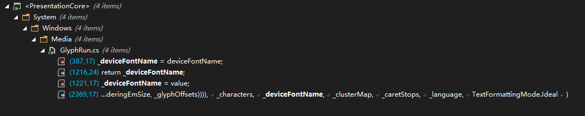

# dotnet 读 WPF 源代码笔记 GlyphRun 的 DeviceFontName 的功能是什么

在 WPF 里面的 GlyphRun 里，有一个令人迷惑的 DeviceFontName 属性，似乎给这个属性传入什么值，结果都不会有变更。通过阅读源代码，可以了解到，这是一个没什么用途的属性。本文将告诉大家这个属性的细节逻辑

<!--more-->


<!-- CreateTime:2023/1/11 17:03:35 -->
<!-- 博客 -->
<!-- 标签：WPF，渲染，WPF源代码 -->
<!-- 发布 -->

在上一篇博客 [WPF 简单聊聊如何使用 DrawGlyphRun 绘制文本](https://blog.lindexi.com/post/WPF-%E7%AE%80%E5%8D%95%E8%81%8A%E8%81%8A%E5%A6%82%E4%BD%95%E4%BD%BF%E7%94%A8-DrawGlyphRun-%E7%BB%98%E5%88%B6%E6%96%87%E6%9C%AC.html ) 里面就提到如何创建 GlyphRun 对象，在创建的时候发现设置的 DeviceFontName 参数，无论设置为什么值，结果都没有变化

官方文档对于 [GlyphRun.DeviceFontName](https://learn.microsoft.com/zh-cn/dotnet/api/system.windows.media.glyphrun.devicefontname) 的描述也是比较不清不楚的。中文文档里面是机器翻译，不如看看英文原文吧

> When a GlyphRun is rendered on a device that has built-in support for the named device font, the GlyphRun should be rendered using a device specific mechanism for selecting that font, and by sending Unicode code points rather than glyph indices. When rendering onto a device that does not include built-in support for the named device font, DeviceFontName should be ignored.

我本来以为这是一个能用来优化性能的属性，但是我似乎没有在网上找到大佬们讨论过这个属性。好在 WPF 是完全开源的，我就开始阅读源代码。通过阅读源代码发现这个属性其实没有什么作用，属性的定义代码如下

```csharp
    public class GlyphRun : DUCE.IResource, ISupportInitialize
    {
        /// <summary>
        /// Identifies a specific device font for which the GlyphRun has been optimized. When a GlyphRun is
        /// being rendered on a device that has built-in support for this named font, then the GlyphRun should be rendered using a
        /// possibly device specific mechanism for selecting that font, and by sending the Unicode codepoints rather than the
        /// glyph indices. When rendering onto a device that does not include built-in support for the named font,
        /// this property should be ignored.
        /// </summary>
        public string DeviceFontName
        {
            get
            {
                CheckInitialized();
                return _deviceFontName;
            }
            set
            {
                CheckInitializing(); // This can only be set during initialization.
                _deviceFontName = value;
            }
        }

        private string              _deviceFontName;

        ...// 忽略其他代码
    }
```

无论是 `_deviceFontName` 还是 `DeviceFontName` 属性，唯一的作用就是给自己，也就是给 `_deviceFontName` 或 `DeviceFontName` 提供赋值。完全就是自己玩自己的代码。看看 ReSharper 帮我找到的引用关系图

<!--  -->


至于 `DeviceFontName` 属性，完全只有一个逻辑在使用，那就是用来创建 GlyphRun 副本时作为参数传入，如下面代码

```csharp
namespace System.Windows.Xps.Serialization
{
    internal class VisualSerializer: IMetroDrawingContext
    {
        private static GlyphRun FilterXmlInvalidChar(GlyphRun glyphRun)
        {
            ...// 忽略其他代码

                GlyphRun filtered = new GlyphRun(
                    glyphRun.GlyphTypeface,
                    glyphRun.BidiLevel,
                    glyphRun.IsSideways,
                    glyphRun.FontRenderingEmSize,
                    glyphRun.PixelsPerDip,
                    glyphRun.GlyphIndices,
                    glyphRun.BaselineOrigin,
                    glyphRun.AdvanceWidths,
                    glyphRun.GlyphOffsets,
                    filteredCharacters,
                    glyphRun.DeviceFontName,
                    glyphRun.ClusterMap,
                    glyphRun.CaretStops,
                    glyphRun.Language
                    );

                return filtered;
        }
        ...// 忽略其他代码
    }
}
```

可以看到，这是一个完全没有实际作用的属性，这也就是为什么传入任何的值，都不会影响结果的原因

我猜测这是在远古的 WPF 存在多个代码版本时，在某些代码版本，这个属性是有实际实现逻辑

但是我好奇的是，在 DX 上是没有任何可以和这个属性对应的，如果有优化，那是如何实现的，还请有了解的大佬教教我

当前的 WPF 在 [https://github.com/dotnet/wpf](https://github.com/dotnet/wpf) 完全开源，使用友好的 MIT 协议，意味着允许任何人任何组织和企业任意处置，包括使用，复制，修改，合并，发表，分发，再授权，或者销售。在仓库里面包含了完全的构建逻辑，只需要本地的网络足够好（因为需要下载一堆构建工具），即可进行本地构建


<a rel="license" href="http://creativecommons.org/licenses/by-nc-sa/4.0/"></a><br />本作品采用<a rel="license" href="http://creativecommons.org/licenses/by-nc-sa/4.0/">知识共享署名-非商业性使用-相同方式共享 4.0 国际许可协议</a>进行许可。欢迎转载、使用、重新发布，但务必保留文章署名[林德熙](http://blog.csdn.net/lindexi_gd)(包含链接:http://blog.csdn.net/lindexi_gd )，不得用于商业目的，基于本文修改后的作品务必以相同的许可发布。如有任何疑问，请与我[联系](mailto:lindexi_gd@163.com)。