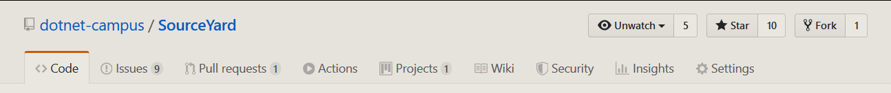
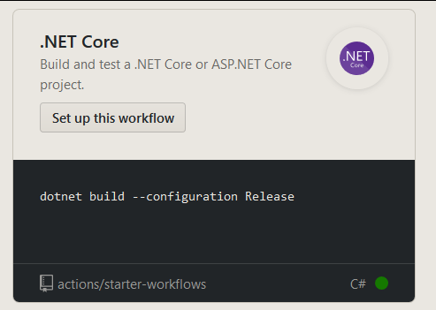
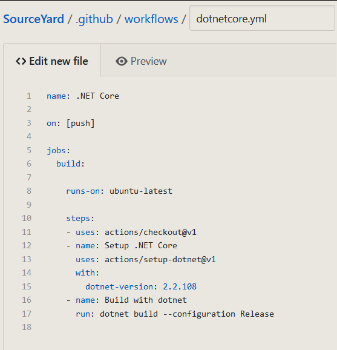

# dotnet 部署 github 的 Action 进行持续集成

大概只需要 3 分钟就可以在 github 上通过 Action 部署持续集成，本文以 SourceYard 作为例子告诉大家如何配置

<!--more-->

<!-- 发布 -->

<!-- 标签：Github，GithubAction -->

其实配置非常简单，不需要了解任何语法就可以开始写

进入 github 对应的项目，可以看到 Action 选项

<!--  -->

这个项目是支持在项目文件夹使用 `dotnet build` 进行编译，因为将 sln 文件放在项目文件夹，同时项目使用 dotnet core 写的

<!--  -->

点击 Action 会自动判断这是一个 dotnet 程序，点击创建 Setup this workflow 就可以

点击之后进入这个页面，这里有个小知识是 github 将会读取 `.github/workflows/*.yml` 进行自动集成，所以只需要将文件放在这个文件夹就可以，文件名只需要后缀是 yml 文件名可以随意写

<!--  -->

此时需要关注的内容很少，甚至这个项目能在 ubuntu 编译的，点击右上角的 start commit 按钮就可以了

<!--  -->

此时的持续集成将会在每次 push 触发，刚好现在提交了一个 dotnetcore.yml 文件，就可以在 Action 看到自动编译

<!--  -->

大概这样就完成了部署了

等等，就这么简单？没错，就这么简单

但是我想要在 Windows 下编译怎么办？没问题，下面就是更详细的配置了

详细的配置请看官方文档 [Automating your workflow](https://help.github.com/cn/actions/automating-your-workflow-with-github-actions/getting-started-with-github-actions )

 本作品采用<a rel="license" href="http://creativecommons.org/licenses/by-nc-sa/4.0/">知识共享署名-非商业性使用-相同方式共享 4.0 国际许可协议</a>进行许可。欢迎转载、使用、重新发布，但务必保留文章署名[林德熙](http://blog.csdn.net/lindexi_gd)(包含链接:http://blog.csdn.net/lindexi_gd )，不得用于商业目的，基于本文修改后的作品务必以相同的许可发布。如有任何疑问，请与我[联系](mailto:lindexi_gd@163.com)。