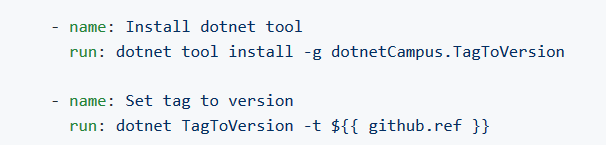
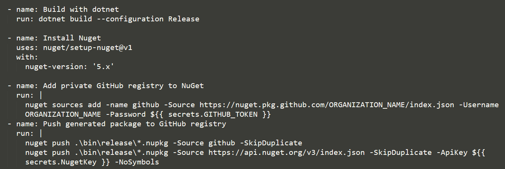

# dotnet 配合 GitHub 的 Action 做自动推 Tag 时打包 NuGet 包

被微软收购的 GitHub 越来越好用，拥有大量免费的工具资源和构建服务器资源，再加上私有项目的无限制使用，我有大量的项目都在向 GitHub 迁移。通过 GitHub 的 Action 的自动构建，可以用上微软土豪的服务器资源，进行自动化测试和构建。对于 CBB 来说，发布就是打出 NuGet 包然后上传到内部 NuGet 服务器。此时遇到的问题是，如何在 GitHub 上执行打包，打包的时候如何指定 NuGet 包的版本号。因为 CBB 的特殊性，我要求每个 NuGet 正式发布的包都应该有一个对应的 Tag 号，这样将 NuGet 库安装到项目里面，之后发现问题了还能找到对应版本的代码

<!--more-->


<!-- CreateTime:5/23/2020 2:32:17 PM -->

<!-- 发布 -->

在阅读本文之前，期望小伙伴能了解如何在 dotnet 下使用 GitHub 的 Action 进行自动构建，请看 [dotnet 部署 github 的 Action 进行持续集成](https://blog.lindexi.com/post/dotnet-%E9%83%A8%E7%BD%B2-github-%E7%9A%84-Action-%E8%BF%9B%E8%A1%8C%E6%8C%81%E7%BB%AD%E9%9B%86%E6%88%90.html ) 而发布 NuGet 包的方法请看 [dotnet 配置 github 自动打包上传 nuget 文件](https://blog.lindexi.com/post/dotnet-%E9%85%8D%E7%BD%AE-github-%E8%87%AA%E5%8A%A8%E6%89%93%E5%8C%85%E4%B8%8A%E4%BC%A0-nuget-%E6%96%87%E4%BB%B6.html)

本文将在此基础上实现本地推送一个 Tag 到 GitHub 服务器上，就会触发 GitHub 的 Action 的自动构建，自动构建的 NuGet 包的版本就是 Tag 版本。为什么需要在推 Tag 打包，请看 [dotnet CBB 为什么决定推送 Tag 才能打包](https://blog.lindexi.com/post/dotnet-CBB-%E4%B8%BA%E4%BB%80%E4%B9%88%E5%86%B3%E5%AE%9A%E6%8E%A8%E9%80%81-Tag-%E6%89%8D%E8%83%BD%E6%89%93%E5%8C%85.html )

本文将用到一个 dotnet tool 工具，在 dotnet 里面可以通过 dotnet tool 轻松分发和安装 dotnet tool 工具。更多关于 dotnet tool 请看 [dotnet 用 NuGet 将自己的工具作为 dotnet tool 分发](https://blog.lindexi.com/post/dotnet-%E7%94%A8-NuGet-%E5%B0%86%E8%87%AA%E5%B7%B1%E7%9A%84%E5%B7%A5%E5%85%B7%E4%BD%9C%E4%B8%BA-dotnet-tool-%E5%88%86%E5%8F%91.html )

之所以用 dotnet tool 工具，是因为利用 dotnet tool 工具可以明确使用到的工具，通过现有的工具可以简化自动构建的脚本的代码

本文用到的 dotnet tool 工具是 [dotnetCampus.TagToVersion](https://github.com/dotnet-campus/dotnetCampus.TagToVersion ) 工具

这个工具就是本文的核心，这个工具将 Tag 转换为 Version 版本号写入到版本号文件里面

在使用这个工具的时候有一个前提是在项目的 Build 文件夹存放一个 Version.prop 文件，此文件夹是版本号文件。这个组织方式在当前大量官方的 dotnet 开源项目，如 [WPF](https://github.com/dotnet/wpf/blob/97b620ec95457d4d9ef95ea89829028f48dff354/eng/Versions.props) 开源项目都是这样使用，只是存放的内容和路径不太相同

在自动化构建时，将通过 [dotnetCampus.TagToVersion](https://github.com/dotnet-campus/dotnetCampus.TagToVersion ) 工具将版本号写入到 Version.prop 版本号文件

在开始之前，请在 `.github\workflows` 文件夹新建一个 yml 文件，所有放在这个文件夹的 yml 文件都会被 GitHub 的 Action 作为配置文件，本文新建的 yml 文件是 `push tag and pack nuget.yml` 文件，在这个文件里面先写触发条件是 tag 推送

```yaml
on:
  push:
    tags:
    - '*' 
```

然后通过 dotnet tool install 安装工具，然后使用工具

```yaml
    - name: Install dotnet tool
      run: dotnet tool install -g dotnetCampus.TagToVersion

    - name: Set tag to version  
      run: dotnet TagToVersion -t ${ { github.ref } }
```

上面代码是通过 `${ { github.ref } }` 传入推送的版本，请将花括号之间的空格去掉，详细配置请看  [dotnetCampus.TagToVersion](https://github.com/dotnet-campus/dotnetCampus.TagToVersion ) 工具的仓库

<!--  -->


接下来就是根据项目的构建代码和上传 NuGet 库

```yaml
    - name: Build with dotnet
      run: dotnet build --configuration Release

    - name: Install Nuget
      uses: nuget/setup-nuget@v1
      with:        
        nuget-version: '5.x'

    - name: Add private GitHub registry to NuGet
      run: |
        nuget sources add -name github -Source https://nuget.pkg.github.com/ORGANIZATION_NAME/index.json -Username ORGANIZATION_NAME -Password ${ { secrets.GITHUB_TOKEN } }
    - name: Push generated package to GitHub registry
      run: |
        nuget push .\bin\release\*.nupkg -Source github -SkipDuplicate
        nuget push .\bin\release\*.nupkg -Source https://api.nuget.org/v3/index.json -SkipDuplicate -ApiKey ${ { secrets.NugetKey } } -NoSymbols 
```

注意上面的代码花括号的中间是不能带空格的，只是因为博客生成平台不支持连续两个花括号

<!--  -->


而为了让项目的打包能用到 Build 文件夹的版本号文件还需要修改这个项目

在 `.git` 文件夹所在的文件夹放一个 Directory.Build.props 文件

什么是 Directory.Build.props 文件请看 [Roslyn 使用 Directory.Build.props 文件定义编译](https://blog.lindexi.com/post/Roslyn-%E4%BD%BF%E7%94%A8-Directory.Build.props-%E6%96%87%E4%BB%B6%E5%AE%9A%E4%B9%89%E7%BC%96%E8%AF%91.html )

这个文件的大概作用就是定义此文件夹，以及此文件夹的子文件夹的编译步骤。在 Directory.Build.props 文件里面制定 Version.prop 文件的路径

```xml
<Project>
  <Import Project="build\Version.props" />
  <PropertyGroup>
    <PackageOutputPath>$(MSBuildThisFileDirectory)bin\$(Configuration)</PackageOutputPath>
    <Authors>dotnet-campus</Authors>
    <Company>dotnet-campus</Company>
    <LangVersion>latest</LangVersion>
    <PackageRequireLicenseAcceptance>false</PackageRequireLicenseAcceptance>
    <Description>描述信息</Description>
    <Copyright>Copyright (c) 2020 dotnet-campus</Copyright>
    <PackageProjectUrl>https://github.com/dotnet-campus/dotnetCampus.SourceYard</PackageProjectUrl>
    <RepositoryUrl>https://github.com/dotnet-campus/dotnetCampus.SourceYard.git</RepositoryUrl>
    <RepositoryType>git</RepositoryType>
    <PackageTags>source;dotnet;nuget;msbuild</PackageTags>
    <PackageLicenseExpression>MIT</PackageLicenseExpression>
  </PropertyGroup>
</Project>
```

请根据你的实际项目添加更改上面代码

核心的代码是设置 Version.props 的路径，放在build文件夹里面

在 Version.props 文件添加下面代码

```xml
<Project>
  <PropertyGroup>
    <Version>1.0.0</Version>
  </PropertyGroup>
</Project>
```

此时的版本号可以自由填写，这样就能解决本地打 NuGet 包指定版本号的问题

对于其他开发者，只有看到这个 Version.props 文件，同时这个文件里面没有其他需要学习的知识，只是知道在这里更改版本号就可以。这个方式对于配置管理员来说很重要，甚至能决定这项技术能否推进。对于大部分开发者是不需要关心，也不愿意了解这部分技术，更多的是想要提升开发的效率，而太多的杂项的配置知识将会降低开发的效率

我用一个例子说明上面的问题，我在 csproj 里面放下面这段代码。然后我告诉你，每次新建文件的时候都需要向 NafojaneKakoweebi 添加一个 o 不然新建的文件没有作用。假设你在我的团队里面，你要不要打我

```xml
<NafojaneKakoweebi>WhaljeahalqaboBembibocaooo</NafojaneKakoweebi>
```

当然，这个例子大家看看就好，虽然我真的写了这样的逻辑。通过仔细看还是能了解下面代码的含义，但是对于开发者的效率降低也确实存在

```xml
  <PropertyGroup>
    <Build>$([System.DateTime]::op_Subtraction($([System.DateTime]::get_Now().get_Date()),$([System.DateTime]::new(2000,1,1))).get_TotalDays())</Build>
    <Revision>$([MSBuild]::Divide($([System.DateTime]::get_Now().get_TimeOfDay().get_TotalSeconds()), 2).ToString('F0'))</Revision>
    <Version>1.0.0.$(Revision)</Version>
  </PropertyGroup>
```

通过本文的方法，可以让开发者在开发的时候不会碰到配置管理的代码，开发者只是看到 Version.props 文件，这个文件有版本号。而开发者最多也就是改版本号做本地打包

此时的项目如果在 csproj 文件没有指定版本号，那么就将会读取版本号文件的版本。而这个版本会在构建的时候被工具修改为推送的版本号，也就是这个项目构建的输出文件的版本号就是推送的版本号，通过这个方式就可以完成打包

可以看到现在有几个项目都在使用这个方式进行打包，如

- [dotnet-campus/dotnetCampus.TagToVersion: The dotnetCampus.TagToVersion that can helps us write tag names into version files is a dotnet tool.](https://github.com/dotnet-campus/dotnetCampus.TagToVersion )
- [dotnet-campus/SourceYard: Add a NuGet package only for dll reference? By using dotnetCampus.SourceYard, you can pack a NuGet package with source code. By installing the new source code package, all source codes behaviors just like it is in your project.](https://github.com/dotnet-campus/SourceYard )

用推 Tag 打包的好处是解决回滚代码的时候，需要用到某个 NuGet 包进行调试，可以找到对应版本的代码。同时解决了手动叫开发者打 NuGet 包的时候需要记得添加 Tag 号

在调试对应版本的 NuGet 的代码的时候，我推荐使用以下方法

- [Roslyn 让 VisualStudio 急速调试底层库方法](https://blog.lindexi.com/post/Roslyn-%E8%AE%A9-VisualStudio-%E6%80%A5%E9%80%9F%E8%B0%83%E8%AF%95%E5%BA%95%E5%B1%82%E5%BA%93%E6%96%B9%E6%B3%95.html )
- [VS DLL引用替换插件](https://github.com/dotnet-campus/DllReferencePathChanger )

当前 Gitlab 上也可以使用此方法，请看 [dotnet 配合 Gitlab 做自动推 Tag 时打包 NuGet 包](https://blog.lindexi.com/post/dotnet-%E9%85%8D%E5%90%88-Gitlab-%E5%81%9A%E8%87%AA%E5%8A%A8%E6%8E%A8-Tag-%E6%97%B6%E6%89%93%E5%8C%85-NuGet-%E5%8C%85.html)

另外我开源了一个构建工具集，请看 [dotnetcampus.DotNETBuildSDK](https://github.com/dotnet-campus/dotnetcampus.DotNETBuildSDK )

本文的方法依然适用构建应用，如构建 WPF 应用，或打包为 UWP 应用。关于 WPF 打包为 UWP 的 GitHub 的 Action 方法请看 [GitHub Action 新上线 WPF .NET Core 自动构建模板](https://blog.lindexi.com/post/GitHub-Action-%E6%96%B0%E4%B8%8A%E7%BA%BF-WPF-.NET-Core-%E8%87%AA%E5%8A%A8%E6%9E%84%E5%BB%BA%E6%A8%A1%E6%9D%BF.html)


<a rel="license" href="http://creativecommons.org/licenses/by-nc-sa/4.0/"></a><br />本作品采用<a rel="license" href="http://creativecommons.org/licenses/by-nc-sa/4.0/">知识共享署名-非商业性使用-相同方式共享 4.0 国际许可协议</a>进行许可。欢迎转载、使用、重新发布，但务必保留文章署名[林德熙](http://blog.csdn.net/lindexi_gd)(包含链接:http://blog.csdn.net/lindexi_gd )，不得用于商业目的，基于本文修改后的作品务必以相同的许可发布。如有任何疑问，请与我[联系](mailto:lindexi_gd@163.com)。