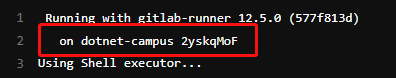
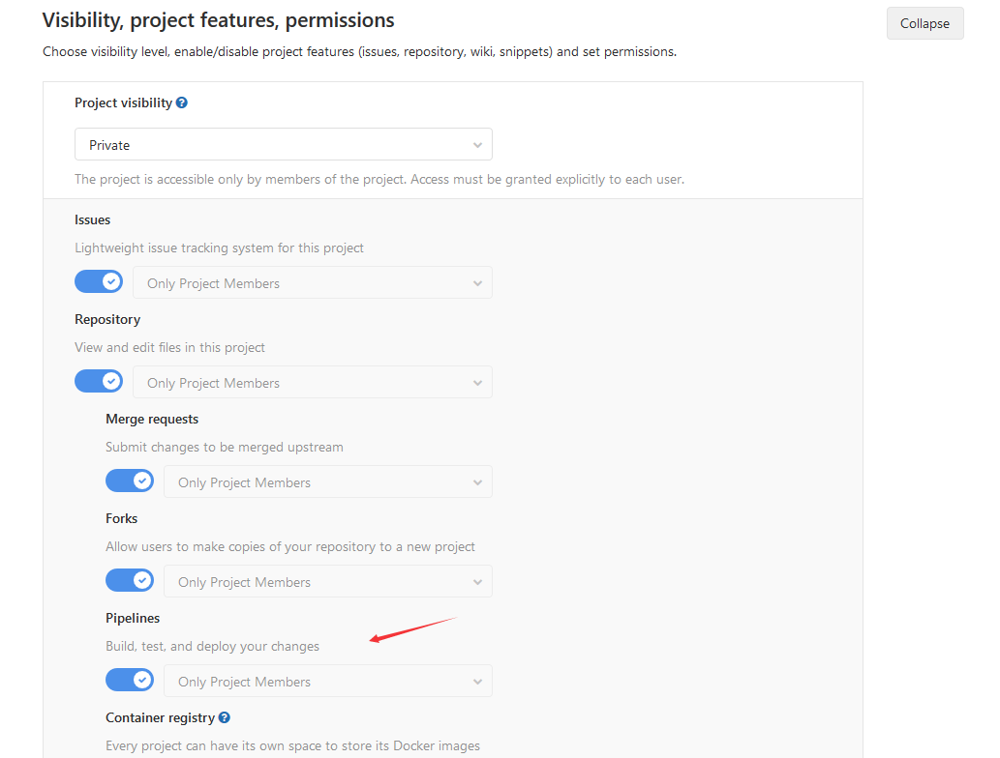
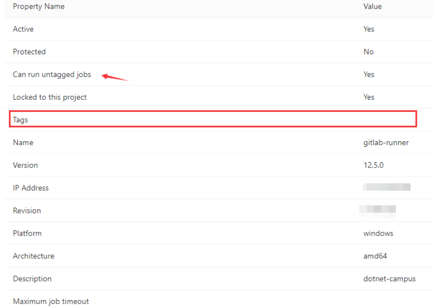
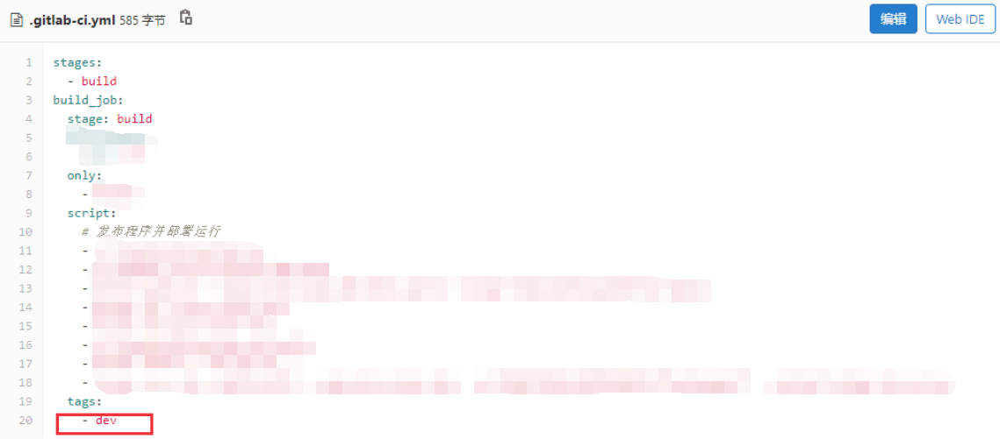

# dotnet 配置 Gitlab 的 CI 找不到 Runner 或找错的可能原因

使用 Gitlab 的 CI 但是任务没有执行，提示找不到 Runner 或者找错了 Runner 服务器，请看本文，从上到下看，是否有坑

<!--more-->

<!-- 发布 -->

## 公共Runner冲突

默认会使用全局共享的 Shared Runners 服务器，此时定位方法是通过某次 CI 运行的时候的运行服务器名字，确定是否自己的 Runner 服务器

<!--  -->

如上图采用的是 dotnet-campus 的服务器

如需要禁用全局共享的 Runner 服务器，打开仓库的 CI 设置页面，禁用 Shared Runners 就可以

<!--  -->

## 没有开启 Piplines 权限

打开仓库设置的 General 配置

<!--  -->

确定下面权限打开

<!--  -->

## 配置的Tag和Runner的Tag不匹配

在GitLab的Runner可以添加 Tag 配置，表示这个 Runner 属于哪一类，请不要将 Tag 概念和 Git Tag 弄混

如果在 Runner 设置了特殊的 Tag 同时要求 ci.yml 文件的配置使用相同的 Tag 才能执行，这个 Tag 的作用大概是：我有一组 Linux 的服务器和一组 win 服务器，我如何指定当前任务在哪个类型的服务器上运行？就是通过 Tag 指定。默认的 Runner 没有指定 Tag 时，可以让所有任务执行，如下图

<!--  -->

而如下图的 Runner 指定了 Tag 是 dev 也就是要求在配置文件指定在 dev 的服务器上运行

<!--  -->

<!--  -->

 本作品采用<a rel="license" href="http://creativecommons.org/licenses/by-nc-sa/4.0/">知识共享署名-非商业性使用-相同方式共享 4.0 国际许可协议</a>进行许可。欢迎转载、使用、重新发布，但务必保留文章署名[林德熙](http://blog.csdn.net/lindexi_gd)(包含链接:http://blog.csdn.net/lindexi_gd )，不得用于商业目的，基于本文修改后的作品务必以相同的许可发布。如有任何疑问，请与我[联系](mailto:lindexi_gd@163.com)。