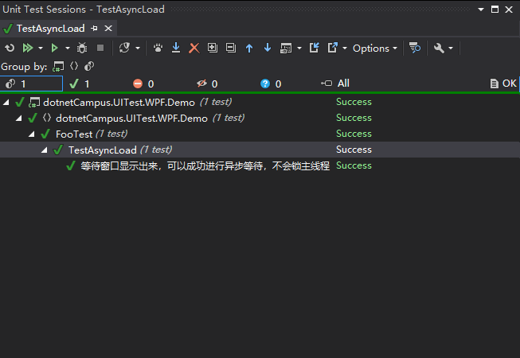

# dotnetCampus.UITest.WPF 一个支持中文用例的界面单元测试框架

本文来安利大家一个支持使用中文做用例名的 WPF 界面 UI 单元测试框架

<!--more-->


<!-- CreateTime:2022/1/6 20:12:56 -->

<!-- 博客 -->
<!-- 发布 -->

## 卖点

有没有觉得命名太难？有没有觉得单元测试的命名更难？没错，这是一个业界的大问题。很多团队都会因为单元测试的用例函数命名太难而让团队成员不喜欢写单元测试，或者说代码审查的时候觉得对方写的单元测试用例名有语法错误，又或者是改到单元测试时发现函数命名因为自己英文能力有限而看不懂

本文安利给大家的 dotnetCampus.UITest.WPF 单元测试框架将用来解决此问题。使用它，你可以用契约的方式来描述一个又一个的测试用例，这些测试用例将在单元测试运行结束后显示到单元测试控制台或 GUI 窗口中。全过程你完全不需要为任何单元测试方法进行命名——你关注的，是测试用例本身

现在，你的单元测试可以这样写了：

```csharp
    [TestClass]
    public class DemoTest
    {
        [UIContractTestCase]
        public void TestAsyncLoad()
        {
            "等待窗口显示出来，可以成功进行异步等待，不会锁主线程".Test(async () =>
            {
                var mainWindow = new MainWindow();
                var taskCompletionSource = new TaskCompletionSource();
                mainWindow.Loaded += (sender, args) => taskCompletionSource.SetResult();
                await mainWindow.Dispatcher.InvokeAsync(mainWindow.Show);
                await taskCompletionSource.Task;
            });
        }
    }
```

于是，运行单元测试将看到这样的结果视图：

<!--  -->


本 UI 单元测试框架，仅仅提供的是让你可以使用 CUint(Chinese Unit Test) 风格编写 UI 测试代码，所有的放在 Test 内的代码将会在 UI 线程执行。本 UI 单元测试框架不提供面向测试的辅助类型的方法，例如模拟鼠标点击等功能，如需这些功能，还请使用第三方的库进行辅助

## 使用方法

此单元测试框架是基于 MIT 最友好开源协议，在 GitHub 上完全开源的，请看 [https://github.com/dotnet-campus/CUnit/](https://github.com/dotnet-campus/CUnit/)

此单元测试框架是 MSTest v2 的一个扩展，在使用时，你需要创建一个 MSTest 的单元测试项目，在此单元测试项目里面额外安装 [dotnetCampus.UITest.WPF](https://www.nuget.org/packages/dotnetCampus.UITest.WPF) 库。对于在使用新 SDK 风格的 csproj 文件，可以编辑加入如下代码进行安装库

```xml
<PackageReference Include="dotnetCampus.UITest.WPF" Version="2.2.0" />
```

如果你的单元测试项目里面包含了 WPF 的 App.xaml 文件，为了修复构建单元测试时有多个入口 Main 函数问题，你需要额外加入以下代码用于修复此问题

```xml
  <ItemGroup>
    <ApplicationDefinition Remove="App.xaml" />
  </ItemGroup>
  <ItemGroup>
    <Page Include="App.xaml">
      <SubType>Designer</SubType>
      <Generator>MSBuild:Compile</Generator>
    </Page>
  </ItemGroup>
```

以上对 App.xaml 的修复非必须，只有你的单元测试项目里面包含了 App.xaml 才有此需求。此问题不是 [dotnetCampus.UITest.WPF](https://www.nuget.org/packages/dotnetCampus.UITest.WPF) 库引入，而是通用的单元测试就存在的问题。对于大部分的 UI 单元测试项目来说，都不会也不应该包含 App.xaml 文件，除非这是针对 WPF 的 UI 类库的单元测试。对于应用本身的 UI 单元测试来说，都应该传入的是应用的 App 类

更改完成之后的 csproj 的内容大概如下

```xml
<Project Sdk="Microsoft.NET.Sdk">

  <PropertyGroup>
    <OutputType>exe</OutputType>
    <DisableWinExeOutputInference>true</DisableWinExeOutputInference>
    <TargetFramework>net6.0-windows</TargetFramework>
    <Nullable>enable</Nullable>
    <UseWPF>true</UseWPF>
    <IsPackable>false</IsPackable>
  </PropertyGroup>

  <ItemGroup>
    <ApplicationDefinition Remove="App.xaml" />
  </ItemGroup>
  <ItemGroup>
    <Page Include="App.xaml">
      <SubType>Designer</SubType>
      <Generator>MSBuild:Compile</Generator>
    </Page>
  </ItemGroup>

  <ItemGroup>
    <PackageReference Include="Moq" Version="4.16.1" />
    <PackageReference Include="Microsoft.NET.Test.Sdk" Version="17.0.0" />
    <PackageReference Include="MSTest.TestAdapter" Version="2.2.8" />
    <PackageReference Include="MSTest.TestFramework" Version="2.2.8" />
    <PackageReference Include="coverlet.collector" Version="3.1.0" />
    <PackageReference Include="dotnetCampus.UITest.WPF" Version="2.2.0" />
  </ItemGroup>

</Project>
```

在开始编写实际的 UI 单元测试之前，需要初始化 UI 测试引擎，这是因为 WPF 需要给定指定的 App 入口函数，用于寻找程序集资源，代码如下

```csharp
    [TestClass]
    public class FooTest
    {
        [AssemblyInitialize]
        public static void InitializeApplication(TestContext testContext)
        {
            UITestManager.InitializeApplication(() => new App());
        }
    }
```

在 WPF 里面，有资源程序集等概念，通过以上代码初始化引擎即可自动完成设置。在一个公开的标记了 TestClassAttribute 特性的测试类型里面，存放一个静态的，标记了 AssemblyInitializeAttribute 特性的带有 TestContext 参数的方法，将会在开始单元测试之前被执行。在此函数里面，需要调用 UITestManager 初始化引擎，将自己测试的项目里的 WPF 应用入口的 App 类传入

接下来即可开始编写业务上的单元测试代码，如以下例子

```csharp
    [TestClass]
    public class FooTest
    {
        [AssemblyInitialize]
        public static void InitializeApplication(TestContext testContext)
        {
            UITestManager.InitializeApplication(() => new App());
        }

        [UIContractTestCase]
        public void TestAsyncLoad()
        {
            "等待窗口显示出来，可以成功进行异步等待，不会锁主线程".Test(async () =>
            {
                var mainWindow = new MainWindow();
                var taskCompletionSource = new TaskCompletionSource();
                mainWindow.Loaded += (sender, args) => taskCompletionSource.SetResult();
                await mainWindow.Dispatcher.InvokeAsync(mainWindow.Show);
                await taskCompletionSource.Task;
            });
        }

        [UIContractTestCase]
        public void TestMainWindow()
        {
            "打开 MainWindow 窗口，可以成功打开窗口".Test(() =>
            {
                Assert.AreEqual(Application.Current.Dispatcher, Dispatcher.CurrentDispatcher);
                var mainWindow = new MainWindow();
                bool isMainWindowLoaded = false;
                mainWindow.Loaded += (sender, args) => isMainWindowLoaded = true;
                mainWindow.Show();
                Assert.AreEqual(true, isMainWindowLoaded);
            });

            "关闭 MainWindow 窗口，可以成功关闭窗口和收到窗口关闭事件".Test(() =>
            {
                var window = Application.Current.MainWindow;
                Assert.AreEqual(true, window is MainWindow);
                bool isMainWindowClosed = false;
                Assert.IsNotNull(window);
                window.Closed += (sender, args) => isMainWindowClosed = true;
                window.Close();
                Assert.AreEqual(true, isMainWindowClosed);
            });
        }
    }
```

每个进入的函数都是在 UI 线程执行的，可以放心调用任何的 UI 资源

## 代码

本文所有代码放在[github](https://github.com/lindexi/lindexi_gd/tree/5d83d18e3f369c36759e1b3d1b6afc1a1c3cac30/dotnetCampus.UITest.WPF.Demo) 和 [gitee](https://gitee.com/lindexi/lindexi_gd/tree/5d83d18e3f369c36759e1b3d1b6afc1a1c3cac30/dotnetCampus.UITest.WPF.Demo) 欢迎访问

可以通过如下方式获取本文的源代码，先创建一个空文件夹，接着使用命令行 cd 命令进入此空文件夹，在命令行里面输入以下代码，即可获取到本文的代码

```
git init
git remote add origin https://gitee.com/lindexi/lindexi_gd.git
git pull origin 5d83d18e3f369c36759e1b3d1b6afc1a1c3cac30
```

以上使用的是 gitee 的源，如果 gitee 不能访问，请替换为 github 的源

```
git remote remove origin
git remote add origin https://github.com/lindexi/lindexi_gd.git
```

获取代码之后，进入 dotnetCampus.UITest.WPF.Demo 文件夹


<a rel="license" href="http://creativecommons.org/licenses/by-nc-sa/4.0/"></a><br />本作品采用<a rel="license" href="http://creativecommons.org/licenses/by-nc-sa/4.0/">知识共享署名-非商业性使用-相同方式共享 4.0 国际许可协议</a>进行许可。欢迎转载、使用、重新发布，但务必保留文章署名[林德熙](http://blog.csdn.net/lindexi_gd)(包含链接:http://blog.csdn.net/lindexi_gd )，不得用于商业目的，基于本文修改后的作品务必以相同的许可发布。如有任何疑问，请与我[联系](mailto:lindexi_gd@163.com)。