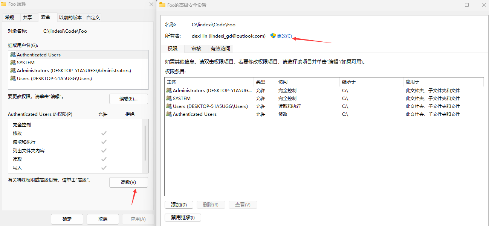

# git fatal detected dubious ownership in repository 的解决方法

我换了一台电脑，将旧电脑的硬盘换到新电脑上；我装了双系统，切换到另一个系统时；我发现了 git 代码仓库无法执行 git 命令，不断报错 fatal: detected dubious ownership in repository at 'C:\lindexi\Code\Foo' is owned by: 'S-1-5-21-469934170-xxx-xxx-1001' but the current user is: 'S-1-5-21-469994170-aaa-bbb-1001' 失败。本文记录此问题的解决方法

<!--more-->
<!-- CreateTime:2023/2/28 10:06:02 -->

<!-- 发布 -->
<!-- 博客 -->

解决方法：

1.如 git 的命令行提示，输入 `git config --global --add safe.directory 'git提示的那个文件夹路径'` 命令

输入完成之后，先试试 `git branch` 命令，如果依然不可用，报错和之前一样，那就需要接下来的一步

2.更改文件夹的所有者。更改方法如下

- 右击文件夹，点击属性
- 进入安全选项卡，点击高级
- 进入高级，修改所有者为当前登录账号

<!--  -->

更改所有者之后，再次试试 git 命令，预计此时就可以使用