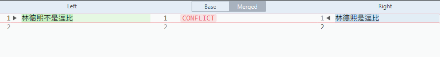

# git 通过 SublimeMerge 处理冲突

在使用 Git 的时候，如果是多个小伙伴开发，那么如果同时修改一个文件将出现冲突。也就是在自动合并的时候不知道使用哪个代码才对，此时就需要合并工具的协助。我找了很久发现 SublimeMerge 是界面最好看的，同时快捷键和 SublimeText 一样多也好用的工具

<!--more-->
<!-- CreateTime:2019/8/31 16:55:59 -->


先通过[官网](https://www.sublimemerge.com/)下载安装 SublimeMerge 记住安装的路径

如我的 [SublimeMerge](https://www.sublimemerge.com/) 安装路径是 `C:\Program Files\Sublime Merge\` 需要在后续将这个路径添加到环境变量

右击计算机，点击属性，点击高级，点击环境变量，添加环境变量

在环境变量的 Path 里面添加一项，可以添加在用户环境变量里面，在这一项输入刚才记的安装路径

通过运行输入 cmd 打开命令行，此时输入 smerge 就可以打开工具了，如果没有成功打开，那么就是上面的配置没有写对

接下来是配置 Git 的合并工具，请依次输入下面的命令

```csharp
git config mergetool.smerge.cmd 'smerge mergetool "$BASE" "$LOCAL" "$REMOTE" -o "$MERGED"'
git config mergetool.smerge.trustExitCode true
git config merge.tool smerge
```

尝试找到一个冲突的项目，如我自己创建了一个项目，在发现自动合并提示下面代码，就可以通过工具合并

```csharp
lindexi@DESKTOP-KA2CD6M MINGW64 /c/lindexi (master)
$ git merge 1
Auto-merging 1.txt
CONFLICT (content): Merge conflict in 1.txt
Automatic merge failed; fix conflicts and then commit the result.

lindexi@DESKTOP-KA2CD6M MINGW64 /c/lindexi (master|MERGING)

```

此时输入 `git mergetool` 就可以启动合并工具

如果配置对了那么会看到下面的界面，这个界面一看就知道如何使用

<!--  -->


在两侧分别代表的是两个分支的代码，中间的部分表示合并出来的代码，通过点击 Next Confict 可以找到下一个冲突，可以看到在冲突的代码里面的左侧都有三角形，此时点击三角形就是应用这部分代码，可以看到中间的代码修改

<!--  -->


修改完成合并点击右上角的保存按钮，这样就完成了合并

在命令行输入 `git merge --continue` 就可以提交合并的 commit 了

在弹出的界面里面使用的是 vim 的界面，在这个界面一般都是输入 esc 然后输入 `:wq` 就可以

在 vim 里面按下 esc 表示输入命令，在输入 `:` 表示后面的命令，输入 `w` 表示写入保存，输入`q`是退出，于是连续的命令就是保存同时退出

这样就完成了合并

<a rel="license" href="http://creativecommons.org/licenses/by-nc-sa/4.0/"></a><br />本作品采用<a rel="license" href="http://creativecommons.org/licenses/by-nc-sa/4.0/">知识共享署名-非商业性使用-相同方式共享 4.0 国际许可协议</a>进行许可。欢迎转载、使用、重新发布，但务必保留文章署名[林德熙](http://blog.csdn.net/lindexi_gd)(包含链接:http://blog.csdn.net/lindexi_gd )，不得用于商业目的，基于本文修改后的作品务必以相同的许可发布。如有任何疑问，请与我[联系](mailto:lindexi_gd@163.com)。
