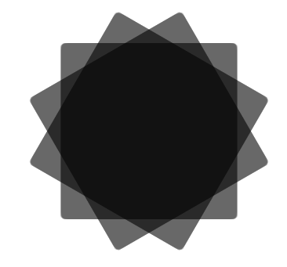
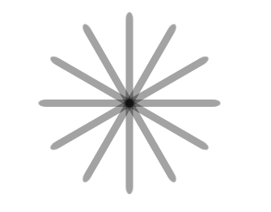

# win10 UWP 圆形等待

看到一个圆形好像微软 ProgressRing 控件


如何去做这个控件，我们可以用自定义控件

<!--more-->
<!-- CreateTime:2018/8/10 19:16:50 -->


<div id="toc"></div>

新建一个用户控件，可以按 ctrl+shift+a 打开后，选用户控件

我们可以用 Rectangle 做圆形边

只要 Rectangle  `RadiusX>0` RadiusX是圆角度

因为每个 Rectangle 都一样，我们可以资源

资源我们写在 Grid

```xaml

        <Grid.Resources>

            

        </Grid.Resources>

```

<!-- 设置 Rectangle  在中间 -->

资源设置需要选 TargetType 

我们是 Rectangle ，于是我们还有给他一个 key

```xaml

                <Style x:Key="RectangleStyle1" TargetType="Rectangle">

                </Style>

```

因为不知道这个要叫什么，就用右击资源


vs默认就帮我写了 RectangleStyle1

每个项需要设置属性，使用 Setter 

```xaml

                    <Setter Property="" Value=""/>

```

设置中间

```xaml

                <Style x:Key="RectangleStyle1" TargetType="Rectangle">

                    <Setter Property="HorizontalAlignment" Value="Center"/>

                    <Setter Property="VerticalAlignment" Value="Center"/>

                </Style>

```

我们跑一下，看起来 Rectangle 很大


<!--  -->

为看起来比较小，把 Height 改为 20

```xaml

                    <Setter Property="Height" Value="50"/>

                    <Setter Property="Width" Value="2"/>

```


<!--  -->

全部资源可以看下面，直接复制是可以

```xaml

 <Style x:Key="RectangleStyle1" TargetType="Rectangle">

                    <Setter Property="RadiusX" Value="1"/>

                    <Setter Property="RadiusY" Value="2"/>

                    <Setter Property="Fill" Value="Black"/>

                    <Setter Property="Opacity" Value="0.2"/>

                    <Setter Property="RenderTransformOrigin" Value="0.5,0.5"/>

                    <Setter Property="HorizontalAlignment" Value="Center"/>

                    <Setter Property="VerticalAlignment" Value="Top"/>

                    <Setter Property="Height" Value="50"/>

                    <Setter Property="Width" Value="2"/>

                </Style>

```

我们做10个 Rectangle  

使用 RectangleStyle1 在 Rectangle 使用 `style="{StaticResource RectangleStyle1}"`

可以看到我们除了中间，其他都和原来一样。中间是白色比较好，添加 Ellipse 。

```xaml

            <Ellipse Height="10" Width="10" Fill="White" HorizontalAlignment="Center" VerticalAlignment="Center"/>

```


<!--  -->

每个 Rectangle  需要一个名字

我们想要 xaml 的控件会动，可以使用

```xaml

            <Grid.Triggers>

                <EventTrigger RoutedEvent="Grid.Loaded">

                    <BeginStoryboard>

                        <Storyboard RepeatBehavior="Forever">

                            <DoubleAnimation Storyboard.TargetName="r01" Storyboard.TargetProperty="Opacity" AutoReverse="True" Duration="0:0:0.08333" BeginTime="0:0:0.00000" To="0"/>

                            <DoubleAnimation Storyboard.TargetName="r02" Storyboard.TargetProperty="Opacity" AutoReverse="True" Duration="0:0:0.08333" BeginTime="0:0:0.08333" To="0"/>

                            <DoubleAnimation Storyboard.TargetName="r03" Storyboard.TargetProperty="Opacity" AutoReverse="True" Duration="0:0:0.08333" BeginTime="0:0:0.16666" To="0"/>

                            <DoubleAnimation Storyboard.TargetName="r04" Storyboard.TargetProperty="Opacity" AutoReverse="True" Duration="0:0:0.08333" BeginTime="0:0:0.24999" To="0"/>

                            <DoubleAnimation Storyboard.TargetName="r05" Storyboard.TargetProperty="Opacity" AutoReverse="True" Duration="0:0:0.08333" BeginTime="0:0:0.33332" To="0"/>

                            <DoubleAnimation Storyboard.TargetName="r06" Storyboard.TargetProperty="Opacity" AutoReverse="True" Duration="0:0:0.08333" BeginTime="0:0:0.41665" To="0"/>

                            <DoubleAnimation Storyboard.TargetName="r07" Storyboard.TargetProperty="Opacity" AutoReverse="True" Duration="0:0:0.08333" BeginTime="0:0:0.49998" To="0"/>

                            <DoubleAnimation Storyboard.TargetName="r08" Storyboard.TargetProperty="Opacity" AutoReverse="True" Duration="0:0:0.08333" BeginTime="0:0:0.58331" To="0"/>

                            <DoubleAnimation Storyboard.TargetName="r09" Storyboard.TargetProperty="Opacity" AutoReverse="True" Duration="0:0:0.08333" BeginTime="0:0:0.66664" To="0"/>

                            <DoubleAnimation Storyboard.TargetName="r10" Storyboard.TargetProperty="Opacity" AutoReverse="True" Duration="0:0:0.08333" BeginTime="0:0:0.74997" To="0"/>

                            <DoubleAnimation Storyboard.TargetName="r11" Storyboard.TargetProperty="Opacity" AutoReverse="True" Duration="0:0:0.08333" BeginTime="0:0:0.83330" To="0"/>

                            <DoubleAnimation Storyboard.TargetName="r12" Storyboard.TargetProperty="Opacity" AutoReverse="True" Duration="0:0:0.08333" BeginTime="0:0:0.91663" To="0"/>

                        </Storyboard>

                    </BeginStoryboard>

                </EventTrigger>

            </Grid.Triggers>

```

Forever 是从开始一直动

我们就写完了我们的控件，如果需要使用控件，就直接写下面代码。注意 local 是我们的命名空间，我们的控件就放在方案的目录，不放在其他文件夹，命名空间也是和方案默认一样。

```xaml

        <local:round ></local:round>

```


<!--  -->

全部代码

```xaml

round.xaml

<UserControl

    x:Class="roundload.round"

    xmlns="http://schemas.microsoft.com/winfx/2006/xaml/presentation"

    xmlns:x="http://schemas.microsoft.com/winfx/2006/xaml"

    xmlns:local="using:roundload"

    xmlns:d="http://schemas.microsoft.com/expression/blend/2008"

    xmlns:mc="http://schemas.openxmlformats.org/markup-compatibility/2006"

    mc:Ignorable="d"

    d:DesignHeight="300"

    d:DesignWidth="400">

    <Grid>

        <Grid>

            <Grid.Resources>

                <Style x:Key="RectangleStyle1" TargetType="Rectangle">

                    <Setter Property="RadiusX" Value="1"/>

                    <Setter Property="RadiusY" Value="2"/>

                    <Setter Property="Fill" Value="Black"/>

                    <Setter Property="Opacity" Value="0.2"/>

                    <Setter Property="RenderTransformOrigin" Value="0.5,0.5"/>

                    <Setter Property="HorizontalAlignment" Value="Center"/>

                    <Setter Property="VerticalAlignment" Value="Center"/>

                    <Setter Property="Height" Value="50"/>

                    <Setter Property="Width" Value="2"/>

                </Style>

            </Grid.Resources>

            <Rectangle x:Name="r01" Style="{StaticResource RectangleStyle1}">

                <Rectangle.RenderTransform>

                    <RotateTransform Angle="0"/>

                </Rectangle.RenderTransform>

            </Rectangle>

            <Rectangle x:Name="r02" Style="{StaticResource RectangleStyle1}">

                <Rectangle.RenderTransform>

                    <RotateTransform Angle="30"/>

                </Rectangle.RenderTransform>

            </Rectangle>

            <Rectangle x:Name="r03" Style="{StaticResource RectangleStyle1}">

                <Rectangle.RenderTransform>

                    <RotateTransform Angle="60"/>

                </Rectangle.RenderTransform>

            </Rectangle>

            <Rectangle x:Name="r04"  Style="{StaticResource RectangleStyle1}">

                <Rectangle.RenderTransform>

                    <RotateTransform Angle="90"/>

                </Rectangle.RenderTransform>

            </Rectangle>

            <Rectangle x:Name="r05"  Style="{StaticResource RectangleStyle1}">

                <Rectangle.RenderTransform>

                    <RotateTransform Angle="120"/>

                </Rectangle.RenderTransform>

            </Rectangle>

            <Rectangle x:Name="r06"  Style="{StaticResource RectangleStyle1}">

                <Rectangle.RenderTransform>

                    <RotateTransform Angle="150"/>

                </Rectangle.RenderTransform>

            </Rectangle>

            <Rectangle x:Name="r07"  Style="{StaticResource RectangleStyle1}">

                <Rectangle.RenderTransform>

                    <RotateTransform Angle="180"/>

                </Rectangle.RenderTransform>

            </Rectangle>

            <Rectangle x:Name="r08"  Style="{StaticResource RectangleStyle1}">

                <Rectangle.RenderTransform>

                    <RotateTransform Angle="210"/>

                </Rectangle.RenderTransform>

            </Rectangle>

            <Rectangle x:Name="r09"  Style="{StaticResource RectangleStyle1}">

                <Rectangle.RenderTransform>

                    <RotateTransform Angle="240"/>

                </Rectangle.RenderTransform>

            </Rectangle>

            <Rectangle x:Name="r10"  Style="{StaticResource RectangleStyle1}">

                <Rectangle.RenderTransform>

                    <RotateTransform Angle="270"/>

                </Rectangle.RenderTransform>

            </Rectangle>

            <Rectangle x:Name="r11"  Style="{StaticResource RectangleStyle1}">

                <Rectangle.RenderTransform>

                    <RotateTransform Angle="300"/>

                </Rectangle.RenderTransform>

            </Rectangle>

            <Rectangle x:Name="r12"  Style="{StaticResource RectangleStyle1}">

                <Rectangle.RenderTransform>

                    <RotateTransform Angle="330"/>

                </Rectangle.RenderTransform>

            </Rectangle>

            <Ellipse Height="10" Width="10" Fill="White" HorizontalAlignment="Center" VerticalAlignment="Center"/>

            <Grid.Triggers>

                <EventTrigger RoutedEvent="Grid.Loaded">

                    <BeginStoryboard>

                        <Storyboard RepeatBehavior="Forever">

                            <DoubleAnimation Storyboard.TargetName="r01" Storyboard.TargetProperty="Opacity" AutoReverse="True" Duration="0:0:0.08333" BeginTime="0:0:0.00000" To="0"/>

                            <DoubleAnimation Storyboard.TargetName="r02" Storyboard.TargetProperty="Opacity" AutoReverse="True" Duration="0:0:0.08333" BeginTime="0:0:0.08333" To="0"/>

                            <DoubleAnimation Storyboard.TargetName="r03" Storyboard.TargetProperty="Opacity" AutoReverse="True" Duration="0:0:0.08333" BeginTime="0:0:0.16666" To="0"/>

                            <DoubleAnimation Storyboard.TargetName="r04" Storyboard.TargetProperty="Opacity" AutoReverse="True" Duration="0:0:0.08333" BeginTime="0:0:0.24999" To="0"/>

                            <DoubleAnimation Storyboard.TargetName="r05" Storyboard.TargetProperty="Opacity" AutoReverse="True" Duration="0:0:0.08333" BeginTime="0:0:0.33332" To="0"/>

                            <DoubleAnimation Storyboard.TargetName="r06" Storyboard.TargetProperty="Opacity" AutoReverse="True" Duration="0:0:0.08333" BeginTime="0:0:0.41665" To="0"/>

                            <DoubleAnimation Storyboard.TargetName="r07" Storyboard.TargetProperty="Opacity" AutoReverse="True" Duration="0:0:0.08333" BeginTime="0:0:0.49998" To="0"/>

                            <DoubleAnimation Storyboard.TargetName="r08" Storyboard.TargetProperty="Opacity" AutoReverse="True" Duration="0:0:0.08333" BeginTime="0:0:0.58331" To="0"/>

                            <DoubleAnimation Storyboard.TargetName="r09" Storyboard.TargetProperty="Opacity" AutoReverse="True" Duration="0:0:0.08333" BeginTime="0:0:0.66664" To="0"/>

                            <DoubleAnimation Storyboard.TargetName="r10" Storyboard.TargetProperty="Opacity" AutoReverse="True" Duration="0:0:0.08333" BeginTime="0:0:0.74997" To="0"/>

                            <DoubleAnimation Storyboard.TargetName="r11" Storyboard.TargetProperty="Opacity" AutoReverse="True" Duration="0:0:0.08333" BeginTime="0:0:0.83330" To="0"/>

                            <DoubleAnimation Storyboard.TargetName="r12" Storyboard.TargetProperty="Opacity" AutoReverse="True" Duration="0:0:0.08333" BeginTime="0:0:0.91663" To="0"/>

                        </Storyboard>

                    </BeginStoryboard>

                </EventTrigger>

            </Grid.Triggers>

        </Grid>

    </Grid>

</UserControl>

```

```xaml

MainPage

<Page

    x:Class="roundload.MainPage"

    xmlns="http://schemas.microsoft.com/winfx/2006/xaml/presentation"

    xmlns:x="http://schemas.microsoft.com/winfx/2006/xaml"

    xmlns:local="using:roundload"

    xmlns:d="http://schemas.microsoft.com/expression/blend/2008"

    xmlns:mc="http://schemas.openxmlformats.org/markup-compatibility/2006"

    mc:Ignorable="d">

    <Grid Background="{ThemeResource ApplicationPageBackgroundThemeBrush}">

        

        <local:round ></local:round>

    </Grid>

</Page>

```

代码：https://github.com/lindexi/lindexi_gd/tree/master/roundload

参考：http://blog.csdn.net/qqamoon/article/details/7001693

<a rel="license" href="http://creativecommons.org/licenses/by-nc-sa/4.0/"></a><br />本作品采用<a rel="license" href="http://creativecommons.org/licenses/by-nc-sa/4.0/">知识共享署名-非商业性使用-相同方式共享 4.0 国际许可协议</a>进行许可。欢迎转载、使用、重新发布，但务必保留文章署名[林德熙](http://blog.csdn.net/lindexi_gd)(包含链接:http://blog.csdn.net/lindexi_gd )，不得用于商业目的，基于本文修改后的作品务必以相同的许可发布。如有任何疑问，请与我[联系](mailto:lindexi_gd@163.com)。


