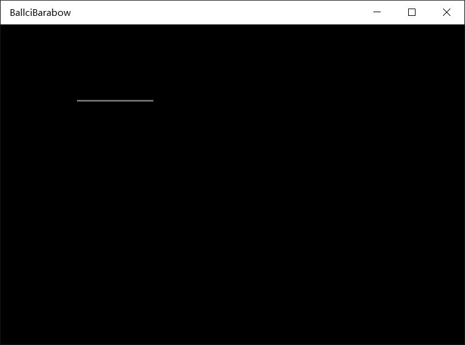
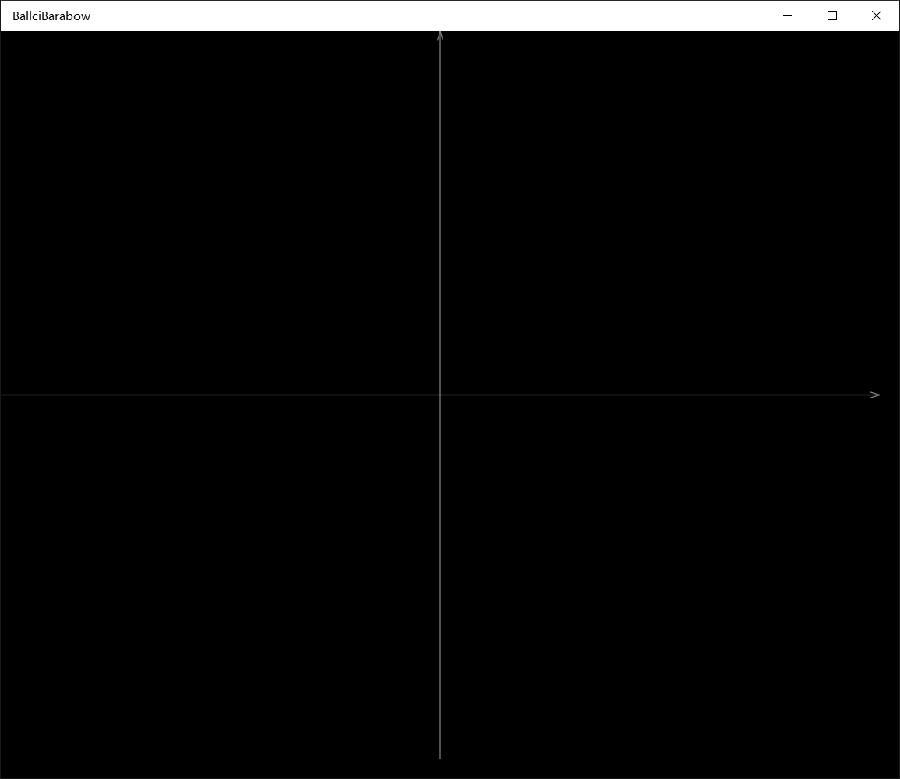

# win10 uwp win2d 使用 Path 绘制界面

本文告诉大家如何在 Win2d 使用 Path 路径绘图

<!--more-->
<!-- CreateTime:2018/8/10 19:17:19 -->

<!-- csdn -->
<div id="toc"></div>

<!-- 标签：win2d,uwp,渲染 -->

## CanvasGeometry

在 win2d ，可以使用 DrawGeometry 的方式画出几何。而路径 Path 就是一种 Geometry 。传入的 CanvasGeometry 参数是不能通过实例创建，需要使用静态工厂创建。

通过 CanvasGeometry.CreatePath 就可以创建出路径几何，通过告诉线条颜色和线条宽度就可以画出 Path ，这个方法只能画出线条。

如果需要填充 Path 需要使用 FillGeometry 方法。

## CanvasPathBuilder

因为 CanvasGeometry.CreatePath 的参数是 CanvasPathBuilder ，而 Path 也需要告诉每个点是如何画，所以需要 CanvasPathBuilder 来告诉 Path 每个点是怎么画。

在创建 CanvasPathBuilder 的时候需要传入 ICanvasResourceCreator ，也就是通过 args.DrawingSession 可以创建 CanvasPathBuilder 来画。

```csharp
            using (var canvasPathBuilder = new CanvasPathBuilder(args.DrawingSession))

```

上面的代码是写在 Canvas_OnDraw 

```csharp
        private void Canvas_OnDraw(CanvasControl sender, CanvasDrawEventArgs args)
        {

            using (var canvasPathBuilder = new CanvasPathBuilder(args.DrawingSession))
            {
                // 这里可以画出 Path 或写出文字 lindexi.github.io
            }
        }
```

因为Path 可以使用多个 Path 组合，如果需要新建一个 Path 需要调用 BeginFigure 告诉 win2d 开始画出一个新的图形。在图形画完需要调用 EndFigure 告诉 win2d 已经画完。

例如准备画一条线，需要在开始画的时候调用 BeginFigure 告诉起点，在结束的时候使用 EndFigure 并且告诉这是不是封闭图形。

```csharp
            using (var canvasPathBuilder = new CanvasPathBuilder(args.DrawingSession))
            {
                // 这里可以画出 Path 或写出文字 lindexi.github.io
                canvasPathBuilder.BeginFigure(100,100);
                canvasPathBuilder.AddLine(200,100);
                canvasPathBuilder.EndFigure(CanvasFigureLoop.Open);
            }
```

现在运行代码会发现没有画出图形，因为没有调用画出来。调用 DrawGeometry 需要传入需要画的几何、线条颜色，线条宽度

```csharp
            using (var canvasPathBuilder = new CanvasPathBuilder(args.DrawingSession))
            {
                // 这里可以画出 Path 或写出文字 lindexi.github.io
                canvasPathBuilder.BeginFigure(100, 100);
                canvasPathBuilder.AddLine(200, 100);
                canvasPathBuilder.EndFigure(CanvasFigureLoop.Open);

                args.DrawingSession.DrawGeometry(CanvasGeometry.CreatePath(canvasPathBuilder), Colors.Gray, 2);
            }
```

<!--  -->


## 画线

从上面的例子已经告诉大家如何画线，使用 BeginFigure 添加起点，然后使用 AddLine 把上一个点和输入的连成直线。

```csharp
           using (var canvasPathBuilder = new CanvasPathBuilder(args.DrawingSession))
            {
                // 这里可以画出 Path 或写出文字 lindexi.github.io
                canvasPathBuilder.BeginFigure(100, 100);
                canvasPathBuilder.AddLine(200, 100);
                canvasPathBuilder.EndFigure(CanvasFigureLoop.Open);
            }
```

## 例子

下面给大家看一些已经画好的路径界面

### 绘制坐标系

```csharp
   private void DrawPath(CanvasControl canvas, CanvasDrawEventArgs args)
        {
            var width = (float) canvas.ActualWidth-20;
            var height = (float) (canvas.ActualHeight)-20;
            var midWidth = (float) (width * .5);
            var midHeight = (float) (height * .5);
            Color color = Colors.Gray;
            using (var cpb = new CanvasPathBuilder(args.DrawingSession))
            {
                // Horizontal line
                // 水平线
                cpb.BeginFigure(new Vector2(0, midHeight));
                cpb.AddLine(new Vector2(width, midHeight));
                cpb.EndFigure(CanvasFigureLoop.Open);

                // Horizontal line arrow
                // 水平箭头
                cpb.BeginFigure(new Vector2(width - 10, midHeight - 3));
                cpb.AddLine(new Vector2(width, midHeight));
                cpb.AddLine(new Vector2(width - 10, midHeight + 3));
                cpb.EndFigure(CanvasFigureLoop.Open);

                args.DrawingSession.DrawGeometry(CanvasGeometry.CreatePath(cpb), color,strokeWidth: 1);
            }

            using (var cpb = new CanvasPathBuilder(args.DrawingSession))
            {
                // Vertical line
                // 垂直线
                cpb.BeginFigure(new Vector2(midWidth, 0));
                cpb.AddLine(new Vector2(midWidth, height));
                cpb.EndFigure(CanvasFigureLoop.Open);

                // Vertical line arrow
                cpb.BeginFigure(new Vector2(midWidth - 3, 10));
                cpb.AddLine(new Vector2(midWidth, 0));
                cpb.AddLine(new Vector2(midWidth + 3, 10));
                cpb.EndFigure(CanvasFigureLoop.Open);

                args.DrawingSession.DrawGeometry(CanvasGeometry.CreatePath(cpb), color, 1);
            }
        }
```

<!--  -->


参见：[第四章(图形篇2) 几何图形CanvasGeometry](https://zhuanlan.zhihu.com/p/39906163 )

<a rel="license" href="http://creativecommons.org/licenses/by-nc-sa/4.0/"></a><br />本作品采用<a rel="license" href="http://creativecommons.org/licenses/by-nc-sa/4.0/">知识共享署名-非商业性使用-相同方式共享 4.0 国际许可协议</a>进行许可。欢迎转载、使用、重新发布，但务必保留文章署名[林德熙](http://blog.csdn.net/lindexi_gd)(包含链接:http://blog.csdn.net/lindexi_gd )，不得用于商业目的，基于本文修改后的作品务必以相同的许可发布。如有任何疑问，请与我[联系](mailto:lindexi_gd@163.com)。
