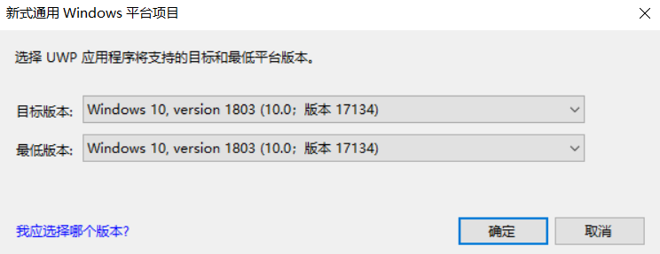
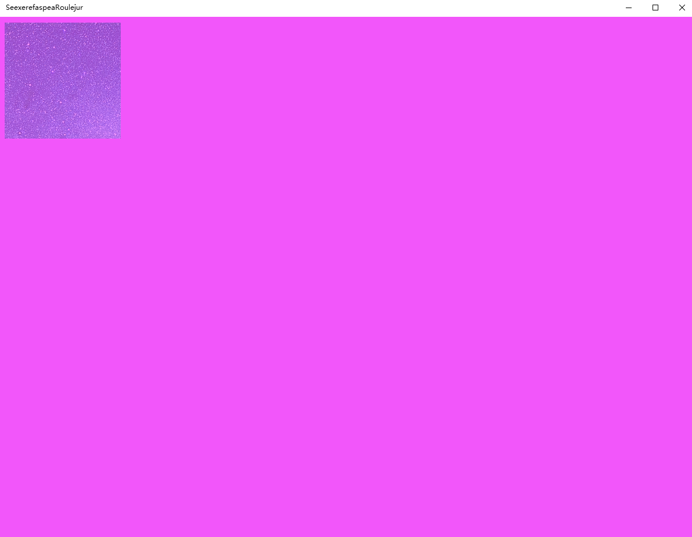
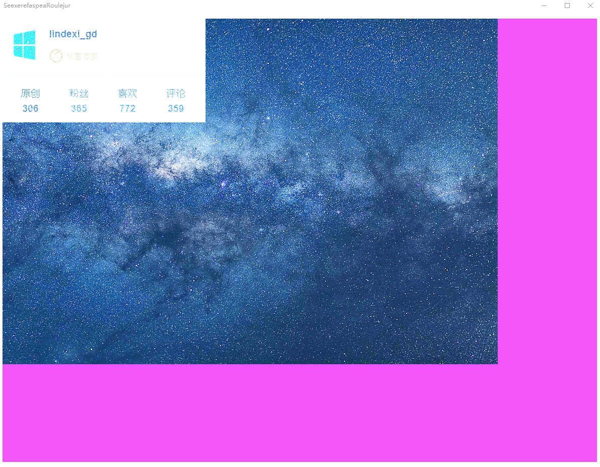
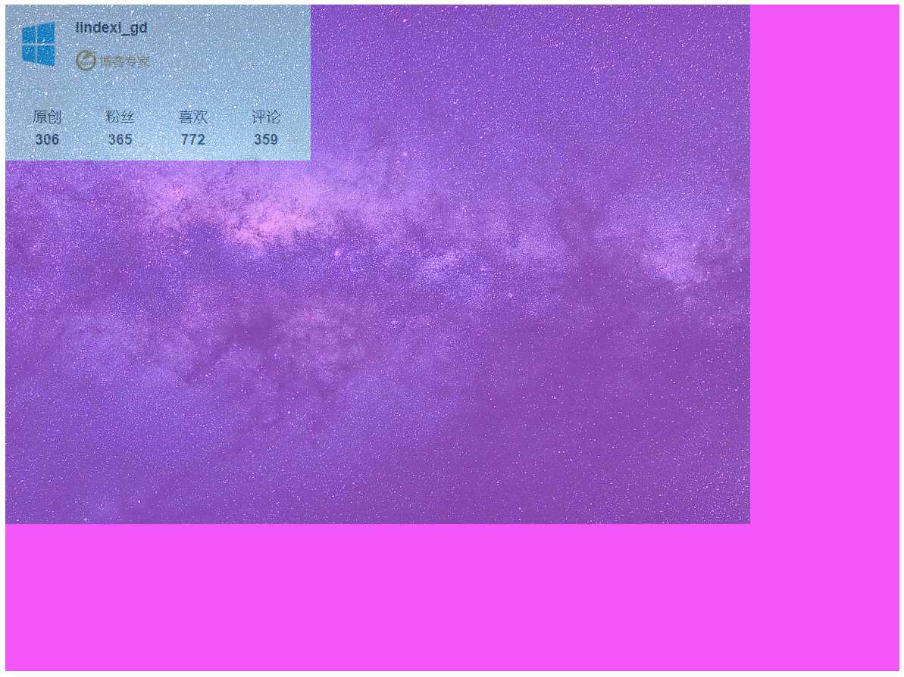
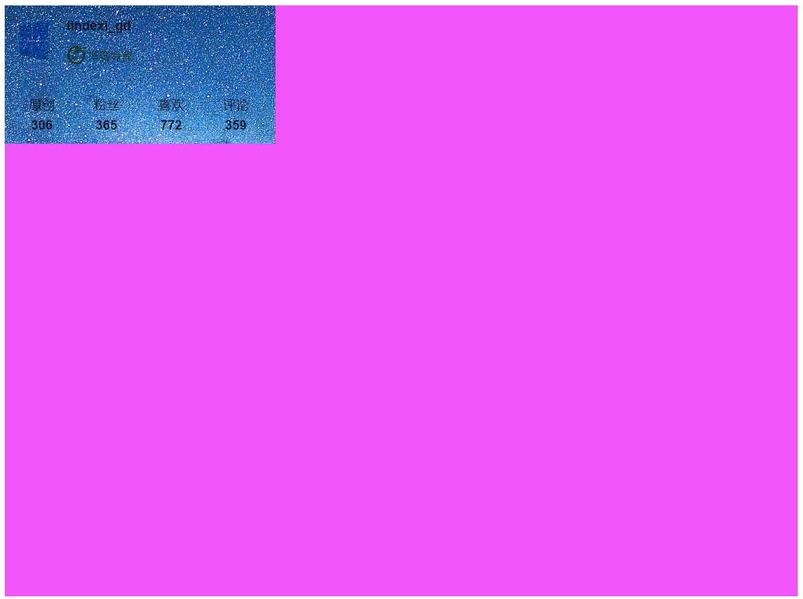

# win10 uwp win2d 特效

本文告诉大家 win2d 里面的特效

<!--more-->
<!-- CreateTime:2018/10/2 21:20:46 -->

<div id="toc"></div>
<!-- csdn -->
<!-- 标签：uwp,win2d -->

在开始之前先创建一个项目，这里创建 SeexerefaspeaRoulejur 最低版本 17134 选择比较新的版本可以解决之前一些版本存在的坑

<!--  -->


通过 Nuget 安装 Win2d 库


先在主页面添加引用 `xmlns:canvas="using:Microsoft.Graphics.Canvas.UI.Xaml"` 然后创建空白的 Canvas 请看代码

```csharp
     <Grid>
        <canvas:CanvasControl x:Name="Canvas" ClearColor="#F256FA"></canvas:CanvasControl>
    </Grid>
``` 

在资源文件添加两张图片 1.png 2.png 作为素材，在 win2d 有事件 CreateResources 可以用来创建图片

先在后台引用 win2d 需要使用的代码

```csharp
using Microsoft.Graphics.Canvas;
using Microsoft.Graphics.Canvas.UI;
using Microsoft.Graphics.Canvas.UI.Xaml;
```

在前台添加 CreateResources 的函数

```csharp
        <canvas:CanvasControl x:Name="Canvas" ClearColor="#F256FA" CreateResources="Canvas_OnCreateResources" Draw="Canvas_OnDraw"></canvas:CanvasControl>
```

在后台添加 `Canvas_OnCreateResources` 创建图片

```csharp
       
        private CanvasBitmap Image2 { get; set; }

        private CanvasBitmap Image1 { get; set; }

        private void Canvas_OnDraw(CanvasControl sender, CanvasDrawEventArgs args)
        {
            
        }

        private void Canvas_OnCreateResources(CanvasControl sender, CanvasCreateResourcesEventArgs args)
        {
            args.TrackAsyncAction(CreateImage(sender).AsAsyncAction());
        }

        private async System.Threading.Tasks.Task CreateImage(CanvasControl sender)
        {
            try
            {
                Image1 = await CanvasBitmap.LoadAsync(sender, new Uri("ms-appx:///assets/1.png"));
                Image2 = await CanvasBitmap.LoadAsync(sender, new Uri("ms-appx:///assets/2.jpg"));
            }
            catch (FileNotFoundException e)
            {
                Debug.WriteLine(e.Message);
            }
        }
```

注意在获取图片时，需要设置图片为内容，请看 [win10 uwp 访问解决方案文件](https://lindexi.gitee.io/post/win10-uwp-%E8%AE%BF%E9%97%AE%E8%A7%A3%E5%86%B3%E6%96%B9%E6%A1%88%E6%96%87%E4%BB%B6.html )

如果没有设置图片为内容，就会出现 FileNotFoundException 而且信息是

```csharp
			"系统找不到指定的文件。 (Exception from HRESULT: 0x80070002)"

```

下面开始告诉大家各个特效是如何使用

## AlphaMaskEffect

在使用特效之前需要引用代码

```csharp
using Microsoft.Graphics.Canvas.Effects;

```

然后在 Canvas_OnDraw 添加一些代码

```csharp
        private void Canvas_OnDraw(CanvasControl sender, CanvasDrawEventArgs args)
        {
            var alphaMask = new CanvasCommandList(sender);

            using (var canvasDrawingSession = alphaMask.CreateDrawingSession())
            {
                canvasDrawingSession.FillRectangle(new Rect(10, 10, 200, 200), Color.FromArgb(100, 0, 0, 0));
            }


            var alphaMaskEffect = new AlphaMaskEffect {AlphaMask = alphaMask, Source = Image2};

            using (var canvasDrawingSession = args.DrawingSession)
            {
                canvasDrawingSession.DrawImage(alphaMaskEffect);
            }
        }

```

在之前已经写过如何使用 AlphaMaskEffect 的博客了，所以本文就简单告诉大家如何使用

运行可以看到下面界面

<!--  -->


更多关于 AlphaMaskEffect 请看 [win10 uwp win2d 入门 看这一篇就够了](https://lindexi.gitee.io/lindexi/post/win10-uwp-win2d-%E5%85%A5%E9%97%A8-%E7%9C%8B%E8%BF%99%E4%B8%80%E7%AF%87%E5%B0%B1%E5%A4%9F%E4%BA%86.html )

代码 [win2d AlphaMaskEffect-CSDN下载](https://download.csdn.net/download/lindexi_gd/10698535 )

## ArithmeticCompositeEffect 

通过算法组合两张图片，这个特效是对两张图片的每个像素对应的计算，计算公式是

```csharp
result = (Source1 * Source1Amount) + (Source2 * Source2Amount) + (Source1 * Source2 * MultiplyAmount) + Offset
```

通过下面的公式可以做到

### 相加两张图片

需要通过下面的设置

```csharp
Source1Amount = 1
Source2Amount = 1
MultiplyAmount = 0
Offset = 0
```

在 Canvas_OnDraw 的代码

```csharp
            var arithmeticCompositeEffect = new ArithmeticCompositeEffect()
            {
                Source1 = Image1,
                Source2 = Image2,
                Source1Amount = 1,
                Source2Amount = 1,
                MultiplyAmount = 0,
                Offset = 0
            };

            args.DrawingSession.DrawImage(arithmeticCompositeEffect);
```

效果

<!--  -->


通过修改 Source1Amount 和 Source2Amount 可以看到不同的相加效果

<!--  -->


### 相乘

设置下面的系数可以让两张图片相乘

```csharp
Source1Amount = 0
Source2Amount = 0
MultiplyAmount = 1
Offset = 0
```

在 Canvas_OnDraw 的代码

```csharp
        private void Canvas_OnDraw(CanvasControl sender, CanvasDrawEventArgs args)
        {
            var arithmeticCompositeEffect = new ArithmeticCompositeEffect()
            {
                Source1 = Image1,
                Source2 = Image2,
                Source1Amount = 0,
                Source2Amount = 0,
                MultiplyAmount = 1,
                Offset = 0
            };

            args.DrawingSession.DrawImage(arithmeticCompositeEffect);
        }
```

可以看到只要第一张不存在的地方，在第二张也无法显示

<!--  -->


### 相减

通过设置 Source1Amount 为 1 设置 Source2Amount 可以 -1 可以让图片1减去图片2

```csharp
            var arithmeticCompositeEffect = new ArithmeticCompositeEffect()
            {
                Source1 = Image1,
                Source2 = Image2,
                Source1Amount = 1,
                Source2Amount = -1,
                MultiplyAmount = 0,
                Offset = 0
            };

            args.DrawingSession.DrawImage(arithmeticCompositeEffect);
```

但是更多的时候是引入参数 t 也就是

```csharp
Source1Amount = 1 - t
Source2Amount = t

```

我在界面添加一个 Slider 让他控制 t 的大小

<div style="position:relative;height:0;padding-bottom:75.0%"><iframe src="https://www.youtube.com/embed/k8kTRXkaQkY?ecver=2" width="480" height="360" frameborder="0" allow="autoplay; encrypted-media" style="position:absolute;width:100%;height:100%;left:0" allowfullscreen></iframe></div>

视频请看 https://youtu.be/k8kTRXkaQkY

之外，还可以设置图片反色，设置反色的时候只能设置一张图片反色

反色的公式是

```csharp
Source1Amount = -1
Source2Amount = 0
MultiplyAmount = 0
Offset = 1
```

修改一下代码

```csharp
            var arithmeticCompositeEffect = new ArithmeticCompositeEffect()
            {
                Source1 = Image1,
                Source2 = Image2,
                Source1Amount = -1,
                MultiplyAmount = 0,
                Offset = 1,
            };

            args.DrawingSession.DrawImage(arithmeticCompositeEffect);
```

也就是通过修改系数可以做出很多特效，请自己尝试修改这几个属性

[ArithmeticCompositeEffect Class](http://microsoft.github.io/Win2D/html/T_Microsoft_Graphics_Canvas_Effects_ArithmeticCompositeEffect.htm )

代码 [win2d ArithmeticCompositeEffect-CSDN下载](https://download.csdn.net/download/lindexi_gd/10698545 )


[第三章(介绍篇) 图像特效Effect](https://zhuanlan.zhihu.com/p/37131345 )

[第三章(特殊篇) 图像特效Effect](https://zhuanlan.zhihu.com/p/37614921 )

<a rel="license" href="http://creativecommons.org/licenses/by-nc-sa/4.0/"></a><br />本作品采用<a rel="license" href="http://creativecommons.org/licenses/by-nc-sa/4.0/">知识共享署名-非商业性使用-相同方式共享 4.0 国际许可协议</a>进行许可。欢迎转载、使用、重新发布，但务必保留文章署名[林德熙](http://blog.csdn.net/lindexi_gd)(包含链接:http://blog.csdn.net/lindexi_gd )，不得用于商业目的，基于本文修改后的作品务必以相同的许可发布。如有任何疑问，请与我[联系](mailto:lindexi_gd@163.com)。
