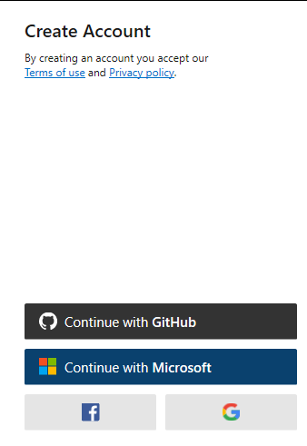
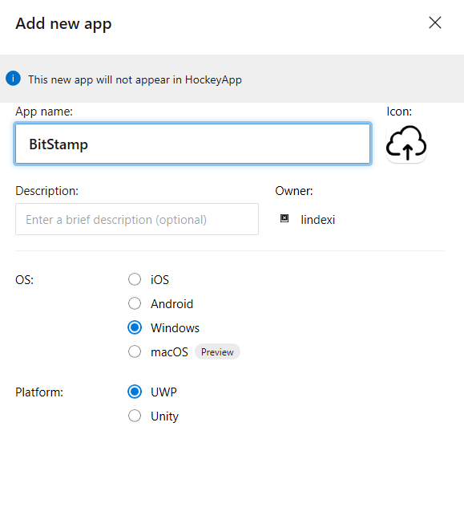
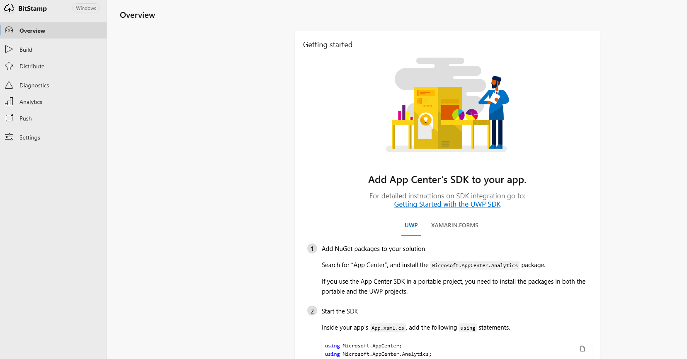
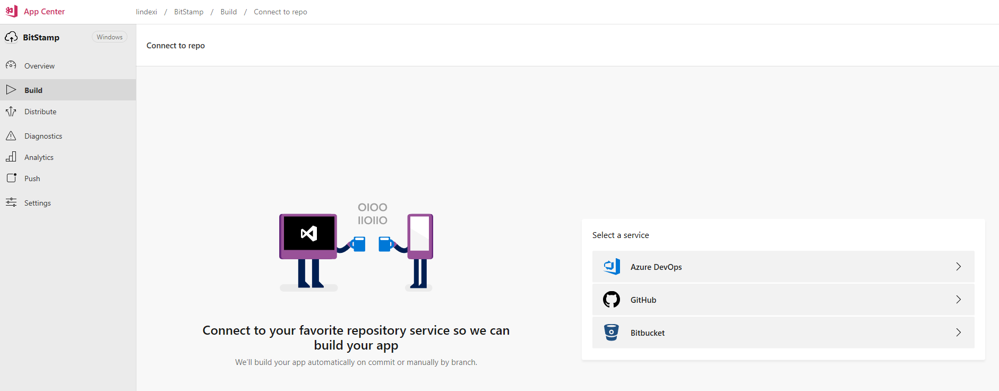
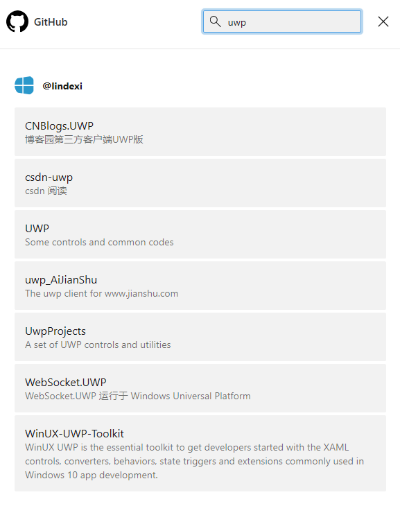
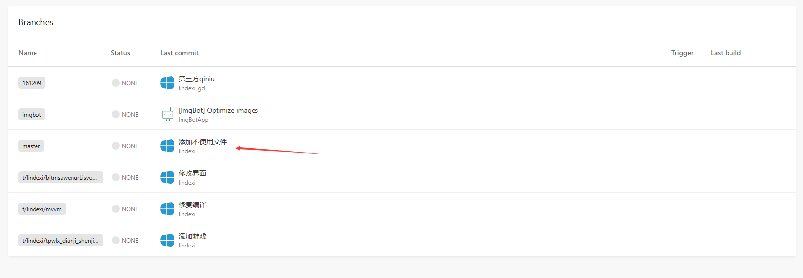
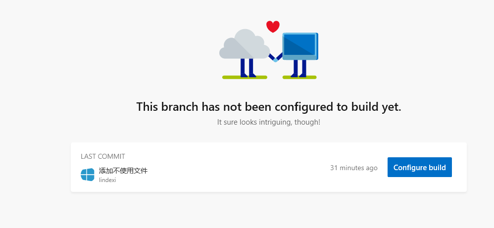
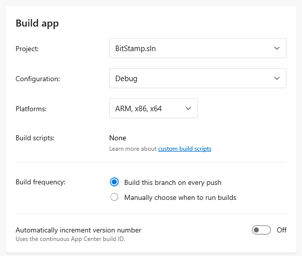
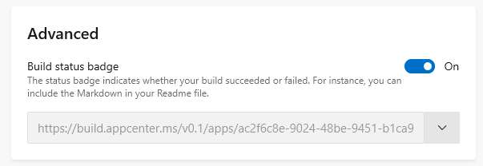

# win10 uwp 使用 AppCenter 自动构建

微软在今年7月上线 appcenter.ms 这个网站，通过 App Center 可以自动对数千种设备进行适配测试、快速将应用发送给测试者或者直接发布到应用商店。做到开发的构建和快速测试，产品的遥测分发合并到一个网站

本文以 UWP 图床为例告诉大家如何在 AppCenter 上部署自动构建。

<!--more-->
<!-- CreateTime:2018/11/19 15:29:34 -->

<!-- 标签：uwp,DevOps,AzureDevOps -->

首先打开 [https://appcenter.ms/](https://appcenter.ms/) 使用微软的账号或 github 账号登陆

<!--  -->


点击 add new 添加一个 UWP 程序，需要写出 app 的命名和选择是哪个平台

没想到这个 AppCenter 默认选的是 IOS 差评，需要自己点击一个 Windows 然后点击 UWP 才可以

<!--  -->


创建完成之后可以看到下面的界面

<!--  -->


点击 Build 标签，可以看到配置自动构建的界面

<!--  -->


因为 UWP 图床是放在 [github](https://github.com/lindexi/uwp) 所以这里选择 github 在弹出的页面选择 UWP 项目

<!--  -->


点击选择之后可以看到当前的分支，这里选择 master 分支

<!--  -->


然后点击配置编译

<!--  -->


在这个网站比较好的是会将所有的 sln 文件列出来，让大家选自己需要编译的文件，同时还可以设置编译的平台

<!--  -->


只需要设置需要编译哪个项目就可以啦，其他的东西都是自动配置的

设置完成就可以点击一下保存，尝试再次在本地推送一个提交就可以看到自动构建在进行编译了

设置这里有一个高级的选项，这个选项可以将编译成功或失败的标识放在了 github 上，这里会生成一个图片

<!--  -->


将内容复制出来，大概就是这样

```csharp
[](https://appcenter.ms)
```

放在自己的项目首页可以看到这个效果

[](https://appcenter.ms)

<a rel="license" href="http://creativecommons.org/licenses/by-nc-sa/4.0/"></a><br />本作品采用<a rel="license" href="http://creativecommons.org/licenses/by-nc-sa/4.0/">知识共享署名-非商业性使用-相同方式共享 4.0 国际许可协议</a>进行许可。欢迎转载、使用、重新发布，但务必保留文章署名[林德熙](http://blog.csdn.net/lindexi_gd)(包含链接:http://blog.csdn.net/lindexi_gd )，不得用于商业目的，基于本文修改后的作品务必以相同的许可发布。如有任何疑问，请与我[联系](mailto:lindexi_gd@163.com)。
