# win10 uwp 使用 Azure DevOps 自动构建

通过 Azure DevOps 可以做到自动构建程序，覆盖计划、创建、编程、测试、部署、发布、托管、共享等各个环节，适用于大多数的语言、平台。

本文继续使用图床为例告诉大家如何使用 Azure DevOps 自动构建

<!--more-->
<!-- CreateTime:2018/11/19 15:26:04 -->


<!-- 标签：uwp,DevOps,AzureDevOps -->

从谷歌搜 Azure DevOps 即可找到 Azure DevOps 的网站 [https://dev.azure.com](https://dev.azure.com)，这里支持使用微软的账号或 github 的账号登陆。

假设已经登陆了账号，首先点击创建一个项目

<!-- 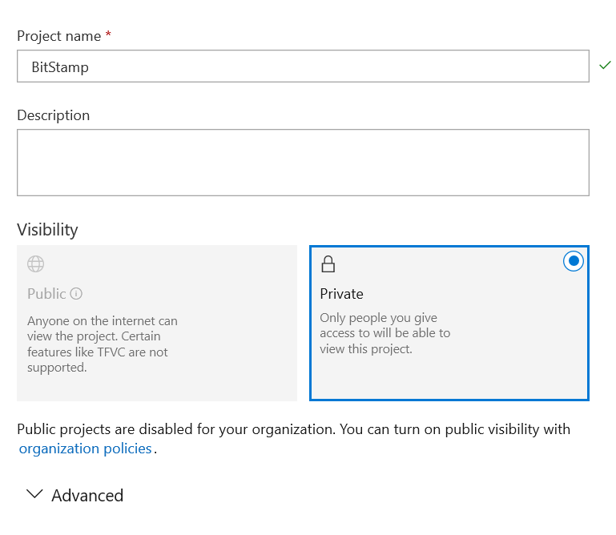 -->


创建的时候需要等待很久，创建之后点击 Repos 导入 github 的仓库作为代码库，或者自己使用创建的项目提交代码

<!--  -->


本文是导入开源在 github 的 uwp 图床项目，点击导入

<!--  -->


输入自己的仓库地址

<!-- 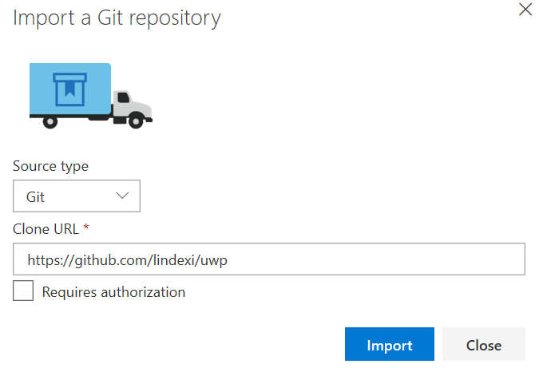 -->


点击 Pipelines 点击 Build 配置自动构建

<!-- 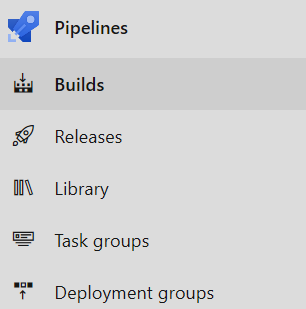 -->


创建新的构建

<!-- 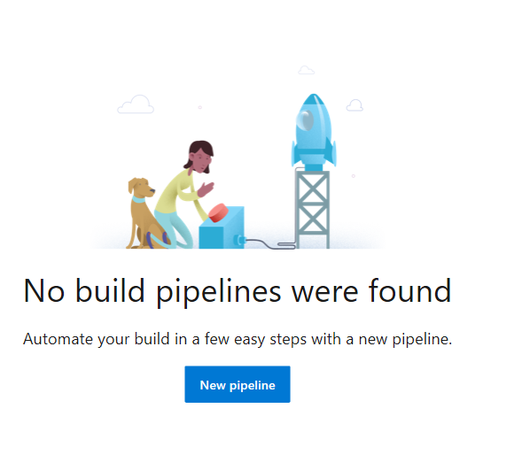 -->


因为刚才已经导入代码，现在就可以直接导入代码

<!-- 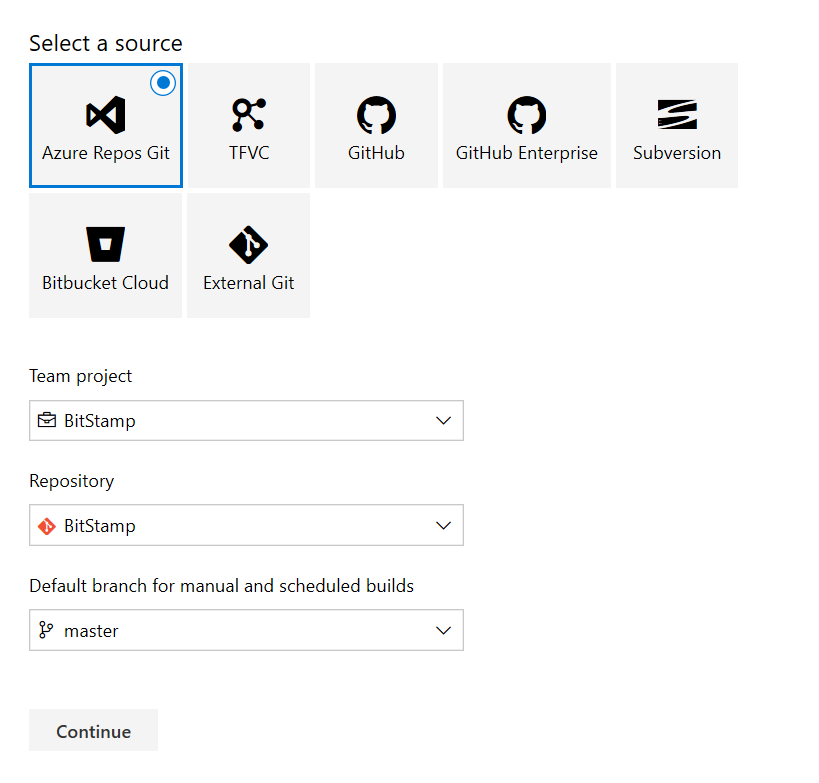 -->


直接点击下一步就可以

这时可以选择自己需要的构建方式，有预定了很多构建的方式，通过寻找 UWP 的构建点击

<!-- 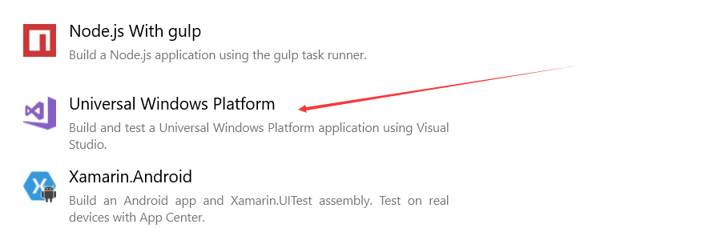 -->


点击应用

然后选择需要编译哪个 sln 文件

<!-- 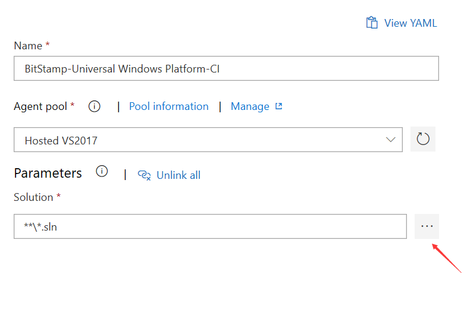 -->


这里选择项目之后点击保存

<!-- 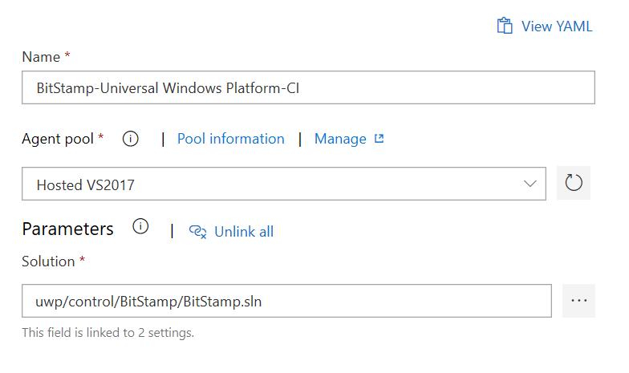 -->


点击队列按钮就可以进行构建

<!--  -->


这样就设置好了构建的方法，点击 Triggers 设置触发，可以设置有 push 上去就进行构建，也可以设置在某个时间进行构建

<!--  -->


点击添加任务，可以设置在某一天的时间构建

<!-- 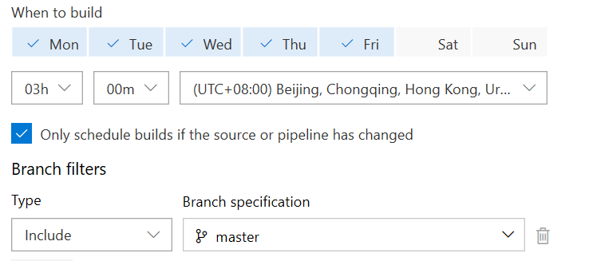 -->


设置完成点击保存就可以

如果需要构建 WPF 程序，实际上和上面的步骤很多都是相同，只是在选择构建的预定义方法的时候选择的是桌面

<!-- 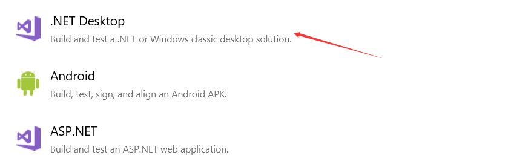 -->


选择需要编译的项目，如果有单元测试项目就设置单元测试项目

<!--  -->


如果没有单元测试项目就点击移除单元测试项目

<!-- 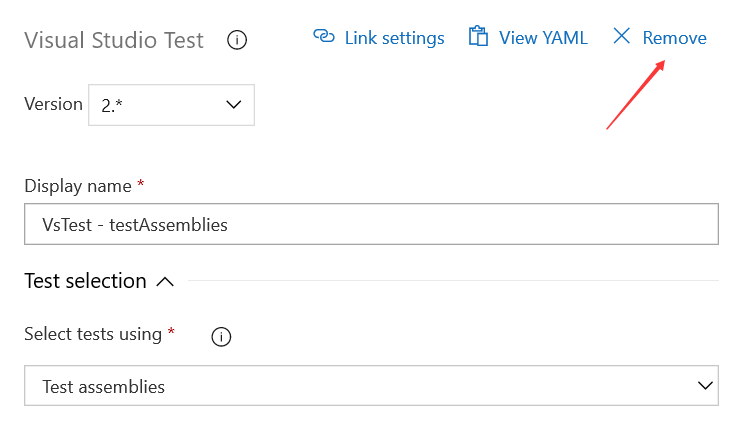 -->


设置完成之后点击保存

设置自动构建的方法和 UWP 的方法相同

手动构建的方法是点击 Queue 加入构建

<!-- 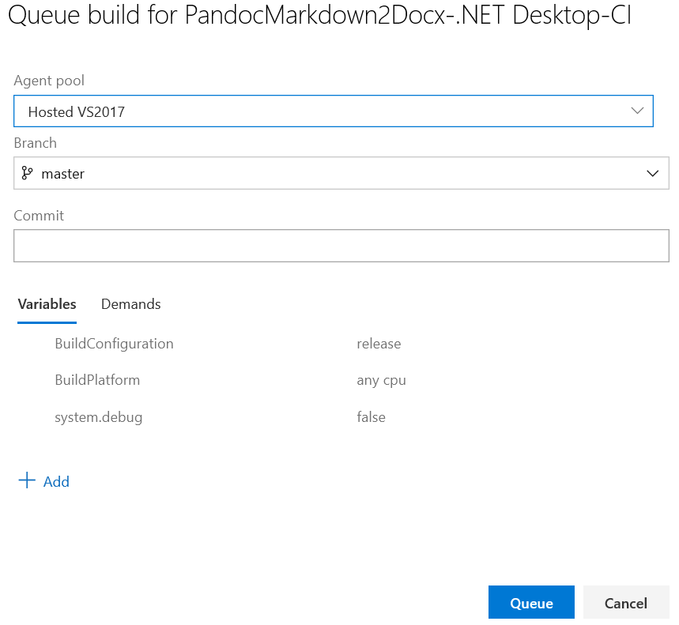 -->


直接点击队列按钮就可以

可以看到点击的任务加入构建

<!--  -->


再次点击 Build 就可以看到当前的构建

<!--  -->


点击 Option 可以将构建是否成功的图标复制出来

```csharp
[](https://dev.azure.com/lindexigd/BitStamp/_build/latest?definitionId=3)
```

放在自己的项目首页就可以看到下面的效果

[](https://dev.azure.com/lindexigd/PandocMarkdown2Docx/_build/latest?definitionId=4)

通过这个方式可以做到自动的构建项目

通过这个网站可以做到发布管理任务，自动构建开发，代码审查，提交测试申请，自动发布，一个网站可以做到整个软件的开发管理

<a rel="license" href="http://creativecommons.org/licenses/by-nc-sa/4.0/"></a><br />本作品采用<a rel="license" href="http://creativecommons.org/licenses/by-nc-sa/4.0/">知识共享署名-非商业性使用-相同方式共享 4.0 国际许可协议</a>进行许可。欢迎转载、使用、重新发布，但务必保留文章署名[林德熙](http://blog.csdn.net/lindexi_gd)(包含链接:http://blog.csdn.net/lindexi_gd )，不得用于商业目的，基于本文修改后的作品务必以相同的许可发布。如有任何疑问，请与我[联系](mailto:lindexi_gd@163.com)。
