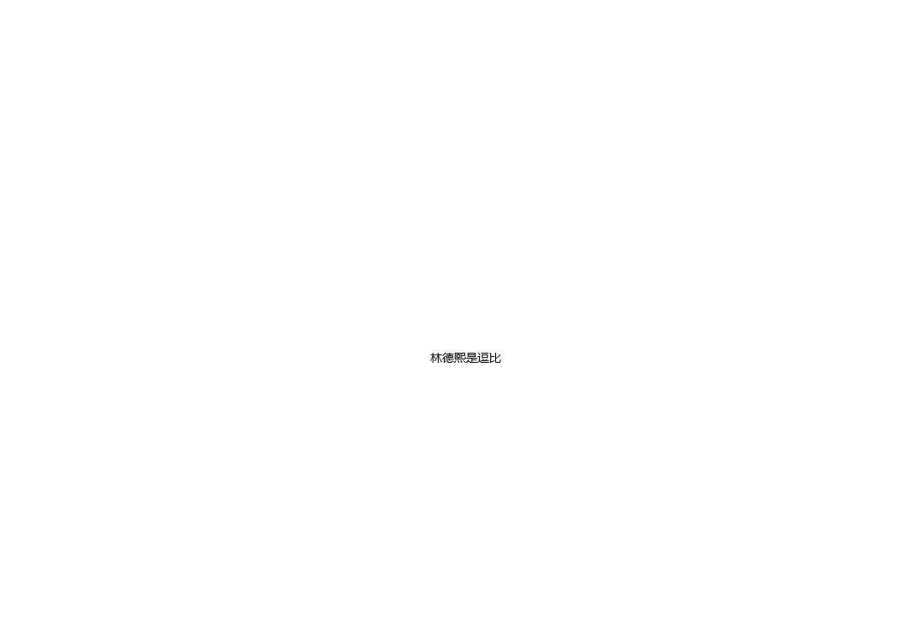
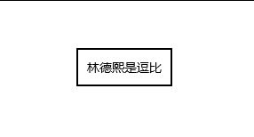
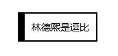
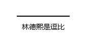
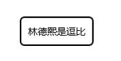
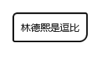
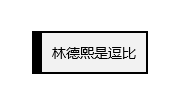

# win10 uwp 使用 Border 布局

在 UWP 写一个界面需要将元素排列，在排列元素的时候有特殊的元素叫容器。容器的意思是元素里面包含元素，在 UWP 用到的容器有很多，也可以自己写一个。简单的容器是 Border 边框控件，如控件说的，这个容器就是用来做元素的边框。提供元素边框和背景，只能在这个容器里面放一个元素

<!--more-->
<!-- CreateTime:2019/4/29 12:29:45 -->


在 UWP 中可以直接在 xaml 写界面，建议将界面在 xaml 写。简单创建项目写一个 Border 里面有一个文本

```csharp
        <Border HorizontalAlignment="Center" VerticalAlignment="Center">
            <TextBlock Margin="10,10,10,10" Text="林德熙是逗比" />
        </Border>
```

这里的 Border 有两个设置的属性 HorizontalAlignment 和 VerticalAlignment 属性，这两个属性是通用的 UIElement 的属性，也就是界面元素定义的属性

定义 HorizontalAlignment 用在外层的容器的布局，容器发现 HorizontalAlignment 就知道需要将这个元素放在水平的哪里

定义 VerticalAlignment 就是告诉外层需要将这个元素放在垂直的哪里，详细请看 [win10 uwp 一张图说明水平对齐和垂直对齐](https://blog.lindexi.com/post/win10-uwp-%E4%B8%80%E5%BC%A0%E5%9B%BE%E8%AF%B4%E6%98%8E%E6%B0%B4%E5%B9%B3%E5%AF%B9%E9%BD%90%E5%92%8C%E5%9E%82%E7%9B%B4%E5%AF%B9%E9%BD%90.html )

在 Border 里面只能放一个元素，上面代码是一个文本，运行代码可以看到这个界面

<!--  -->


在 VisualStudio 2017 可以在 UWP 运行修改 xaml 代码修改界面，在 Border 控件定义边框

边框包括两个需要定义的属性，一个是边框的线条宽度，另一个是边框的颜色。修改代码，加上 `BorderThickness="2" BorderBrush="Black"` 修改 Border 边框宽度为 2 颜色是黑色

```csharp
        <Border HorizontalAlignment="Center" VerticalAlignment="Center"
                BorderThickness="2" BorderBrush="Black">
            <TextBlock Margin="10,10,10,10" Text="林德熙是逗比" />
        </Border>
```

<!--  -->


其实边框可以定制的很多，如我需要边框的上方线条宽度是 2 像素，边框左边是10像素，边框的下方是 2 像素等，我可以这样写

```csharp
        <Border HorizontalAlignment="Center" VerticalAlignment="Center"
                BorderThickness="10 2 2 2" BorderBrush="Black">
            <TextBlock Margin="10,10,10,10" Text="林德熙是逗比" />
        </Border>
```

这里的 Border 宽度是可以使用多个值和 Margin 相同，顺序是左上右下对应修改就可以

<!--  -->


如果修改宽度为 0 那么就看不到相同，如我就需要在文本画一条直线

```csharp
        <Border HorizontalAlignment="Center" VerticalAlignment="Center"
                BorderThickness="0 2 0 0" BorderBrush="Black">
            <TextBlock Margin="10,10,10,10" Text="林德熙是逗比" />
        </Border>
```

<!--  -->


边框还可以修改圆角 CornerRadius 请看代码

```csharp
        <Border HorizontalAlignment="Center" VerticalAlignment="Center"
                BorderThickness="2 2 2 2" BorderBrush="Black" CornerRadius="5">
            <TextBlock Margin="10,10,10,10" Text="林德熙是逗比" />
        </Border>
```

<!--  -->


和 BorderThickness 一样，可以修改 CornerRadius 的上下左右的值，顺序是左上角 右上角 右下角 左下角

```csharp
        <Border HorizontalAlignment="Center" VerticalAlignment="Center"
                BorderThickness="2 2 2 2" BorderBrush="Black" CornerRadius="5 2 10 2">
            <TextBlock Margin="10,10,10,10" Text="林德熙是逗比" />
        </Border>
```

<!--  -->


在 TextBlock 是没有背景属性的，那么如何给一段文字修改背景？可以使用 Border 里面放文本，通过修改背景的方法。请看代码我修改了边框的背景，这样文本也就被我修改背景

```csharp
        <Border HorizontalAlignment="Center" VerticalAlignment="Center"
                BorderThickness="10 2 2 2" BorderBrush="Black" Background="#0F252525">
            <TextBlock Margin="10,10,10,10" Text="林德熙是逗比" />
        </Border>
```

颜色有两个写法，一个是直接写预定的颜色，如 Black 黑色，另一个是写颜色的 `#AARRGGBB` 可以在 QQ 截图的时候按下 ctrl 键知道屏幕鼠标的颜色

<!--  -->


在写到了背景会看到还有属性是 BackgroundSizing 这个表示背景是否包含边框，默认的值是 InnerBorderEdge 也就是背景大小是不包括边框，可以修改为 OuterBorderEdge 背景大小包括边框。这个属性是在边框是透明的时候才有用

另外还有背景动画，这个需要在后台修改背景，通过 BrushTransition 在元素背景修改的时候做动画渐变

```csharp
        <Border HorizontalAlignment="Center" VerticalAlignment="Center"
                BorderThickness="20 20 2 2" BorderBrush="Transparent" CornerRadius="5 2 10 2"
                Background="{x:Bind BorderBackground,Mode=OneWay}" BackgroundSizing="OuterBorderEdge">
            <Border.BackgroundTransition>
                <BrushTransition></BrushTransition>
            </Border.BackgroundTransition>
            <TextBlock Margin="10,10,10,10" Text="林德熙是逗比" />
        </Border>
```

在后台创建属性 BorderBackground 在两秒之后修改颜色，可以看到这个方法的动画很诡异，如果想要好看的动画请看[UWP Background过渡动画 - 叫我蓝火火 - 博客园](https://www.cnblogs.com/blue-fire/p/9617275.html )

```csharp
        public MainPage()
        {
            this.InitializeComponent();

            Task.Delay(TimeSpan.FromSeconds(2)).ContinueWith(async _ =>
            {
                await Dispatcher.RunAsync(CoreDispatcherPriority.Normal,
                    () => { BorderBackground = new SolidColorBrush(Colors.Black); });
            });
        }

        public static readonly DependencyProperty BorderBackgroundProperty = DependencyProperty.Register(
            "BorderBackground", typeof(Brush), typeof(MainPage),
            new PropertyMetadata(new SolidColorBrush(Colors.White)));

        public Brush BorderBackground
        {
            get { return (Brush) GetValue(BorderBackgroundProperty); }
            set { SetValue(BorderBackgroundProperty, value); }
        }
```

[Border.BackgroundTransition Property (Windows.UI.Xaml.Controls)](https://docs.microsoft.com/en-us/uwp/api/windows.ui.xaml.controls.border.backgroundtransition )

[Border Class (Windows.UI.Xaml.Controls)](https://docs.microsoft.com/en-us/uwp/api/windows.ui.xaml.controls.border )

<a rel="license" href="http://creativecommons.org/licenses/by-nc-sa/4.0/"></a><br />本作品采用<a rel="license" href="http://creativecommons.org/licenses/by-nc-sa/4.0/">知识共享署名-非商业性使用-相同方式共享 4.0 国际许可协议</a>进行许可。欢迎转载、使用、重新发布，但务必保留文章署名[林德熙](http://blog.csdn.net/lindexi_gd)(包含链接:http://blog.csdn.net/lindexi_gd )，不得用于商业目的，基于本文修改后的作品务必以相同的许可发布。如有任何疑问，请与我[联系](mailto:lindexi_gd@163.com)。  
