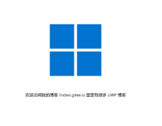
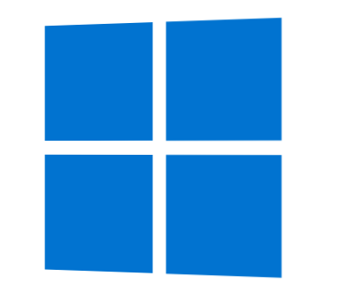

# win10 uwp 使用 Matrix3DProjection 进行 3d 投影

在UWP可以通过 Matrix3DProjection 让元素显示出来的界面进行 3d 变换

<!--more-->
<!-- CreateTime:2018/11/19 15:31:42 -->


在所有的 UIElement 都可以通过 Projection 属性，设置元素的投影，可以让 2d 的元素看起来和 在 3d 上的一样

例如在界面添加一个图片

```csharp
	       <Image x:Name="Image" Source="Assets/Square150x150Logo.png" HorizontalAlignment="Center" VerticalAlignment="Center"></Image>
```

在后台代码让图片点击的时候，先下和向右移动 100 像素

```csharp
       public MainPage()
        {
            this.InitializeComponent();
            Image.PointerPressed += Image_PointerPressed;
        }

        private void Image_PointerPressed(object sender, PointerRoutedEventArgs e)
        {
            Matrix3D m = new Matrix3D();

            // This matrix simply translates the image 100 pixels
            // down and 100 pixels right.
            m.M11 = 1.0; m.M12 = 0.0; m.M13 = 0.0; m.M14 = 0.0;
            m.M21 = 0.0; m.M22 = 1.0; m.M23 = 0.0; m.M24 = 0.0;
            m.M31 = 0.0; m.M32 = 0.0; m.M33 = 1.0; m.M34 = 0.0;
            m.M44 = 1.0;
            m.OffsetX = 100;
            m.OffsetY = 100;
            m.OffsetZ = 0;

            var m3dProjection = new Matrix3DProjection {ProjectionMatrix = m};

            Image.Projection = m3dProjection;
        }
```

从上面可以看到，在后台代码写的很多，如果在 xaml 写的代码就很少

```xml
       <Image x:Name="Image" Source="Assets/Square150x150Logo.png" HorizontalAlignment="Center"
               VerticalAlignment="Center">
            <Image.Projection>
                <Matrix3DProjection
                    ProjectionMatrix="001, 000, 0, 0,
                                      000, 001, 0, 0,
                                      000, 000, 1, 0,
                                      100, 100, 0, 1" />
            </Image.Projection>
        </Image>
```

这里的代码和上面的后台代码点击的时候是一样的

现在来模仿做一个微软的图标，通过界面画出 2d 的微软图标

```xml
        <Grid HorizontalAlignment="Center" VerticalAlignment="Center">
            <StackPanel>
                <StackPanel.Resources>
                    <Style TargetType="Border">
                        <Setter Property="BorderBrush" Value="Transparent" />
                        <Setter Property="BorderThickness" Value="5" />
                        <Setter Property="Background" Value="#0173d0" />
                        <Setter Property="Width" Value="100" />
                        <Setter Property="Height" Value="100" />
                    </Style>
                </StackPanel.Resources>
                <StackPanel Orientation="Horizontal">
                    <Border />
                    <Border />
                </StackPanel>
                <StackPanel Orientation="Horizontal">
                    <Border />
                    <Border />
                </StackPanel>
            </StackPanel>
        </Grid>

```

<!--  -->


想要做到下图的效果，只需要修改一点代码

<!--  -->


在 Grid 添加 `RotationY="20"` 请看代码

```csharp
        <Grid HorizontalAlignment="Center" VerticalAlignment="Center">
            <Grid.Projection>
                <PlaneProjection RotationY="20" />
            </Grid.Projection>
            <StackPanel>
                <StackPanel.Resources>
                    <Style TargetType="Border">
                        <Setter Property="BorderBrush" Value="Transparent" />
                        <Setter Property="BorderThickness" Value="5" />
                        <Setter Property="Background" Value="#0173d0" />
                        <Setter Property="Width" Value="100" />
                        <Setter Property="Height" Value="100" />
                    </Style>
                </StackPanel.Resources>
                <StackPanel Orientation="Horizontal">
                    <Border />
                    <Border />
                </StackPanel>
                <StackPanel Orientation="Horizontal">
                    <Border />
                    <Border />
                </StackPanel>
            </StackPanel>
        </Grid>

```

这个方法使用的是比较简单的 PlaneProjection 方法，对于大部分开发已经满足，只有在复杂的需要，如矩阵变换的时候才需要使用 Matrix3DProjection 的方法

参见 [3-D perspective effects for XAML UI - UWP app developer](https://docs.microsoft.com/en-us/windows/uwp/design/layout/3-d-perspective-effects )

<a rel="license" href="http://creativecommons.org/licenses/by-nc-sa/4.0/"></a><br />本作品采用<a rel="license" href="http://creativecommons.org/licenses/by-nc-sa/4.0/">知识共享署名-非商业性使用-相同方式共享 4.0 国际许可协议</a>进行许可。欢迎转载、使用、重新发布，但务必保留文章署名[林德熙](http://blog.csdn.net/lindexi_gd)(包含链接:http://blog.csdn.net/lindexi_gd )，不得用于商业目的，基于本文修改后的作品务必以相同的许可发布。如有任何疑问，请与我[联系](mailto:lindexi_gd@163.com)。
