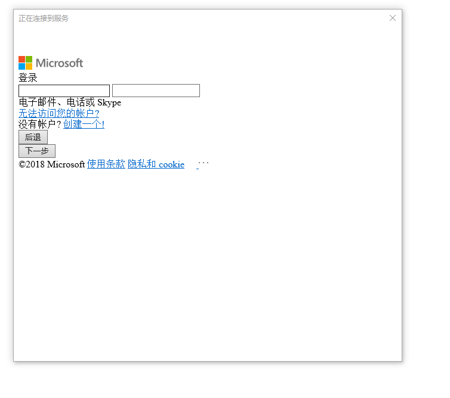

# win10 uwp 使用 Microsoft.Graph 发送邮件

在 2018 年 10 月 13 号参加了 [张队长](http://www.csharpkit.com/ ) 的 [Office 365 训练营](https://www.cnblogs.com/adalovelacer/archive/2018/09/16/9657143.html ) 学习如何开发 Office 365 插件和 OAuth 2.0 开发，于是我就使用 UWP 尝试使用 Microsoft.Graph 经过了一天的测试终于成功使用发送邮件

本文告诉大家如何在 UWP 调用 Microsoft.Graph 发送邮件

<!--more-->
<!-- CreateTime:2019/12/24 9:27:54 -->


在仔细阅读了[Microsoft Graph 桌面应用程序 - 陈希章](https://www.cnblogs.com/chenxizhang/p/7904255.html )的文章之后，按照文章的方法尝试了很久终于成功发送了邮件

可以使用 Microsoft.Graph 调用 Office 365 的几乎所有功能，但是我只有成功使用邮件的功能，暂时就先告诉大家如何在 UWP 使用 Microsoft.Graph 发送邮件

之后的其他功能等我跑通了，再告诉大家

因为 Microsoft.Graph 开发速度是很快的，本文安装的 Nuget 都会告诉大家指定的版本，防止因为微软的版本修改而让大家无法按照本文提供的方式

## 注册应用

首先登陆 [Microsoft Applications](https://apps.dev.microsoft.com/ ) 平台，在登陆之后可以看到下面界面

<!--  -->


本文用的例子都是使用国际版的 Office 365 版本，而不会使用国内的版本，因为国内的版本少了很多功能


点击添加应用，随意给一个应用的命名，我这里给了一个 LasecouDofalerJornowserewel 应用

<!--  -->


需要记下程序的 ID 在应用会用到

<!--  -->


添加权限，要发送邮件，需要添加 `"User.Read", "Mail.Read", "Mail.Send","Files.Read"` 权限

<!--  -->


点击添加权限

<!--  -->


点击添加应用程序权限

<!--  -->


关于权限这一步，请先照着点，详细请看[Office 365 开发入门指南](https://chenxizhang.gitbooks.io/office365devguide)

还有这个步骤最重要的，点击下方的保存，有小伙伴就告诉我按照我的教程无法成功，过了很长的时间才发现是没有保存

## 创建 UWP 程序

打开 VisualStudio 创建一个 UWP 项目，尽可能选择新版本，只有在自己跑通了之后才使用小的版本，防止因为版本问题在尝试开发的时候做到放弃

我创建了一个 BalreMahouVoomawbatu 项目，最低版本是 17134 也就是现在最新的

<!--  -->


<!--  -->


## 安装 nuget 包

右击项目，点击管理 Nuget 包

先点击安装 Microsoft.Graph 的 1.11 版本

<!--  -->


然后勾选包含预发行版，找到 Microsoft.Identity.Client 的 2.2 版本

<!--  -->


## 添加访问权限

打开 UWP 的 MainPage.xaml.cs 文件，添加 Load 事件

<!--  -->


在 Load 事件的函数添加自己的代码，首先使用 DelegateAuthenticationProvider 拿到访问的权限，在 Microsoft.Graph 的所有访问都需要先获得 OAuth 的权限

在文件的最上面添加引用

```csharp
using Microsoft.Graph;

```

然后在 MainPage_Loaded 添加下面代码

```csharp
            var provider = new DelegateAuthenticationProvider(AuthenticateRequestAsyncDelegate);

```

创建方法 AuthenticateRequestAsyncDelegate 请看下面

```csharp
        private Task AuthenticateRequestAsyncDelegate(HttpRequestMessage request)
        {
            
        }
```

现在的代码还是无法运行通过的，需要在 AuthenticateRequestAsyncDelegate 添加访问的 Token 拿到权限

还记得刚才记下来的程序 ID 现在就需要用到他了

<!--  -->


请看下面代码

```csharp
        private Task AuthenticateRequestAsyncDelegate(HttpRequestMessage request)
        {

            string clientID = "2f56798a-66f7-4330-9bc4-d3a8a0898642"; //这个ID是我创建的一个临时App的ID，请替换为自己的
            string[] scopes = {"User.Read", "Mail.Read", "Mail.Send", "Files.Read"};

        }
```

<!--  -->


通过 clientID 创建 `Microsoft.Identity.Client.PublicClientApplication` 请看代码

```csharp
             string clientID = "2f56798a-66f7-4330-9bc4-d3a8a0898642"; //这个ID是我创建的一个临时App的ID，请替换为自己的
            string[] scopes = {"User.Read", "Mail.Read", "Mail.Send", "Files.Read"};

            var clientApplication = new PublicClientApplication(clientID);

```

使用 clientApplication 获得权限

```csharp
            var authenticationResult = await clientApplication.AcquireTokenAsync(scopes);

```

运行到这一步就会请求用户的权限

从获取到的权限给传入的参数

```csharp
            request.Headers.Authorization = new AuthenticationHeaderValue("Bearer", authenticationResult.AccessToken);

```

详细关于 OAuth 获取权限的请看张队长的博客，这里的博客很多，请看文章的最后

现在可以看到的 AuthenticateRequestAsyncDelegate 代码是这样

```csharp
        private async Task AuthenticateRequestAsyncDelegate(HttpRequestMessage request)
        {

            string clientID = "2f56798a-66f7-4330-9bc4-d3a8a0898642"; //这个ID是我创建的一个临时App的ID，请替换为自己的
            string[] scopes = { "User.Read", "Mail.Read", "Mail.Send", "Files.Read" };

            var clientApplication = new PublicClientApplication(clientID);

            var authenticationResult = await clientApplication.AcquireTokenAsync(scopes);

            request.Headers.Authorization = new AuthenticationHeaderValue("Bearer", authenticationResult.AccessToken);
        }
```

注意需要替换这里的 clientID 为你自己的 clientID 当然代码可以按照我的使用，因为用我的 ID 也是没问题

## 发送邮件

在获取到权限之后，很容易就可以调用 Microsoft.Graph 发送邮件，请看代码

创建 GraphServiceClient 之后调用 SendMail 就可以，邮件里面的内容请自己修改

```csharp
            await client.Me.SendMail(new Message()
            {
                Subject = "调用Microsoft Graph发出的邮件",
                Body = new ItemBody()
                {
                    ContentType = BodyType.Text,
                    Content = "这是一封调用了Microsoft Graph服务发出的邮件，范例参考 https://github.com/chenxizhang/office365dev"
                },
                ToRecipients = new[]
                {
                    new Recipient()
                    {
                        EmailAddress = new EmailAddress() {Address = "lindexi_gd@outlook.com"}
                    }
                }
            }, SaveToSentItems: true /*保存到发送邮件夹*/).Request().PostAsync();
```

<!--  -->


特别是 EmailAddress 请修改为你自己的邮箱，因为已经设置 SaveToSentItems 即使发送给我也可以在自己的已经发送邮件夹找到这个邮件

现在尝试运行一下这个 UWP 程序，在运行之前需要右击部署一下

运行之后需要等待很久才可以看到这个界面，在国内的网络不是很好，所以可能会看到这个界面

<!--  -->


如果看到下面这个界面，请多次重试

<!--  -->


或者给 IE 可以用的代理，默认的 UWP 程序会使用 IE 的代理

如果看到这个页面，证明可以访问

<!--  -->


因为所有的代码都没有涉及到界面，登陆之后等待一会，就可以打开自己的 Outlook 邮箱看到刚才发送的邮件

<!--  -->


<!--  -->


看到这里就可以知道，现在UWP发送邮件有三个方法，本文是其中一个，其他方法请看[win10 UWP 发邮件](https://lindexi.gitee.io/post/win10-UWP-%E5%8F%91%E9%82%AE%E4%BB%B6.html )

本文代码放在 [github](https://github.com/lindexi/lindexi_gd/blob/22a89c4f916dc891e384324b29138dda3dfdb426/BalreMahouVoomawbatu/) 欢迎小伙伴访问

参考

[Microsoft Graph 桌面应用程序 - 陈希章 - 博客园](https://www.cnblogs.com/chenxizhang/p/7904255.html )

[ASP.NET Core Identity 实战（1）——Identity 初次体验 - .Net Core 微服务 - .Net Core 开源微服务 套件 工具包 CSharpKit](http://www.csharpkit.com/2018-05-28_99073.html )

[ASP.NET Core Identity Hands On（2）——注册、登录、Claim - .Net Core 微服务 - .Net Core 开源微服务 套件 工具包 CSharpKit](http://www.csharpkit.com/2018-05-28_50086.html )

[OAuth2授权 - .Net Core 微服务 - .Net Core 开源微服务 套件 工具包 CSharpKit](http://www.csharpkit.com/2017-09-23_69971.html )

[教你实践ASP.NET Core Authorization - .Net Core 微服务 - .Net Core 开源微服务 套件 工具包 CSharpKit](http://www.csharpkit.com/2017-09-23_51057.html )

[ASP.NET Core 之 Identity 入门（一） - .Net Core 微服务 - .Net Core 开源微服务 套件 工具包 CSharpKit](http://www.csharpkit.com/2017-09-23_56275.html )

[ASP.NET Core 之 Identity 入门（二） - .Net Core 微服务 - .Net Core 开源微服务 套件 工具包 CSharpKit](http://www.csharpkit.com/2017-09-23_51500.html )

<a rel="license" href="http://creativecommons.org/licenses/by-nc-sa/4.0/"></a><br />本作品采用<a rel="license" href="http://creativecommons.org/licenses/by-nc-sa/4.0/">知识共享署名-非商业性使用-相同方式共享 4.0 国际许可协议</a>进行许可。欢迎转载、使用、重新发布，但务必保留文章署名[林德熙](http://blog.csdn.net/lindexi_gd)(包含链接:http://blog.csdn.net/lindexi_gd )，不得用于商业目的，基于本文修改后的作品务必以相同的许可发布。如有任何疑问，请与我[联系](mailto:lindexi_gd@163.com)。
