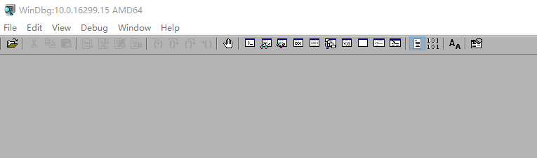
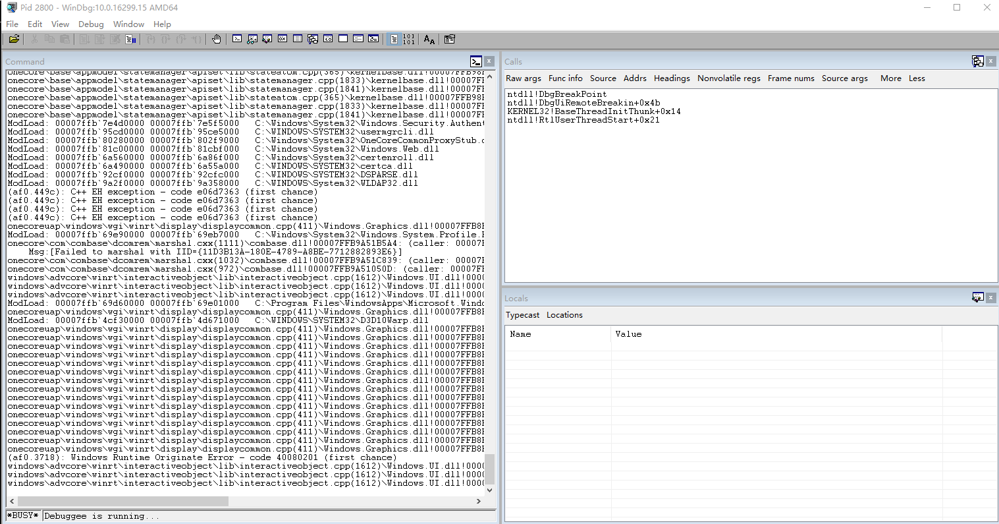
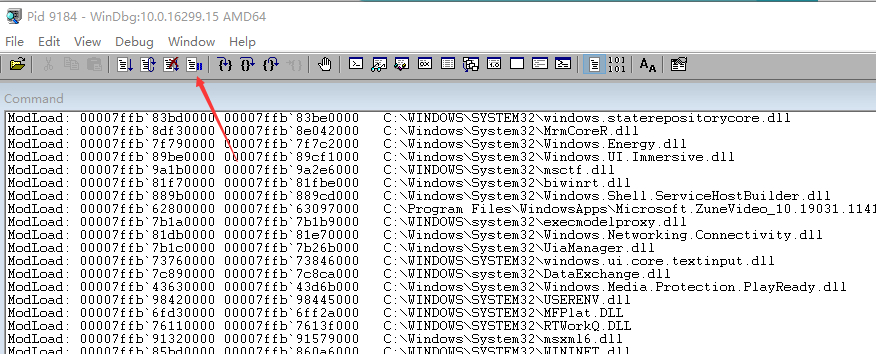
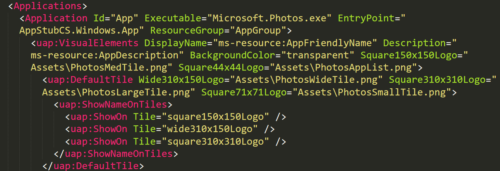
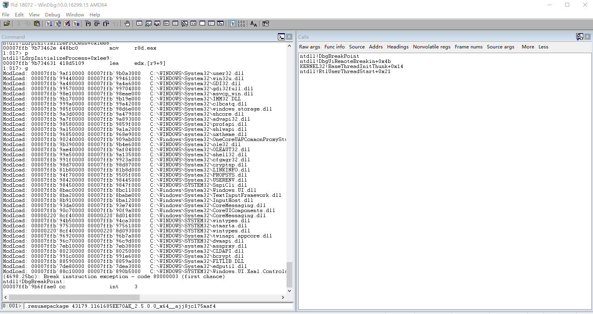

# win10 uwp 使用 WinDbg 调试

本文告诉大家如何用 WinDbg 调试 UWP 应用，使用 WinDbg 调试是在没有其他手段的时候才进行的调试，因为调试难度特别大。我最近因为发现有 Edge 和其他 UWP 程序打不开的问题，然而我没有 Edge 和其他 UWP 的源代码，于是我只能通过 WinDbg 去调试 UWP 程序

<!--more-->
<!-- CreateTime:2019/8/31 10:30:35 -->

<!-- csdn -->

## 找到工具

请不要在网上去下载 WinDbg 工具，请在安装完成 VisualStudio 安装对应的开发包，例如 UWP 的 17763 这个 sdk 开发包，调试工具将在开发包里面

如果想要调试 UWP 程序，那么不能使用古老的 6.12 版本调试，这个版本的 WinDbg 的路径在 `"C:\Program Files\Debugging Tools for Windows (x64)\windbg.exe"` 也就是文档里面说的路径，打开这个路径的程序，可以看到版本号如下

```csharp
6.12.0002.633
```

<!--  -->


用这个版本输入下面代码将会提示 `Syntax error in '.querypackages'` 也就是不支持 UWP 调试

```csharp
 .querypackages
                    ^ Syntax error in '.querypackages'
```

在安装完成 [Windows 10 SDK](https://developer.microsoft.com/en-us/windows/downloads/windows-10-sdk ) 之后，可以在 `C:\Program Files (x86)\Windows Kits\10\Debuggers` 里面找到对应的 x86 和 x64 等版本的工具，打开之后可以从标题栏看到版本号，要求的版本号是 10.0 以上

<!--  -->


## 附加进程调试

附加到 UWP 程序的方法和附加到普通的程序的方法相同，但是附加到 UWP 程序调试的难度会比较大，因为 UWP 程序在调试过程可能就被挂起

在 WinDbg 的 File 里面点击附加到进程，快捷键是 F6 找到对应的进程就可以附加

建议的方法是通过任务管理器找到对应的进程的进程号，然后在附加进程里面输入，这样的附加效率比较快

附加调试完成之后做什么就看你技术了

下面图片是我附加调试到照片程序

<!--  -->


## 启动 UWP 程序

通过启动的时候进行调试比较好的方法，需要使用命令行方式启动 windbg 程序，使用下面命令

```csharp
windbg.exe -plmPackage <PLMPackageName> -plmApp <ApplicationId> [<parameters>]
```

可以从命令看到需要两个参数，一个是 `PLMPackageName` 一个是 `ApplicationId` 下面让我告诉大家如何拿到这两个参数

第一个参数需要在 windbg 命令行输入 `.querypackages` 命令，而默认打开的 windbg 是不提供命令行的，此时就需要让 windbg 进入调试，这样才能输入命令

打开 WinDbg 程序，随意附加到一个可以附加的进程，例如 QQ 程序，这时可不要选 DWM 或 Explorer 调试，如果你好奇为什么，那么请保存好你的所有代码，然后附加一下

附加到任意的进程是为了可以在 Windbg 里面输入命令，附加之后点击暂停

<!--  -->


这样就可以在命令行输入内容了

输入 `.querypackages` 命令可以列出本机所有安装的 UWP 程序，看起来内容很多，不过好在菜单里面的 Edit 有 Find 的功能，可以查找字符串，用这个方法查找到需要调试的 UWP 程序可以看到他的信息

如用我的图床为例

```csharp
Package Full Name: 43179.1161685EE70AE_2.5.0.0_x64__ajj8jc175maf4
Package Display Name: uwp 图床
Version: 2.5.0.0
Processor Architecture: x64
Publisher: CN=227D1644-D24B-430C-AFA3-3FD86CE65409
Publisher Display Name: 林德熙
Install Folder: C:\Program Files\WindowsApps\43179.1161685EE70AE_2.5.0.0_x64__ajj8jc175maf4
Package State: Running
AppId: App

```

这里的 `Package Full Name` 就是对应的 `PLMPackageName` 的参数，而 AppId 就是对应的第二个参数，当然还有另一个方法拿到 AppId 的值

知道了全名，可以通过在 `C:\Program Files\WindowsApps\` 路径找到对应的包，也就是拼接路径 `C:\Program Files\WindowsApps\全名` 例如照片的路径

```csharp
C:\Program Files\WindowsApps\Microsoft.Windows.Photos_2019.19061.18920.0_x64__8wekyb3d8bbwe
```

在这个路径里面可以找到 AppxManifest.xml 文件，也就是 `C:\Program Files\WindowsApps\全名\AppxManifest.xml` 在这个文件里面将会记录 id 是什么

<!--  -->


在知道了 `PLMPackageName` 和 `ApplicationId` 就可以通过命令行打开 WinDbg 启动调试

```csharp
windbg.exe -plmPackage 43179.1161685EE70AE_2.5.0.0_x64__ajj8jc175maf4 -plmApp App 
```

上面代码就可以打开我的图床进入调试

## 挂起应用

有一些 UWP 程序在调试过程就 gg 了，一个可以使用的方法是在进行符号加载的时候先将他挂起

在 UWP 运行的时候，有以下状态 suspend 和 resume 详细请看 [Windows 10 UWP App lifecycle - Windows UWP applications](https://docs.microsoft.com/en-us/windows/uwp/launch-resume/app-lifecycle )

可以使用下面命令

```csharp
.suspendpackage <PLMPackageName> 
```

这里的 `PLMPackageName` 就是上面拿到的应用全名，用我刚才启动调试的图床为例，请看代码

```csharp
.suspendpackage 43179.1161685EE70AE_2.5.0.0_x64__ajj8jc175maf4
```

执行之后软件就挂起了，让软件继续执行的方法是 `.resumepackage` 请看代码

```csharp
.resumepackage <PLMPackageName> 
```

和上面相同，用被挂起的图床作为例子，先点击 break 进入断点，然后在命令行输入代码，请看下图

<!--  -->


输入代码之后按下回车，将会有以下提示

```csharp
The "resumePackage" action will be completed on next execution.
```

此时点击继续按钮就可以

还有其他更多的命令就请小伙伴去看文档，虽然在 UWP 里面用 windbg 调试难度很高，但是用来吹水还是可以

虽然有官方文档，但相信我，很少有小伙伴能按照官方文档说的调试

[Windows 10 SDK - Windows app development](https://developer.microsoft.com/en-us/windows/downloads/windows-10-sdk )

[Debugging a UWP app using WinDbg - Windows drivers](https://docs.microsoft.com/en-us/windows-hardware/drivers/debugger/debugging-a-uwp-app-using-windbg?wt.mc_id=MVP )

<a rel="license" href="http://creativecommons.org/licenses/by-nc-sa/4.0/"></a><br />本作品采用<a rel="license" href="http://creativecommons.org/licenses/by-nc-sa/4.0/">知识共享署名-非商业性使用-相同方式共享 4.0 国际许可协议</a>进行许可。欢迎转载、使用、重新发布，但务必保留文章署名[林德熙](http://blog.csdn.net/lindexi_gd)(包含链接:http://blog.csdn.net/lindexi_gd )，不得用于商业目的，基于本文修改后的作品务必以相同的许可发布。如有任何疑问，请与我[联系](mailto:lindexi_gd@163.com)。
