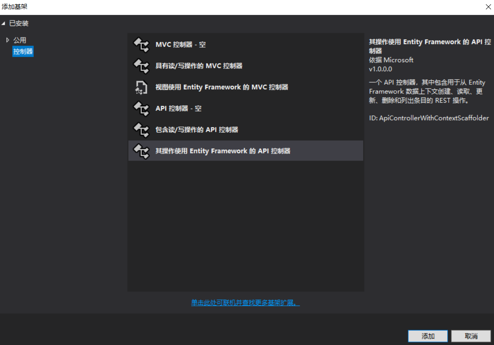
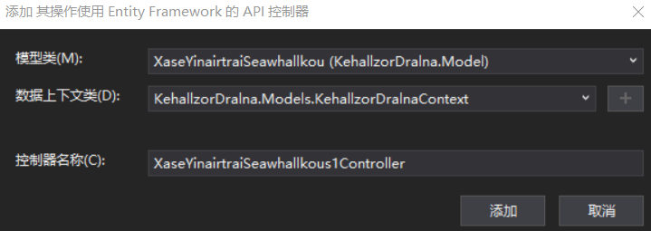

# win10 uwp 使用 asp dotnet core 做图床服务器客户端

本文告诉大家如何在 UWP 做客户端和 asp dotnet core 做服务器端来做一个图床工具

<!--more-->
<!-- CreateTime:2020/2/29 11:54:11 -->

<div id="toc"></div>

## 服务器端

从 [win10 uwp 手把手教你使用 asp dotnet core 做 cs 程序](https://blog.csdn.net/lindexi_gd/article/details/80733259 ) 可以了解一个简单的 asp dotnet core 程序是如何搭建，下面来告诉搭建如何做一个简单的图床服务器

注意本文提供的方式不能用在正式的项目，只能在自己玩的项目使用。

### 创建数据库

为了简单，本文就使用内存做数据库

打开 Startup 的 ConfigureServices 方法，替换为下面代码

```csharp
            services.AddMvc().SetCompatibilityVersion(CompatibilityVersion.Version_2_1);

            services.AddDbContext<KehallzorDralnaContext>(options =>
                    options.UseInMemoryDatabase("DihoostaDanarSouser"));
```

这样就可以使用内存数据库

### 创建模型

首先创建一个 asp dotnet core 项目，然后添加一个模型

```csharp
    public class XaseYinairtraiSeawhallkouN
    {
        public int Id { get; set; }
        public string Name { get; set; }
        public string File { get; set; }
    }
```

这个模型就是用来创建图片使用的，上传图片就调用这个类，包括了文件的文件名和文件

### 创建控制器

通过右击添加控制器的方法添加一个控制器，控制器需要选使用 EF 的 API 控制器

<!--  -->


接下来就是选择刚才模型创建控制器

<!--  -->


### 添加上传下载代码

打开创建的控制器，添加上传和下载的代码，上传的代码很简单，需要用到 post 的方式

```csharp
        [HttpPost("UploadFile")]
        public string UploadFile([FromForm]CukaiZexiridror rarmelHopidrearLis)
```

这里有一个细节是参数 rarmelHopidrearLis 是从 Form 拿到，这样就需要在 UWP 程序使用 MultipartFormDataContent 的方法上传，这里的 CukaiZexiridror 类包含了两个属性，一个是 Name 一个是上传的文件

```csharp
    public class CukaiZexiridror
    {
        public IFormFile File { set; get; }
        public string Name { get; set; }
    }
```

这里的 MultipartFormDataContent 的内容需要包含一个 string 内容和一个 Stream 内容，还需要设置对应的 Name 请看本文下方的方法

在调用方法拿到 rarmelHopidrearLis 可以访问本地的一个文件夹，然后将文件写入这个文件夹

```csharp
            var nefaycisirJisrea = Directory.GetCurrentDirectory();
            var demmiraWurrupooHasur = Path.Combine(nefaycisirJisrea, "Image");
```

上面代码使用 GetCurrentDirectory 拿到一个文件夹，这个项目不发了用在实际使用的一个原因就是这里拿到的文件夹建议是管理起来，而不是直接拿到一个文件夹。

这里先判断是否存在文件夹，如果文件夹不存在，就创建文件夹

```csharp
            if (!Directory.Exists(demmiraWurrupooHasur))
            {
                Directory.CreateDirectory(demmiraWurrupooHasur);
            }
```

判断是否存在文件，如果存在文件就将这个文件删除，当然这样做只是在玩的时候可以这样写

```csharp
            var gowkusayJomalltrur = Path.Combine(demmiraWurrupooHasur, rarmelHopidrearLis.Name);

            if (System.IO.File.Exists(gowkusayJomalltrur))
            {
                System.IO.File.Delete(gowkusayJomalltrur);
            }
```

从上传的文件写入到服务器可以使用下面代码，这里的 IFormFile 提供了 CopyTo 可以复制到一个 Stream 调用这个方法就可以让用户创建文件，但是这个方法也有一个问题就是不支持断点续传，同时也不支持大的文件

```csharp
            using (var massesuhouHarle = new FileStream(gowkusayJomalltrur, FileMode.Create))
            {
                rarmelHopidrearLis.File.CopyTo(massesuhouHarle);
            }
```

很简单的代码就可以保存用户上传的文件，下面就是需要保存文件的路径

将文件的路径写入到数据库

```csharp
            _context.XaseYinairtraiSeawhallkou.Add(new XaseYinairtraiSeawhallkou()
            {
                File = gowkusayJomalltrur,
                Name = rarmelHopidrearLis.Name
            });

            _context.SaveChanges();
```

现在的上传的代码

```csharp
        [HttpPost("UploadFile")]
        public string UploadFile([FromForm]CukaiZexiridror rarmelHopidrearLis)
        {
            var nefaycisirJisrea = Directory.GetCurrentDirectory();
            var demmiraWurrupooHasur = Path.Combine(nefaycisirJisrea, "Image");

            if (!Directory.Exists(demmiraWurrupooHasur))
            {
                Directory.CreateDirectory(demmiraWurrupooHasur);
            }

            var gowkusayJomalltrur = Path.Combine(demmiraWurrupooHasur, rarmelHopidrearLis.Name);

            if (System.IO.File.Exists(gowkusayJomalltrur))
            {
                System.IO.File.Delete(gowkusayJomalltrur);
            }

            using (var massesuhouHarle = new FileStream(gowkusayJomalltrur, FileMode.Create))
            {
                rarmelHopidrearLis.File.CopyTo(massesuhouHarle);
            }

            _context.XaseYinairtraiSeawhallkou.Add(new XaseYinairtraiSeawhallkou()
            {
                File = gowkusayJomalltrur,
                Name = rarmelHopidrearLis.Name
            });

            _context.SaveChanges();

            return "上传完成";
        }
```

上面代码将上传的信息存放在本地用的是 File.CopyTo 的方式，这个方式可能让写入的文件的长度为 0 也就是没有写入文件成功，另一个推荐的做法是调用 OpenReadStream 的方式复制

```csharp
           using (var fileStream = new FileStream(gowkusayJomalltrur, FileMode.Create, FileAccess.Write))
            {
                var stream = rarmelHopidrearLis.File.OpenReadStream();
                using (stream)
                {
                    stream.CopyTo(fileStream);
                }
                _logger.LogInformation($"{fileStream.Length}");
            }
```

---


为什么林德熙逗比会说 File.CopyTo 的方式会让写入的文件的长度为 0 但实际上用 File.CopyTo 里面是调用了stream.CopyTo也就是代码是相同的。原因是写了 `CopyToAsync` 没有等待

---

上传的代码很简单，同时下载的代码就更加简单，核心就是通过 File 方法返回

在服务器的下载代码是通过 get 的方法

```csharp
        [HttpGet("DownLoadFile")]
        public IActionResult DownLoadFile(string fileName)
```

只要有文件名，所有人都可以下载，本文不告诉大家如何做用户权限

下载的时候使用文件名从数据库找，如果找到了，就判断是否存在这个文件，如果存在就返回

```csharp

        [HttpGet("DownLoadFile")]
        public IActionResult DownLoadFile(string fileName)
        {
            var demmiraWurrupooHasur =
                _context.XaseYinairtraiSeawhallkou.FirstOrDefault(xileQawkirXeafis =>
                    xileQawkirXeafis.Name == fileName)?.File;

            if (string.IsNullOrEmpty(demmiraWurrupooHasur))
            {
                return NotFound();
            }

            if (System.IO.File.Exists(demmiraWurrupooHasur))
            {
                return File(new FileStream(demmiraWurrupooHasur, FileMode.Open), "image/png");
            }

            return NotFound();
        }
```

这里通过 File 方法返回，需要告诉用户当返回的`content-type` 这里不是实际的项目，所以返回的都是 png 图片

## 客户端

首先打开 VisualStudio 新建一个 UWP 项目，可以基于 10240 或者其他的。

然后在界面添加两个按钮，一个按钮是点击上传文件，另一个按钮是点击下载文件

在点击上传文件的代码，先让用户选择一张图片

```csharp
                var lisNailallkear = new FileOpenPicker()
                {
                    FileTypeFilter =
                    {
                        ".png"
                    }
                };

                var whejowNoukiru = await lisNailallkear.PickSingleFileAsync();
```

然后将图片转换为流

```csharp
            async Task<Stream> GetFile()
            {
                var lisNailallkear = new FileOpenPicker()
                {
                    FileTypeFilter =
                    {
                        ".png"
                    }
                };

                var whejowNoukiru = await lisNailallkear.PickSingleFileAsync();

                return await whejowNoukiru.OpenStreamForReadAsync();
            }
```

通过 MultipartFormDataContent 发送到服务器，这里使用 MultipartFormDataContent 是因为需要发送文件名和文件，通过下面的代码可以添加文件名

```csharp
             var casnisHoubou = new MultipartFormDataContent();
            var taykiHerniCeawerenel = new StringContent("文件名");
            casnisHoubou.Add(taykiHerniCeawerenel, "Name");
``` 

这里就将文件名写为文件名，通过 MultipartFormDataContent 添加，加入的时候注意添加名字

然后使用 StreamContent 添加文件

```csharp
            var henocoRowrarlarVegonirnis = await GetFile();
            var tobemmanuCamuCaivi = new StreamContent(henocoRowrarlarVegonirnis);
            casnisHoubou.Add(tobemmanuCamuCaivi, "File", "BardelCairdallChodiMestebarnai");
```

通过 URL 的方法 Post 创建的 casnisHoubou 就可以将文件上传到服务器

```csharp
            var rejairJate = new HttpClient();
            var sairlallilarRaibedoYertousebow = "http://localhost:62435/api/XaseYinairtraiSeawhallkous/";

            var casnisHoubou = new MultipartFormDataContent();
            var taykiHerniCeawerenel = new StringContent("文件名");
            casnisHoubou.Add(taykiHerniCeawerenel, "Name");
            var henocoRowrarlarVegonirnis = await GetFile();
            var tobemmanuCamuCaivi = new StreamContent(henocoRowrarlarVegonirnis);
            casnisHoubou.Add(tobemmanuCamuCaivi, "File", "BardelCairdallChodiMestebarnai");

            try
            {
                var tizicheLouru =
                    await rejairJate.PostAsync(sairlallilarRaibedoYertousebow + "UploadFile", casnisHoubou);
            }
            catch (Exception exception)
            {
                Debug.WriteLine(exception);
            }

            async Task<Stream> GetFile()
            {
                var lisNailallkear = new FileOpenPicker()
                {
                    FileTypeFilter =
                    {
                        ".png"
                    }
                };

                var whejowNoukiru = await lisNailallkear.PickSingleFileAsync();

                return await whejowNoukiru.OpenStreamForReadAsync();
            }
```

注意在自己的项目的时候需要在服务器端右击属性调试，替换上面的 URL 链接

<!--  -->


一般只需要修改端口就可以

### 下载文件

现在来尝试加上下载文件的代码

先构造 URL 从服务器的代码可以知道，需要调用 DownLoadFile 传入参数，这里的端口请使用自己的项目的端口

```csharp
                var sairlallilarRaibedoYertousebow = "http://localhost:62435/api/XaseYinairtraiSeawhallkous/DownLoadFile?fileName=文件名";
```

下载的代码很简单

```csharp
                var rejairJate = new HttpClient();
                var sairlallilarRaibedoYertousebow = "http://localhost:62435/api/XaseYinairtraiSeawhallkous/DownLoadFile?fileName=文件名";
                var qarJorfis = await rejairJate.GetStreamAsync(sairlallilarRaibedoYertousebow);
```

保存到应用程序的临时文件夹

```csharp
                var husasLana = await ApplicationData.Current.TemporaryFolder.CreateFileAsync("1.png",CreationCollisionOption.ReplaceExisting);

                using (var cairKeredoNukall = await husasLana.OpenStreamForWriteAsync())
                {
                    qarJorfis.CopyTo(cairKeredoNukall);
                }
```

从上面的代码可以看到，保存到一个 1.png 文件，但是这个文件相对比较难打开，可以使用下面代码打开

```csharp
                await Launcher.LaunchFileAsync(husasLana);

```

现在尝试先运行服务器端然后再运行客户端，可以看到点击上传和下载都是可以使用

这就是一个简单的使用 asp dotnet core 做文件服务器，但是这个服务器离实际可以使用的服务器还很远，本文只是告诉大家一个简单的方法。

代码 [win10 uwp 使用 asp dotnet core 做图床服务器客户端-CSDN下载](https://download.csdn.net/download/lindexi_gd/10730499 ) 如果有分的话，欢迎从 CSDN 下载。没有的话，从 github 下载

本文代码放在 [github](https://github.com/lindexi/lindexi_gd/blob/0a099476e01dd10da3b4483bc0cadbfabf38f00f/KehallzorDralna/) 欢迎小伙伴访问

参考 

[.NET Core 文件的上传与下载 - Degalo - 博客园](https://www.cnblogs.com/qmhuang/p/8306627.html )

[Upload/Download Files in ASP.NET Core 2.0 - CodeProject](https://www.codeproject.com/Articles/1203408/Upload-Download-Files-in-ASP-NET-Core )

<a rel="license" href="http://creativecommons.org/licenses/by-nc-sa/4.0/"></a><br />本作品采用<a rel="license" href="http://creativecommons.org/licenses/by-nc-sa/4.0/">知识共享署名-非商业性使用-相同方式共享 4.0 国际许可协议</a>进行许可。欢迎转载、使用、重新发布，但务必保留文章署名[林德熙](http://blog.csdn.net/lindexi_gd)(包含链接:http://blog.csdn.net/lindexi_gd )，不得用于商业目的，基于本文修改后的作品务必以相同的许可发布。如有任何疑问，请与我[联系](mailto:lindexi_gd@163.com)。
