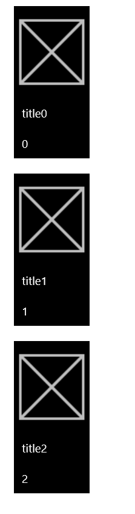
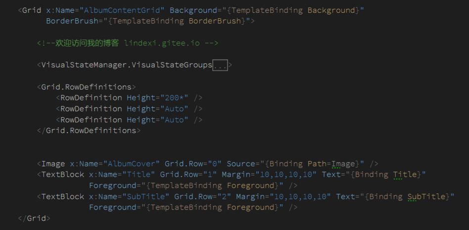

# win10 uwp 使用资源在后台创建控件

本文告诉大家如何使用资源在后台创建控件，本文使用按钮做例子，包括如何绑定资源，找到资源。

<!--more-->
<!-- CreateTime:2018/8/10 19:17:19 -->

<!-- csdn -->

## 定义资源

在 App.xaml 定义的资源样式可以在整个程序拿到，但是不建议在 App.xaml 直接写资源，建议是写一个资源文件，例如是 SormarMapay.xaml 在 App.xaml 用`ResourceDictionary.MergedDictionaries`合并

```
    <Application.Resources>
        <ResourceDictionary>
            <ResourceDictionary.MergedDictionaries>
                <ResourceDictionary Source="SormarMapay.xaml"></ResourceDictionary>
            </ResourceDictionary.MergedDictionaries>
        </ResourceDictionary>
    </Application.Resources>
```

现在可以打开 SormarMapay.xaml 写样式，这里需要写一个按钮的样式，就需要设置`TargetType="Button"`，例如这个按钮需要一张图片和标题、次标题

```
<ResourceDictionary
    xmlns="http://schemas.microsoft.com/winfx/2006/xaml/presentation" 
    xmlns:x="http://schemas.microsoft.com/winfx/2006/xaml">
    <Style x:Key="CustomButtonLarge" TargetType="Button">
        <Setter Property="Background" Value="Black" />
        <Setter Property="Foreground" Value="White" />
        <Setter Property="HorizontalAlignment" Value="Center" />
        <Setter Property="VerticalAlignment" Value="Top" />
        <Setter Property="Margin" Value="10,10,10,10"></Setter>
        <Setter Property="Height" Value="200" />
        <Setter Property="Width" Value="100" />
        <Setter Property="Template">
            <Setter.Value>
                <ControlTemplate TargetType="Button" >
                    <Grid x:Name="AlbumContentGrid" Background="{TemplateBinding Background}" >
                        <Grid.RowDefinitions>
                            <RowDefinition Height="200*"/>
                            <RowDefinition Height="Auto"/>
                            <RowDefinition Height="Auto"/>
                        </Grid.RowDefinitions>

                        <Image x:Name="AlbumCover" Grid.Row="0" Source="{Binding Path=Image}"/>
                        <TextBlock x:Name="Title" Grid.Row="1" Margin="10,10,10,10" Text="{Binding Title}" Foreground="{TemplateBinding Foreground}"/>
                        <TextBlock x:Name="SubTitle" Grid.Row="2" Margin="10,10,10,10" Text="{Binding SubTitle}" Foreground="{TemplateBinding Foreground}"/>
                    </Grid>
                </ControlTemplate>
            </Setter.Value>
        </Setter>
    </Style>
</ResourceDictionary>
```

这里需要解释一下，使用的`<Grid x:Name="AlbumContentGrid" Background="{TemplateBinding Background}" >`是为了让按钮的背景有用，如果没有设置这个值，也就是按钮的背景设置了是没有用的。

里面的控件使用的是`x:Name="AlbumCover"`而不是 `x:Key` ，因为只能使用name的方法。

为了在后台代码可以修改按钮的内容，就需要使用绑定 DataContext ，这时绑定只能用 Binding 的方法，如果大家发现如何在这里使用 `x:bind` 请告诉我

## 定义数据

这里使用的数据需要自己定义，下面代码定义一直类

```csharp
    public class Foo
    {
        public BitmapImage Image { get; set; }

        public string Title { get; set; }

        public string  SubTitle { get; set; }
    }
```

## 创建按钮

在 Main 页面添加下面代码，用来创建多个按钮

```csharp
        public MainPage()
        {
            this.InitializeComponent();

            Loaded += MainPage_Loaded;
        }

        private void MainPage_Loaded(object sender, RoutedEventArgs e)
        {
            int numberOfButtons = 3;


            for (int i = 0; i < numberOfButtons; i++)
            {
                var foo = new Foo
                {
                    Image = new BitmapImage(new Uri("ms-appx:///Assets/Square44x44Logo.scale-200.png")),
                    Title = "title" + i,
                    SubTitle = i.ToString()
                };

                Button btn = new Button();
                Style style = Application.Current.Resources["CustomButtonLarge"] as Style;

                btn.Style = style;

                btn.DataContext = foo;

                StackAlbums.Children.Add(btn);
            }
        }
```

上面的 StackAlbums 就是一个 StackPanel ，现在运行代码可以看到下面界面

<!--  -->


## 添加动画

如果使用了上面的代码可以看到，这个界面按钮是不存在按下的动画，因为没有写 `VisualStateManager` 现在打开 SormarMapay.xaml 在 AlbumContentGrid 添加下面代码

```
                        <VisualStateManager.VisualStateGroups>
                            <VisualStateGroup x:Name="CommonStates">
                                <VisualState x:Name="Normal">
                                    <Storyboard>
                                        <PointerUpThemeAnimation Storyboard.TargetName="AlbumContentGrid" />
                                    </Storyboard>
                                </VisualState>
                                <VisualState x:Name="PointerOver">
                                    <Storyboard>
                                        <ObjectAnimationUsingKeyFrames Storyboard.TargetName="AlbumContentGrid"
                                                                       Storyboard.TargetProperty="BorderBrush">
                                            <DiscreteObjectKeyFrame KeyTime="0"
                                                                    Value="{ThemeResource SystemControlHighlightBaseMediumLowBrush}" />
                                        </ObjectAnimationUsingKeyFrames>
                                        <ObjectAnimationUsingKeyFrames Storyboard.TargetName="Title"
                                                                       Storyboard.TargetProperty="Foreground">
                                            <DiscreteObjectKeyFrame KeyTime="0"
                                                                    Value="#aaaaaa" />
                                        </ObjectAnimationUsingKeyFrames>
                                        <ObjectAnimationUsingKeyFrames Storyboard.TargetName="SubTitle"
                                                                       Storyboard.TargetProperty="Foreground">
                                            <DiscreteObjectKeyFrame KeyTime="0"
                                                                    Value="#aaaaaa" />
                                        </ObjectAnimationUsingKeyFrames>
                                        <PointerUpThemeAnimation Storyboard.TargetName="AlbumContentGrid" />
                                    </Storyboard>
                                </VisualState>
                                <VisualState x:Name="Pressed">
                                    <Storyboard>
                                        <ObjectAnimationUsingKeyFrames Storyboard.TargetName="AlbumContentGrid"
                                                                       Storyboard.TargetProperty="Background">
                                            <DiscreteObjectKeyFrame KeyTime="0" Value="{ThemeResource SystemControlBackgroundBaseMediumLowBrush}" />
                                        </ObjectAnimationUsingKeyFrames>
                                        <ObjectAnimationUsingKeyFrames Storyboard.TargetName="AlbumContentGrid"
                                                                       Storyboard.TargetProperty="BorderBrush">
                                            <DiscreteObjectKeyFrame KeyTime="0" Value="{ThemeResource SystemControlHighlightTransparentBrush}" />
                                        </ObjectAnimationUsingKeyFrames>
                                        <ObjectAnimationUsingKeyFrames Storyboard.TargetName="Title"
                                                                       Storyboard.TargetProperty="Foreground">
                                            <DiscreteObjectKeyFrame KeyTime="0" Value="{ThemeResource SystemControlHighlightBaseHighBrush}" />
                                        </ObjectAnimationUsingKeyFrames>
                                        <ObjectAnimationUsingKeyFrames Storyboard.TargetName="SubTitle"
                                                                       Storyboard.TargetProperty="Foreground">
                                            <DiscreteObjectKeyFrame KeyTime="0" Value="{ThemeResource SystemControlHighlightBaseHighBrush}" />
                                        </ObjectAnimationUsingKeyFrames>
                                        <PointerDownThemeAnimation Storyboard.TargetName="AlbumContentGrid" />
                                    </Storyboard>
                                </VisualState>
                            </VisualStateGroup>
                        </VisualStateManager.VisualStateGroups>

```

然后在 AlbumContentGrid 绑定一下 BorderBrush ，请看代码

```csharp
Grid x:Name="AlbumContentGrid" Background="{TemplateBinding Background}"
                          BorderBrush="{TemplateBinding BorderBrush}"
```

现在代码看起来就是这样


<!--  -->

尝试运行一下代码，可以看到按下动画


<a rel="license" href="http://creativecommons.org/licenses/by-nc-sa/4.0/"></a><br />本作品采用<a rel="license" href="http://creativecommons.org/licenses/by-nc-sa/4.0/">知识共享署名-非商业性使用-相同方式共享 4.0 国际许可协议</a>进行许可。欢迎转载、使用、重新发布，但务必保留文章署名[林德熙](http://blog.csdn.net/lindexi_gd)(包含链接:http://blog.csdn.net/lindexi_gd )，不得用于商业目的，基于本文修改后的作品务必以相同的许可发布。如有任何疑问，请与我[联系](mailto:lindexi_gd@163.com)。
