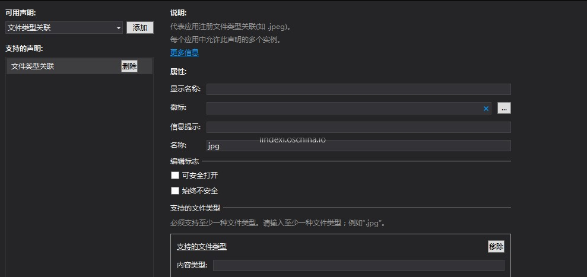
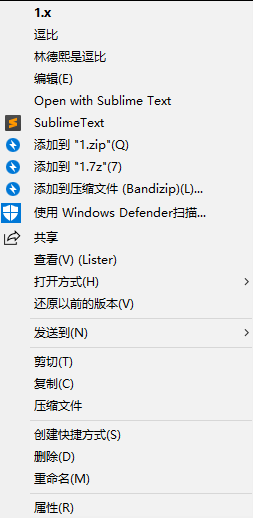

# win10 uwp 关联文件

有时候应用需要打开后缀名为x的文件，那么如何从文件打开应用？

<!--more-->
<!-- CreateTime:2020/2/17 10:20:15 -->


<div id="toc"></div>

首先，需要打开 Package.appxmanifest 在声明添加文件

<!--  -->


添加一个功能，需要写的最少的项是名称，文件类型两个。

上面的图就是我添加 jpg 关联的方法，建议是写多一些。如果是作为测试，想看这个功能是如何使用，就只需要写文件类型。

现在我的应用可以打开 jpg 文件，在一个 jpg 文件右击打开方式，在这个项目部署之后就可以设置是使用这个项目打开。在实际的项目我也有一个应用是需要这个功能，这个就是 UWP图床: https://www.microsoft.com/store/apps/9nblggh562r2 这个软件可以快速将图片上传到图床，图床可以使用默认的也可以自己设置。在写博客时使用这个软件可以快速上传图片创建连接。

添加完，打开 App.xaml.cs 添加一个函数，通过 OnFileActivated 调用就是用户使用这个应用打开关联文件，打开的文件可以从 FileActivatedEventArgs 找到


```csharp
        protected override void OnFileActivated(FileActivatedEventArgs args)
        {
            base.OnFileActivated(args);
        }
```

这个函数现在还没代码，需要对他做一点修改

```csharp
        protected override void OnFileActivated(FileActivatedEventArgs args)
        {
            var file = args.Files[0];
            Frame frame = Window.Current.Content as Frame;
            if (frame == null)
            {
                frame = new Frame();
                Window.Current.Content = frame;
            }
            frame.Navigate(typeof(MainPage), file);
             Window.Current.Activate();
 }
```

这里的 file 可能是空，但是上面只是告诉大家一个最简单方法，不考虑可能存在的软件已经打开等。

如果已经打开了软件，通过 `frame.Navigate` 重新跳转到主页面，页面跳转就是这样，页面传入可以是 StorageFile 但是需要在对应的页面使用对应类型。

现在软件在用户打开对应文件直接显示在 MainPage ，如果需要显示在别的窗口，就可以通过`frame.Navigate`跳转到其他的页面，对于跳转传参数，建议使用本渣的 MVVM 框架，请看[win10 uwp MVVM入门](https://blog.lindexi.com/post/win10-uwp-MVVM%E5%85%A5%E9%97%A8.html )。

我没有在博客说如何传参，但是这个对大家也不难。

打开 MainPage.xaml 写一个 Image 在这个 Image 显示打开的图片

```xml
            <Image x:Name="Image"></Image>

```

打开 xaml.cs ，把app启动的file显示在刚才的图片

```csharp
        protected override async void OnNavigatedTo(NavigationEventArgs e)
        {
            var file = e.Parameter as StorageFile;
            if (file != null)
            {
                using (var stream = await file.OpenAsync(FileAccessMode.Read))
                {
                    BitmapImage img = new BitmapImage();
                    await img.SetSourceAsync(stream);
                    Image.Source = img;
                }
            }
        }
```

UWP 从文件显示图片很简单，打开放在img就好。

现在尝试运行一下这个项目，然后找到一张 jpg 图片，右击打开方式选择这个项目，这时就可以看到 UWP 应用显示图片。可以看到关联的代码很简单，实际上也是很简单


刚才只是用最简单的方式写了显示的名称，但是一个好看的应用，需要在关联文件加上图片。

加上图片就是在刚才打开的功能可以看到图标，选择一个好看的图片，在用户将打开这个文件的默认应用设置为自己的应用时，就会使用这个应用设置的图标

添加 Verb 也就是在文件右键菜单里面显示多个其他选项，注意此时的 UWP 应用虽然可以在文件里面显示右键菜单，但是仅限于被关联的文件。如我编辑 Package.appxmanifest 的代码，添加了 `<uap:FileType ContentType="foo/foo">.x</uap:FileType>` 也就是关联了后缀名是 x 的文件，我才可以修改 x 的文件右键菜单显示其他内容

如在 x 文件右键菜单显示`逗比` 和 `林德熙是逗比` 两个选项，需要右击编辑 Package.appxmanifest 的代码

<!--  -->

先添加命名空间

```csharp
  xmlns:uap2="http://schemas.microsoft.com/appx/manifest/uap/windows10/2"
  xmlns:uap3="http://schemas.microsoft.com/appx/manifest/uap/windows10/3"
```

然后添加下面代码

```xml
        <uap3:Extension Category="windows.fileTypeAssociation">
          <uap3:FileTypeAssociation Name="lindexi">
            <uap:SupportedFileTypes>
              <uap:FileType ContentType="foo/foo">.x</uap:FileType>
            </uap:SupportedFileTypes>
              <uap2:SupportedVerbs>
                  <uap3:Verb Id="doubi">逗比</uap3:Verb>
                  <uap3:Verb Id="Print">林德熙是逗比</uap3:Verb>
              </uap2:SupportedVerbs>
            <uap:DisplayName>林德熙逗比</uap:DisplayName>
            <uap:EditFlags OpenIsSafe="true"/>
          </uap3:FileTypeAssociation>
        </uap3:Extension>
```

现在部署完成了应用，将 x 打开关联到应用，就可以在 x 的文件右击看到了逗比和林德熙是逗比而这两个如何在应用判断用户想要的是什么打开不同页面

在 App.xaml.cs 里面可以重写 OnFileActivated 方法，在这个方法可以用参数 FileActivatedEventArgs 的 Verb 判断

在 FileActivatedEventArgs 的 Verb 会设置为刚才设置的 Id 的值，如 `<uap3:Verb Id="doubi">逗比</uap3:Verb>` 在 Verb 的值就是 doubi 可以通过这个值判断

本文有部分逻辑都推荐小伙伴去看我的代码，本文代码放在[github](https://github.com/lindexi/lindexi_gd/tree/84466f2af53538ecdc8d51952f4ac5ceb893771d/NoweenanemkoGefefenaijel)欢迎小伙伴访问

<a rel="license" href="http://creativecommons.org/licenses/by-nc-sa/4.0/"></a><br />本作品采用<a rel="license" href="http://creativecommons.org/licenses/by-nc-sa/4.0/">知识共享署名-非商业性使用-相同方式共享 4.0 国际许可协议</a>进行许可。欢迎转载、使用、重新发布，但务必保留文章署名[林德熙](http://blog.csdn.net/lindexi_gd)(包含链接:http://blog.csdn.net/lindexi_gd )，不得用于商业目的，基于本文修改后的作品务必以相同的许可发布。如有任何疑问，请与我[联系](mailto:lindexi_gd@163.com)。  