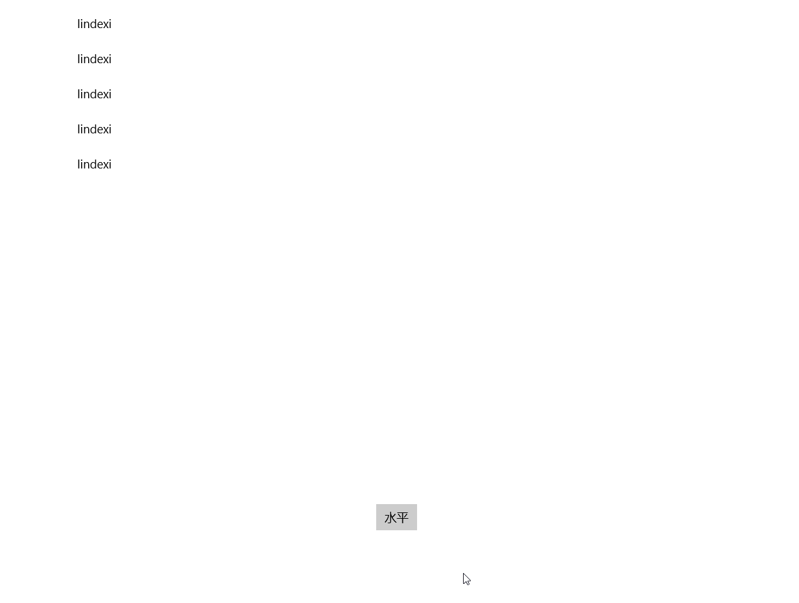

# win10 uwp 动态修改ListView元素布局

本文告诉大家如何在代码动态修改 ListView 的元素布局，从垂直修改为水平，从水平修改为垂直

<!--more-->
<!-- CreateTime:2018/5/28 15:15:54 -->

<!-- csdn -->

先给大家一张图看一下效果

<!--  -->


如何需要从 cs 代码修改 ListView 的 ItemsPanel 的 ItemsPanelTemplate 从而修改元素布局是比较困难的。如修改下面代码的 Orientation 从 Horizontal 修改为 Vertical。

```csharp
    <ListView.ItemsPanel>
        <ItemsPanelTemplate>
            <ItemsStackPanel Orientation="Horizontal"/>
        </ItemsPanelTemplate>
    </ListView.ItemsPanel>
```

因为无法通过后台代码直接创建一个 ItemsPanelTemplate ，除了使用 XamlReader 来做。

但是这样做比较复杂。

我期望的方式是直接通过代码修改。

在堆栈网发现[c# - How to set ListView ItemsStackPanel orientation by code? - Stack Overflow](https://stackoverflow.com/questions/50553480/how-to-set-listview-itemsstackpanel-orientation-by-code )，里面使用 ItemsPanelRoot 来设置

```csharp
            if (xxListView.ItemsPanelRoot is ItemsStackPanel panel)
            {
                panel.Orientation = Orientation.Vertical;
            }
```

实际上的 ItemsPanelRoot 就是控制的 panel ，通过修改这个 panel 的值就可以修改列表的布局。

<a rel="license" href="http://creativecommons.org/licenses/by-nc-sa/4.0/"></a><br />本作品采用<a rel="license" href="http://creativecommons.org/licenses/by-nc-sa/4.0/">知识共享署名-非商业性使用-相同方式共享 4.0 国际许可协议</a>进行许可。欢迎转载、使用、重新发布，但务必保留文章署名[林德熙](http://blog.csdn.net/lindexi_gd)(包含链接:http://blog.csdn.net/lindexi_gd )，不得用于商业目的，基于本文修改后的作品务必以相同的许可发布。如有任何疑问，请与我[联系](mailto:lindexi_gd@163.com)。
