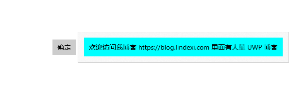
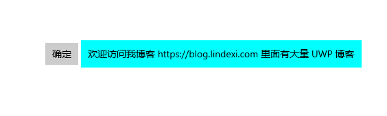

# win10 uwp 去掉 Flyout 边框

在 UWP 的 Flyout 的边框一点都不好看，本文告诉大家如何去掉这个边框

<!--more-->
<!-- CreateTime:2019/2/27 17:48:46 -->

<!-- csdn -->

先写一个简单的界面，这个界面里面有一个按钮

```csharp
           <Button.Flyout>
                <Flyout Placement="Right">
                    <Grid Name="PopupGrid" Background="Aqua" Height="600" Width="200"/>
                </Flyout>
            </Button.Flyout>
        </Button>
```

运行代码，点击按钮，可以看到下面界面

<!--  -->


通过重写 FlyoutPresenterStyle 可以修改边框的距离

```csharp
            <Button.Flyout>
                <Flyout Placement="Right">
                    <Flyout.FlyoutPresenterStyle>
                        <Style TargetType="FlyoutPresenter">
                            <Setter Property="Padding" Value="0"></Setter>
                            <Setter Property="BorderThickness" Value="0"></Setter>
                        </Style>
                    </Flyout.FlyoutPresenterStyle>
                    <Grid Name="PopupGrid" Background="Aqua" >
                        <TextBlock Margin="10,10,10,10" Text="欢迎访问我博客 https://blog.lindexi.com 里面有大量 UWP 博客"></TextBlock>
                    </Grid>
                </Flyout>
            </Button.Flyout>
```

现在运行代码点击按钮可以看到下面界面，看不到边框

<!--  -->


更多 Flyout 请看

[win10 uwp 右击浮出窗在点击位置](https://blog.lindexi.com/post/win10-uwp-%E5%8F%B3%E5%87%BB%E6%B5%AE%E5%87%BA%E7%AA%97%E5%9C%A8%E7%82%B9%E5%87%BB%E4%BD%8D%E7%BD%AE.html )

<a rel="license" href="http://creativecommons.org/licenses/by-nc-sa/4.0/"></a><br />本作品采用<a rel="license" href="http://creativecommons.org/licenses/by-nc-sa/4.0/">知识共享署名-非商业性使用-相同方式共享 4.0 国际许可协议</a>进行许可。欢迎转载、使用、重新发布，但务必保留文章署名[林德熙](http://blog.csdn.net/lindexi_gd)(包含链接:http://blog.csdn.net/lindexi_gd )，不得用于商业目的，基于本文修改后的作品务必以相同的许可发布。如有任何疑问，请与我[联系](mailto:lindexi_gd@163.com)。
