# win10 uwp 发布旁加载自动更新

在很多企业使用的程序都是不能通过微软商店发布，原因很多，其中我之前的团队开发了很久的应用，结果发现没有用户能从微软应用商店下载所以我对应用商店没有好感。但是作为一个微软粉丝，怎么能不支持 UWP 开发呢。但是做出来 UWP 应用还是需要用户能用，经过了很长的时间，和很多大佬聊了之后，终于对新的项目使用旁加载的方式，使用自己的服务器提供下载更新

<!--more-->
<!-- CreateTime:2019/11/25 15:45:47 -->


本文告诉大家如何搭建一个 asp dotnet core 服务器，将一个 UWP 程序使用旁加载发布，同时支持自动更新


首先创建一个简单的 UWP 程序，这个程序显示当前的包的版本，通过程序的包的版本就可以知道是否更新成功。

在 17134 也就是系统的版本是 1803 的时候，就支持自动更新 UWP 应用，因为我所在的团队的客户的系统都是可以控制的，于是全部都升级到 1803 的系统。

<!-- 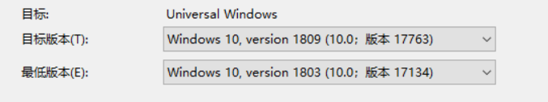 -->


虽然旁加载对于证书不是很友好，但是因为我的应用都是预装的，本来的两大问题一个就是自动更新问题，另一个是从应用商店下载的问题，通过预装可以解决应用商店下载问题。解决了下载的坑，最大的问题在于更新问题，如果能使用自己的服务器，那么在国内更新是没有网络问题

如果小伙伴不是使用预装，那么也可以自己写一个简单的安装程序，这里就不说了

在 UWP 获取当前的软件版本可以使用下面代码


```csharp
        private static string GetVersion()
        {
            Package package = Package.Current;
            PackageId packageId = package.Id;
            PackageVersion version = packageId.Version;

            return $"{version.Major}.{version.Minor}.{version.Build}.{version.Revision}";
        }
```

在界面创建简单的代码，请看代码

```csharp
        public MainPage()
        {
            this.InitializeComponent();
            ((Grid) Content).Children.Add(new TextBlock()
            {
                Text = GetVersion(),
                HorizontalAlignment = HorizontalAlignment.Center,
                VerticalAlignment = VerticalAlignment.Center
            });
        }
```

现在尝试右击项目创建包，选择旁加载

<!--  -->


这里只是做演示，所以只勾选 x86 的，这样创建速度比较快

<!-- 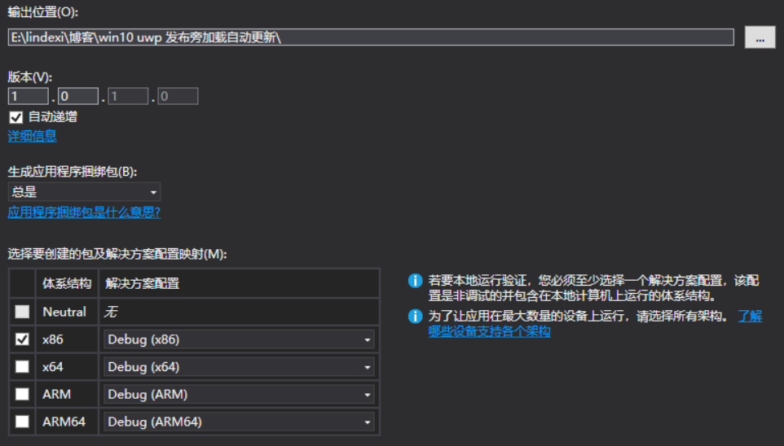 -->


点击下一步，在这里写入 URL 这里需要拿到本地的内网的 IP 这样在可以在后面在其他的设备安装 UWP 应用，我这里已经写上了自己的 IP 和端口号，还有一个路径

<!-- 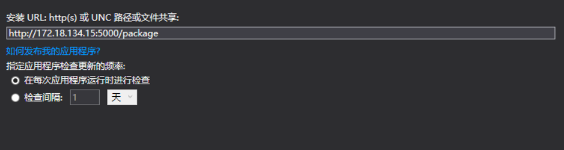 -->


在本文下面将会告诉大家如何让 asp dotnet core 程序支持上面的路径下载程序，当然需要将 IP 修改为你的内网IP才可以

不等待 VisualStudio 编译，先创建一个 asp dotnet core 程序

选择创建 api 程序，注意不要打开 https 这样比较快，如何创建请看[win10 uwp 手把手教你使用 asp dotnet core 做 cs 程序](https://blog.csdn.net/lindexi_gd/article/details/80733259 )

打开 Startup 文件，在 Configure 添加静态文件的支持，因为旁加载发布的就是文件

在 asp dotnet core 打开静态文件支持，就可以让访问网页的小伙伴直接下载文件，如我将旁加载的内容放在`E:\package` 文件夹，那么我就需要设置这个文件夹可以在网页被访问，里面的文件访问到就可以下载

```csharp
            app.UseStaticFiles(new StaticFileOptions()
            {
                FileProvider = new PhysicalFileProvider("E:\\package"),
                RequestPath = "/package",
            });
```

因为现在可能 VisualStudio 还没编译完成，所以先尝试在 E:\package 放一个文件，如 1.txt 在里面随意写一点内容，然后调试 asp dotnet core 程序，在地址写上 `http://localhost:端口/package/1.txt` 每个项目调试的端口都不一样，请自己将端口修改为调试的端口，然后看是不是能看到 1.txt 写入的内容

<!-- 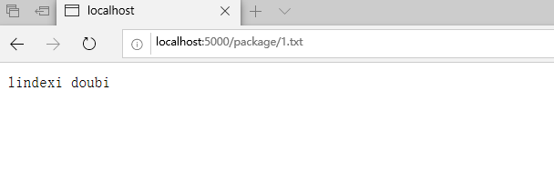 -->


大概现在 UWP 程序已经编译完成，将编译的文件复制到 E:\package 文件夹，可以看到里面的文件有很多 asp dotnet core 不认识的文件，在 asp dotnet core 如果想要让用户下载某个文件，需要设置这个文件的 IMME 只需要创建 FileExtensionContentTypeProvider 就会添加很多已知的文件，如刚才访问的 txt 文件

```csharp
│  DoucoujaWeasaikibeaDreecoVorkehear.appinstaller
│  index.html
│
└─DoucoujaWeasaikibeaDreecoVorkehear_1.0.1.0_Debug_Test
   │  Add-AppDevPackage.ps1
   │  DoucoujaWeasaikibeaDreecoVorkehear_1.0.1.0_x86_Debug.appxbundle
   │  DoucoujaWeasaikibeaDreecoVorkehear_1.0.1.0_x86_Debug.appxsym
   │  DoucoujaWeasaikibeaDreecoVorkehear_1.0.1.0_x86_Debug.cer
   │
   ├─Add-AppDevPackage.resources
   │  │  Add-AppDevPackage.psd1
   │  │
   │  ├─cs-CZ
   │  │      Add-AppDevPackage.psd1
   │  │
   │  ├─de-DE
   │  │      Add-AppDevPackage.psd1
   │  │
   │  ├─en-US
   │  │      Add-AppDevPackage.psd1
   │  │
   │  ├─es-ES
   │  │      Add-AppDevPackage.psd1
   │  │
   │  ├─fr-FR
   │  │      Add-AppDevPackage.psd1
   │  │
   │  ├─it-IT
   │  │      Add-AppDevPackage.psd1
   │  │
   │  ├─ja-JP
   │  │      Add-AppDevPackage.psd1
   │  │
   │  ├─ko-KR
   │  │      Add-AppDevPackage.psd1
   │  │
   │  ├─pl-PL
   │  │      Add-AppDevPackage.psd1
   │  │
   │  ├─pt-BR
   │  │      Add-AppDevPackage.psd1
   │  │
   │  ├─ru-RU
   │  │      Add-AppDevPackage.psd1
   │  │
   │  ├─tr-TR
   │  │      Add-AppDevPackage.psd1
   │  │
   │  ├─zh-CN
   │  │      Add-AppDevPackage.psd1
   │  │
   │  └─zh-TW
   │          Add-AppDevPackage.psd1
   │
   └─Dependencies
       ├─arm
       │      Microsoft.NET.CoreFramework.Debug.2.2.appx
       │      Microsoft.NET.CoreRuntime.2.2.appx
       │      Microsoft.VCLibs.ARM.Debug.14.00.appx
       │
       ├─ARM64
       │      Microsoft.VCLibs.ARM64.Debug.14.00.appx
       │
       ├─x64
       │      Microsoft.NET.CoreFramework.Debug.2.2.appx
       │      Microsoft.NET.CoreRuntime.2.2.appx
       │      Microsoft.VCLibs.x64.Debug.14.00.appx
       │
       └─x86
               Microsoft.NET.CoreFramework.Debug.2.2.appx
               Microsoft.NET.CoreRuntime.2.2.appx
               Microsoft.VCLibs.x86.Debug.14.00.appx


```

在 UWP 的安装对于这些文件有诡异的要求，如 appinstaller 需要是 `application/xml` 对于 `appx` 和 `appxbundle` 需要是 `application/vns.ms-appx` 才能安装

```csharp
            app.UseStaticFiles(new StaticFileOptions()
            {
                FileProvider = new PhysicalFileProvider("E:\\package"),
                RequestPath = "/package",
                DefaultContentType = "application/octet-stream",
                ServeUnknownFileTypes = true,
                ContentTypeProvider = new FileExtensionContentTypeProvider()
                {
                    Mappings =
                    {
                        {".appinstaller", "application/xml"},
                        {".appx", "application/vns.ms-appx"},
                        {".appxbundle", "application/vns.ms-appx"},
                    }
                }
            });
```

如果小伙伴不想使用 E:\package 作为存放 UWP 安装包的文件夹，那么可以修改为自己本地的可以访问的文件夹，同时访问的 URL 链接不变，因为设置 URL 的链接是通过 RequestPath 属性。如我将 RequestPath 修改为 `/csdn` 那么就需要从 `http://ip:端口/csdn/文件` 才可以

还看到了有 index.html 文件，打开默认文件，这样访问 package 就可以看到 index.html 文件

现在的 asp dotnet core 的代码请看下面

```csharp
        public void Configure(IApplicationBuilder app, IHostingEnvironment env)
        {
            if (env.IsDevelopment())
            {
                app.UseDeveloperExceptionPage();
            }

            app.UseDefaultFiles();

            app.UseStaticFiles(new StaticFileOptions()
            {
                FileProvider = new PhysicalFileProvider("E:\\package"),
                RequestPath = "/package",
                DefaultContentType = "application/octet-stream",
                ServeUnknownFileTypes = true,
                ContentTypeProvider = new FileExtensionContentTypeProvider()
                {
                    Mappings =
                    {
                        {".appinstaller", "application/xml"},
                        {".appx", "application/vns.ms-appx"},
                        {".appxbundle", "application/vns.ms-appx"},
                    }
                }
            });

            app.UseMvc();
        }

```

此时访问 http://localhost:端口/package/index.html 能看到下面界面

<!-- 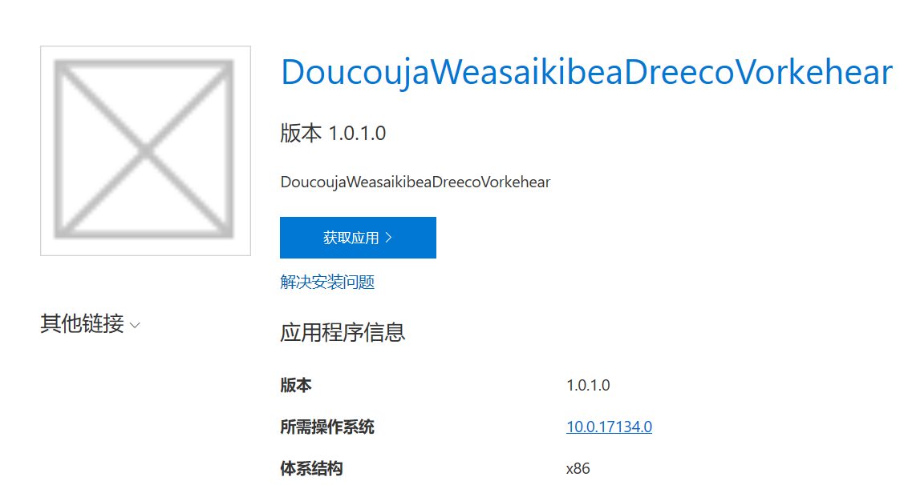 -->


当然因为大家创建的测试的 UWP 程序的命名不一样，看到界面也有一些不一样

但是现在还是无法安装的，因为安装程序是 UWP 程序，发布的 asp dotnet core 是本地网络，但是 UWP 程序无法直接访问本地网络，所以要么修改让 UWP 可以访问本地网络，要么拿小伙伴的设备访问，刚好我就拿了小伙伴的设备

如果想要让安装程序访问本地网络，请在命令行输入下面代码

```csharp
CheckNetIsolation.exe LoopbackExempt -a -n="microsoft.desktopappinstaller_8wekyb3d8bbwe"
```

要让小伙伴的设备可以访问你的 asp dotnet core 程序，就需要在 asp dotnet core 设置使用的 URL 和端口

使用下面的代码可以修改 asp dotnet core 监听端口

```csharp
        public static IWebHostBuilder CreateWebHostBuilder(string[] args) =>
            WebHost.CreateDefaultBuilder(args)
                .UseUrls("http://0.0.0.0:5000")
                .UseStartup<Startup>();
```

这里使用 0.0.0.0 就是能访问到本机的所有 Ip 如 127.0.0.1 或内网 ip 都可以，上面的代码写在 Program 文件，请不要随意更改设置的端口，应该刚才的 UWP 程序就使用了这个端口

现在重新编译一下，然后通过命令行运行 dotnet core 程序，然后告诉小伙伴你的本地的 ip 让在浏览器输入

我的小伙伴使用不清真的 Chrome 访问，但是他不能立刻点获取应用

<!-- 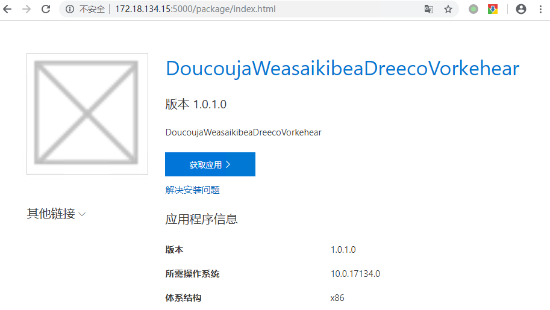 -->


因为他需要先下载证书，在使用旁加载就需要手动安装证书，因为测试程序使用的证书是不可信的，点击其他链接，下载证书

<!-- 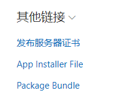 -->


打开证书，然后点击安装证书，选放在本地计算机

<!-- 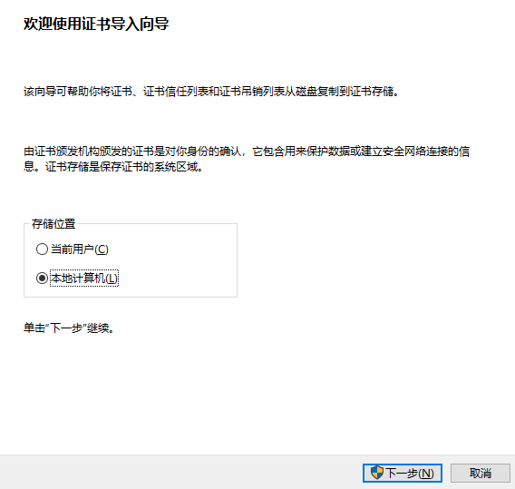 -->


然后点击将所有的证书放在受信任的根证书颁发

<!-- 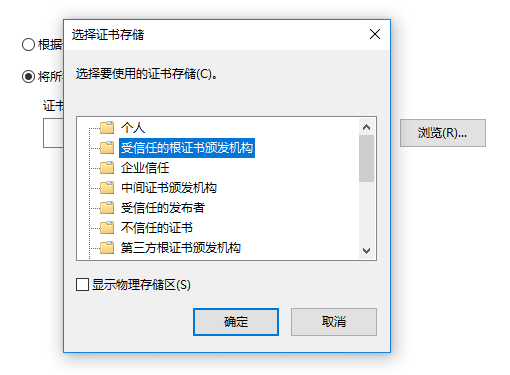 -->


点击完成

<!-- 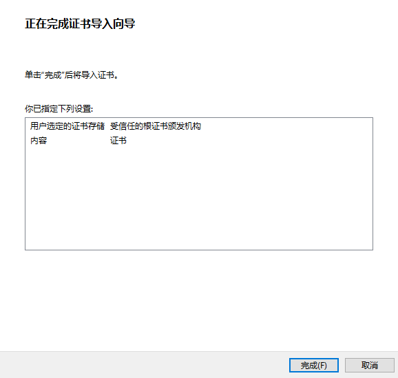 -->


现在点击获取应用，等待安装，现在就可以看到下面界面

<!-- 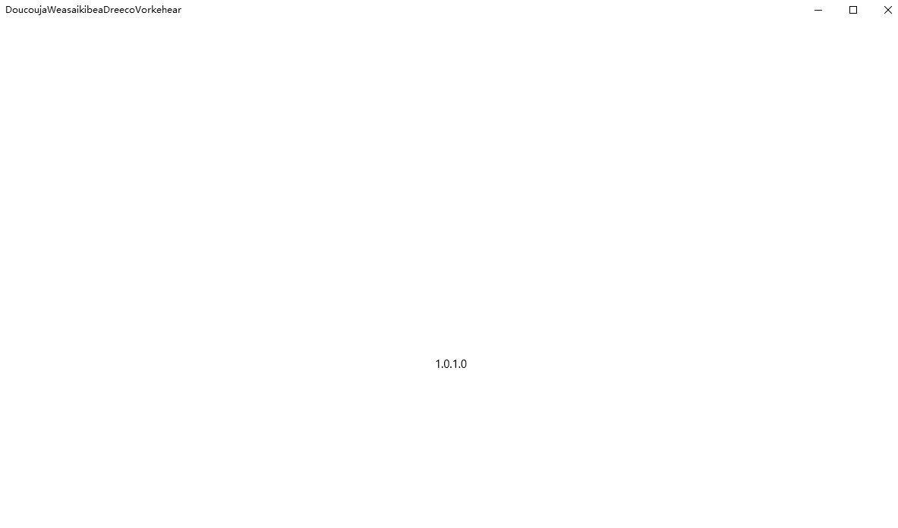 -->


那么如何做到自动更新，刚才创建的时候设置是每次打开的时候都判断有没有可以更新的，现在尝试点击打包，自动会更新版本号

于是将打包的文件复制到 E:\package 文件夹，注意 appinstaller 文件也需要复制，这个文件就是自动更新的核心

复制过去之后，在小伙伴的设备关闭测试的 UWP 程序，再打开，此时可以从命令行看到有程序访问 asp dotnet core 程序

关闭测试的 UWP 程序，再次打开发现这个程序已经是 1.0.2 请看下面

<!-- 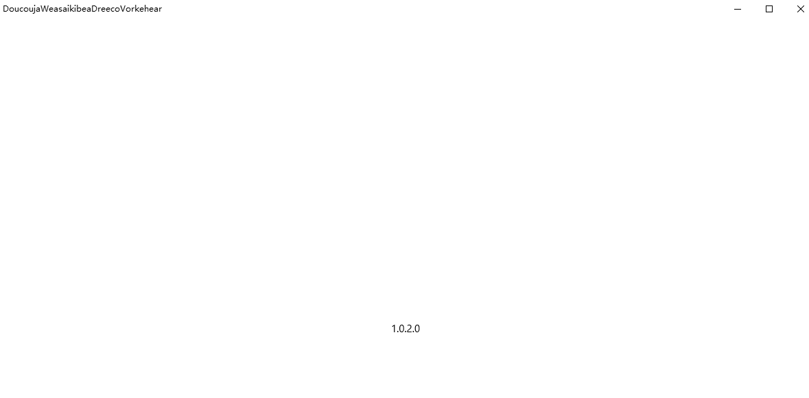 -->


看起来自己做一个服务器让用户安装 UWP 程序还是很简单的

但是有一个问题是 UWP 如何知道可以更新了？其实用 VisualStudio 打开 appinstaller 文件就知道了，这个文件是 xml 文件，里面写了 MainBundle 的路径，于是判断当前的程序版本比服务器的小，就从服务器下载安装

## 总结

1. 需要最低版本是 17134 用户的设备是 1803 版本

1. 因为 UWP 安装程序是 UWP 程序不能访问本机网络，建议测试的时候拿小伙伴的设备

1. 在 asp dotnet core 服务器需要修改 appinstaller 和 `appx` 文件才能下载

1. 需要先安装证书为可信任同时放在本地计算机才可以安装

1. 更新的时候需要更新 appinstaller 文件才能自动更新

通过这个方法，我在很多用户的设备安装了应用，而不需要将应用放在应用商店，这样我可以控制用户下载，控制用户下载的方法通过 asp dotnet core 判断用户访问了 appinstaller 文件，通过控制权限的方法，返回不同的 appinstaller 文件，这样有一些用户就发现版本是新的，下载新的程序，有一些用户发现还是之前的版本，于是就不会下载

现在开发 UWP 感觉还是不错的，虽然没有多少用户会使用应用商店，但是通过本文告诉大家的方法是不需要应用商店，只需要一个服务器，但是大家可以看到安装界面不好看，那么就需要小伙伴自己去写安装程序

[如何在国内发布 UWP 应用](https://blog.lindexi.com/post/%E5%A6%82%E4%BD%95%E5%9C%A8%E5%9B%BD%E5%86%85%E5%8F%91%E5%B8%83-UWP-%E5%BA%94%E7%94%A8.html )

[加强版在国内分发 UWP 应用正确方式 通过win32安装UWP应用](https://blog.lindexi.com/post/%E5%8A%A0%E5%BC%BA%E7%89%88%E5%9C%A8%E5%9B%BD%E5%86%85%E5%88%86%E5%8F%91-UWP-%E5%BA%94%E7%94%A8%E6%AD%A3%E7%A1%AE%E6%96%B9%E5%BC%8F-%E9%80%9A%E8%BF%87win32%E5%AE%89%E8%A3%85UWP%E5%BA%94%E7%94%A8.html )

<a rel="license" href="http://creativecommons.org/licenses/by-nc-sa/4.0/"></a><br />本作品采用<a rel="license" href="http://creativecommons.org/licenses/by-nc-sa/4.0/">知识共享署名-非商业性使用-相同方式共享 4.0 国际许可协议</a>进行许可。欢迎转载、使用、重新发布，但务必保留文章署名[林德熙](http://blog.csdn.net/lindexi_gd)(包含链接:http://blog.csdn.net/lindexi_gd )，不得用于商业目的，基于本文修改后的作品务必以相同的许可发布。如有任何疑问，请与我[联系](mailto:lindexi_gd@163.com)。
