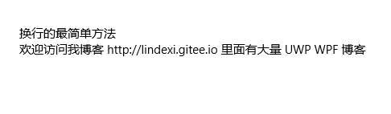

# win10 uwp 在 xaml 让 TextBlock 换行

本文告诉大家几个方法在 xaml 的 TextBlock 的 Text 换行

<!--more-->
<!-- CreateTime:2018/11/17 16:02:29 -->

<!-- csdn -->

在 xaml 可以使用 `&#x0a;` 表示换行，所以最简单的方法是在 Text 里面输入 `&#x0a;` 换行

如显示下面的图片，可以使用下面代码

<!--  -->


```xml
        <TextBlock Text="换行的最简单方法&#x0a;欢迎访问我博客 lindexi.gitee.io 里面有大量 UWP WPF 博客
" 
                   HorizontalAlignment="Center"
                   VerticalAlignment="Center" />
```

如果换行需要使用 `\r\n` 可以在 xaml 使用 `&#x0d;&#x0a;` 替换

如果是在 WPF 可以通过 `LineBreak` 的方法换行

```csharp
        <TextBlock HorizontalAlignment="Center"
                   VerticalAlignment="Center">
            <TextBlock.Text>
                换行的最简单方法
                <LineBreak/>
                欢迎访问我博客 lindexi.gitee.io 里面有大量 UWP WPF 博客
            </TextBlock.Text>
        </TextBlock>
```

但是上面的方法无法在 UWP 使用

好在可以使用`xml:space="preserve"`直接输入换行

```csharp
        <TextBlock xml:space="preserve">
            <TextBlock.Text>
                换行的最简单方法
                欢迎访问我博客 lindexi.gitee.io 里面有大量 UWP WPF 博客
            </TextBlock.Text>
        </TextBlock>
```

添加了 `space` 就可以在换行的时候自动换行

如果担心在 元素 上添加 `xml:space="preserve"` 会让其他的功能不好用，可以使用资源的方法，请看代码

```csharp
        <Grid.Resources>
            <x:String x:Key="str" xml:space="preserve">
                换行的最简单方法
                欢迎访问我博客 lindexi.gitee.io 里面有大量 UWP WPF 博客
            </x:String>
        </Grid.Resources>
        <TextBlock HorizontalAlignment="Center" 
                   VerticalAlignment="Center" Text="{StaticResource str}">
         
        </TextBlock>
```

使用了 `xml:space="preserve"` 会将行前的空格也加上

<!--  -->


<a rel="license" href="http://creativecommons.org/licenses/by-nc-sa/4.0/"></a><br />本作品采用<a rel="license" href="http://creativecommons.org/licenses/by-nc-sa/4.0/">知识共享署名-非商业性使用-相同方式共享 4.0 国际许可协议</a>进行许可。欢迎转载、使用、重新发布，但务必保留文章署名[林德熙](http://blog.csdn.net/lindexi_gd)(包含链接:http://blog.csdn.net/lindexi_gd )，不得用于商业目的，基于本文修改后的作品务必以相同的许可发布。如有任何疑问，请与我[联系](mailto:lindexi_gd@163.com)。  
