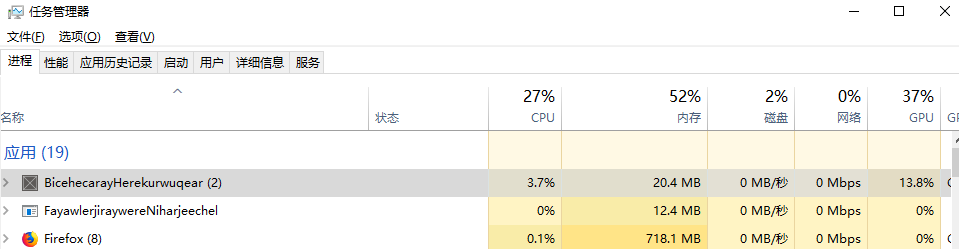
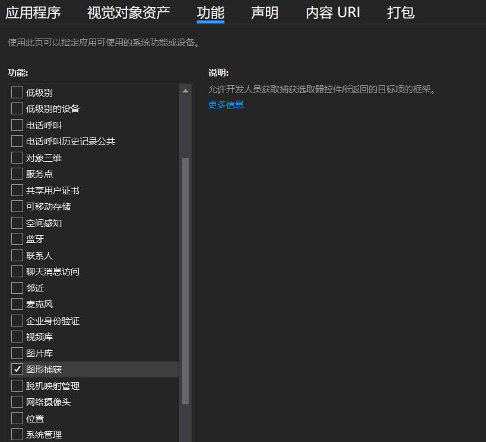
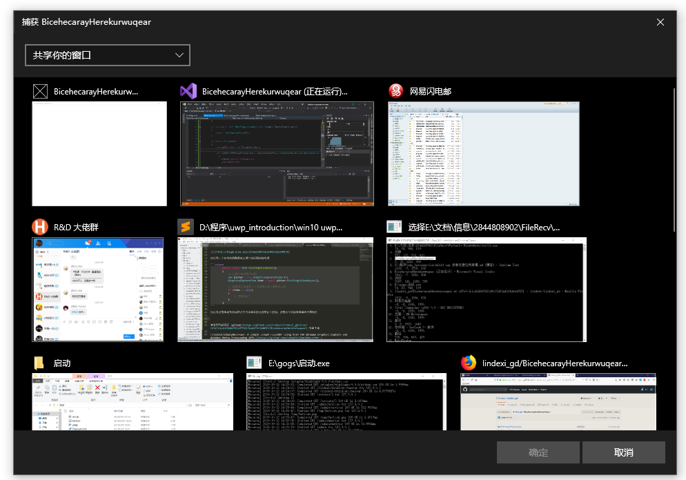

# win10 uwp 录制任意应用屏幕

在 1803 可以使用 Windows.Graphics.Capture 捕获屏幕，可以用来录制应用的窗口

<!--more-->
<!-- CreateTime:2019/10/31 9:10:38 -->


通过 CompositionAPI 和 win2d 可以作为 D3D 绘制，通过 Direct3D11CaptureFramePool 可以拿到其他应用的界面渲染图，这样就可以完成拿到其他窗口绘制在这个窗口内

用这个方法录屏的性能超级高，一个空的应用只做录屏占用内存只有 30M 左右，占用 CPU 几乎可以忽略，同时也不占用GPU资源，这是在底层做的优化。我猜是从显卡拿到渲染的图片的句柄，然后在win2d渲染只是复制句柄通过 DWM 渲染图层。这个方式的渲染速度基本就是跑满，同时占用资源如下图

<!--  -->


下面请让我告诉大家如何使用

通过 GraphicsCapturePicker 可以让用户选取录制哪个应用，在开始之前需要申请权限。双击 Package.appxmanifest 文件，勾选图形捕获，请看下图

<!--  -->


此时写一个简单的函数用来让用户选择捕获的应用

```csharp
        public async Task StartCaptureAsync()
        {
            // 让用户选择哪个应用
            var picker = new GraphicsCapturePicker();
            GraphicsCaptureItem item = await picker.PickSingleItemAsync();

            // 如果用户有选择一个应用那么这个属性不为空
            if (item != null)
            {
            	// 忽略代码
            }
        }
```

尝试在应用加载完成调用这个方法或在按钮调用这个方法，调用这个方法将会看到下面图片

<!--  -->


当然在你的设备上应该看到的不是这个界面，因为你打开的应用应该和我不一样

现在需要初始化 CompositionAPI 和 win2d 的资源

请写一个方法 Setup 将会在这个方法里面写初始化

```csharp
        private void Setup()
        {
        	// 忽略代码
        }
```

先定义两个字段，包括 CanvasDevice 和对应的图层，将会在创建资源的时候用到设备，在刷新界面的使用用到图层

```csharp
        private CanvasDevice _canvasDevice;
        private CompositionDrawingSurface _surface;
```

先从当前的窗口创建混合设备

```csharp
            _canvasDevice = new CanvasDevice();

            var compositionGraphicsDevice = CanvasComposition.CreateCompositionGraphicsDevice(
                Window.Current.Compositor,
                _canvasDevice);

            var compositor = Window.Current.Compositor;
```

创建图层，注意现在的图层能使用的参数如下

```csharp
            _surface = compositionGraphicsDevice.CreateDrawingSurface(
                new Size(1000, 600),
                DirectXPixelFormat.B8G8R8A8UIntNormalized,
                DirectXAlphaMode.Premultiplied);
```

这里的 Size 可以任意修改，但是像素格式就不能修改

通过 CompositionAPI 创建精灵元素，将图层在精灵元素上显示，然后插入到当前控件作为最后一个图层也就是放在最上层元素

```csharp
            var visual = compositor.CreateSpriteVisual();
            visual.RelativeSizeAdjustment = Vector2.One;
            var brush = compositor.CreateSurfaceBrush(_surface);
            brush.Stretch = CompositionStretch.Uniform;
            visual.Brush = brush;
            ElementCompositionPreview.SetElementChildVisual(this, visual);
```

现在就初始化完成了

在刚才写的方法可以获取到 GraphicsCaptureItem 对象，接下面创建方法从拿到的 GraphicsCaptureItem 获取界面

在 Direct3D11CaptureFramePool.Create 静态方法可以创建 Direct3D11CaptureFramePool 属性，这个属性就是捕获窗口或屏幕的核心

在 Direct3D11CaptureFramePool 有一个事件是 FrameArrived 这个事件将会在捕获的界面刷新的时候触发，可以在这个事件触发的时候从参数拿到当前的界面图片，绘制在win2d图层

还有一个方法是 CreateCaptureSession 可以用来返回捕获会话，请看下面代码

```csharp
            // 下面参数暂时不能修改
            Direct3D11CaptureFramePool framePool = Direct3D11CaptureFramePool.Create(
                _canvasDevice, // D3D device
                DirectXPixelFormat.B8G8R8A8UIntNormalized, // Pixel format
                // 要在其中存储捕获的框架的缓冲区数量
                1, 
                // 每个缓冲区大小
                item.Size); // Size of the buffers

            // 界面刷新的时候将会触发这个事件
            framePool.FrameArrived += (s, a) =>
            {
            	// 忽略代码
            };

            var captureSession = framePool.CreateCaptureSession(item);
            captureSession.StartCapture();            
```

在 `captureSession.StartCapture` 方法将会开始捕获传入的 item 界面，这里的 item 是 GraphicsCaptureItem 类，可以传入某个应用的窗口，也可以传入整个屏幕，也就是在上面代码让用户选的内容

在 `framePool.FrameArrived` 事件将会传入刷新的图片，此时的图片是 Direct3D11CaptureFrame 还不能在 win2d 渲染，需要使用 CanvasBitmap.CreateFromDirect3D11Surface 转换

```csharp
           framePool.FrameArrived += (s, a) =>
            {
                using (var frame = framePool.TryGetNextFrame())
                {
                    try
                    {
                        // 将获取到的 Direct3D11CaptureFrame 转 win2d 的
                        CanvasBitmap canvasBitmap = CanvasBitmap.CreateFromDirect3D11Surface(
                            _canvasDevice,
                            frame.Surface);

                        // 忽略代码
                    }
                    catch
                    {

                    }
                }
            }
```

因为可能此时的窗口的大小修改了，所以需要执行修改当前的图层的大小

```csharp
                        CanvasComposition.Resize(_surface, canvasBitmap.Size);
```

在获取到 CanvasBitmap 就可以使用 win2d 绘制到图层上，这样就完成了绘制其他窗口

```csharp
                        using (var session = CanvasComposition.CreateDrawingSession(_surface))
                        {
                            session.Clear(Colors.Transparent);
                            session.DrawImage(canvasBitmap);
                        }
```

本文的代码放在 [github](https://github.com/lindexi/lindexi_gd/tree/fd7e7c1c1c4368d7831dff323f2ad2ffdfed0553/BicehecarayHerekurwuqear) 欢迎下载

相对于官方的源代码，我删了很多不是核心的细节代码，所以上面的代码只能在测试使用

如果你发现录到一半界面冻结了，也就是不刷新了，那么可能是你的 GraphicsCaptureSession 或 Direct3D11CaptureFramePool 类被回收了，在界面冻结的时候看调试工具是否有显示GC如果有，那么就是对象被回收了，解决方法是定义一些字段，将这些变量放在字段

如何调试内存请看 [dotnet 代码调试方法](https://blog.lindexi.com/post/dotnet-%E4%BB%A3%E7%A0%81%E8%B0%83%E8%AF%95%E6%96%B9%E6%B3%95.html)

另外还有 [robmikh](https://github.com/robmikh) 大神写的例子，请看 [robmikh/SimpleRecorder: A simple screen recorder using both the Windows.Graphics.Capture and Windows.Media.Transcoding APIs.](https://github.com/robmikh/SimpleRecorder )

在看到这个技术，我就想到了也许UWP是能做到很好的多进程渲染的，也就是用这个技术获取其他窗口的渲染界面，其他窗口可以在其他渲染架构的进程运行，然后转发用户输入消息，这样就能做到解决空域的多进程渲染

<a rel="license" href="http://creativecommons.org/licenses/by-nc-sa/4.0/"></a><br />本作品采用<a rel="license" href="http://creativecommons.org/licenses/by-nc-sa/4.0/">知识共享署名-非商业性使用-相同方式共享 4.0 国际许可协议</a>进行许可。欢迎转载、使用、重新发布，但务必保留文章署名[林德熙](http://blog.csdn.net/lindexi_gd)(包含链接:http://blog.csdn.net/lindexi_gd )，不得用于商业目的，基于本文修改后的作品务必以相同的许可发布。如有任何疑问，请与我[联系](mailto:lindexi_gd@163.com)。
