# win10 uwp 手把手教你使用 asp dotnet core 做 cs 程序

本文是一个非常简单的博客，让大家知道如何使用 asp dot net core 做后台，使用 UWP 或 WPF 等做前台。

本文因为没有什么业务，也不想做管理系统，所以看到起来是很简单。

<!--more-->
<!-- CreateTime:2019/11/29 10:16:12 -->


<div id="toc"></div>

## VisualStudio 

建议去官网下载最新的在线安装，然后安装，安装的时候需要选择通用平台开发、桌面开发、跨平台开发。如果你安装的不是中文版，请看下面图片找到差不多的位置，或者全部打勾。

<!-- 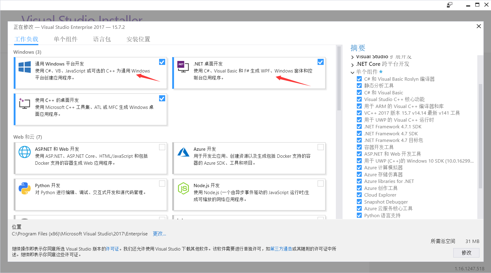 -->


<!-- 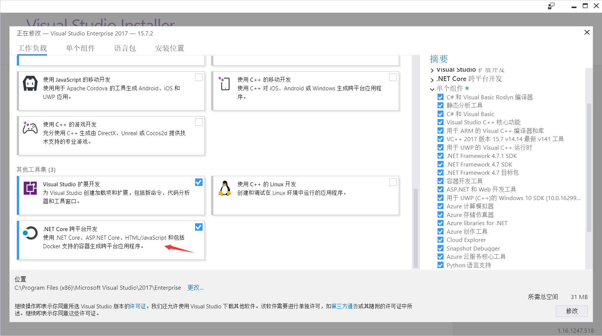 -->


点击安装，可以去睡觉，明天再看我的博客。因为 VisualStudio 的安装是很慢的，如果发现因为自己的网站无法访问，需要代理，可以发邮件给我，我发一个代理给你。

## 创建项目

现在一起创建三个项目，第一个项目是 UWP 项目，没有什么需要注意，点击创建空白UWP项目就可以。第二个是一个 dotnet standard 项目。第三个是 dotnet core 项目。

### UWP

创建一个 UWP 程序是非常简单，点击C#，创建空白项目，随意给个名字，点击确定。注意尽量选择最高的平台，在项目开发是需要通过用户才知道需要选哪个平台。但是在开始学的时候，请尽量选择最新版本，这样可以减少因为版本问题让自己的时间花费在解决版本问题不兼容

<!-- 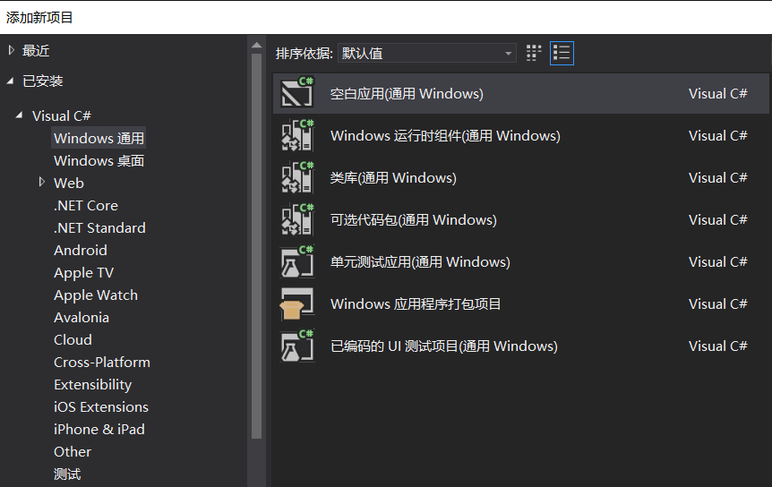 -->


如果完全没有开发过 UWP 程序，那么请看[win10 uwp 如何开始写 uwp 程序 - CSDN博客](https://blog.csdn.net/lindexi_gd/article/details/80373159 )

### dotnet standard 

创建一个 dotnet standard 可以让多个项目使用，在这里放一些类的定义。这个项目叫 Model ，名字不是随便叫的。

<!--  -->


### dotnet core

右击解决方案，选择新建项目，在弹出的窗口选择 dotnet core ，选择 asp.net core web 程序。

<!-- 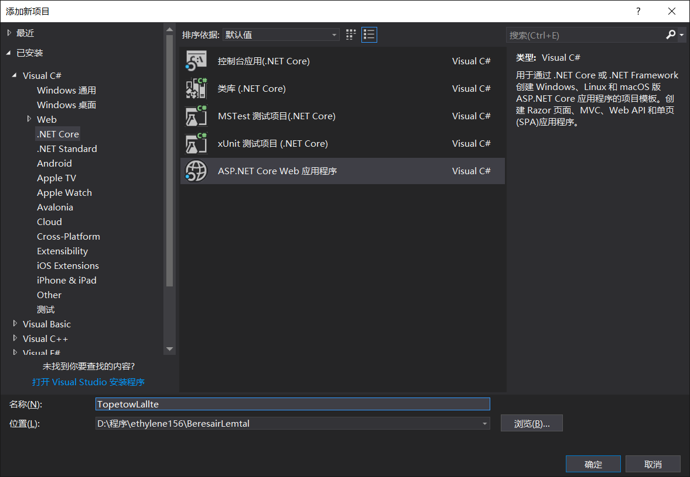 -->


随意给这个项目一个名字，然后点击确定

在弹出的窗口选择 API ，注意不勾选 Docker 支持

<!-- 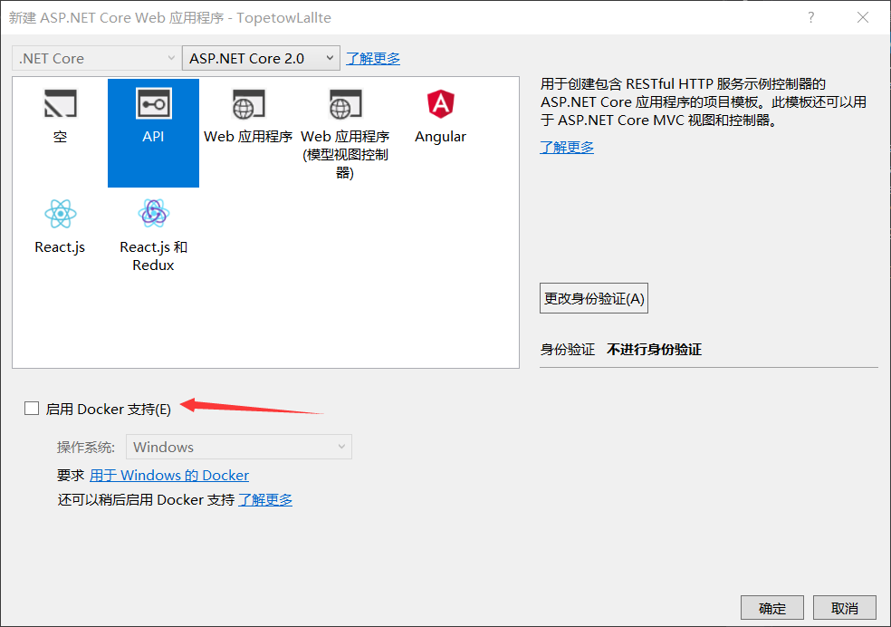 -->


现在就创建好了所有项目

## 引用项目

现在在创建好的 UWP 项目和 asp dotnet core 项目，右击引用，加上 Model 的引用

<!-- 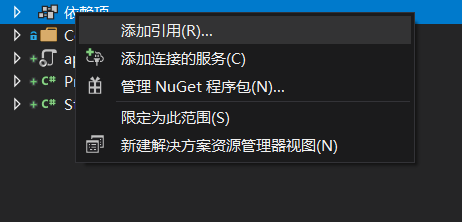 -->


在 UWP 项目，引用的叫引用，在 asp dotnet core 项目，引用叫依赖项，只需要右击项目，点击添加就可以看到引用

<!-- 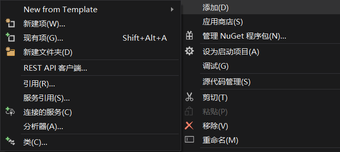 -->


现在使用新的 VisualStudio 打开相同的解决方案，这样才可以进行调试 asp dotnet core 的同时调试 UWP 项目

## 创建通用结构

现在打开 Model 项目，创建一个类，这个类是通用结构，在多个项目都需要使用。现在决定做这个项目是读取现有的小伙伴的网站和名字，添加新的名字和网站记录。

那么这里的类就需要包含小伙伴的名字和他的网站

```csharp
    public class RoqawzemJajene
    {
        public int Id { get; set; }

        public string Name { get; set; }

        public string Url { get; set; }
    }
```

可以看到上面的代码多了一个属性 Id ，现在我还不告诉大家为什么需要添加 id ，请在看到本文之后，自己尝试删除 id 然后重新运行项目。

## 设置控制器

现在打开 asp dotnet core 项目，通过 RoqawzemJajene 添加控制器。控制器就是访问 URL 时可以返回结果的类。通过控制器才可以使用 URL 访问，当然使用其他的方法也是可以做到，但是没有这个方法好用。

右击 Controler 添加，点击添加控制器

<!-- 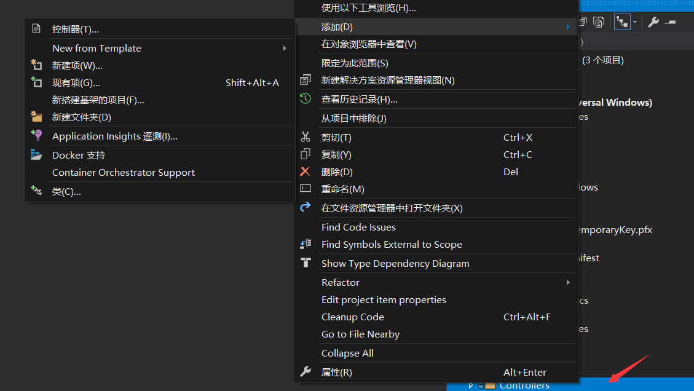 -->


选择EF的控制器，请看下面图片。使用这个控制器，就会自动下载 EF 而且帮你设置好很多类，最简单的方法是这样写。如果想知道具体的每个类意思就需要自己去看文档，推荐[ASP.NET Core 中文文档目录](http://www.cnblogs.com/dotNETCoreSG/p/aspnetcore-index.html )

<!-- 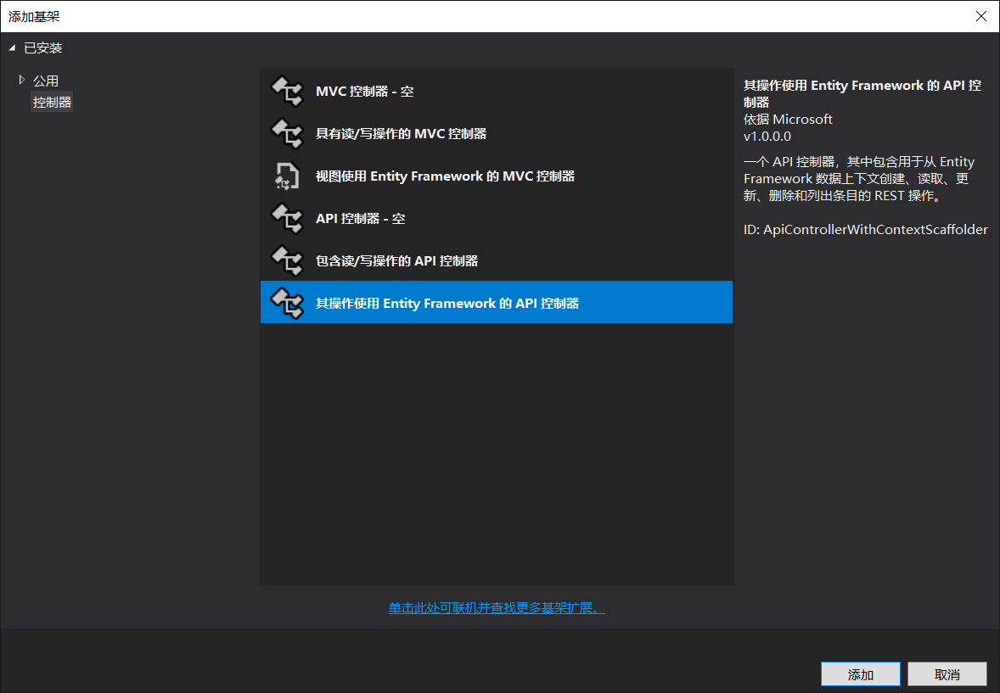 -->


这时需要告诉 VisualStudio 使用哪个模型类，和上下文，实际上如果刚才的引用已经写好，而且有 RoqawzemJajene 那么这一步是十分简单的。如果没有按照上面的方法来，那么这一步可能就无法继续。本文下面的也就无法继续。如果实在不知道怎么弄，欢迎在评论告诉我。

<!-- 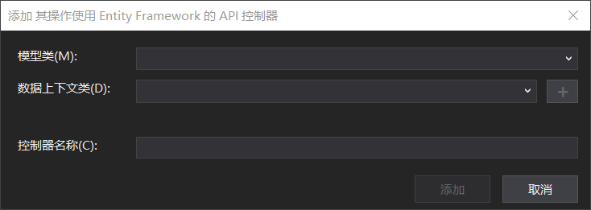 -->


点击下拉，可以找到 RoqawzemJajene 这个类

<!-- 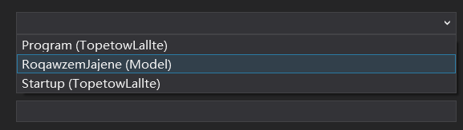 -->


点击了之后会看到没有数据上下文，点击最后的加号就可以自动帮你弄好

<!-- 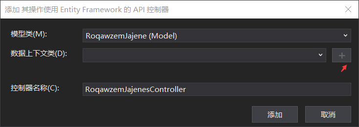 -->


现在可以看到和下图差不多的界面，点击添加就可以等着 VisualStudio 帮你添加一些项目了

<!-- 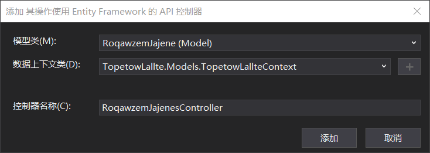 -->


现在 VisualStudio 会帮你创建两个类

```csharp
    public class TopetowLallteContext : DbContext
    {
        public TopetowLallteContext (DbContextOptions<TopetowLallteContext> options)
            : base(options)
        {
        }

        public DbSet<Model.RoqawzemJajene> RoqawzemJajene { get; set; }
    }
```

```csharp
    [Produces("application/json")]
    [Route("api/RoqawzemJajenes")]
    public class RoqawzemJajenesController : Controller
    {
        private readonly TopetowLallteContext _context;

        public RoqawzemJajenesController(TopetowLallteContext context)
        {
            _context = context;
        }

        // GET: api/RoqawzemJajenes
        [HttpGet]
        public IEnumerable<RoqawzemJajene> GetRoqawzemJajene()
        {
            return _context.RoqawzemJajene;
        }

        // GET: api/RoqawzemJajenes/5
        [HttpGet("{id}")]
        public async Task<IActionResult> GetRoqawzemJajene([FromRoute] int id)
        {
            if (!ModelState.IsValid)
            {
                return BadRequest(ModelState);
            }

            var roqawzemJajene = await _context.RoqawzemJajene.SingleOrDefaultAsync(m => m.Id == id);

            if (roqawzemJajene == null)
            {
                return NotFound();
            }

            return Ok(roqawzemJajene);
        }

        // PUT: api/RoqawzemJajenes/5
        [HttpPut("{id}")]
        public async Task<IActionResult> PutRoqawzemJajene([FromRoute] int id, [FromBody] RoqawzemJajene roqawzemJajene)
        {
            if (!ModelState.IsValid)
            {
                return BadRequest(ModelState);
            }

            if (id != roqawzemJajene.Id)
            {
                return BadRequest();
            }

            _context.Entry(roqawzemJajene).State = EntityState.Modified;

            try
            {
                await _context.SaveChangesAsync();
            }
            catch (DbUpdateConcurrencyException)
            {
                if (!RoqawzemJajeneExists(id))
                {
                    return NotFound();
                }
                else
                {
                    throw;
                }
            }

            return NoContent();
        }

        // POST: api/RoqawzemJajenes
        [HttpPost]
        public async Task<IActionResult> PostRoqawzemJajene([FromBody] RoqawzemJajene roqawzemJajene)
        {
            if (!ModelState.IsValid)
            {
                return BadRequest(ModelState);
            }

            _context.RoqawzemJajene.Add(roqawzemJajene);
            await _context.SaveChangesAsync();

            return CreatedAtAction("GetRoqawzemJajene", new { id = roqawzemJajene.Id }, roqawzemJajene);
        }

        // DELETE: api/RoqawzemJajenes/5
        [HttpDelete("{id}")]
        public async Task<IActionResult> DeleteRoqawzemJajene([FromRoute] int id)
        {
            if (!ModelState.IsValid)
            {
                return BadRequest(ModelState);
            }

            var roqawzemJajene = await _context.RoqawzemJajene.SingleOrDefaultAsync(m => m.Id == id);
            if (roqawzemJajene == null)
            {
                return NotFound();
            }

            _context.RoqawzemJajene.Remove(roqawzemJajene);
            await _context.SaveChangesAsync();

            return Ok(roqawzemJajene);
        }

        private bool RoqawzemJajeneExists(int id)
        {
            return _context.RoqawzemJajene.Any(e => e.Id == id);
        }
    }
```

<!-- 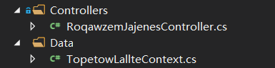 -->


请看上图 RoqawzemJajenesController 就是控制器，TopetowLallteContext 就是数据，里面包含了数据定义。现代的程序员是很少写古老的 sql ，因为很难维护，而且容易写错。只需要直接对`DbSet<RoqawzemJajene> RoqawzemJajene`列表做修改就可以。对于很多个人项目，不使用 sql 来读写数据库也是没问题。但是对于大型的项目还是需要 sql ，所以有空去学一下还是可以。

因为 asp dotnet core 默认的数据库是 sql server ，如果直接运行项目会说没有找到数据库，所以本文告诉大家使用内存做数据库。

打开 Startup.cs 找到 ConfigureServices ，可以看到下面代码

```csharp
        public void ConfigureServices(IServiceCollection services)
        {
            services.AddMvc();

            services.AddDbContext<TopetowLallteContext>(options =>
                    options.UseSqlServer(Configuration.GetConnectionString("TopetowLallteContext")));
        }
```

这里 UseSqlServer 就是使用 sql server 数据库，把他修改为`options.UseInMemoryDatabase("lindexi")`请看代码

```csharp
        public void ConfigureServices(IServiceCollection services)
        {
            services.AddMvc();

            services.AddDbContext<TopetowLallteContext>(options =>
                    options.UseInMemoryDatabase("lindexi"));
        }
```

这时就可以使用内存放数据，当然这时如果关闭了应用，数据也会没了。

现在打开 RoqawzemJajenesController 构造函数，在第一次进入添加一些数据

```csharp
        public RoqawzemJajenesController(TopetowLallteContext context)
        {
            _context = context;
            if (!context.RoqawzemJajene.Any())
            {
                context.RoqawzemJajene.Add(new RoqawzemJajene()
                {
                    Name = "lindexi",
                    Url = "https://lindexi.oschina.io"
                });

                context.SaveChanges();
            }
        }
```

在这里添加修改列表都需要调用 context.SaveChanges() 保存

## 运行网站

先右击 asp dotnet core 项目属性，点击调试，可以看到下面界面

<!-- 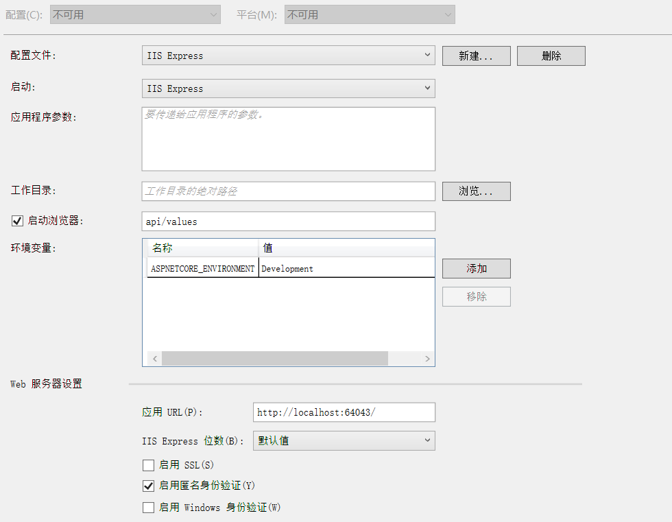 -->


因为不需要使用浏览器，所以去掉启动浏览器。需要记下端口，这个端口在下面的 UWP 项目使用。

请看上图，我的应用 URL 里面包含了端口 64043

```csharp
http://localhost:64043/
```

现在右击设置 asp dotnet core 项目为启动项目，然后按下 F5 运行这个项目

<!-- 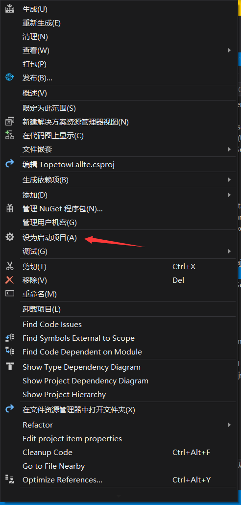 -->


## UWP 连接

打开 UWP 程序，先创建一个 ViewModel 用于数据绑定。本文不会告诉大家很多关于 ViewModel 的方法，如果想了解这个写法，请看[win10 uwp MVVM入门](https://blog.lindexi.com/post/win10-uwp-MVVM%E5%85%A5%E9%97%A8.html )

### ViewModel

现在需要定义一个数据结构，ObservableCollection 的列表，这样可以在界面绑定

```csharp
    public class ViewModel
    {
        public ObservableCollection<RoqawzemJajene> RoqawzemJajeneList { get; set; } =
            new ObservableCollection<RoqawzemJajene>();
    }
```

### 绑定数据

界面绑定，首先需要添加 ViewModel 属性，打开 MainPage.xaml.cs 添加下面代码

```csharp
        public MainPage()
        {
            this.InitializeComponent();
            DataContext = ViewModel;
        }

        public ViewModel ViewModel { get; } = new ViewModel();
```

### 界面

然后在 MainPage.xaml 添加一个列表，在这个 ListView 可以用来显示列表


```xml
   <Grid>
        <Grid.RowDefinitions>
            <RowDefinition />
            <RowDefinition Height="Auto" />
        </Grid.RowDefinitions>
        <ListView ItemsSource="{x:Bind ViewModel.RoqawzemJajeneList}">
            <ListView.ItemContainerStyle>
                <Style TargetType="ListViewItem">
                    <Setter Property="HorizontalContentAlignment" Value="Stretch"></Setter>
                </Style>
            </ListView.ItemContainerStyle>
            <ListView.ItemTemplate>
                <DataTemplate x:DataType="model:RoqawzemJajene">
                    <Grid>
                        <Grid.ColumnDefinitions>
                            <ColumnDefinition Width="100" />
                            <ColumnDefinition></ColumnDefinition>
                        </Grid.ColumnDefinitions>
                        <TextBlock Text="{x:Bind Name}"></TextBlock>
                        <TextBlock Grid.Column="1" Text="{x:Bind Url}"></TextBlock>
                    </Grid>
                </DataTemplate>
            </ListView.ItemTemplate>
        </ListView>
        <StackPanel Grid.Row="1" Orientation="Horizontal">
            <Button Margin="10,10,10,10" Content="下载数据" Click="Button_OnClick"></Button>
        </StackPanel>
    </Grid>
```

因为使用了 DataType ，所以需要添加引用

```csharp
    xmlns:model="using:Model"

```

因为现在添加了一个按钮下载数据，所以需要打开 MainPage.xaml.cs 添加下面代码

```csharp
        private void Button_OnClick(object sender, RoutedEventArgs e)
        {
            // 更新数据
        }
```

现在的 UWP 软件是可以编译通过的，但是运行是不会显示内容

### 下载列表

在 MainPage.xaml.cs 的 Button_OnClick 调用 ViewModel 的函数用来更新数据

```csharp
        private void Button_OnClick(object sender, RoutedEventArgs e)
        {
            ViewModel.Update();
        }
```

这时可能会觉得这样写不好，因为有 x:bind 可以在 xaml 绑定 ViewModel 的方法为什么还需要添加在按钮。因为这样写我可以在按钮点击下去同时做一些动画。

现在打开 ViewModel 先添加引用

```csharp
using System.Net.Http;

```

然后打开 Update 函数，访问 URL 需要用到 HttpClient，还记得刚才的 RoqawzemJajenesController 里面有这样的代码

```csharp
    [Route("api/RoqawzemJajenes")]
    public class RoqawzemJajenesController : Controller
```

这里的 Route 就是路由，也就是在 URL 后面添加 `api/RoqawzemJajenes` 就可以访问这个控制器。默认的 Get 方法就是通过 GetRoqawzemJajene 实现。

```csharp
        [HttpGet]
        public IEnumerable<RoqawzemJajene> GetRoqawzemJajene()
        {
            return _context.RoqawzemJajene;
        }
```

所以想调用 GetRoqawzemJajene 方法就需要访问 http://localhost:64043/api/RoqawzemJajenes，需要知道，这里的链接的端口是需要在上面右击 asp dotnet core 项目属性，调试那里才知道。

因为 asp dotnet core 程序返回的是 json ，可以通过设置让他返回 xml 。因为刚才没设置，默认返回的格式是 json 。

为了解析数据，需要在 Nuget 安装 json ，打开 Nuget 安装第一个就可以

<!--  -->


通过简单的 Get 的方法访问 URL 可以使用下面代码，参见 [win10 UWP GET Post - CSDN博客](https://blog.csdn.net/lindexi_gd/article/details/50838740 )

```csharp
        public async Task Update()
        {
            var httpClient = new HttpClient();
            var url = "http://localhost:64043/";

            url = url + "api/RoqawzemJajenes";
            var str = await httpClient.GetStringAsync(url);
            var roqawzemJajeneList = JsonConvert.DeserializeObject<List<RoqawzemJajene>>(str);

            RoqawzemJajeneList.Clear();

            foreach (var temp in roqawzemJajeneList)
            {
                RoqawzemJajeneList.Add(temp);
            }
        }
```

上面的代码通过 Get 访问 URL 拿到数据只需要一句话

```csharp
            var str = await httpClient.GetStringAsync(url);

```

因为这里使用了异步，所以修改了方法，需要在 MainPage.xaml.cs 的 Button_OnClick 修改

```csharp
        private async void Button_OnClick(object sender, RoutedEventArgs e)
        {
            await ViewModel.Update();
        }
```

现在尝试运行 asp dotnet core 项目，然后再运行 UWP 项目，这时点击一下 UWP 项目的下载数据，就可以看到如下图界面

<!--  -->


现在就完成了 UWP 程序的连接

## 上传数据

现在尝试上传数据，因为写界面速度比较慢，所以直接添加一个按钮，里面把我的一个小伙伴的信息传上去。

虽然刚才的代码已经有一个函数可以用来上传数据

```csharp
        public async Task<IActionResult> PostRoqawzemJajene([FromBody] RoqawzemJajene roqawzemJajene)
```

但是为了让大家知道如何使用路由，所以修改一下这个参数。

我希望访问 `http://localhost:64043/api/RoqawzemJajenes/add` 来添加一个小伙伴。

这时可以在 PostRoqawzemJajene 添加特性。打开 RoqawzemJajenesController ，进入 PostRoqawzemJajene ，在函数上面添加下面代码

```csharp
      [Route("add")]
        [HttpPost]
        public async Task<IActionResult> PostRoqawzemJajene([FromBody] RoqawzemJajene roqawzemJajene)
```

现在打开 ViewModel 添加一个函数

```csharp
       public async Task Add()
        {
            var roqawzemJajene = new RoqawzemJajene()
            {
                Name = "头像",
                Url = "https://huangtengxiao.gitee.io/"
            };

            var url = Url + "api/RoqawzemJajenes/add";

            var httpClient = new HttpClient();

            var str = JsonConvert.SerializeObject(roqawzemJajene);

            var stringContent = new StringContent(str);
            stringContent.Headers.ContentType.MediaType = "application/json";

            await httpClient.PostAsync(url, stringContent);
        }
```

这里的 Url 是因为在很多函数都需要使用，所以我把 http://localhost:64043/ 拿出来。在 UWP 使用 post 是很简单，只需要一句代码

```csharp
            await httpClient.PostAsync(url, stringContent);

```

现在打开 MainPage.xaml 添加一个按钮

```csharp
            <Button Margin="10,10,10,10" Content="上传" Click="Add_OnClick"></Button>

```

然后打开 MainPage.xaml.cs 添加函数

```csharp
        private async void Add_OnClick(object sender, RoutedEventArgs e)
        {
            await ViewModel.Add();
            await ViewModel.Update();
        }
```

现在尝试运行 UWP 程序，然后点击上传，可以看到这个界面

<!-- 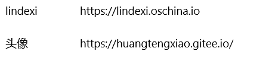 -->


如果刚才的代码有地方没有写对，如 stringContent 没有添加下面代码

```csharp
            stringContent.Headers.ContentType.MediaType = "application/json";
```

或者写的 Url 不对，都可以在 asp dotnet core 项目的输出看到和下面差不多的输出

```csharp
Application Insights Telemetry (unconfigured): {"name":"Microsoft.ApplicationInsights.Dev.Message","time":"2018-06-03T07:31:44.4397220Z","tags":{"ai.application.ver":"1.0.0.0","ai.operation.id":"d8ff58c-4a3bece1b1751287","ai.location.ip":"127.0.0.1","ai.internal.nodeName":"DESKTOP-KA1CD6M","ai.operation.name":"POST /api/add","ai.cloud.roleInstance":"DESKTOP-KA1CD6M","ai.internal.sdkVersion":"aspnet5c:2.1.1","ai.operation.parentId":"|d8ff58c-4a3bece1b1751287."},"data":{"baseType":"MessageData","baseData":{"ver":2,"message":"Request starting HTTP/1.1 POST http://localhost:64043/api/add  0","severityLevel":"Information","properties":{"CategoryName":"Microsoft.AspNetCore.Hosting.Internal.WebHost","Scheme":"http","Method":"POST","Host":"localhost:64043","ContentLength":"0","Path":"/api/add","Protocol":"HTTP/1.1","AspNetCoreEnvironment":"Development","DeveloperMode":"true"}}}}
Application Insights Telemetry (unconfigured): {"name":"Microsoft.ApplicationInsights.Dev.Message","time":"2018-06-03T07:31:44.4417985Z","tags":{"ai.application.ver":"1.0.0.0","ai.operation.id":"d8ff58c-4a3bece1b1751287","ai.location.ip":"127.0.0.1","ai.internal.nodeName":"DESKTOP-KA1CD6M","ai.operation.name":"POST /api/add","ai.cloud.roleInstance":"DESKTOP-KA1CD6M","ai.internal.sdkVersion":"aspnet5c:2.1.1","ai.operation.parentId":"|d8ff58c-4a3bece1b1751287."},"data":{"baseType":"MessageData","baseData":{"ver":2,"message":"Request finished in 2.0912ms 404","severityLevel":"Information","properties":{"CategoryName":"Microsoft.AspNetCore.Hosting.Internal.WebHost","StatusCode":"404","ElapsedMilliseconds":"2.0912","AspNetCoreEnvironment":"Development","DeveloperMode":"true"}}}}
Application Insights Telemetry (unconfigured): {"name":"Microsoft.ApplicationInsights.Dev.Request","time":"2018-06-03T07:31:44.4395938Z","tags":{"ai.location.ip":"127.0.0.1","ai.cloud.roleInstance":"DESKTOP-KA1CD6M","ai.internal.nodeName":"DESKTOP-KA1CD6M","ai.operation.id":"d8ff58c-4a3bece1b1751287","ai.internal.sdkVersion":"aspnet5c:2.1.1","ai.operation.name":"POST /api/add","ai.application.ver":"1.0.0.0"},"data":{"baseType":"RequestData","baseData":{"ver":2,"id":"|d8ff58c-4a3bece1b1751287.","name":"POST /api/add","duration":"00:00:00.0045034","success":false,"responseCode":"404","url":"http://localhost:64043/api/add","properties":{"httpMethod":"POST","AspNetCoreEnvironment":"Development","DeveloperMode":"true"}}}}

```

在这里，如何写一个简单的 cs 程序已经告诉了大家，建议完全复制代码来试试。如果发现还是无法运行，看到的界面和我不一样。那么尝试下载我的代码来试试。

如果遇到任何问题欢迎通过评论告诉我，或发邮件给我。

代码：[手把手教你使用 asp dotnet core 做 cs 程序 1.1-CSDN下载](https://download.csdn.net/download/lindexi_gd/10455849 )

<a rel="license" href="http://creativecommons.org/licenses/by-nc-sa/4.0/"></a><br />本作品采用<a rel="license" href="http://creativecommons.org/licenses/by-nc-sa/4.0/">知识共享署名-非商业性使用-相同方式共享 4.0 国际许可协议</a>进行许可。欢迎转载、使用、重新发布，但务必保留文章署名[林德熙](http://blog.csdn.net/lindexi_gd)(包含链接:http://blog.csdn.net/lindexi_gd )，不得用于商业目的，基于本文修改后的作品务必以相同的许可发布。如有任何疑问，请与我[联系](mailto:lindexi_gd@163.com)。
