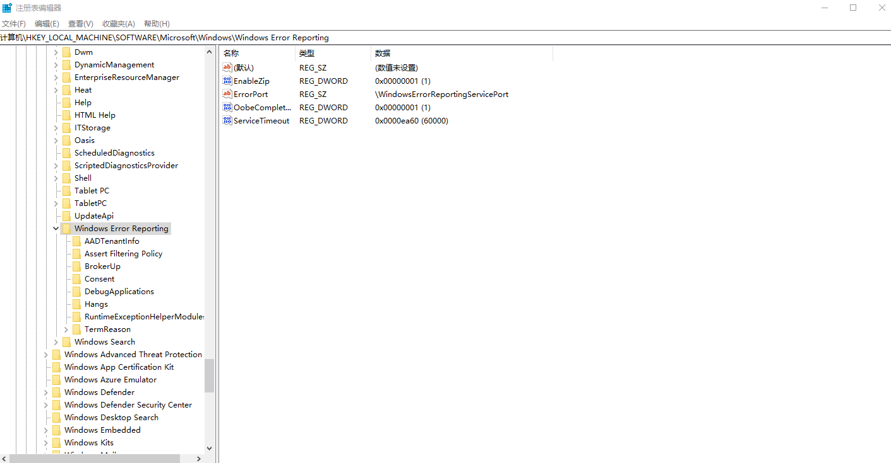
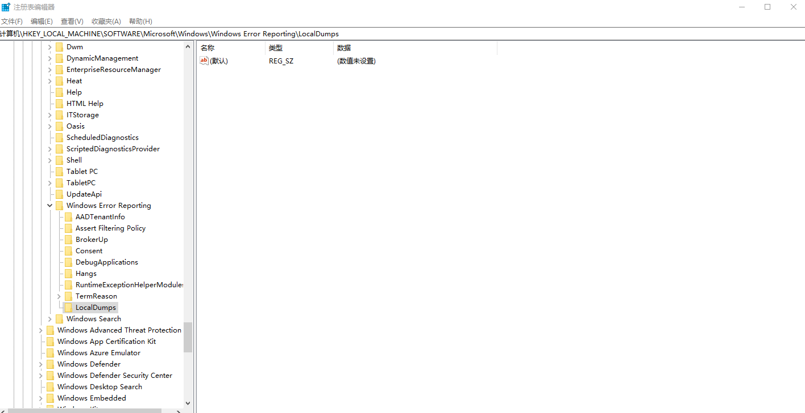
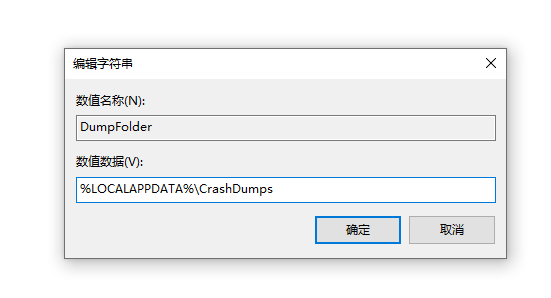
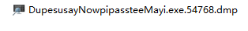
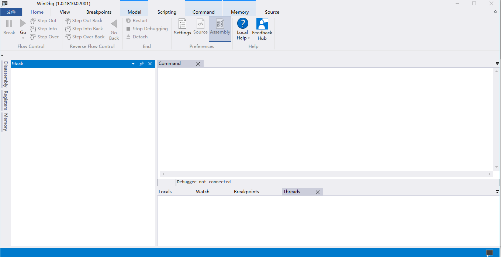
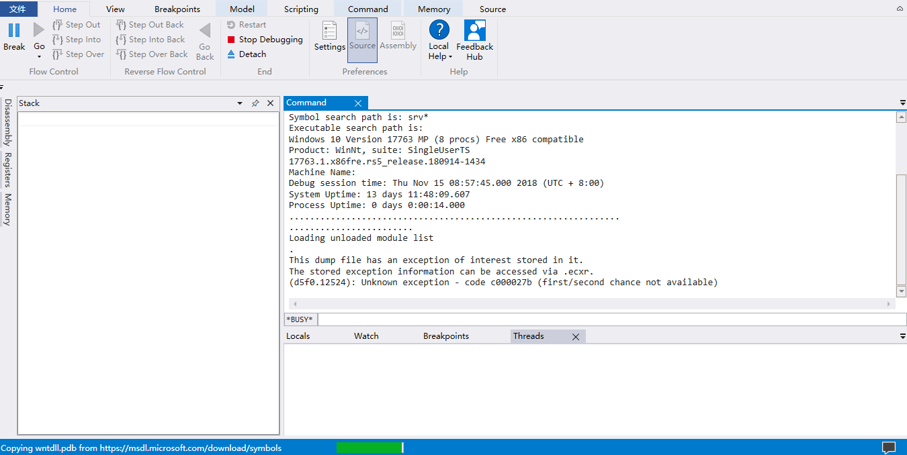
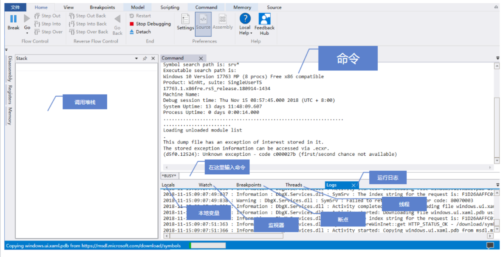

# win10 uwp 收集 DUMP 文件

如果在用户端软件直接退出，在以前 win32 程序可以使用 DUMP 进行调试。在 UWP 需要在电脑的注册表做一些配置才可以收集到 DUMP 文件

<!--more-->
<!-- CreateTime:2019/9/3 17:48:44 -->

<!-- csdn -->

打开注册表，通过 win+R 运行 regedit 就可以打开注册表

注册表可以输入路径，请输入 `HKEY_LOCAL_MACHINE\SOFTWARE\Microsoft\Windows\Windows Error Reporting` 请看下面

<!--  -->


如果不存在 LocalDumps 文件夹，请右击创建一个

右击新建项，输入 LocalDumps 保存

<!--  -->


右击新建一个可扩展字符串，写入 DumpFolder 然后双击输入 DUMP 文件可以存放的文件夹，注意这个文件夹需要有权限

<!--  -->


接着右击新建 DWORD 32 位，输入 DumpCount 再双击输入值，这个表示最多可以存放多少个 DUMP 文件，默认值是 10 个

右击新建 DWORD 32 位，输入 DumpType 再双击输入值，设置存放的 DUMP 是什么 DUMP 可以选的值有三个。输入 0 是 Custom dump 自定义的 dump 文件，输入 1 是 Mini dump 一个小的 DUMP 输入 2 是 Full dump 推荐使用包含程序所有信息的 dump 这样调试方便。但是  Full dump 是很大的，如果使用了推荐设置 DumpCount 小一些。

最后一个值可以不创建，只有在 DumpType 设置为 0 也就是 Custom dump 才需要新建 CustomDumpFlags 这个是 DWORD 32 位，具体请看 [`_MINIDUMP_TYPE`](https://docs.microsoft.com/en-us/windows/desktop/api/minidumpapiset/ne-minidumpapiset-_minidump_type )

设置完成就可以运行一个会炸的程序，看一下是不是在设置的文件里面存在了 DUMP 文件

如果小伙伴不想做复杂的设置，请看这篇博客用脚本自动设置 [UWP应用异常退出Dump - Lulixue的专栏 - CSDN博客](https://blog.csdn.net/Meta_Cpp/article/details/88657660 )

用 PowerShell 设置方法请看下面代码

```PowerShell
New-Item -Path "HKLM:\SOFTWARE\Microsoft\Windows\Windows Error Reporting" -Name "LocalDumps"
New-ItemProperty -Path "HKLM:\SOFTWARE\Microsoft\Windows\Windows Error Reporting\LocalDumps" -Name "DumpFolder" -Value "%LOCALAPPDATA%\CrashDumps" -PropertyType "ExpandString"
New-ItemProperty -Path "HKLM:\SOFTWARE\Microsoft\Windows\Windows Error Reporting\LocalDumps" -Name "DumpCount" -Value 10 -PropertyType DWord
```

这里 `"%LOCALAPPDATA%\CrashDumps"` 就是设置 DUMP 输出文件夹，请将这个文件夹修改为你期望的路径

## 创建一个运行直接退出的程序

打开 VisualStudio 创建一个 UWP 程序，在这个程序里面写简单代码

界面的代码

```csharp

    <Grid Background="Transparent">
        <TextBlock TextWrapping="Wrap" HorizontalAlignment="Center" VerticalAlignment="Center" Text="不要碰我，碰我就直接退出&#x0a;&#x0a;欢迎访问我博客 http://lindexi.gitee.io 里面有大量 UWP WPF 博客"/>
    </Grid>
```

打开 cs 文件，在用户碰到软件就让软件直接退出

```csharp
        public MainPage()
        {
            InitializeComponent();

            Content.PointerMoved += MainPage_PointerMoved;
        }

        private void MainPage_PointerMoved(object sender, PointerRoutedEventArgs e)
        {
            throw new Exception();
        }
```

现在运行程序，碰一下让他直接退出，打开刚才设置的 DUMP 文件夹，可以看到文件

<!--  -->


## 调试 DUMP 文件

推荐使用 [WinDbg Preview](https://www.microsoft.com/store/productId/9PGJGD53TN86) 进行调试

打开应用商店，搜 WinDbg Preview 就可以安装

<!--  -->


直接双击 DUMP 文件使用 WinDbg Preview 打开

<!--  -->


打开之后就可以去玩一会回来，加载符号需要很长的时间

这个软件的每个界面功能请看下面

<!--  -->


调试的方法本文就不告诉大家了

<a rel="license" href="http://creativecommons.org/licenses/by-nc-sa/4.0/"></a><br />本作品采用<a rel="license" href="http://creativecommons.org/licenses/by-nc-sa/4.0/">知识共享署名-非商业性使用-相同方式共享 4.0 国际许可协议</a>进行许可。欢迎转载、使用、重新发布，但务必保留文章署名[林德熙](http://blog.csdn.net/lindexi_gd)(包含链接:http://blog.csdn.net/lindexi_gd )，不得用于商业目的，基于本文修改后的作品务必以相同的许可发布。如有任何疑问，请与我[联系](mailto:lindexi_gd@163.com)。  
