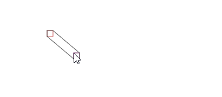

# win10 uwp 求两个矩形相连的几何

在写笔迹的过程，我需要做橡皮的功能，橡皮是一个矩形在移动，因为移动的过程是不连续的，需要将多个矩形组合为连续的几何

<!--more-->
<!-- CreateTime:2018/12/24 20:51:49 -->

<!-- csdn -->
<!-- math -->

大概的做法就是连接两个矩形作为一个六边形或者一个大的矩形的方法，这个方法最简单是求闭包的方法

<!--  -->


本文采用的坐标是左上角是 (0,0) 点，从左向右坐标变大，从上到下坐标变大

但是对于矩形可以做到特殊算法，提高速度，方法就是取矩形的左上角进行判断，如果判断两个矩形中的一个矩形的左边小于另一个矩形的左边，同时这个矩形的上边小于另一个矩形的上边。

也就是两个矩形中，满足下面公式，其中 rect1 和 rect2 的值可以互换

```csharp
rect1.Left <= rect2.Left && rect1.Top <= rect2.Top
```

此时就可以认为两个矩形按照从左上角到右下角的坐标

于是连接 rect1 的左上角点 rect1 的右上角点 rect2 的右上角点 rect2 的右下角点 rect2 的左下角点 rect1 的左下角点就可以连接处理这个六边形或矩形

另一个是两个矩形是按照从左下角到右上角的坐标，需要判断两个矩形的左下角。如果存在一个矩形的左下角的左边比另一个矩形的左边小，同时这个矩形的下边比另一个矩形的下边大

在两个矩形中，满足下面方法，其中 rect1 和 rect2 的值可以互换

```csharp
rect1.Left <= rect2.Left && rect1.Bottom >= rect2.Bottom
```

通过连接 rect1 的左上角 rect2 的左上角 rect2 的右上角 rect2 的右下角 rect1 的右下角 rect1 的左下角就可以连接处理这个六边形或矩形

下面是我写的一个呆磨，代码是通过 win2d 写的，需要通过 Nuget 安装 Win2d 然后在 xaml 设置 Grid 的 Name 为 Grid 在代码可以添加

```csharp
	        var canvas = new CanvasAnimatedControl();
            Grid.Children.Add(canvas);

            canvas.Draw += Canvas_Draw;
```

在鼠标移动的时候拿到坐标，作为第二个矩形的左上角

```csharp
	
        protected override void OnPointerMoved(PointerRoutedEventArgs e)
        {
            _move = e.GetCurrentPoint(Grid).Position;
            base.OnPointerMoved(e);
        }

        private Point _move;
```

然后在 `Canvas_Draw` 创建两个矩形

```csharp
	        Rect rect1 = new Rect(50, 50, 10, 10);
            Rect rect2 = new Rect(_move, new Size(10, 10));
```

可以看到矩形 1 是固定的，但是矩形2会安装鼠标的左上角作为矩形，所以可以通过鼠标看自己的方法是否符合

先将两个矩形画出来

```csharp
	            ds.DrawRectangle(rect1, Colors.IndianRed);
                ds.DrawRectangle(rect2, new Color()
                {
                    R = 0x6f,
                    B = 0x5f,
                    G = 0x26,
                    A = 0xff
                });

```

这里的 ds 就是通过 args.DrawingSession 创建

```csharp
	    private void Canvas_Draw(ICanvasAnimatedControl sender, CanvasAnimatedDrawEventArgs args)
        {
            using (var ds = args.DrawingSession)
            {

            }
        }
```

然后开始判断，两个矩形有两个不同的方法，按照不同对角线，这里直接开始写判断

```csharp
	            if (rect1.Left <= rect2.Left && rect1.Top <= rect2.Top)
                {
                }
                else if (rect2.Left < rect1.Left && rect2.Top < rect1.Top)
                {
                }
```

这就是第一个方法的判断，创建一个方法用于绘制，因为两个矩形的计算需要互换，通过创建方法的方法可以减少代码


```csharp
	    private void VerpallWayhi(Rect rect1, Rect rect2, CanvasDrawingSession ds)
        {
            var canvasPathBuilder = new CanvasPathBuilder(ds.Device);
            canvasPathBuilder.BeginFigure((float) rect1.Left, (float) rect1.Top);
            canvasPathBuilder.AddLine((float) rect1.Right, (float) rect1.Top);
            canvasPathBuilder.AddLine((float) rect2.Right, (float) rect2.Top);
            canvasPathBuilder.AddLine((float) rect2.Right, (float) rect2.Bottom);
            canvasPathBuilder.AddLine((float) rect2.Left, (float) rect2.Bottom);
            canvasPathBuilder.AddLine((float) rect1.Left, (float) rect1.Bottom);
            canvasPathBuilder.EndFigure(CanvasFigureLoop.Closed);

            var geometry = CanvasGeometry.CreatePath(canvasPathBuilder);
            ds.DrawGeometry(geometry, new Color()
            {
                R = 0x56,
                B = 0x56,
                G = 0x56,
                A = 0xff
            });

            canvasPathBuilder.Dispose();
            geometry.Dispose();
        }
```

请不要认为上面的代码很复杂，自己画一下就知道上面的方法

在调用的时候，需要互换矩形

```csharp
	            if (rect1.Left <= rect2.Left && rect1.Top <= rect2.Top)
                {
                    VerpallWayhi(rect1, rect2, ds);
                }
                else if (rect2.Left < rect1.Left && rect2.Top < rect1.Top)
                {
                    VerpallWayhi(rect2, rect1, ds);
                }
```

因为两个矩形的相对关系只有两种，可以在下面判断

```csharp
	            else if (rect1.Left <= rect2.Left && rect1.Bottom >= rect2.Bottom)
                {
                }
                else if (rect2.Left < rect1.Left && rect2.Bottom > rect1.Bottom)
                {
                }
```

同时创建新的方法，对不同的矩形画出六边形或矩形

```csharp
        private void Stoutiheagea(Rect rect1, Rect rect2, CanvasDrawingSession ds)
        {
            var canvasPathBuilder = new CanvasPathBuilder(ds.Device);
            canvasPathBuilder.BeginFigure((float) rect1.Left, (float) rect1.Top);
            canvasPathBuilder.AddLine((float) rect2.Left, (float) rect2.Top);
            canvasPathBuilder.AddLine((float) rect2.Right, (float) rect2.Top);
            canvasPathBuilder.AddLine((float) rect2.Right, (float) rect2.Bottom);
            canvasPathBuilder.AddLine((float) rect1.Right, (float) rect1.Bottom);
            canvasPathBuilder.AddLine((float) rect1.Left, (float) rect1.Bottom);
            canvasPathBuilder.EndFigure(CanvasFigureLoop.Closed);

            var geometry = CanvasGeometry.CreatePath(canvasPathBuilder);
            ds.DrawGeometry(geometry, new Color()
            {
                R = 0x56,
                B = 0x56,
                G = 0x56,
                A = 0xff
            });

            canvasPathBuilder.Dispose();
            geometry.Dispose();
        }
```

现在互换矩形

```csharp
                else if (rect1.Left <= rect2.Left && rect1.Bottom >= rect2.Bottom)
                {
                    Stoutiheagea(rect1, rect2, ds);
                }
                else if (rect2.Left < rect1.Left && rect2.Bottom > rect1.Bottom)
                {
                    Stoutiheagea(rect2, rect1, ds);
                }
```

运行代码可以看到有一个矩形跟随鼠标，同时会连接两个矩形

用到的代码

```csharp
    public sealed partial class MainPage : Page
    {
        public MainPage()
        {
            this.InitializeComponent();
            var canvas = new CanvasAnimatedControl();
            Grid.Children.Add(canvas);

            canvas.Draw += Canvas_Draw;
        }

        protected override void OnPointerMoved(PointerRoutedEventArgs e)
        {
            _move = e.GetCurrentPoint(Grid).Position;
            base.OnPointerMoved(e);
        }

        private Point _move;

        private void Canvas_Draw(ICanvasAnimatedControl sender, CanvasAnimatedDrawEventArgs args)
        {
            var cl = DrawRectangle(sender);

            using (var ds = args.DrawingSession)
            {
                ds.DrawImage(cl, new Vector2(10, 10));
            }
        }

        private CanvasCommandList DrawRectangle(ICanvasResourceCreator sender)
        {
            Rect rect1 = new Rect(50, 50, 10, 10);
            Rect rect2 = new Rect(_move, new Size(10, 10));

            var cl = new CanvasCommandList(sender);
            using (var ds = cl.CreateDrawingSession())
            {
                ds.DrawRectangle(rect1, Colors.IndianRed);
                ds.DrawRectangle(rect2, new Color()
                {
                    R = 0x6f,
                    B = 0x5f,
                    G = 0x26,
                    A = 0xff
                });


                if (rect1.Left <= rect2.Left && rect1.Top <= rect2.Top)
                {
                    VerpallWayhi(rect1, rect2, ds);
                }
                else if (rect2.Left < rect1.Left && rect2.Top < rect1.Top)
                {
                    VerpallWayhi(rect2, rect1, ds);
                }
                else if (rect1.Left <= rect2.Left && rect1.Bottom >= rect2.Bottom)
                {
                    Stoutiheagea(rect1, rect2, ds);
                }
                else if (rect2.Left < rect1.Left && rect2.Bottom > rect1.Bottom)
                {
                    Stoutiheagea(rect2, rect1, ds);
                }
            }
            return cl;
        }

        private void Stoutiheagea(Rect rect1, Rect rect2, CanvasDrawingSession ds)
        {
            var canvasPathBuilder = new CanvasPathBuilder(ds.Device);
            canvasPathBuilder.BeginFigure((float) rect1.Left, (float) rect1.Top);
            canvasPathBuilder.AddLine((float) rect2.Left, (float) rect2.Top);
            canvasPathBuilder.AddLine((float) rect2.Right, (float) rect2.Top);
            canvasPathBuilder.AddLine((float) rect2.Right, (float) rect2.Bottom);
            canvasPathBuilder.AddLine((float) rect1.Right, (float) rect1.Bottom);
            canvasPathBuilder.AddLine((float) rect1.Left, (float) rect1.Bottom);
            canvasPathBuilder.EndFigure(CanvasFigureLoop.Closed);

            var geometry = CanvasGeometry.CreatePath(canvasPathBuilder);
            ds.DrawGeometry(geometry, new Color()
            {
                R = 0x56,
                B = 0x56,
                G = 0x56,
                A = 0xff
            });

            canvasPathBuilder.Dispose();
            geometry.Dispose();
        }

        private void VerpallWayhi(Rect rect1, Rect rect2, CanvasDrawingSession ds)
        {
            var canvasPathBuilder = new CanvasPathBuilder(ds.Device);
            canvasPathBuilder.BeginFigure((float) rect1.Left, (float) rect1.Top);
            canvasPathBuilder.AddLine((float) rect1.Right, (float) rect1.Top);
            canvasPathBuilder.AddLine((float) rect2.Right, (float) rect2.Top);
            canvasPathBuilder.AddLine((float) rect2.Right, (float) rect2.Bottom);
            canvasPathBuilder.AddLine((float) rect2.Left, (float) rect2.Bottom);
            canvasPathBuilder.AddLine((float) rect1.Left, (float) rect1.Bottom);
            canvasPathBuilder.EndFigure(CanvasFigureLoop.Closed);

            var geometry = CanvasGeometry.CreatePath(canvasPathBuilder);
            ds.DrawGeometry(geometry, new Color()
            {
                R = 0x56,
                B = 0x56,
                G = 0x56,
                A = 0xff
            });

            canvasPathBuilder.Dispose();
            geometry.Dispose();
        }
    }
```

<a rel="license" href="http://creativecommons.org/licenses/by-nc-sa/4.0/"></a><br />本作品采用<a rel="license" href="http://creativecommons.org/licenses/by-nc-sa/4.0/">知识共享署名-非商业性使用-相同方式共享 4.0 国际许可协议</a>进行许可。欢迎转载、使用、重新发布，但务必保留文章署名[林德熙](http://blog.csdn.net/lindexi_gd)(包含链接:http://blog.csdn.net/lindexi_gd )，不得用于商业目的，基于本文修改后的作品务必以相同的许可发布。如有任何疑问，请与我[联系](mailto:lindexi_gd@163.com)。
