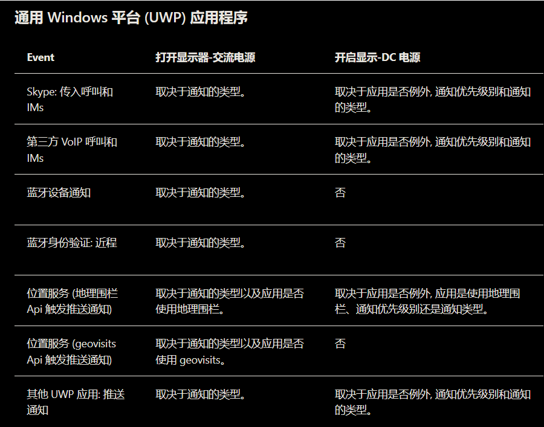

# win10 uwp 睡眠唤醒

本文记录某大佬找 UWP 唤醒睡眠设备的博客

<!--more-->
<!-- CreateTime:2019/9/23 16:34:08 -->

<!-- csdn -->

[新式备用唤醒源](https://docs.microsoft.com/zh-cn/windows-hardware/design/device-experiences/modern-standby-wake-sources )

<!--  -->

[WNS Notification Priorities - Windows UWP applications](https://docs.microsoft.com/en-us/windows/uwp/design/shell/tiles-and-notifications/wns-notification-priorities )

[System Power States - Windows applications](https://docs.microsoft.com/en-us/windows/win32/power/system-power-states )

 本作品采用<a rel="license" href="http://creativecommons.org/licenses/by-nc-sa/4.0/">知识共享署名-非商业性使用-相同方式共享 4.0 国际许可协议</a>进行许可。欢迎转载、使用、重新发布，但务必保留文章署名[林德熙](http://blog.csdn.net/lindexi_gd)(包含链接:http://blog.csdn.net/lindexi_gd )，不得用于商业目的，基于本文修改后的作品务必以相同的许可发布。如有任何疑问，请与我[联系](mailto:lindexi_gd@163.com)。
