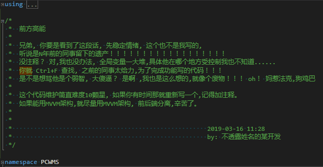

# win10 uwp 鼠标移动到图片上切换图片

如果只是在后台代码判断鼠标是否移动到图片上，修改图片，那么实在简单，但是如果后台代码写多了，就会如下面的注释说的一样。如果只是在 xaml 写所有代码能否在鼠标移动到图片上自动修改图片？在 UWP 有一个好用的库 Behaviors 库支持绑定事件，于是在鼠标进入图片的时候触发动画修改图片，在鼠标在图片范围外的时候触发动画修改图片

<!--more-->
<!-- CreateTime:2019/3/16 14:43:46 -->

<!-- csdn -->

这个问题是[堆栈](https://stackoverflow.com/a/55194046/6116637)的小伙伴问的，我看到有小伙伴通过后台代码控制图片，看起来代码一点都不好，我看到小伙伴发的注释，有一段代码很难维护，其实如果将本来 UI 做的代码都放在后台，那么这个代码会让开发者觉得不如删除代码自己写

<!--  -->


在[Microsoft.Xaml.Behaviors.Uwp.Managed](https://www.nuget.org/packages/Microsoft.Xaml.Behaviors.Uwp.Managed/ ) 提供了 EventTriggerBehavior 可以用来在触发了某个事件就调用里面的 Action 方法。同时有 ControlStoryboardAction 可以用来播放动画

将 Image 图片放在一个 Border 控件，这样可以在 Border 控件里面写动画修改 Image 的内容

在鼠标没有移动到图片上的时候，图片使用的是 `Assets/click_cursor_mouse_pointer_select_121.7433808554px_1193623_easyicon.net.png` 在鼠标移动到图片上使用的是 `assets/click_cursor_mouse_pointer_select_128px_1225441_easyicon.net.png` 请看代码

```csharp
        <Border>
            <Border.Resources>
                <Storyboard x:Key="EnterStoryboard">
                    <ObjectAnimationUsingKeyFrames Storyboard.TargetName="Image" Storyboard.TargetProperty="Source">
                        <ObjectAnimationUsingKeyFrames.KeyFrames>
                            <DiscreteObjectKeyFrame KeyTime="0:0:0"
                                                    Value="assets/click_cursor_mouse_pointer_select_128px_1225441_easyicon.net.png" />
                        </ObjectAnimationUsingKeyFrames.KeyFrames>
                    </ObjectAnimationUsingKeyFrames>
                </Storyboard>
                <Storyboard x:Key="ExitStoryboard">
                    <ObjectAnimationUsingKeyFrames Storyboard.TargetName="Image" Storyboard.TargetProperty="Source">
                        <ObjectAnimationUsingKeyFrames.KeyFrames>
                            <DiscreteObjectKeyFrame KeyTime="0:0:0"
                                                    Value="Assets/click_cursor_mouse_pointer_select_121.7433808554px_1193623_easyicon.net.png" />
                        </ObjectAnimationUsingKeyFrames.KeyFrames>
                    </ObjectAnimationUsingKeyFrames>
                </Storyboard>
            </Border.Resources>

            <Image x:Name="Image"
                   Source="Assets/click_cursor_mouse_pointer_select_121.7433808554px_1193623_easyicon.net.png"
                   Height="120" Width="120" Margin="176,31,534,84" />
        </Border>

```

因为图片的 Source 只能通过 ObjectAnimationUsingKeyFrames 修改，于是看起来的动画写的代码还是很多

在使用 Behaviors 之前需要引用命名空间

```csharp
    xmlns:interactivity="using:Microsoft.Xaml.Interactivity"
    xmlns:core="using:Microsoft.Xaml.Interactions.Core"
    xmlns:media="using:Microsoft.Xaml.Interactions.Media"
```

使用 EventTriggerBehavior 可以知道用户的鼠标移动到图标上，然后通过 ControlStoryboardAction 播放动画，请看代码

```csharp
           <interactivity:Interaction.Behaviors>
                <core:EventTriggerBehavior EventName="PointerEntered">
                    <media:ControlStoryboardAction Storyboard="{StaticResource EnterStoryboard}" />
                </core:EventTriggerBehavior>
                <core:EventTriggerBehavior EventName="PointerExited">
                    <media:ControlStoryboardAction Storyboard="{StaticResource ExitStoryboard}" />
                </core:EventTriggerBehavior>
            </interactivity:Interaction.Behaviors>
```

运行代码可以看到下面图片


我将所有代码放在 github 请看[https://github.com/lindexi/lindexi_gd/tree/7f0dcf62f38eda513b3455658b9dffd6c4974847/PernemtanowsearDeerawkurkosa](https://github.com/lindexi/lindexi_gd/tree/7f0dcf62f38eda513b3455658b9dffd6c4974847/PernemtanowsearDeerawkurkosa) 直接下载代码，选择 x86 就可以运行

现在修改图片在鼠标移动到图片上就显示图片1如果没有鼠标移动到图片上就显示原来图片的代码可以全部写在 xaml 不需要后台代码

```csharp
        <Border>
            <Border.Resources>
                <Storyboard x:Key="EnterStoryboard">
                    <ObjectAnimationUsingKeyFrames Storyboard.TargetName="Image" Storyboard.TargetProperty="Source">
                        <ObjectAnimationUsingKeyFrames.KeyFrames>
                            <DiscreteObjectKeyFrame KeyTime="0:0:0"
                                                    Value="assets/click_cursor_mouse_pointer_select_128px_1225441_easyicon.net.png" />
                        </ObjectAnimationUsingKeyFrames.KeyFrames>
                    </ObjectAnimationUsingKeyFrames>
                </Storyboard>
                <Storyboard x:Key="ExitStoryboard">
                    <ObjectAnimationUsingKeyFrames Storyboard.TargetName="Image" Storyboard.TargetProperty="Source">
                        <ObjectAnimationUsingKeyFrames.KeyFrames>
                            <DiscreteObjectKeyFrame KeyTime="0:0:0"
                                                    Value="Assets/click_cursor_mouse_pointer_select_121.7433808554px_1193623_easyicon.net.png" />
                        </ObjectAnimationUsingKeyFrames.KeyFrames>
                    </ObjectAnimationUsingKeyFrames>
                </Storyboard>
            </Border.Resources>
            <interactivity:Interaction.Behaviors>
                <core:EventTriggerBehavior EventName="PointerEntered">
                    <media:ControlStoryboardAction Storyboard="{StaticResource EnterStoryboard}" />
                </core:EventTriggerBehavior>
                <core:EventTriggerBehavior EventName="PointerExited">
                    <media:ControlStoryboardAction Storyboard="{StaticResource ExitStoryboard}" />
                </core:EventTriggerBehavior>
            </interactivity:Interaction.Behaviors>
            <Image x:Name="Image"
                   Source="Assets/click_cursor_mouse_pointer_select_121.7433808554px_1193623_easyicon.net.png"
                   Height="120" Width="120" Margin="176,31,534,84" />
        </Border>

```

[xaml - How do I change an image on image Mouse over in UWP - Stack Overflow](https://stackoverflow.com/q/55182371/6116637)

[如何在 UWP 使用 wpf 的 Trigger](https://lindexi.gitee.io/post/%E5%A6%82%E4%BD%95%E5%9C%A8-UWP-%E4%BD%BF%E7%94%A8-wpf-%E7%9A%84-Trigger.html )

<a rel="license" href="http://creativecommons.org/licenses/by-nc-sa/4.0/"></a><br />本作品采用<a rel="license" href="http://creativecommons.org/licenses/by-nc-sa/4.0/">知识共享署名-非商业性使用-相同方式共享 4.0 国际许可协议</a>进行许可。欢迎转载、使用、重新发布，但务必保留文章署名[林德熙](http://blog.csdn.net/lindexi_gd)(包含链接:http://blog.csdn.net/lindexi_gd )，不得用于商业目的，基于本文修改后的作品务必以相同的许可发布。如有任何疑问，请与我[联系](mailto:lindexi_gd@163.com)。
