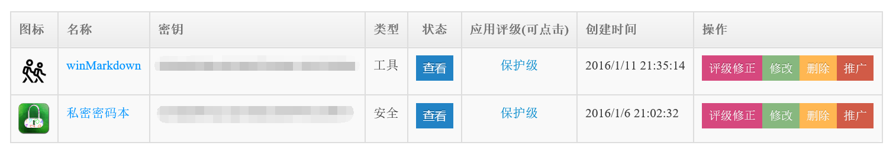
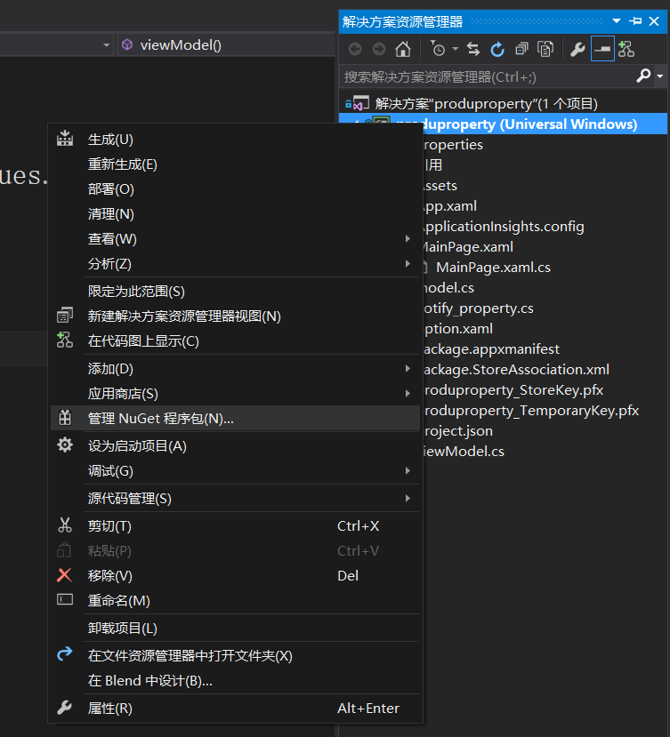
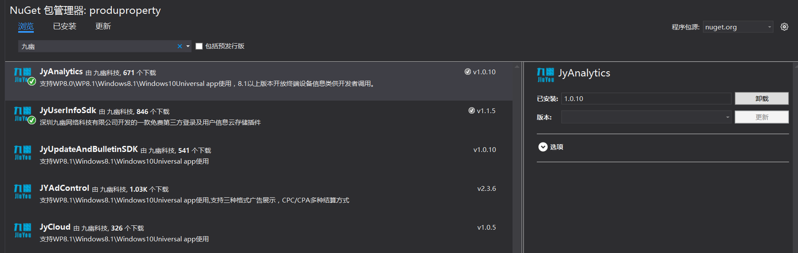

# win10 UWP 九幽数据分析

九幽数据统计是统计和分析数据来源，用户使用，先申请账号

<!--more-->


<!-- CreateTime:2018/2/13 17:23:03 -->


<div id="toc"></div>

http://www.windows.sc


创建应用


图片要`72*72`的，然后请看下面的图片，记密钥



在项目Nuget进行搜索，然后下载安装





在App.xaml.cs添加`Suspending`和`Resuming`准备给九幽发信息，这时莫老板就会收到消息


```csharp

        public App()
        {
            Microsoft.ApplicationInsights.WindowsAppInitializer.InitializeAsync(
                Microsoft.ApplicationInsights.WindowsCollectors.Metadata |
                Microsoft.ApplicationInsights.WindowsCollectors.Session);
            this.InitializeComponent();
            this.Suspending += OnSuspending;
            this.Resuming += App_Resuming;
        }

        private void App_Resuming(object sender, object e)
        {
            track();
        }

        protected override void OnActivated(IActivatedEventArgs args)
        {
            base.OnActivated(args);
            track();
        }

        private async void track()
        {
            await JYAnalyticsUniversal.JYAnalytics.StartTrackAsync("你的key");
        }

```

同样在OnLaunched加`track`表示这时已经启动。

```csharp

track();

```

在OnSuspending加`EndTrackAsync`，需要注意代码的位置


```csharp

        private async void OnSuspending(object sender, SuspendingEventArgs e)
        {
            var deferral = e.SuspendingOperation.GetDeferral();
            //TODO: 保存应用程序状态并停止任何后台活动
            await JYAnalyticsUniversal.JYAnalytics.EndTrackAsync(); //需注意此处代码位置不可更改 
            deferral.Complete();
        }

```

运行，等待九幽，因为鹤鹤跑了，所有只能靠莫老板统计了，等一下就可以看到了，大概是几个小时。

如果需要使用页面统计，那么需要添加的代码就是使用`TrackPageStart`，里面就写进入哪个类。


```csharp

        protected override void OnNavigatedFrom(Windows.UI.Xaml.Navigation.NavigationEventArgs e)
        {
            base.OnNavigatedFrom(e);
            JYAnalytics.TrackPageEnd("main_page");
        }
        protected override void OnNavigatedTo(Windows.UI.Xaml.Navigation.NavigationEventArgs e)
        {
            base.OnNavigatedTo(e);
            JYAnalytics.TrackPageStart("main_page");
        }

```

如果需要统计一个特殊的事件，那么请使用`TrackEvent`，传入一个字符串，可以得到一个事件的次数，如在点击打开游戏，就发送统计。


```csharp

JYAnalytics.TrackEvent("StartTimes");

```

除了输入字符串，还可以输入 id 和参数，当然都是字符串，例如需要统计用于打开`blog.csdn.net/lindexi_gd`，那么可以使用下面代码。


```csharp

string eventId=“open";//当前统计的事件
string lable="打开blog.csdn.net/lindexi_gd";//描述当前id
JYAnalytics.TrackEvent(eventId,lable);

```

除了可以统计事件，还可以统计错误，同样是字符串。

```csharp
string error="软件启动发现错误"；
JYAnalytics.TrackError(error);

```

在开始运行的时候，还需要在在Package.appxmanifest功能，选择Internet(客户端服务器)使用


<a rel="license" href="http://creativecommons.org/licenses/by-nc-sa/4.0/"></a><br />本作品采用<a rel="license" href="http://creativecommons.org/licenses/by-nc-sa/4.0/">知识共享署名-非商业性使用-相同方式共享 4.0 国际许可协议</a>进行许可。欢迎转载、使用、重新发布，但务必保留文章署名[林德熙](http://blog.csdn.net/lindexi_gd)(包含链接:http://blog.csdn.net/lindexi_gd )，不得用于商业目的，基于本文修改后的作品务必以相同的许可发布。如有任何疑问，请与我[联系](mailto:lindexi_gd@163.com)。